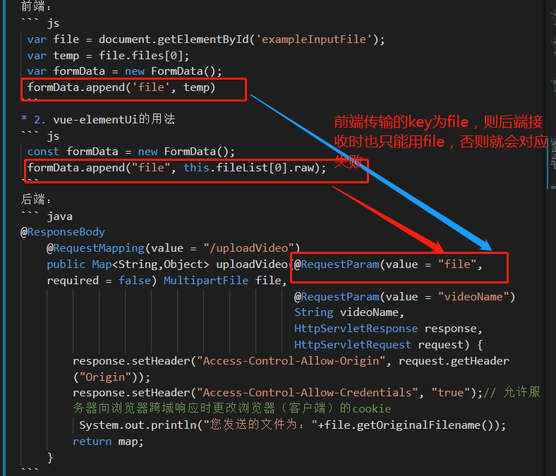
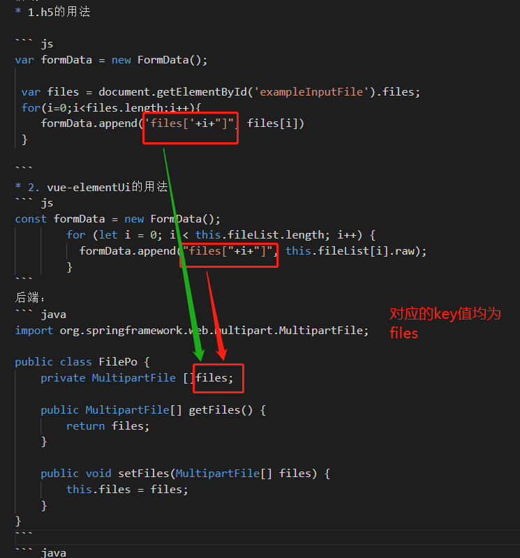
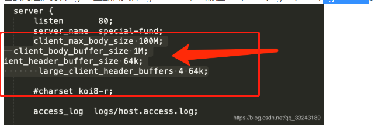

<!-- TOC -->

- [1.创建目录](#1创建目录)
- [2.获取文件类型](#2获取文件类型)
- [3.MultipartFile 转 File](#3multipartfile-转-file)
- [4. File转 MultipartFile](#4-file转-multipartfile)
- [5.获取MultipartFile文件类型的大小](#5获取multipartfile文件类型的大小)
- [6.压缩图片](#6压缩图片)
- [7.前后端文件的交互](#7前后端文件的交互)
  - [7.1 单文件的交互](#71-单文件的交互)
  - [7.2 多文件的交互](#72-多文件的交互)
  - [7.3 ajax交互](#73-ajax交互)
- [8.springBoot设置文件上传大小](#8springboot设置文件上传大小)
  - [方式1：在application.properties添加以下内容](#方式1在applicationproperties添加以下内容)
  - [方式2：在配置类中添加以下内容](#方式2在配置类中添加以下内容)

<!-- /TOC -->
# 1.创建目录
``` java
/**
     * 判断该路径下的目录是否存在，不存在就生成此目录
     * @param filePath
     * @return
     */
    public static Boolean createDirectory(String filePath){
        Boolean result=true;
        try {
            File file=new File(filePath);
            if (!file.exists()) {
                file.mkdirs();
            }
        }catch (Exception e){
            result=false;
            e.printStackTrace();
        }

        return result;
    }
```
# 2.获取文件类型
``` java
/**
     * 获取文件类型
     * @param file
     * @return
     */
    public static String getFileType(MultipartFile file){
        String fileType=null;
        try {
            String orginName=file.getOriginalFilename();
            String []temp=orginName.split("\\.");
            if(temp.length>1){
                fileType= temp[temp.length-1];
            }
        }catch (Exception e){
            log.error(e.getMessage());

        }
        return fileType;
    }
```
# 3.MultipartFile 转 File
``` java
 /**
     * MultipartFile 转 File
     * @param file
     * @return
     */
    public static File MultipartFile2File(MultipartFile file){
        File re=null;
        try {
            String fileName=new Date().getTime()+file.getOriginalFilename();
            String filePath=PropertyUtil.getProp("pathConfig.properties", "video.local.path");
            File newFile = new File(filePath+fileName);
            file.transferTo(newFile);
            re=newFile;
        }catch (Exception e){
            e.printStackTrace();
        }
        return re;
    }
```
# 4. File转 MultipartFile
``` java

 /**
     * file 转 MultipartFile
     * @param file
     * @return
     */
    public static File MultipartFile2File(File file){
        MultipartFile multipartFile=null;
        try {
            FileInputStream fileInputStream = new FileInputStream(file);
           multipartFile = new MockMultipartFile(file.getName(), file.getName(), ContentType.APPLICATION_OCTET_STREAM.toString(), fileInputStream);
        }catch (Exception e){
            e.printStackTrace();
        }
        return multipartFile;
    }
```
# 5.获取MultipartFile文件类型的大小
``` java
/**
     * 获取MultipartFile文件类型的大小
     * @param file 文件
     * @param sizeTpe 可选择的文件大小类型：B K M G
     * @return
     */
    public static Double getMultipartFileSize(MultipartFile file,String sizeTpe){
        Double fileSize=0.;
        switch (sizeTpe.toUpperCase()){
            case "B":
                fileSize = (double) file.getSize();
                break;
            case "K":
                fileSize = (double) file.getSize()/1024;
                break;
            case "M":
                fileSize = (double) file.getSize()/ 1048576;
                break;
            case "G":
                fileSize = (double) file.getSize()/ 1073741824;
                break;
        }
        return fileSize;
    }
```
# 6.压缩图片
``` java
   /**
     * 压缩图片
     * @param file
     * @return
     */
    public static File compressImage(MultipartFile file){
        File re=null;
        try {
            InputStream inputStream = file.getInputStream();
            // 把图片读入到内存中
            BufferedImage bufImg = ImageIO.read(inputStream);
            // 压缩代码
            // 存储图片文件byte数组
            ByteArrayOutputStream bos = new ByteArrayOutputStream();
            System.out.println(bufImg.getWidth());
            System.out.println(bufImg.getHeight());
            BufferedImage newBufferedImage = new BufferedImage(bufImg.getWidth()-100, bufImg.getHeight()-100,BufferedImage.TYPE_INT_RGB);
            newBufferedImage.createGraphics().drawImage(bufImg, 0, 0, Color.WHITE, null);
            //先转成jpg格式来压缩,然后在通过OSS来修改成源文件本来的后缀格式
            ImageIO.write(newBufferedImage,"jpg",bos);
            //获取输出流
            inputStream = new ByteArrayInputStream(bos.toByteArray());
            String filePath=PropertyUtil.getProp("pathConfig.properties", "video.local.path");
            File newFile=new File(filePath+"\\"+new Date().getTime()+".jpg");
            java.nio.file.Files.copy(
                    inputStream,
                    newFile.toPath(),
                    StandardCopyOption.REPLACE_EXISTING);
            re=newFile;
        }catch (Exception e){
            e.printStackTrace();
        }

        return re;
    }
```
# 7.前后端文件的交互
## 7.1 单文件的交互
我们前端使用ajax进行表单提交   
前端：
* 1.h5的用法   

``` js
 var file = document.getElementById('exampleInputFile');
 var temp = file.files[0];
 var formData = new FormData();
 formData.append('file', temp)
```
* 2. vue-elementUi的用法
``` js
 const formData = new FormData();
 formData.append("file", this.fileList[0].raw);
```
ajax 发送请求：
``` js
   $.ajax({
          url: "http://localhost:2000/vue/upload",
          data: formData,
          dataType: "json",
          type: "post",
          processData: false, // 告诉jQuery不要去处理发送的数据
          contentType: false, // 告诉jQuery不要去设置Content-Type请求头
          //加上这句话,允许浏览器向服务器跨域请求时携带cookie
          xhrFields: {
            withCredentials: true
          },
          crossDomain: true,
          success: function(data) {
            console.log(data);
          },
          error: function(data) {
            console.log(data);
          }
        });
```
后端：
``` java
@ResponseBody
	@RequestMapping(value = "/uploadVideo")
	public Map<String,Object> uploadVideo(@RequestParam(value = "file", required = false) MultipartFile file,
										  @RequestParam(value = "videoName") String videoName,
										  HttpServletResponse response, HttpServletRequest request) {
		response.setHeader("Access-Control-Allow-Origin", request.getHeader("Origin"));
		response.setHeader("Access-Control-Allow-Credentials", "true");// 允许服务器向浏览器跨域响应时更改浏览器（客户端）的cookie
		 System.out.println("您发送的文件为："+file.getOriginalFilename());
		return map;
	}
```
对应关系如下：

## 7.2 多文件的交互
前端：
* 1.h5的用法   

``` js
var formData = new FormData();

 var files = document.getElementById('exampleInputFile').files;
 for(i=0;i<files.length;i++){
    formData.append('files['+i+"]", files[i])
 }
 
```
* 2. vue-elementUi的用法
``` js
const formData = new FormData();
        for (let i = 0; i < this.fileList.length; i++) {
          formData.append("files["+i+"]", this.fileList[i].raw);
        }
```
后端：
``` java
    @PostMapping(path = "/upload")
    @ResponseBody
    public Map<String,Object> upload(FilePo filePo, HttpServletResponse response, HttpServletRequest request){
        response.setHeader("Access-Control-Allow-Origin", request.getHeader("Origin"));
        response.setHeader("Access-Control-Allow-Credentials", "true");// 允许服务器向浏览器跨域响应时更改浏览器（客户端）的cookie
        Map<String,Object>map=new HashMap<>();
        if(filePo.getFiles()!=null){
            FileUtils.MultipartFile2File(filePo.getFiles()[0]);
        }

        map.put("result",200);
        return map;
    }
```
对应的FilePo：
``` java
import org.springframework.web.multipart.MultipartFile;

public class FilePo {
    private MultipartFile []files;

    public MultipartFile[] getFiles() {
        return files;
    }

    public void setFiles(MultipartFile[] files) {
        this.files = files;
    }
}
```
对应关系如下：

## 7.3 ajax交互
无论是h5还是vue我们均采用jquery的ajax进行前后端的交互，个人习惯问题，如果是vue也可以使用axios
``` js
   $.ajax({
          url: "http://localhost:2000/vue/upload",
          data: formData,
          dataType: "json",
          type: "post",
          processData: false, // 告诉jQuery不要去处理发送的数据
          contentType: false, // 告诉jQuery不要去设置Content-Type请求头
          //加上这句话,允许浏览器向服务器跨域请求时携带cookie
          xhrFields: {
            withCredentials: true
          },
          crossDomain: true,
          success: function(data) {
            console.log(data);
          },
          error: function(data) {
            console.log(data);
          }
        });
```
# 8.springBoot设置文件上传大小
## 方式1：在application.properties添加以下内容
``` xml
## 设置上传文件大小
# 启用http代理
spring.servlet.multipart.enabled=true
# 最大请求文件大小
spring.servlet.multipart.max-request-size=100MB
# 设置单个文件大小
spring.servlet.multipart.max-file-size=20
```
## 方式2：在配置类中添加以下内容
``` java

@Configuration
public class UploadConfig {
 
    @Bean
    public MultipartConfigElement multipartConfigElement() {
        MultipartConfigFactory factory = new MultipartConfigFactory();
        //单个文件最大
        factory.setMaxFileSize("20480KB"); //KB,MB
        /// 设置总上传数据总大小
        factory.setMaxRequestSize("1024000KB");
        return factory.createMultipartConfig();
    }
}
```
若我们上传的文件目录是由nginx反向代理的，则需要修改nginx.conf
