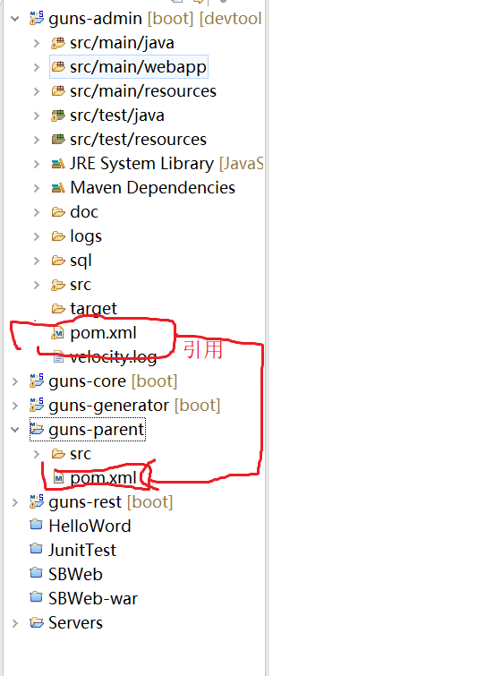

# 一.层次结构介绍

### 1.代码结构层次：

- guns-admin:后台系统管理模块
- guns-core:其他模块，里面是其他模块提取出来的公共代码，比如说一些工具类，分页插件，结点等
- guns-parent:guns 的父模块，用于管理其他的子模块，可以把整个项目的依赖提取到这个模块的 pom.xml 文件中，并且修改对应依赖的版本，而其他模块的 pom.xml 文件中是不会带有依赖的版本号的
- guns-rest:提供对接口服务端的支持，并且利用 jwt token 鉴权机制给予客户端的访问权限，传输数据进行 md5 签名，保证数据传输的安全性

### 2.包结构层次

- common：公用的注解，常量，状态的一些枚举等
- config:用于存放配置文件
  下面就讲一个配置的工作原理：
  先看一个 guns-admin/config/properties/BeetlProperties:

```
package com.stylefeng.guns.config.properties;

import com.stylefeng.guns.core.util.ToolUtil;
import org.springframework.beans.factory.annotation.Value;
import org.springframework.boot.context.properties.ConfigurationProperties;
import org.springframework.context.annotation.Configuration;

import java.util.Properties;

/**
 * beetl配置(如果需要配置别的配置可参照这个形式自己添加)
 *
 * @author fengshuonan
 * @date 2017-05-24 20:37
 */
@Configuration
@ConfigurationProperties(prefix = BeetlProperties.BEETLCONF_PREFIX)
public class BeetlProperties {
    public static final String BEETLCONF_PREFIX = "beetl";
    private String delimiterStatementStart;
    private String delimiterStatementEnd;
    private String resourceTagroot;
    private String resourceTagsuffix;
    private String resourceAutoCheck;
    //下面省略get set 构造函数以及其他方法
```

由于这个类含有注解：@Configuration，所以这是一个配置类，而且会在项目启动时扫描主配置文件（application.properties 或者 application.yml 文件），并且@ConfigurationProperties 的作用是识别前缀为 BeetlProperties.BEETLCONF_PREFIX，而 BeetlProperties.BEETLCONF_PREFIX 对应的就是 public static final String BEETLCONF_PREFIX = "beetl";中的 beetl，识别之后会将对应的属性注入进去

- core:是 guns 运行的核心机制，比如说 aop:全局的拦截器——日志（日志拦截器，异常拦截器）以及 pemmisonAop:权限检查，不同角色的用户登录之后会看到不同的效果
- modular：存放着业务逻辑的核心代码，其中 system 下是对应的 controller,service,po 等，其中 factory 是为了方便创建的对象而设计的工厂

# 2.使用代码生成器来生成表对应的实体以和数据库操作

- 首先在数据库创建对应的表，比如创建了一个 user 表
- 然打开 generator 层，在里面修改一下部分代码(genertor/GunsCodeGenerator.java)：

```
public class MyBatisPlusGenerator {
    public static void main(String[] args) {
        //上面的代码省略
        gc.setOutputDir("D:\\program\\naan1993-guns-v3.0.1\\guns\\guns-admin\\src\\main\\java");//这里写你自己的工程下的java目录
        //注意此处的路径要精确到项目src/main/java目录下，如果没有，就手动
        //中间代码省略
        pc.setService("TTT");       //本项目没用，生成之后删掉
        pc.setServiceImpl("TTT");   //本项目没用，生成之后删掉
        pc.setController("TTT");    //本项目没用，生成之后删掉
        //注意这三个文件是代码生成时创建的业务层（controller,service,serviceImpl）
        //下面代码省略
    }}
```

# 3.配置菜单和角色

- 首先在数据库里面建立相应的表（比如说创建了一个 biz_order 表）;
- 当表建立完成之后，打开后台的管理系统->代码生成,然后修改‘业务名称’，‘模块名称’,‘父级菜单名称’,‘表前缀’

```
业务名称:订单管理
模块名称：order
父级菜单：由于是根菜单，所以选择顶级
表前缀：biz_
数据表里面的内容：
biz_order订单表
模板：全部选中
```

- 做完上面的工作之后，讲这个菜单栏加入管理系统，打开后台的管理系统->系统管理->菜单管理->添加：

```
名称：订单管理
请求地址：（找到生成代码的的controller层，由于模块名称叫做order，所以这个包叫做XXX.order.controller），打开里面的内容应该是：
@Controller
@RequestMapping("/myOrder")
public class MyOrderController extends BaseController {
}
，所以请求地址填/myOrder
菜单编号:order
排序：也就是在菜单栏的第几位，比如放在第5位，那就写5
父级编号：顶级（也就是为根节点的位置）
图标：在h+的ui中找一个，但是要在对应的字符串前面加fa-
是否是菜单：是
```

- 接着给这个菜单的访问赋予权限，也就是指到底谁可以访问这个菜单：打开后台的管理系统->系统管理->角色管理
  > 比如说让系统管理员可以看到这个订单，那么就选中系统管理员，点击权限配置，勾选订单管理即可
- 验证效果： 退出重新登录

# 4.开发具体业务

就是在对应的 controller 层编写相应的业务

# 5.定制 404 错误页面

- 1.准备错误页面的 html, [点击查看 404 模板](http://www.mobanwang.com/mb/special/cuowu/)
- 2.配置实现 springView 接口的 bean 对应的 id 为 error  
  controller 层：
-

```
@Component("error")
public class GunsErrorView implements View {

    @Override
    public String getContentType() {
        return "text/html";
    }
    @Override
    public void render(Map<String, ?> map, HttpServletRequest httpServletRequest, HttpServletResponse httpServletResponse) throws Exception {
        httpServletRequest.getRequestDispatcher("/global/error").forward(httpServletRequest, httpServletResponse);
    }
}
```

其中/global/error 对应的 controller：

```
@Controller
@RequestMapping("/global")
public class GlobalController {
    @RequestMapping("/error")
    public String errorPage() {
        return "/404_New.html";}}
```

# 6.配置多数据源

> 1.打开 application.yml 中的多数据源开关

```
 muti-datasource-open: true #是否开启多数据源(true/false)
```

> 2.在需要切换多数据源的 service 层上添加注解@DataSource(name="数据源名称")即可

```java
@Service
public class TestServiceImpl implements ITestService {
    @Autowired
    TestMapper testMapper;
    @Override
    @DataSource(name = DatasourceEnum.DATA_SOURCE_GUNS)
    public void testGuns() {
 Test test1 = new Test();
 test1.setValue("222");
 testMapper.insert(test1);
 } }
```
# 7.map+warpper——结果包装器
这个知识点就是将数据库的字段进行转换，比如说用户状态，1：激活，0：禁止
所以我们只需要在后台处理变为激活或者禁止状态传向前端即可
举一个简单的例子：
``` java
public class UserWarpper extends BaseControllerWarpper {
 public UserWarpper(List<Map<String, Object>> list) { super(list);}
 @Override
public void warpTheMap(Map<String, Object> map) {
map.put("sexName", ConstantFactory.me().getSexName((Integer) map.get("sex")));
map.put("roleName", ConstantFactory.me().getRoleName((String) map.get("roleid")));
map.put("deptName", ConstantFactory.me().getDeptName((Integer)map.get("deptid")));
map.put("statusName", ConstantFactory.me().getStatusName((Integer) map.get("status")));} }
```     
# 8.日志记录
### 1.我们通过 @BussinessLog注解 来记录日志
日志分两种：   

* 1.不涉及到修改的
``` java
@Controller
@RequestMapping("/mgr")
public class UserMgrController extends BaseController {   
    @RequestMapping("/add")
    @BussinessLog(value = "添加管理员", key = "account", dict = UserDict.class)
    @Permission(Const.ADMIN_NAME)
    @ResponseBody
    public Tip add(@Valid UserDto user, BindingResult result) {
      //里面代码略
    }
```
> 下面解释一下上面的代码：
> @BussinessLog(value = "添加管理员", key = "account", dict = UserDict.class)：
> * value是指这个日志所代表的是什么
> * key:被修改的实体的唯一标识,例如:菜单实体的唯一标识为"id"
> * dict：指的是数据字典，而UserDict.class对应的代码如下：
``` java
 public class UserDict extends AbstractDictMap {
    @Override
    public void init() {
        put("userId","账号");
        put("avatar","头像");
        put("account","账号");
        put("name","名字");
        put("birthday","生日");
        put("sex","性别");
        put("email","电子邮件");
        put("phone","电话");
        put("roleid","角色名称");
        put("deptid","部门名称");
        put("roleIds","角色名称集合");
    }
    @Override
    protected void initBeWrapped() {
        putFieldWrapperMethodName("sex","getSexName");
        putFieldWrapperMethodName("deptid","getDeptName");
        putFieldWrapperMethodName("roleid","getSingleRoleName");
        putFieldWrapperMethodName("userId","getUserAccountById");
        putFieldWrapperMethodName("roleIds","getRoleName");
    }
}
 ```
> 下面解释一下这个字典的功能：
> 上面有两个方法:
> * init（存放英文字段和中文字段的匹配）
> * initBeWrapped（某些字段的数字值翻译为中文直观名称的过程）
> 下面继续对字典做详细的解释：
> 用户修改了一个人性别信息，但是数据库中只有1,2之间的变化,但是日志是给别人看的，所以要把1,2对应的值包装起来,变为男，女的变化就行了
* 2.涉及到修改的（需要修改的需要记录修改前的信息）  
``` java
    @Permission
    @RequestMapping("/user_edit/{userId}")
    public String userEdit(@PathVariable Integer userId, Model model) {
        if (ToolUtil.isEmpty(userId)) {
            throw new GunsException(BizExceptionEnum.REQUEST_NULL);
        }
        assertAuth(userId);
        User user = this.userService.selectById(userId);
        model.addAttribute(user);
        model.addAttribute("roleName", ConstantFactory.me().getRoleName(user.getRoleid()));
        model.addAttribute("deptName", ConstantFactory.me().getDeptName(user.getDeptid()));
        LogObjectHolder.me().set(user);
        return PREFIX + "user_edit.html";
    }
```
它是如何实现保存旧值的呢，就是通过LogObjectHolder.me().set(user);来实现的，那么LogObjectHolder又是什么呢
```java
/**
 * 被修改的bean临时存放的地方
 *
 * @author fengshuonan
 * @date 2017-03-31 11:19
 */
@Component
@Scope(scopeName = WebApplicationContext.SCOPE_SESSION)
public class LogObjectHolder implements Serializable{
    private Object object = null;
    public void set(Object obj) {
        this.object = obj;
    }
    public Object get() {
        return object;
    }
    public static LogObjectHolder me(){
        LogObjectHolder bean = SpringContextHolder.getBean(LogObjectHolder.class);
        return bean;
    }
}
```
上面讲了日志的流程，但是具体如何操作日志：
> * 在需要被记录日志的接口上添加@BussinessLog注解，并根据需要填写三个属性(value，key，dict)
> * 2.若是添加或者修改业务，往往需要去编写Dict字典类
> * 3.若是修改业务，例如修改用户信息，因为点击更新用户的时候不会提交修改之前的数据，所以在更新用户信息之前需要保存一下用户的旧的信息才可以记录用户修改的内容，这个缓存用户临时信息的地方一般添加在跳转到用户详情接口，用 LogObjectHolder.me().set(user); 这行代码来缓存用户的旧的信息，具体用法
可以参考 UserMgrController 类中的 userEdit() 和 edit()，就在上面的1，2对应的代码    
### 上面讲述了业务日志的操作，下面继续学习一下异常日志如何实现
对于异常的日志有两种处理：
* 1.记录到数据库
> 调用Guns的日志记录工具类，如下
``` java
LogManager.me().executeLog();
```
该方法为异步记录日志的方法，executeLog()方法中需要传递一个 TimerTask 对象，TimerTask对象可以用 LogTaskFactory 类创建，在 LogTaskFactory 类中，有5个方法，可以分别记录不用的日志，有 登录日志 ， 退出日志 ， 业务日志 ， 异常日志 等等，可以自行选择调用
* 2.记录到文件中
> 采用slf4j的 org.slf4j.Logger 类记录，具体方法如下
``` java
  //首先在类中初始化
  private Logger log = LoggerFactory.getLogger(this.getClass());
  //再在方法中调用
  log.error("业务异常:", e);
```
# 9.项目的拆分与介绍
### 1.先从guns-parent这个包讲解：
> 这个包的作用就是用于管理maven依赖，所以里面只有一个pom.xml文件   
> 里面有一个modules标签，用于管理子项目依赖的jar包版本
``` xml
<modules>
        <module>../guns-admin</module>
        <module>../guns-core</module>
        <module>../guns-rest</module>
        <module>../guns-generator</module>
    </modules>
 ```
解释一下上面的代码：这个就说明parent所管理的包有guns-admin guns-core guns-rest guns-generator 
> 里面还有properties标签，就是将下面的依赖的版本抽取出来，也就是说当修改版本时只需要在properties中进行就行了：
``` xml
 <properties>
        <project.build.sourceEncoding>UTF-8</project.build.sourceEncoding>
        <project.reporting.outputEncoding>UTF-8</project.reporting.outputEncoding>
        <java.version>1.8</java.version>
        <guns.version>1.0.0-SNAPSHOT</guns.version>
        <mybatisplus-spring-boot-starter.version>1.0.5</mybatisplus-spring-boot-starter.version>
        <shiro.version>1.4.0</shiro.version>
        <mybatis-plus.version>2.1.8</mybatis-plus.version>
        <fastjson.version>1.2.44</fastjson.version>
    </properties>
    <dependencyManagement>
        <dependencies>
            <dependency>
                <groupId>com.stylefeng</groupId>
                <artifactId>guns-generator</artifactId>
                <version>${guns.version}</version>
            </dependency>
            <dependency>
                <groupId>com.baomidou</groupId>
                <artifactId>mybatisplus-spring-boot-starter</artifactId>
                <version>${mybatisplus-spring-boot-starter.version}</version>
            </dependency>
            <!--shiro依赖-->
            <dependency>
                <groupId>org.apache.shiro</groupId>
                <artifactId>shiro-core</artifactId>
                <version>${shiro.version}</version>
            </dependency>
        </dependencies>
    </dependencyManagement>
```
其中dependencyManagement就表示依赖控制，用于管理依赖，一般的依赖只需要写在 <dependencies>中就行了，如果不用<dependencyManagement>就表示引入依赖   
#### 那么子项目如何进行引入parent中的依赖呢
先看一下parent中的pom.xml文件中有这样一串代码，用于表示这个pom.xml文件：
``` xml
<groupId>com.stylefeng</groupId>
    <artifactId>guns-parent</artifactId>
    <version>1.0.0-SNAPSHOT</version>
```
> 解释一下：
> * groupId:就是域名，一般用于定义项目的名字
> * artifactId： 就是来表示这个Pom的名字，通过引用这个名字就可找到这个依赖   
再看看guns-admin中如何进行引用：
``` xml
<parent>
        <groupId>com.stylefeng</groupId>
        <artifactId>guns-parent</artifactId>
        <version>1.0.0-SNAPSHOT</version>
        <relativePath>../guns-parent/pom.xml</relativePath>
    </parent>
```
下面解释一下：
> * parent:说明继承的依赖是来自artifactId（guns-parent）中的依赖
> * relativePath:用于指定这个父依赖所存放的位置，指的是相对路径   

### 下面接着看看其他包的内容如何能够让guns-admin中的包使用
就举一个guns-core中的内容如何让gus-admin使用吧
就只需要在guns-admin的pom.xml文件中加入：
```xml
<dependency>
            <groupId>com.stylefeng</groupId>
            <artifactId>guns-core</artifactId>
        </dependency>
```
这样的话就可引用guns-core中的内容
# 10.shrio权限
### 1.引入maven依赖
``` xml
 <!--shiro依赖-->
        <dependency>
            <groupId>org.apache.shiro</groupId>
            <artifactId>shiro-core</artifactId>
            <exclusions>
                <exclusion>
                    <artifactId>slf4j-api</artifactId>
                    <groupId>org.slf4j</groupId>
                </exclusion>
            </exclusions>
        </dependency>
        <dependency>
            <groupId>org.apache.shiro</groupId>
            <artifactId>shiro-spring</artifactId>
        </dependency>
        <dependency>
            <groupId>org.apache.shiro</groupId>
            <artifactId>shiro-ehcache</artifactId>
            <exclusions>
                <exclusion>
                    <artifactId>slf4j-api</artifactId>
                    <groupId>org.slf4j</groupId>
                </exclusion>
            </exclusions>
        </dependency>
        <dependency>
            <groupId>org.ehcache</groupId>
            <artifactId>ehcache</artifactId>
        </dependency>
```