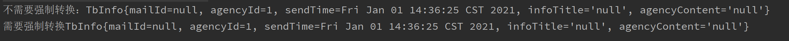
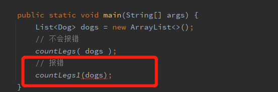
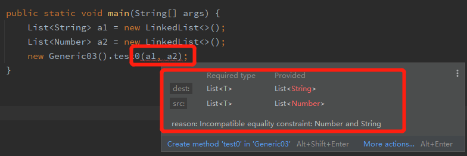
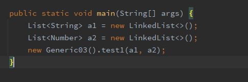
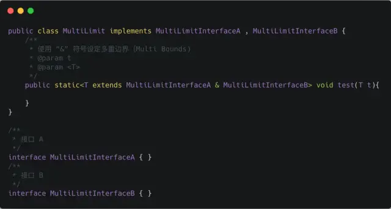
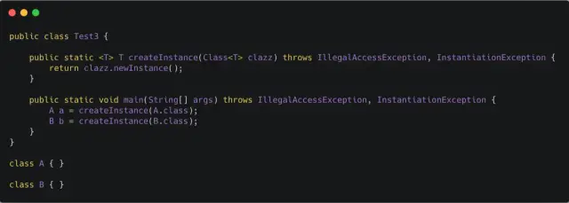

<!-- TOC -->

- [1.前言](#1前言)
- [2.泛型的好处](#2泛型的好处)
- [3.泛型中通配符](#3泛型中通配符)
  - [3.1 ？无界通配符](#31-无界通配符)
  - [3.2 上界通配符<? extends E>](#32-上界通配符-extends-e)
  - [3.3 下界通配符<? super E>](#33-下界通配符-super-e)
- [4.？和 T 的区别](#4和-t-的区别)
  - [4.1 区别1：通过 T 来 确保 泛型参数的一致性](#41-区别1通过-t-来-确保-泛型参数的一致性)
  - [4.2 区别2：类型参数可以多重限定而通配符不行](#42-区别2类型参数可以多重限定而通配符不行)
  - [4.3 区别3：通配符可以使用超类限定而类型参数不行](#43-区别3通配符可以使用超类限定而类型参数不行)
- [5.Class< T> 和 Class<?> 区别](#5class-t-和-class-区别)

<!-- /TOC -->
# 1.前言
Java 泛型（generics）是 JDK 5 中引入的一个新特性, 泛型提供了编译时类型安全检测机制，该机制允许开发者在编译时检测到非法的类型。
泛型的本质是参数化类型，也就是说所操作的数据类型被指定为一个参数。
# 2.泛型的好处
* 在不使用泛型时，通过对类型 Object 的引用来实现参数的“任意化”，“任意化”带来的缺点是要做显式的强制类型转换，但是这种转换是要求开发者对实际参数类型可以预知的情况下进行的。
* 对于强制类型转换错误的情况，编译器可能不提示错误，在运行的时候才出现异常，这是本身就是一个安全隐患。
* 那么泛型的好处就是在编译的时候能够检查类型安全，并且所有的强制转换都是自动和隐式的。

``` java
import java.util.Date;
import java.util.List;
public class Generic<T> {
    private T t;

    public void set(T t) {
        this.t = t;
    }

    public T get() {
        return t;
    }

    public static void main(String[] args) {
        //这种声明方式不需要强制转换
        Generic<TbInfo> generic1 = new Generic();
        generic1.set(new TbInfo(1, new Date()));
        TbInfo tb = generic1.get();
        System.out.println(tb.toString());

        //这种声明方式需要强制转换
        Generic generic2 = new Generic();
        generic2.set(new TbInfo(1, new Date()));
        TbInfo tb2 = (TbInfo) generic2.get();
        System.out.println(tb.toString());
    }
}
```
下面附上TbInfo代码：
``` java
public class TbInfo{
    private Integer agencyId;
    private Date sendTime;
    public TbInfo(Integer agencyId, Date sendTime) {
        this.agencyId = agencyId;
        this.sendTime = sendTime;
    }
    public String getAgencyContent() {
        return agencyContent;
    }

    public void setAgencyContent(String agencyContent) {
        this.agencyContent = agencyContent;
    }
    public Integer getAgencyId() {
        return this.agencyId;
    }
    public void setAgencyId(Integer agencyId) {
        this.agencyId = agencyId;
    }
    public Date getSendTime() {
        return this.sendTime;
    }
    public void setSendTime(Date sendTime) {
        this.sendTime = sendTime;
    }

    /* This code was generated by TableGo tools, mark 2 end. */

    @Override
    public String toString() {
        return "TbInfo{" +
                ", agencyId=" + agencyId +
                ", sendTime=" + sendTime +
                '}';
    }
}
```
运行结果如下:

# 3.泛型中通配符
我们在定义泛型类，泛型方法，泛型接口的时候经常会碰见很多不同的通配符，比如 T，E，K，V 等等，这些通配符又都是什么意思呢？
常用的 T，E，K，V，？
> 本质上这些个都是通配符，没啥区别，只不过是编码时的一种约定俗成的东西。比如上述代码中的 T ，我们可以换成 A-Z 之间的任何一个 字母都可以，并不会影响程序的正常运行，但是如果换成其他的字母代替 T ，在可读性上可能会弱一些。通常情况下，T，E，K，V，？是这样约定的：
> * ？表示不确定的 java 类型
> * T (type) 表示具体的一个java类型
> * K V (key value) 分别代表java键值中的Key Value
> * E (element) 代表Element

## 3.1 ？无界通配符
我们先看一个小的demo
我有一个父类 Animal 和几个子类，如狗、猫等，现在我需要一个动物的列表，我的第一个想法是像这样的：
``` java
List<Animal> listAnimals
```
但是老板的想法确实这样的：
``` java
List<? extends Animal> listAnimals
```
老板为什么想要使用通配符而不是简单的泛型呢？
通配符其实在声明局部变量时是没有什么意义的，但是当你为一个方法声明一个参数时，它是非常重要的。比如以下代码：
``` java
public class Generic01 {
    static int countLegs (List<? extends Animal > animals ) {
        int retVal = 0;
        for ( Animal animal : animals )
        {
            retVal += animal.countLegs();
        }
        return retVal;
    }
    static int countLegs1 (List< Animal > animals ){
        int retVal = 0;
        for ( Animal animal : animals )
        {
            retVal += animal.countLegs();
        }
        return retVal;
    }
    public static void main(String[] args) {
        List<Dog> dogs = new ArrayList<>();
        // 不会报错
        countLegs( dogs );
        // 报错
        countLegs1(dogs);
    }
}
```

其中Animal,Dog代码如下
* Animal
``` java
public class Animal {
    private Integer legs;
    public Integer countLegs() {
        return legs;
    }
    public Integer getLegs() {
        return legs;
    }
    public void setLegs(Integer legs) {
        this.legs = legs;
    }
}
```
* Dog
``` java
public class Dog extends Animal {
    @Override
    public Integer countLegs() {
        return super.countLegs();
    }
}
```
但是在我们实际上使用时根本不知道我们要传入的参数到底是Dog还是Cat，所以对于不确定或者不关心实际要操作的类型，可以使用无限制通配符<font color=#FF0000>（ 尖括号里一个问号，即 <?>  ） </font>   表示可以持有任何类型。
像 countLegs 方法中，限定了上界，但是不关心具体类型是什么，所以对于传入的 Animal 的所有子类都可以支持，并且不会报错。而 countLegs1 就不行。于是我们引出了上界通配符 < ? extends E>


## 3.2 上界通配符<? extends E>
> 上界：用 extends 关键字声明，表示参数化的类型可能是所指定的类型，或者是此类型的子类。

在类型参数中使用 extends 表示这个泛型中的参数必须是 E 或者 E 的子类，这样有两个好处：
* 如果传入的类型不是 E 或者 E 的子类，编译不成功
* 泛型中可以使用 E 的方法，要不然还得强转成 E 才能使用

> 类型参数列表中如果有多个类型参数上限，用逗号分开,比如：
``` java
private <K extends A, E extends B> E test(K arg1, E arg2){
    E result = arg2;
    arg2.compareTo(arg1);
    //.....
    return result;
}
```
## 3.3 下界通配符<? super E>
> 下界: 用 super 进行声明，表示参数化的类型可能是所指定的类型，或者是此类型的父类型，直至 Object

在类型参数中使用 super 表示这个泛型中的参数必须是 E 或者 E 的父类。
``` java
package com.ownplus.consumerown.test.generic;

import java.util.ArrayList;
import java.util.List;

public class Generic02 {
    private <T> void test(List<? super T> dst, List<T> src) {
        for (T t : src) {
            dst.add(t);
        }
    }
    public static void main(String[] args) {
        List<Dog> dogs = new ArrayList<>();
        for (int i=0;i<10;i++){
            Dog dog=new Dog();
            dog.setLegs(i);
            dogs.add(dog);
        }
        List<Animal> animals = new ArrayList<>();
        new Generic02().test(animals, dogs);
    }
}
```
我大致解释一下这串代码：
> 首先我们传入的参数是<font color=#FF0000>animals，dogs </font> 
而<font color=#FF0000>List<? super T> dst </font> 表示泛型中的参数必须是T的父类，那么这个T又是什么呢
我们接下来看第二个参数<font color=#FF0000>List<T> src</font> ，说明我们在使用test方法时，传入的第二个参数的泛型类型就是T对应的类型
现在我们回到main方法中，<font color=#FF0000>new Generic02().test(animals, dogs)</font> 说明传入的T的类型是dog类型，第一个参数对应的通配符<font color=#FF0000>?</font> 应该是<font color=#FF0000>T</font> 对应的父类，而我们传入的第一个参数是<font color=#FF0000>animals</font>，那就是说明<font color=#FF0000>?</font> 对应的类型是<font color=#FF0000> animal</font> 类型，符合<font color=#FF0000> ？为T的父类</font> 这一规则

# 4.？和 T 的区别
``` java
        // 指定元素的集合只能是T类型
        List<T> list1=new LinkedList<>();
        // 指定元素的集合可以是任意类型，不过这种没有任何意义，一般是方法中，只是为了说明用法
        List<?> list2=new LinkedList<>();
```
？和 T 都表示不确定的类型，区别在于我们可以对 T 进行操作，但是对 ？不行，比如如下这种 ：
``` java
// 可以
T t = operate();
// 不可以
？car = operate();
```
* T 是一个 确定的 类型，通常用于泛型类和泛型方法的定义
* ？是一个 不确定 的类型，通常用于泛型方法的调用代码和形参，不能用于定义类和泛型方法。
## 4.1 区别1：通过 T 来 确保 泛型参数的一致性
``` java
// 通过 T 来 确保 泛型参数的一致性
public <T extends Number> void
test(List<T> dest, List<T> src)

//通配符是 不确定的，所以这个方法不能保证两个 List 具有相同的元素类型
public void test(List<? extends Number> dest, List<? extends Number> src)
```
比如以下代码：
``` java
public class Generic03 {
    //可以保证两个list元素的一致性
    public <T> void test0(List<T> dest, List<T> src) {
    }

    public static void main(String[] args) {
        List<String> a1 = new LinkedList<>();
        List<Number> a2 = new LinkedList<>();
        new Generic03().test0(a1, a2);
    }
}
```
则会出现以下结果：
但是如果我们使用？通配符：
``` java
public class Generic03 {
    //不可以保证两个list元素的一致性
    public <T> void test1(List<? extends T> dest, List<? extends T> src) {
    }
    public static void main(String[] args) {
        List<String> a1 = new LinkedList<>();
        List<Number> a2 = new LinkedList<>();
        new Generic03().test1(a1, a2);
    }
}
```
我们会发现并没有报错
## 4.2 区别2：类型参数可以多重限定而通配符不行

使用 & 符号设定多重边界（Multi Bounds)，指定泛型类型 T 必须是 MultiLimitInterfaceA 和 MultiLimitInterfaceB 的共有子类型，此时变量 t 就具有了所有限定的方法和属性。
对于通配符(？)来说，因为它不是一个确定的类型，所以不能进行多重限定。
## 4.3 区别3：通配符可以使用超类限定而类型参数不行
类型参数 T 只具有 一种 类型限定方式：<font color=#FF0000> T extends A</font> 
但是通配符 ? 可以进行 两种限定：
``` java
? extends A
? super A
```

# 5.Class< T> 和 Class<?> 区别
前面介绍了 ？和 T 的区别，那么对于，Class<T> 和 Class<?> 又有什么区别呢？
Class<T> 和 Class<?>最常见的是在反射场景下的使用，这里以用一段反射的代码来说明下：
``` java
// 通过反射的方式生成  multiLimit对象，这里比较明显的是，我们需要使用强制类型转换
MultiLimit multiLimit = (MultiLimit)
Class.forName("com.glmapper.bridge.boot.generic.MultiLimit").newInstance();
```
对于上述代码，在运行期，如果反射的类型不是 MultiLimit 类，那么一定会报 java.lang.ClassCastException 错误。
对于这种情况，则可以使用下面的代码来代替，使得在在编译期就能直接 检查到类型的问题：

Class<T> 在实例化的时候，T 要替换成具体类。Class<?> 它是个通配泛型，? 可以代表任何类型，所以主要用于声明时的限制情况。比如，我们可以这样做申明：
``` java
// 可以
public Class<?> clazz;
// 不可以，因为 T 需要指定类型
public Class<T> clazzT;
```
所以当不知道定声明什么类型的 Class 的时候可以定义一 个Class<?>。
那如果也想 public Class<T> clazzT 这样的话，就必须让当前的类也指定 T ,即：
``` java
public class Test3<T> {
    public Class<?> clazz;
    // 不会报错
    public Class<T> clazzT;}
```
