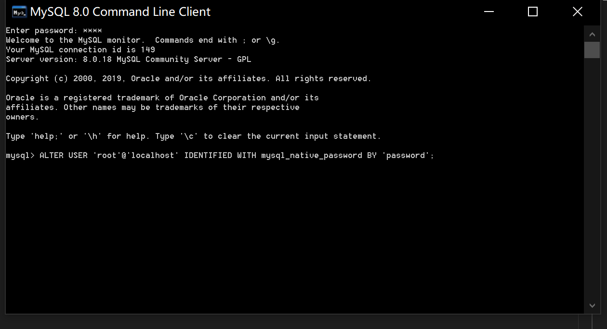

# 1.配置新连接报错：错误号码 2058，分析是 mysql 密码加密方法变了。如图：

# 2.解决办法：
* 1.登录到mysql控制台,登录你的 mysql 数据库,如图：
 
* 2.然后 执行这条SQL：
   ```mysql
   ALTER USER 'root'@'localhost' IDENTIFIED WITH mysql_native_password BY 'password';
  ```
注：password 是你自己设置的root密码
然后在重新配置SQLyog的连接，则可连接成功了，OK。