<!-- TOC -->

- [1.windows下Anaconda的搭建](#1windows下anaconda的搭建)
- [2.在Anaconda下搭建和配置TensorFlow](#2在anaconda下搭建和配置tensorflow)
  - [1.创建tensorflow环境](#1创建tensorflow环境)
  - [2.在tensorflow环境中安装opencv、tensorflow](#2在tensorflow环境中安装opencvtensorflow)
- [3.安装notebook](#3安装notebook)
- [4.在我们刚刚搭建好的tensorflow环境下编写一个实例进行测试](#4在我们刚刚搭建好的tensorflow环境下编写一个实例进行测试)
  - [1.运行notebook，进入到以下界面](#1运行notebook进入到以下界面)
  - [2.我们在桌面创建一个文件夹来保存我们以后要编写的项目，进入我们的文件夹执行以下操作](#2我们在桌面创建一个文件夹来保存我们以后要编写的项目进入我们的文件夹执行以下操作)
  - [3.开始编写程序](#3开始编写程序)
- [4.下面开始实现图片的读取和展示](#4下面开始实现图片的读取和展示)
  - [1.编写代码](#1编写代码)
- [5.接下来我们继续实现图片的写入功能](#5接下来我们继续实现图片的写入功能)
- [6.了解不同图片质量的保存](#6了解不同图片质量的保存)
  - [1.jpg格式图片的压缩](#1jpg格式图片的压缩)
  - [2.png格式的压缩](#2png格式的压缩)
- [7.像素操作](#7像素操作)
  - [1.像素](#1像素)
  - [2.RGB](#2rgb)
  - [3.颜色深度](#3颜色深度)
  - [4.图片的宽高](#4图片的宽高)
  - [5.图片的大小](#5图片的大小)
  - [6.RGB alpha](#6rgb-alpha)
  - [7.像素的读取以及写入](#7像素的读取以及写入)
    - [1.像素的读取](#1像素的读取)
    - [2.像素的写入](#2像素的写入)
- [8.tensorflow常量变量定义](#8tensorflow常量变量定义)
- [9.tensorflow运算原理](#9tensorflow运算原理)
- [10.tensor的四则运算](#10tensor的四则运算)
  - [1.常量间的四则运算](#1常量间的四则运算)
  - [2.常量与变量间的四则运算](#2常量与变量间的四则运算)
- [11.矩阵基础](#11矩阵基础)
  - [1.矩阵的定义：](#1矩阵的定义)
  - [2.矩阵的运算](#2矩阵的运算)
  - [3.矩阵的初始化](#3矩阵的初始化)
- [12.numpy模块的使用——矩阵模块](#12numpy模块的使用矩阵模块)
  - [1.检查numpy是否引入](#1检查numpy是否引入)
  - [2.回到notebook继续编写相应程序](#2回到notebook继续编写相应程序)
- [13.matplotlib模块的使用——绘图模块](#13matplotlib模块的使用绘图模块)
  - [1.模块的引入](#1模块的引入)
  - [2.绘制折线图以及柱状图](#2绘制折线图以及柱状图)
- [14.人工神经网络逼近股票拟合](#14人工神经网络逼近股票拟合)
  - [1.神经网络逼近股票的收盘均价](#1神经网络逼近股票的收盘均价)
  - [2.神经网络的工作原理](#2神经网络的工作原理)
    - [1.](#1)
    - [2.](#2)
    - [3.考虑维度的变化](#3考虑维度的变化)

<!-- /TOC -->
注意：在进行以下操作之前确保python环境已经搭建
# 1.windows下Anaconda的搭建
[点击此处进行下载](https://www.anaconda.com/products/individual)
下载之后就是一路的next进行安装，安装完成之后配置环境变量
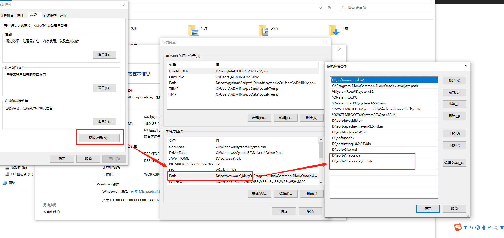
通过cmd输入conda， 若出现以下界面说明安装成功
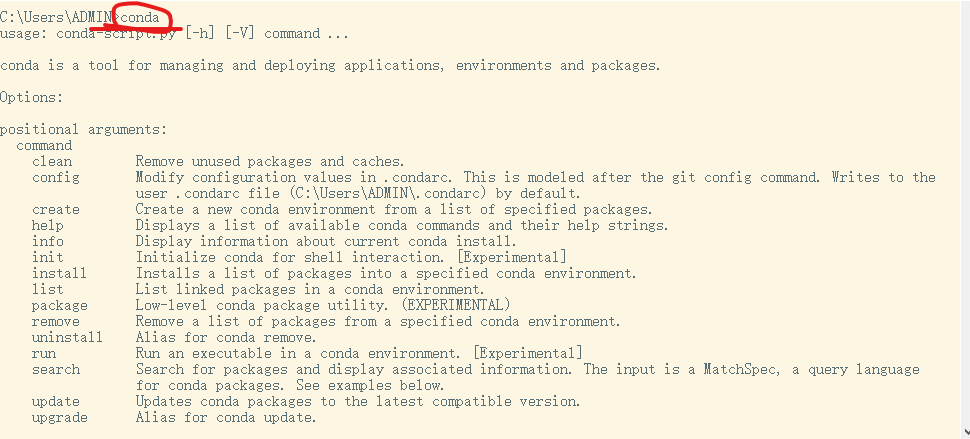
# 2.在Anaconda下搭建和配置TensorFlow
进入我们刚刚安装好的Anaconda软件 
## 1.创建tensorflow环境
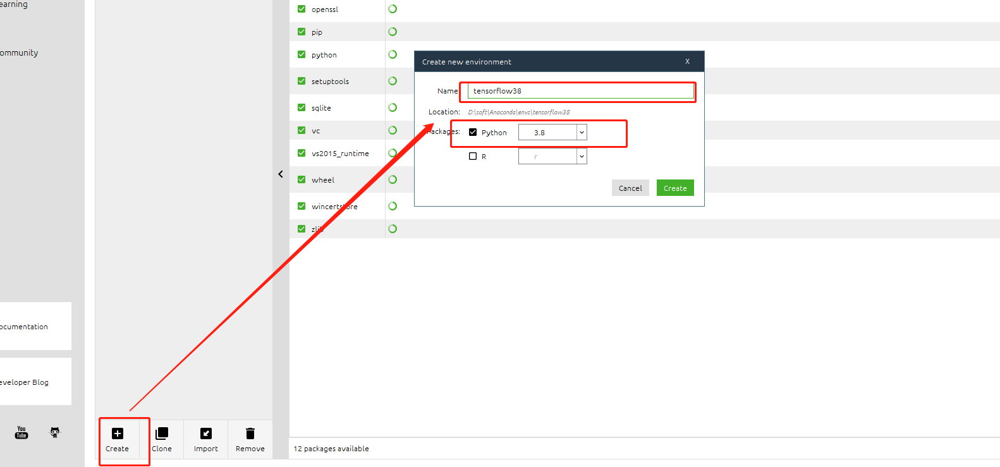
## 2.在tensorflow环境中安装opencv、tensorflow
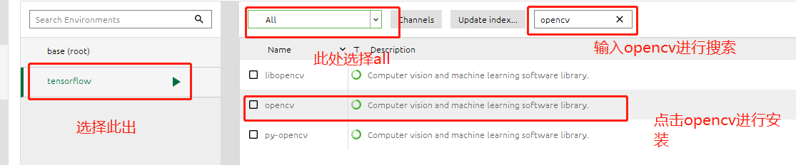
同样的方法搜索tensorflow，点击apply进行安装即可
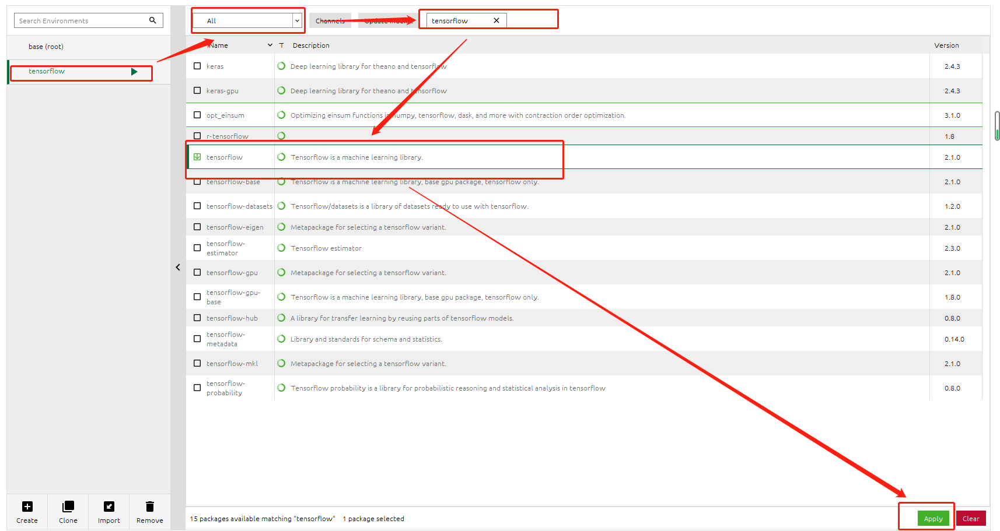
# 3.安装notebook
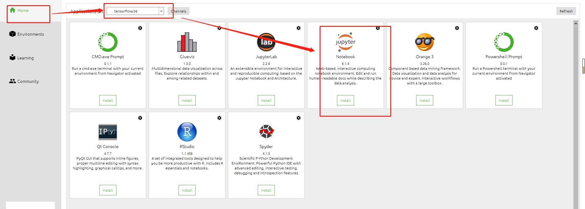
# 4.在我们刚刚搭建好的tensorflow环境下编写一个实例进行测试
## 1.运行notebook，进入到以下界面
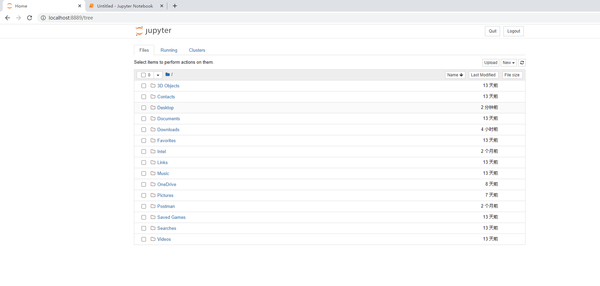
## 2.我们在桌面创建一个文件夹来保存我们以后要编写的项目，进入我们的文件夹执行以下操作
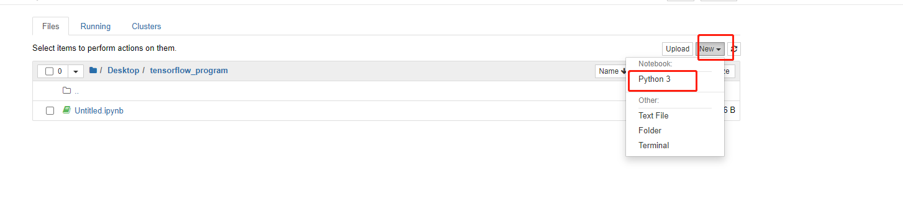
文件是绿色的说明项目正在运行，我们停掉服务，点击rename，重命名为00hello
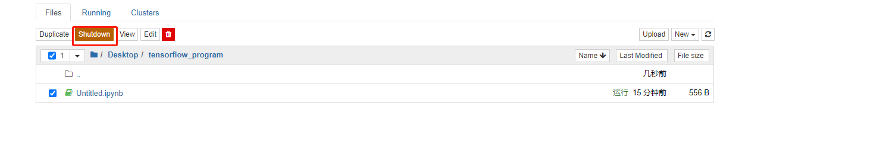
## 3.开始编写程序
首先引入tensorflow
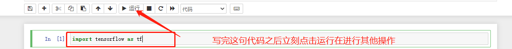
``` python
import tensorflow as tf
# 保证sess.run()能够正常运行
tf.compat.v1.disable_eager_execution()
hello=tf.constant("hello tf!")
sess=tf.compat.v1.Session()
print(sess.run(hello))
```
``` python
import cv2
print("hello opencv")
```
执行以上代码若出现以下结果说明环境搭建成功
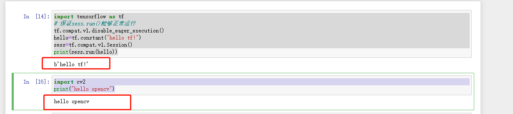
# 4.下面开始实现图片的读取和展示
我们重新创建一个文件，创建方法与步骤三的过程相同
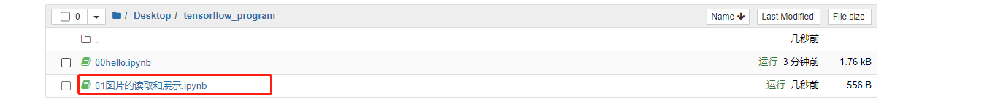
## 1.编写代码
``` python
import cv2
img=cv2.imread("image0.jpg",1)
cv2.imshow("image",img)
cv2.waitKey(0)
```
大致解释以下代码的作用：
* cv2.imread("image0.jpg","1")
> 该方法是完成的图片的读取，其中第一个参数是图片的名称，第二个参数是读取的类型 0：读取进来的是灰度的图片 1：读取进来的是彩色的图片

* cv2.imshow("image",img)
> 第一个参数是显示的窗体的名称，第二个参数描绘的是当前图片的内容

注意：image0.jpg可以是任意一张图片，并且要与你的项目在同级目录下面
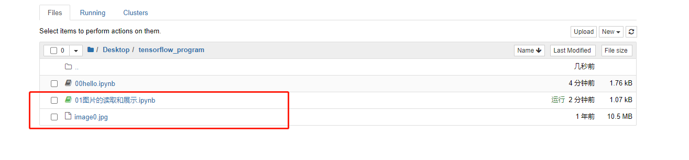
# 5.接下来我们继续实现图片的写入功能
使用  cv2.imwrite进行图片的写入
``` python
import cv2
img=cv2.imread("image0.jpg",1)
cv2.imwrite("image1.jpg",img)
```
* cv2.imwrite("image1.jpg",img)
> image1.jpg：表示写入的图片名称,同时根据当前图片的名称将为文件后缀添加
> img表示读取到的图片数据
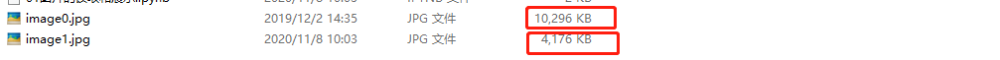
通过产生的结果我们很明显能看到新生成的图片是压缩过的
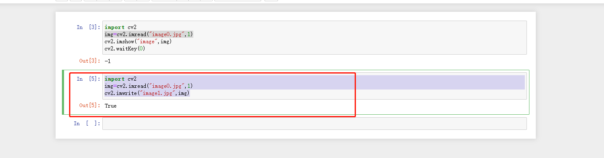
# 6.了解不同图片质量的保存
## 1.jpg格式图片的压缩
注意：jpg格式的图片压缩是有损压缩，且无法设置图片的透明度
* 我们第一次将图片压缩比设置为0
``` python
import cv2
img=cv2.imread("image0.jpg",1)
cv2.imwrite("imageTest.jpg",img,[cv2.IMWRITE_JPEG_QUALITY,0])
```
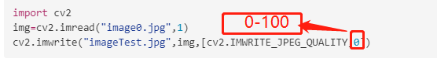
可以看到图片被压缩至4kb，打开之后非常的模糊
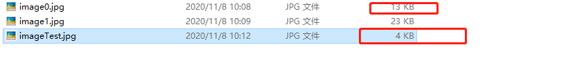
* 我们将参数调整至50,我们会发现图片会较之前清晰很多
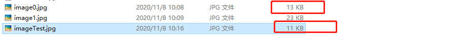
## 2.png格式的压缩
注意：png实现的是无损压缩
同样我们也先将压缩比设置为0
``` python
import cv2
img=cv2.imread("image0.jpg",1)
cv2.imwrite("imageTest.png",img,[cv2.IMWRITE_PNG_COMPRESSION,0])
```
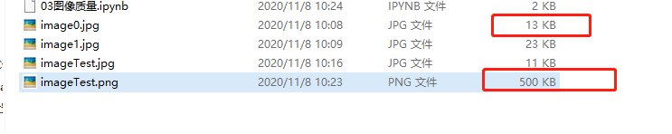
由此我们可以总结出png图片压缩比越低，像素就越高
# 7.像素操作
## 1.像素
> 像素是指由图像的小方格组成的，这些小方块都有一个明确的位置和被分配的色彩数值，小方格颜色和位置就决定该图像所呈现出来的样子。

## 2.RGB
> 每一种颜色都是由R G B 三种颜色分量组成

## 3.颜色深度
> 8bit的颜色深度它所能表示的颜色范围是0-255，所以对于RGB可以表示256^3个颜色

## 4.图片的宽高
> 640*480 表示：在水平方向上有640个像素点，在竖直方向上有480个像素点

## 5.图片的大小
> 1.14M=720 * 547 * 3 * 8 bit/8 (B)转换为M之后就是1.14M
> 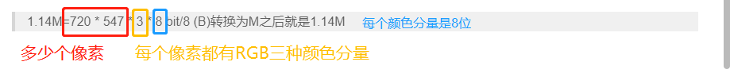

## 6.RGB alpha
> 描绘的是图片的透明度

## 7.像素的读取以及写入
### 1.像素的读取
``` python
import cv2
img=cv2.imread("image0.jpg",1)
(b,g,r)=img[100,100]
print(b,g,r)
```
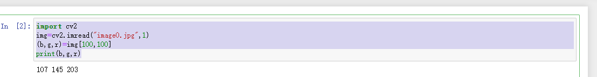
通过结果我们可以看到100,100这个点对应的像素值是b:107,g:145,r:203
### 2.像素的写入
``` python
import cv2
img=cv2.imread("image0.jpg",1)
(b,g,r)=img[100,100]
for i in range(1,100):
    img[10+i,100]=(255,0,0)
cv2.imshow("image",img)
cv2.waitKey(0)
```
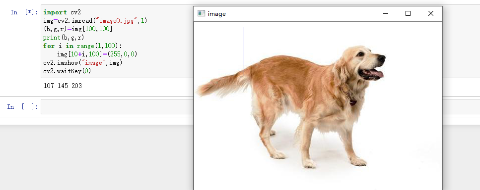
我们可以看出此时已经绘制出一条蓝色的线段
# 8.tensorflow常量变量定义
```
import tensorflow as tf
data1=tf.constant(2.5)# 常量
data2=tf.Variable(10,name='var')# 变量，变量名为data2
print(data1)
print(data2)
```
此时会输出刚刚我们定义的常量和变量的信息
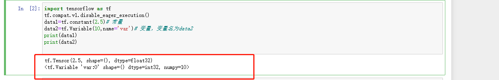
接下来我们使用session输出信息
``` python
import tensorflow as tf
tf.compat.v1.disable_eager_execution()
data1=tf.constant(2.5)# 常量
data2=tf.Variable(10,name='var')# 变量，变量名为data2
print(data1)
print(data2)
sess=tf.compat.v1.Session()
print(sess.run(data1))
init=tf.compat.v1.global_variables_initializer()# 初始化变量
sess.run(init)
print(sess.run(data2))
```
输出结果如下：
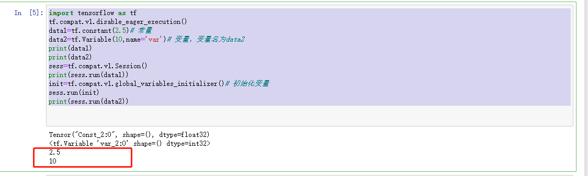
# 9.tensorflow运算原理
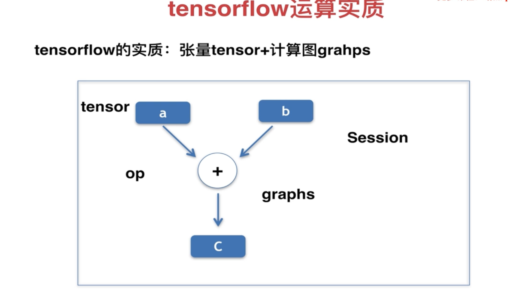
> tf=tensor+计算图
> tensor的实质就是数据
> op：指的是数据的操作，可以是四则运算操作也可以指赋值操作
> 计算图(graphs)：实质就是数据和操作的过程
> session:可以理解成一个运算的交互环境

注意：session中所有的变量必须初始化之后才能继续进行
# 10.tensor的四则运算
## 1.常量间的四则运算
```python
import tensorflow as tf
# 保证sess.run()能够正常运行
tf.compat.v1.disable_eager_execution()
data1=tf.constant(6)
data2=tf.constant(2)
dataAdd=tf.add(data1,data2)# 加法
dataMul=tf.multiply(data1,data2)# 乘法
dataSub=tf.subtract(data1,data2)# 减法
DataDiv=tf.divide(data1,data2)# 除法
with tf.compat.v1.Session() as sess:
    print(sess.run(dataAdd))
    print(sess.run(dataMul))
    print(sess.run(dataSub))
    print(sess.run(DataDiv))
print("end!")
```
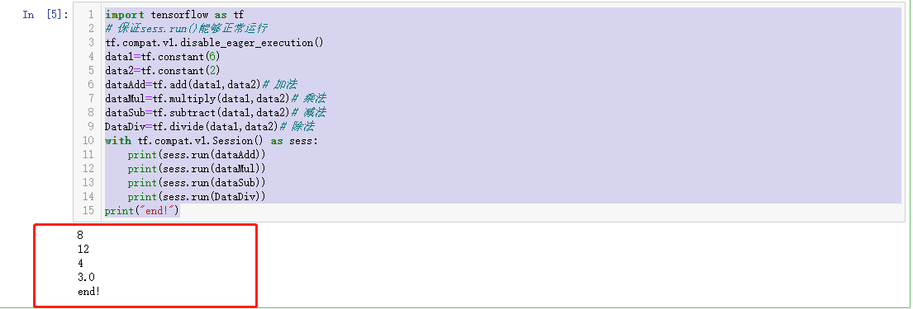
## 2.常量与变量间的四则运算
``` python
import tensorflow as tf
import tensorflow as tf
# 保证sess.run()能够正常运行
tf.compat.v1.disable_eager_execution()
data1=tf.constant(6)
data2=tf.Variable(2,name='var')# 变量，变量名为data2
dataAdd=tf.add(data1,data2)# 加法
dataMul=tf.multiply(data1,data2)# 乘法
dataSub=tf.subtract(data1,data2)# 减法
DataDiv=tf.divide(data1,data2)# 除法
datacopy=tf.compat.v1.assign(data2,dataAdd) # 相当于将dataAdd的值赋予data2
init=tf.compat.v1.global_variables_initializer()# 初始化变量
with tf.compat.v1.Session() as sess:
    sess.run(init)#必须先执行init
    print(sess.run(dataAdd))
    print(sess.run(dataMul))
    print(sess.run(dataSub))
    print(sess.run(DataDiv))
    print("datacopy:",sess.run(datacopy))
    print("datacopy_evel",datacopy.eval())# 在执行这句话时data2已经是8了，datacopy.evel()就是相当于sess.run(dataAdd)操作，即执行8+6=14,并且把值赋给data2
    print("get_default_session",tf.compat.v1.get_default_session().run(datacopy))#与data.evel()操作一样，14+6=20
print("end!")
```
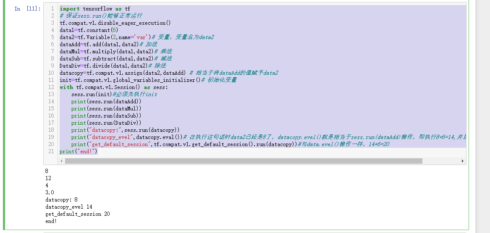
# 11.矩阵基础
## 1.矩阵的定义：
内部：[] 括号里面表示的是一个列数据，中括号的整体作为一个行数
eg:
``` python
[[6,8]]:表示一个一行两列的矩阵，第一行第一列：6，第一行第二列：8
[[2],[3]]:表示两行一列，其中第一行第一列的数据：2,第二行第一列的数据：3
[[1,2],[3,4],[5,6]]:三行两列。
第一行第一列：1，第一行第二列：2;
第二行第一列：3，第二行第二列：4;
第三行第一列：5，第三行第二列：6，
```
``` python
import tensorflow as tf
# 保证sess.run()能够正常运行
tf.compat.v1.disable_eager_execution()
data1=tf.constant([[6,6]])
data2=tf.constant([[2],
                   [2]])
data3=tf.constant([[3,3]])
data4=tf.constant([[1,2],
                   [3,4],
                   [5,6]])
print("data4维度：",data4.shape) #打印矩阵维度
with tf.compat.v1.Session() as sess:
    print("data4内容：",sess.run(data4))
    print("data4第一行：",sess.run(data4[0]))# 第一行的数据
    print("data4第一列：",sess.run(data4[:,0]))# 第一列的数据
    print("data4第一行第一列：",sess.run(data4[0,0]))# 第一行第一列的数据
```
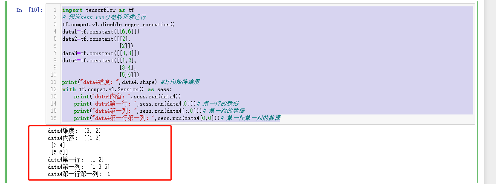
## 2.矩阵的运算
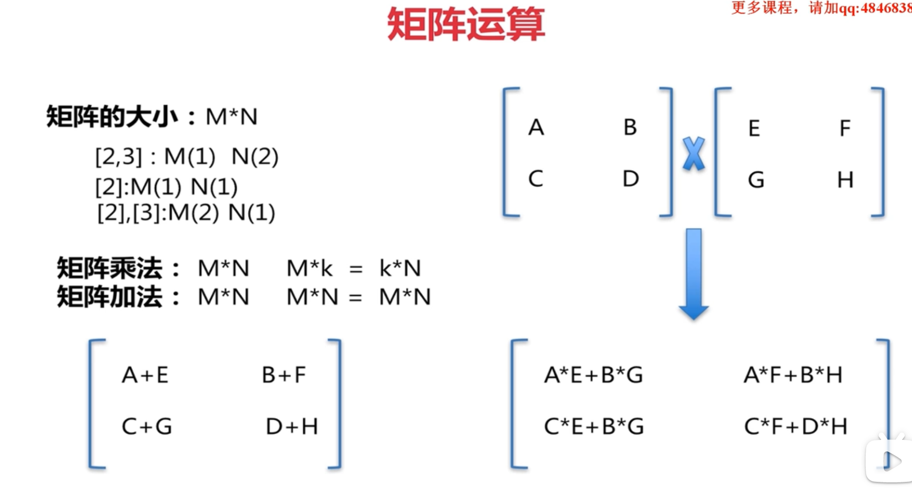
``` python
import tensorflow as tf
# 保证sess.run()能够正常运行
tf.compat.v1.disable_eager_execution()
data1=tf.constant([[6,6]])
data2=tf.constant([[2],
                   [2]])
data3=tf.constant([[3,3]])
data4=tf.constant([[1,2],
                   [3,4],
                   [5,6]])
matMul=tf.matmul(data1,data2)# 矩阵相乘
matAdd=tf.add(data1,data2)# 矩阵相加
with tf.compat.v1.Session() as sess:
    print("加法：",sess.run(matAdd))
    print("乘法：",sess.run(matMul))
    print(sess.run([matAdd,matMul]))
```
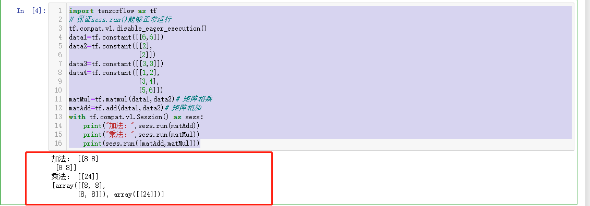
## 3.矩阵的初始化
``` python
import tensorflow as tf
# 保证sess.run()能够正常运行
tf.compat.v1.disable_eager_execution()
mat0=tf.constant([[0,0,0],[0,0,0]])# 定义一个2*3的空矩阵
mat1=tf.zeros([2,3])# 定义一个2*3的空矩阵
mat2=tf.ones([3,2])#定义一个3*2的全1矩阵
mat3=tf.fill([2,3],15)# 定义一个2*3的填充矩阵，填充内容为15
with tf.compat.v1.Session() as sess:
    print("全0矩阵：",sess.run(mat1))
    print("全1矩阵：",sess.run(mat2))
    print("填充矩阵：",sess.run(mat3))
```
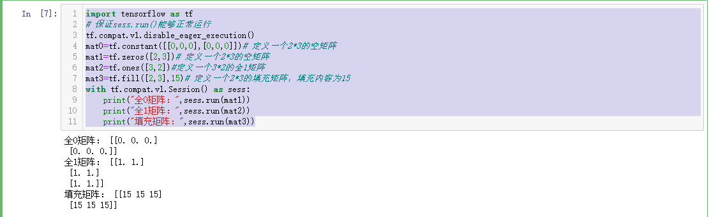
```python
import tensorflow as tf
# 保证sess.run()能够正常运行
tf.compat.v1.disable_eager_execution()
mat1=tf.constant([[2],[3],[4]])
mat2=tf.zeros_like(mat1)# 定义一个和mat1维度相同的全零矩阵
mat3=tf.linspace(0.0,2.0,11)#定义一个1*10 从1到2被均分为10份的矩阵
# 定义一个2*3的矩阵，矩阵内容为-1,2所产生的随机数
mat4=tf.compat.v1.random_uniform([2,3],-1,2)
with tf.compat.v1.Session() as sess:
    print("mat2",sess.run(mat2))
    print("均分矩阵mat3:",sess.run(mat3))
    print("随机矩阵mat4:",sess.run(mat4))
```
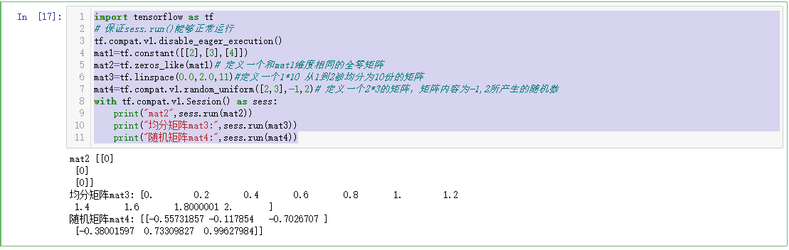
# 12.numpy模块的使用——矩阵模块
## 1.检查numpy是否引入
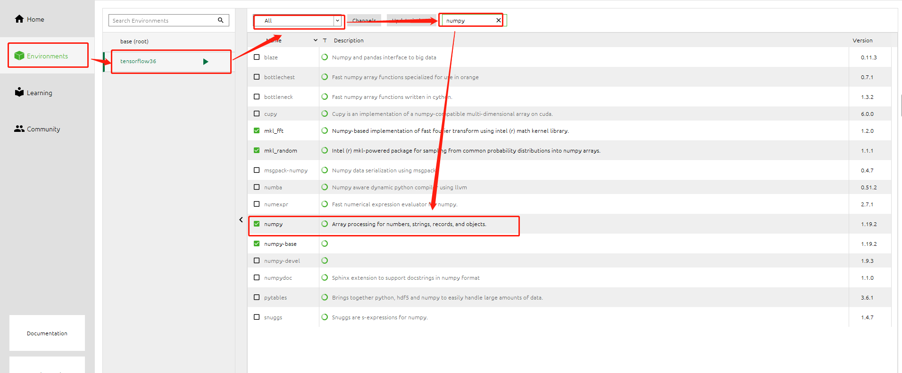
## 2.回到notebook继续编写相应程序
``` python
import numpy as np
data1=np.array([1,2,3,4,5])
print(data1)
data2=np.array([[1,2],[3,4]])
print(data2)
print("data1维度:",data1.shape)
print("data2维度:",data2.shape)
# 矩阵的修改与查找
data2[1,0]=5 #将矩阵2的第二行第一列的值修改为5
print("修改之后的2矩阵：",data2)
print("矩阵2第二行第2列的值:",data2[1,1])
# 基本运算
data3=np.ones([2,3])
print("data3*2:",data3*2)
```
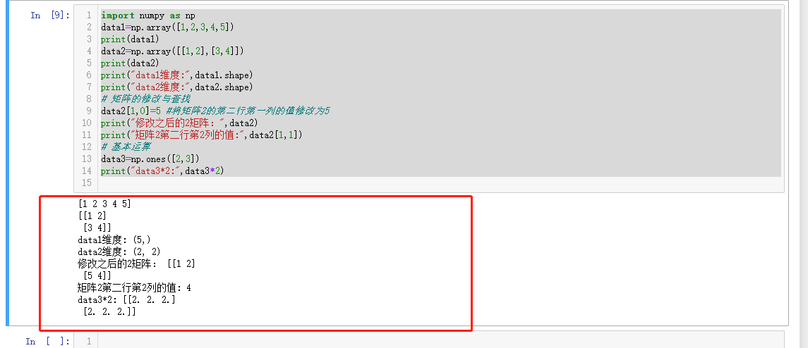
# 13.matplotlib模块的使用——绘图模块
## 1.模块的引入

## 2.绘制折线图以及柱状图
``` python
import numpy as np
import matplotlib.pyplot as plt
#用于绘制折线图
x=np.array([1,2,3,4,5,6,7,8])
y=np.array([3,5,7,6,2,6,10,15])
plt.plot(x,y,'red')
plt.plot(x,y,"green",lw=10)# lw表示线条的宽度
#用于绘制柱状图
x=np.array([1,2,3,4,5,6,7,8])
y=np.array([13,25,17,36,21,16,10,15])
plt.bar(x,y,0.5,alpha=1,color='b')# 0.5:表示每个柱状图所占用的比例  alpha:透明度
plt.show()
```
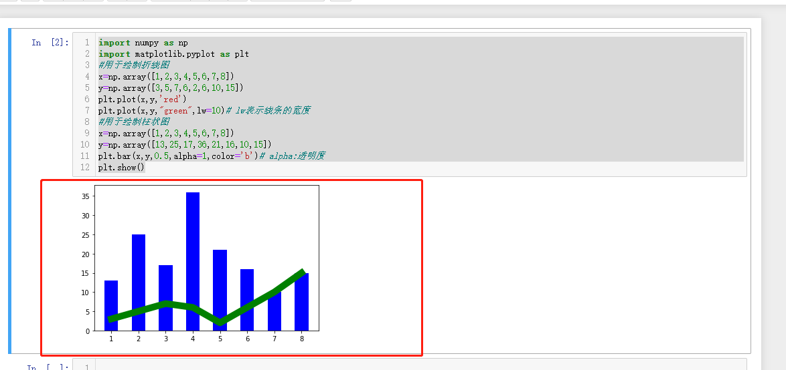
# 14.人工神经网络逼近股票拟合
## 1.神经网络逼近股票的收盘均价
``` python
import tensorflow.compat.v1 as tf
import numpy as np
import matplotlib.pyplot as plt
# 保证sess.run()能够正常运行
tf.disable_eager_execution()
date=np.linspace(1,15,15)#1-15天的日期
endPrice=np.array([2511.90,2538.26,2510.68,2591.66,2732.98,2701.69,2701.29,2678.67,2726.50,2681.50,2739.17,2715.07,2823.58,2864.90,2919.08])
beginPrice=np.array([2438.71,2500.88,2534.95,2512.52,2594.04,2743.26,2697.47,2695.24,2678.23,2722.13,2674.93,2744.13,2717.46,2832.73,2877.40])
print("日期：",date)
plt.figure()# 定义一个绘图
for i in range(0,15):
    # 1.柱状图
    dateOne=np.zeros([2])# 当天的日期
    dateOne[0]=i
    dateOne[1]=i
    priceOne=np.zeros([2]) #当天的开盘价以及收盘价
    priceOne[0]=beginPrice[i]# 当天的开盘价
    priceOne[1]=endPrice[i]# 当天的收盘价
    
    if endPrice[i]>beginPrice[i]:#判断当天的开盘价是否小于当天的收盘价
        plt.plot(dateOne,priceOne,'red',lw=8)
    else:
         plt.plot(dateOne,priceOne,'green',lw=8)
plt.show()
```
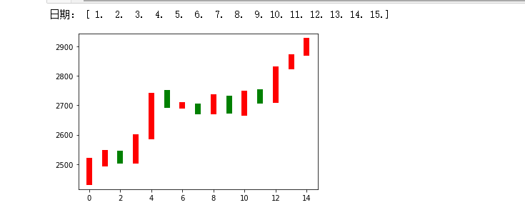
## 2.神经网络的工作原理
### 1.
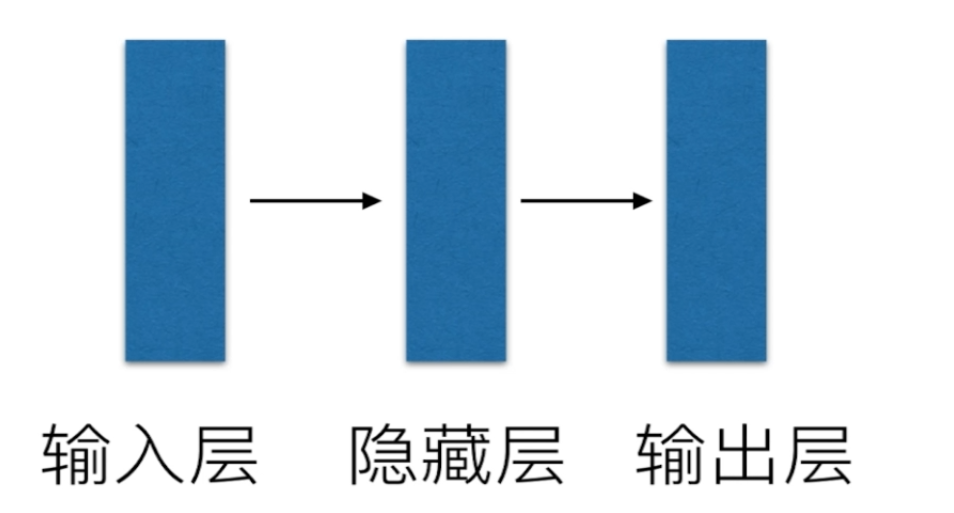
上面就是一个最简单的神经网络模型，其中:
* 输入层就是我们即将要输入的天数的矩阵即一个一行15列的矩阵
* 隐藏层：接收到输入层的数据，注意：中间层（也叫隐藏层）可以是一层也可以是多层
* 输出层：就是经过隐藏层计算之后得到的数据也就是我们要拿到的预测的股票价格
### 2.
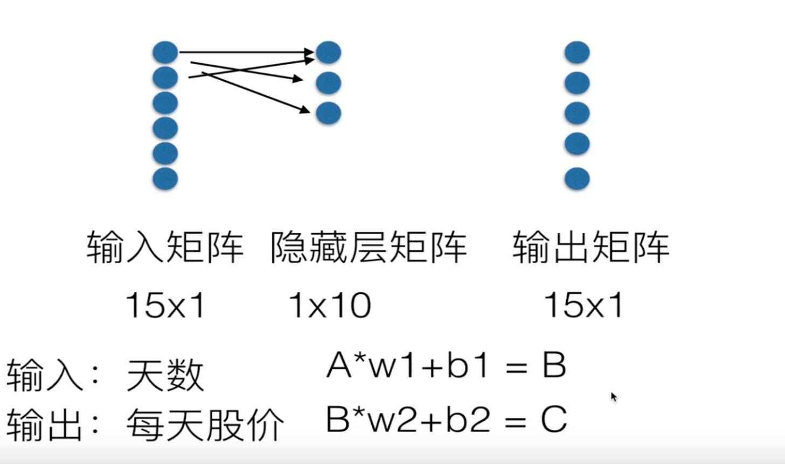
第一层和第二层之间的关系：<font color="#FF0000">A*W1+b1=B</font>
* A:输入矩阵
* w1:权重矩阵
* b1:偏执矩阵


第二层和第三层之间的关系：<font color="#FF0000">B*W2+b2=C</font>
### 3.考虑维度的变化
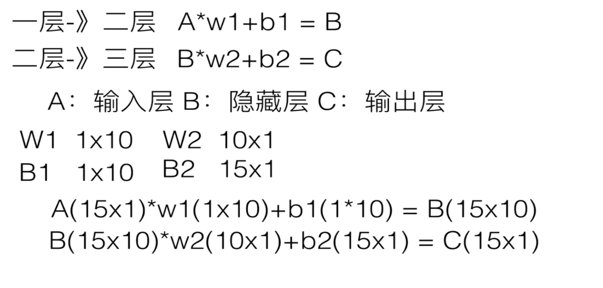
* 第一次循环 A现在描述第一天的日期 其中w1w2b1b2共同构成C
给w1w2b1b2一个初始值分别是（0.1 0.1 0.2 0.3）
w1w2b1b2(0.1 0.1 0.2 0.3)——>C
通过计算我们可以计算出C的结果是2400点，但实际上股票值是2511点，中间相差111点
* 第二次循环 ，我们使用梯度下降法，目的是降低误差，这样的话会给出新的w1w2b1b2来降低误差
* 那我们何时终止循环？
通过次数来控制当误差控制在2%以内即可终止