# 1.本文搭建 FTP 服务组成版本如下：
* Windows 操作系统，本文以 Windows Server 2012 为例。
* IIS：Web 服务器，本文以 IIS 8.5 为例。
# 2.操作步骤：
### 1.登录云服务器
windows系统登录云服务器的方法[点击此处](https://help.aliyun.com/knowledge_detail/60784.html?spm=5176.10173289.107.2.1d9d2e77rmBhhd)
### 2.在 IIS 上安装 FTP 服务
##### 1.在操作系统界面，打开服务器管理器。
##### 2. 在“服务器管理器”窗口中，单击【添加角色与功能】。如下图所示：
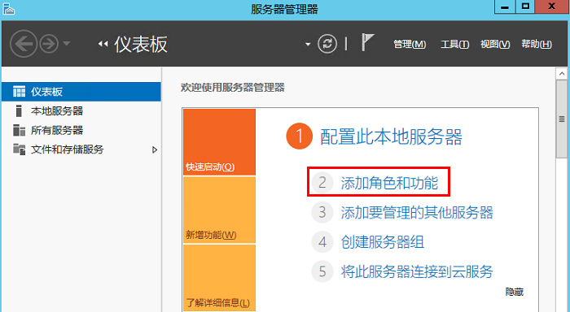
##### 3. 在弹出的“添加角色和功能向导”窗口中，单击【下一步】，进入“选择安装类型”界面。
##### 4. 在“选择安装类型”界面中，选择【基于角色或基于功能的安装】，单击【下一步】。
##### 5. 在“选择目标服务器”界面中，保持默认设置，单击【下一步】。如下图所示：
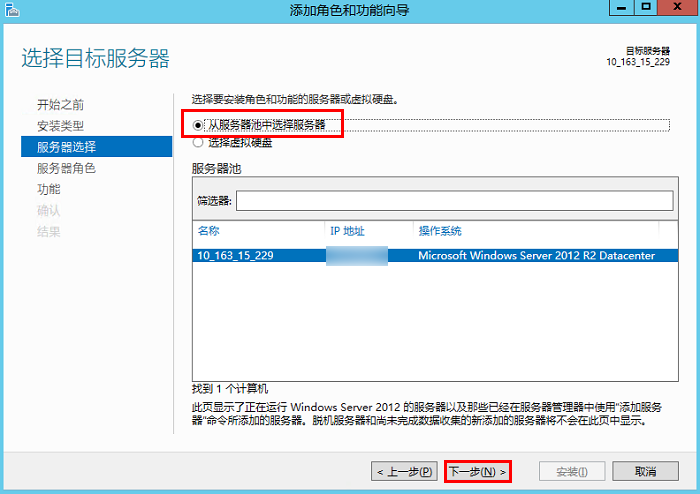
##### 6. 在“选择服务器角色”界面中，勾选【Web 服务器(IIS)】，并在弹出的窗口中单击【添加功能】。如下图所示：
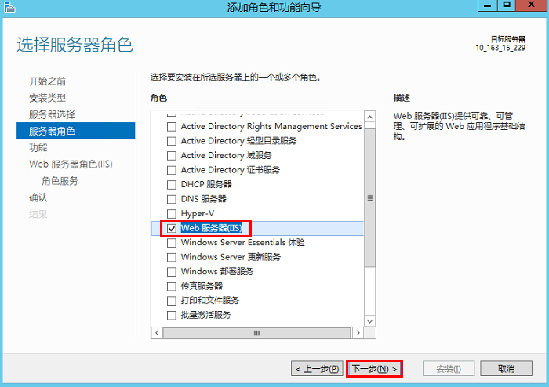
##### 7. 连续单击三次【下一步】，进入“选择角色服务”界面。
##### 8.在“选择角色服务”界面，勾选【FTP 服务】及【FTP 扩展】，单击【下一步】。如下图所示：
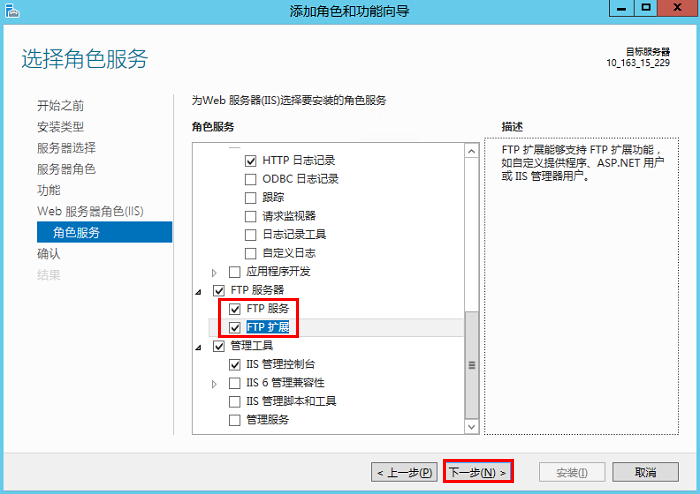
##### 9. 单击【安装】，开始安装 FTP 服务。
##### 10. 安装完成后，单击【关闭】。
### 3.创建 FTP 用户名及密码
##### 1. 在“服务器管理器”窗口中，选择右上角导航栏中的【工具】>【计算机管理】，打开计算机管理窗口。
##### 2. 在“计算机管理”界面中，选择左侧导航栏中的【系统工具】>【本地用户和组】>【用户】。
##### 3. 在【用户】右侧界面中，右键单击空白位置，选择【新用户】。如下图所示：
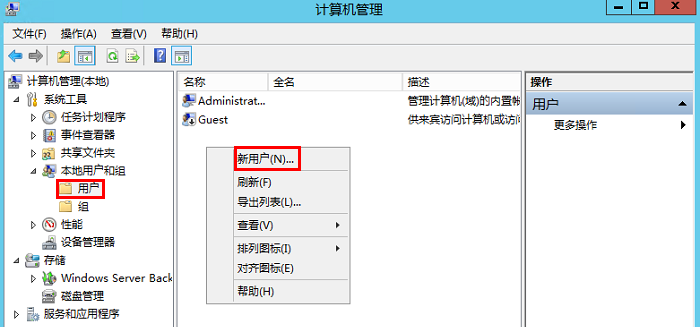
##### 4.在“新用户”界面，按照以下提示设置用户名及密码，并单击【创建】。如下图所示：
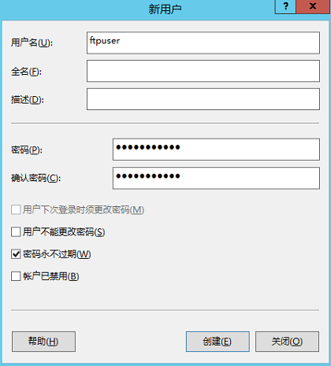
##### 5. 单击【关闭】，关闭“新用户”窗口后即可在列表中查看已创建的 ftpuser 用户。
### 4.设置共享文件夹权限
##### 1. 在操作系统界面，打开“这台电脑”窗口。
##### 2. 在 C 盘下，选择并右键单击 test 文件夹，选择【属性】。
##### 3. 在“test 属性”窗口中，选择【安全】标签。
##### 4. 选择 Everyone 用户并单击【编辑】。如下图所示：
若没有everyone用户，[点击此处](https://cloud.tencent.com/document/product/213/10414#add)
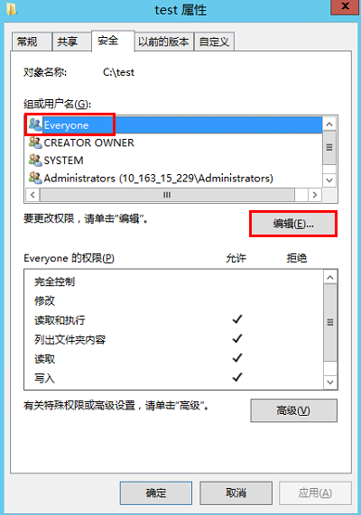
##### 5. 在“test 的权限”界面中，按需设置 Everyone 用户的权限并单击【确定】。如下图所示：
本文以授予 Everyone 用户所有权限为例。
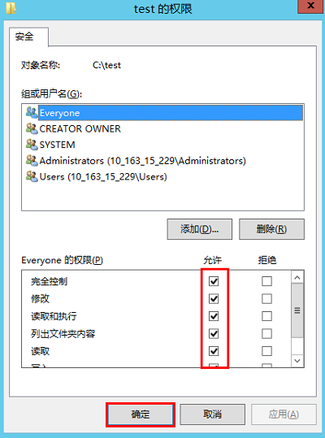
##### 6. 在“test 属性”窗口中，单击【确定】完成设置。
### 5.添加 FTP 站点
##### 1. 在“服务器管理器”窗口中，选择右上角导航栏中的【工具】>【Internet Information Services (IIS)管理器 】。
##### 2. 在打开的 “Internet Information Sevices (IIS)管理器” 窗口中，依次展开左侧导航栏的服务器名称，并右键单击【网站】，选择【添加 FTP 站点】。如下图所示：
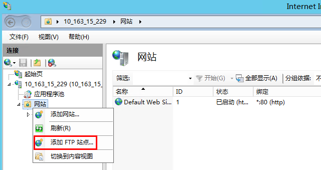
##### 3. 在“站点信息”界面中，参考以下信息进行设置，并单击【下一步】。如下图所示：
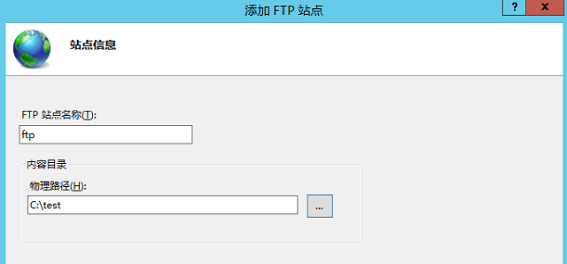
* FTP 站点名称：填写 FTP 站点名称，本文以 ftp 为例。
* 物理路径：请选择已设置权限的共享文件夹路径，本文以 C:\test 为例。
##### 4.在“绑定和 SSL 设置”界面中，参考以下信息进行设置，并单击【下一步】。如下图所示：
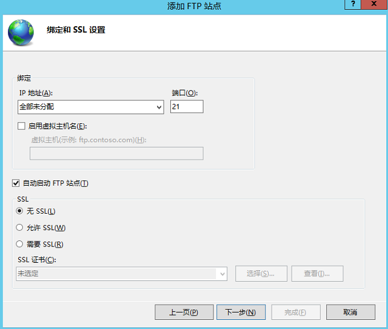
##### 5. 在“身份验证和授权信息”界面中，参考以下信息进行设置，并单击【下一步】。如下图所示：
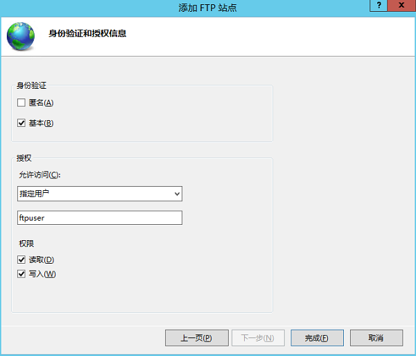
##### 6. 单击【完成】即可成功创建 FTP 站点。
### 6.测试是否配置成功
打开客户端的计算机，在路径栏中访问以下地址。如下图所示：
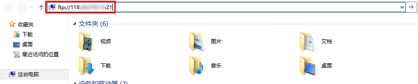
若出现 **200 Type set to A**的错误，如图：     

解决办法如下：
* 1.打开IE浏览器，在intenet选项里的高级==》
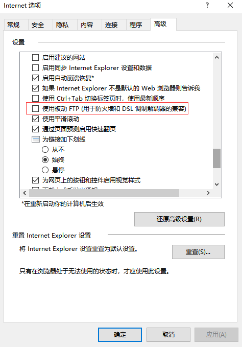
取消勾选“使用被动ftp”