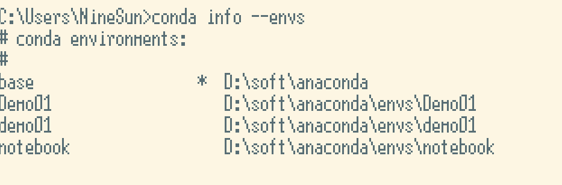
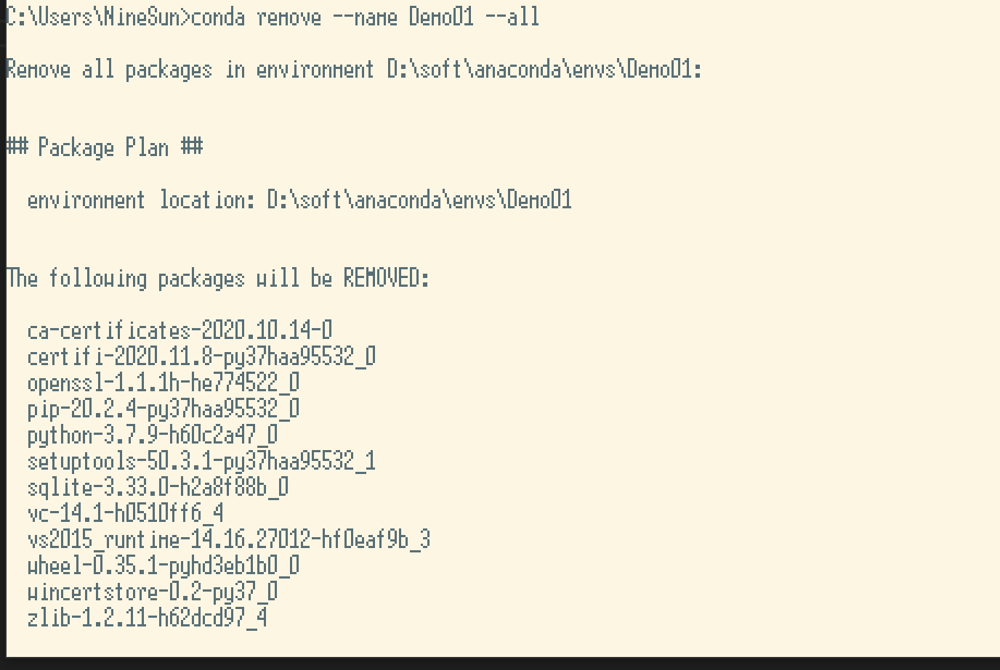
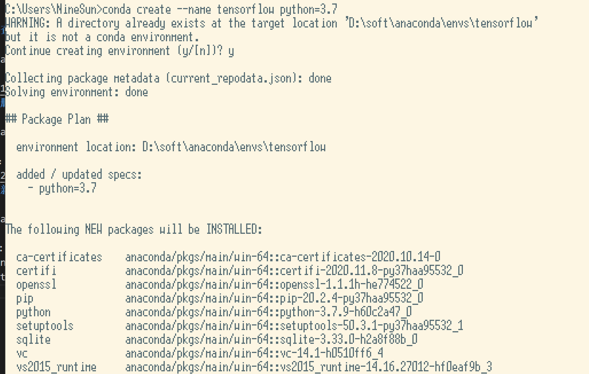
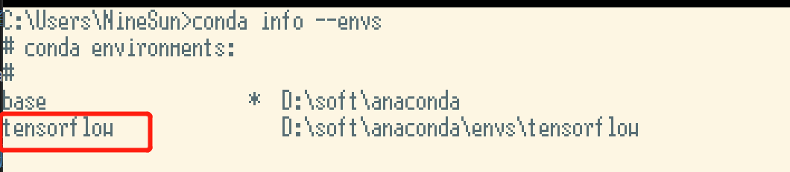
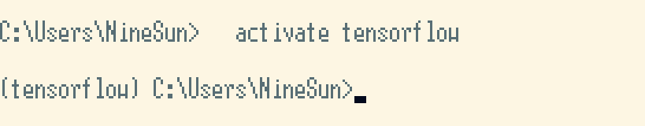
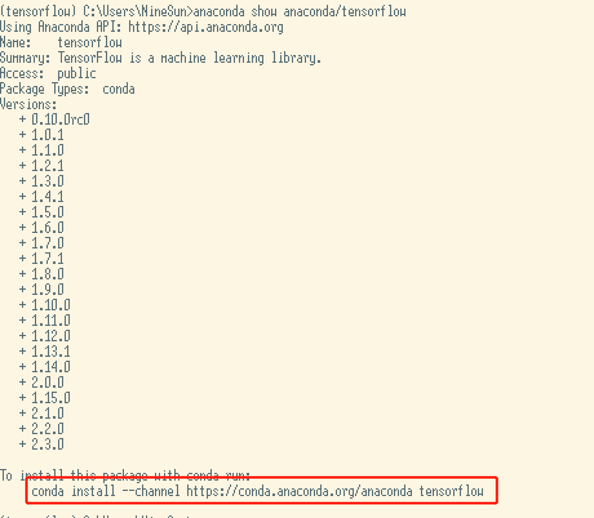

<!-- TOC -->

- [1.查看anaconda已经创建的环境](#1查看anaconda已经创建的环境)
- [2.删除已经添加的环境](#2删除已经添加的环境)
- [3.新建一个环境](#3新建一个环境)
- [4.指定使用新环境](#4指定使用新环境)
- [5.在指定环境下安装tensorflow等](#5在指定环境下安装tensorflow等)
  - [5.1 使用](#51-使用)
  - [5.2 安装](#52-安装)

<!-- /TOC -->
# 1.查看anaconda已经创建的环境
```
conda info --envs
```

# 2.删除已经添加的环境
```
conda remove --name Demo01 --all
```
注意：Demo01是你创建的环境名

# 3.新建一个环境
```
conda create --name tensorflow python=3.7
```
注意:
* tensorflow是你创建的新环境的名字
* python=3.7 是指定的新环境的版本

使用指令conda info --envs就可以看到我们刚刚创建的新环境

# 4.指定使用新环境
```
activate tensorflow
```
注意：tensorflow 是你的环境名字

使用指令conda info --envs查看当前的激活环境
# 5.在指定环境下安装tensorflow等
## 5.1 使用
```
anaconda show anaconda/tensorflow
```
查看你要安装的版本

## 5.2 安装
通过它提供给我们的指令进行安装
```
conda install --channel https://conda.anaconda.org/anaconda tensorflow
```
通过指令
```
pip list
```
查看已经安装好的包已经对应的版本
