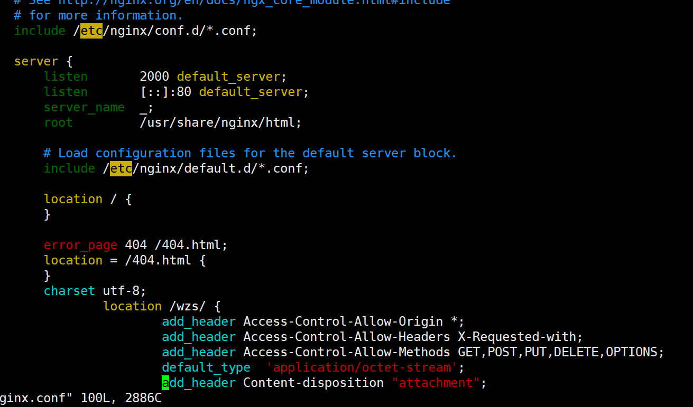

# 1.安装nginx
```
yum -y install nginx
```
等待安装结束之后，通过指令
```
nginx -v
```
查看是否安装成功

# 2.修改nginx.conf
```
cd /etc/nginx
vim ./nginx.conf
```

# 3.nginx的启动，重启，停止
* 1.启动
  ```
    service nginx start
  ```
* 2.重启
  ```
    service nginx restart
  ```
* 3.停止
  ```
    service nginx stop
  ```
至此一个简单的nginx环境到此结束