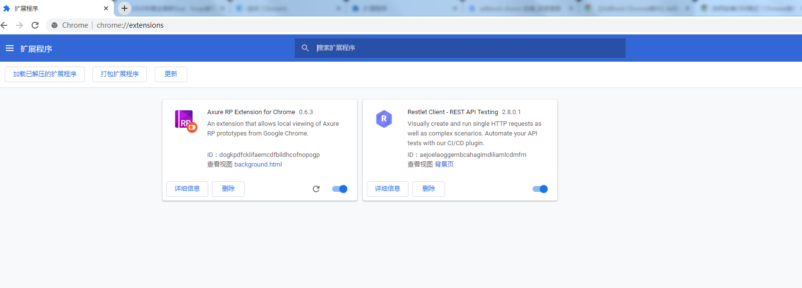
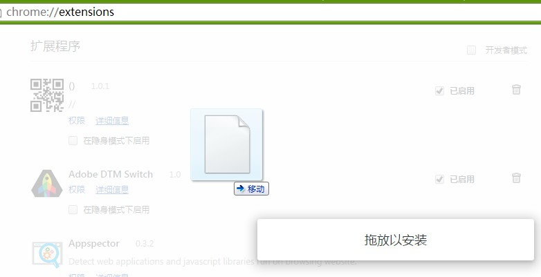
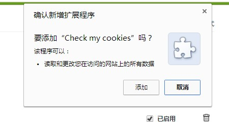
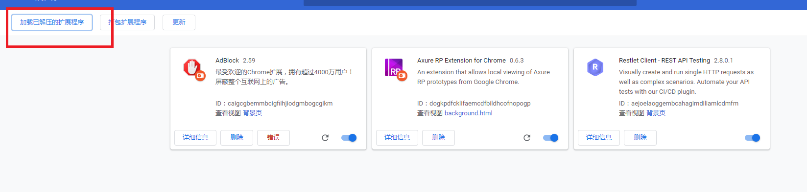
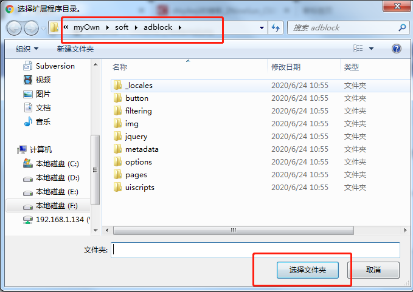

# 1.输入链接：chrome://extensions/

# 2.将下载好的插件拖动至此页面，点击安装即可

# 3.若提示安装包无效，则将你下载好的插件后缀改为.rar格式，同时解压缩

# 4.在chorm的扩展程序界面，点击加载已扩展程序

选择你刚刚解压的目录即可

[点击此处下载adblock插件](http://123.57.24.75:2000/downLoad/adblock.crx)