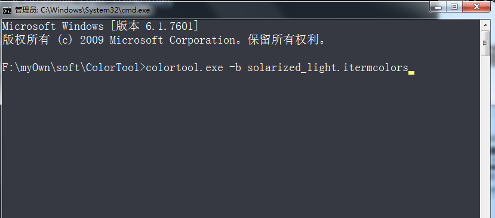
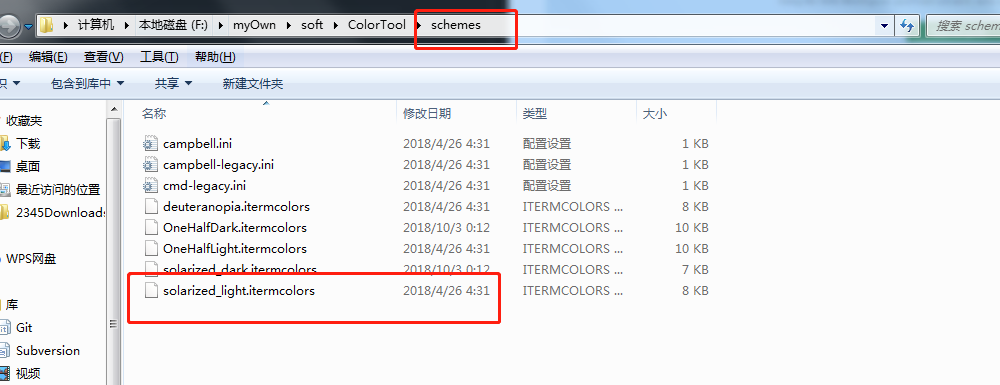
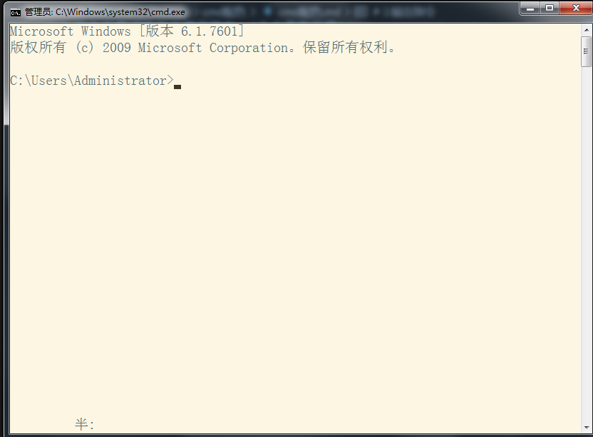

# 1.首先下载对应的主题安装包，[点击此处下载](https://github.com/microsoft/terminal/releases/tag/1904.29002)

# 2.解压现在好的文件，同时打开cmd进入并切换路径至你解压的文件夹下
# 3.输入指令
```
colortool.exe -b solarized_light.itermcolors
```

注意 solarized_light.itermcolors为主题名称，对应在schemes目录下

# 4.最终效果如下：
