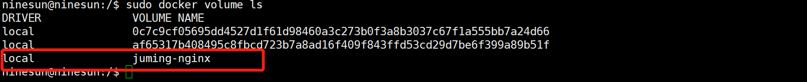
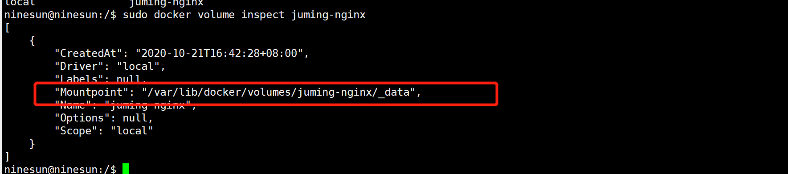

<!-- TOC -->

- [1.停止镜像](#1停止镜像)
    - [1.通过  docker ps -a 查看所有的运行的进程](#1通过-docker-ps--a-查看所有的运行的进程)
    - [2. 通过运行 docker stop id  停止运行](#2-通过运行-docker-stop-id-停止运行)
    - [3.进程停止后就可以t通过 docker rm id  删除 承载改进程的容器了](#3进程停止后就可以t通过-docker-rm-id-删除-承载改进程的容器了)
    - [4.最后通过运行 docker rmi id  删除镜像](#4最后通过运行-docker-rmi-id-删除镜像)
- [2.拉取镜像](#2拉取镜像)
    - [1.不指定版本（默认获取最新版本）](#1不指定版本默认获取最新版本)
    - [2.指定版本](#2指定版本)
- [3.查看镜像](#3查看镜像)
- [4.运行容器](#4运行容器)
- [5.启动镜像](#5启动镜像)
- [6.查看当前正在运行镜像](#6查看当前正在运行镜像)
- [7.查看所有镜像](#7查看所有镜像)
- [8.停止镜像服务](#8停止镜像服务)
- [9.查看日志](#9查看日志)
- [10.进入当前正在运行的容器](#10进入当前正在运行的容器)
- [11.从容器内拷贝文件到主机上](#11从容器内拷贝文件到主机上)
- [12.查看docker状态](#12查看docker状态)
- [13.提交容器成为一个新的副本](#13提交容器成为一个新的副本)
- [14.查看容器详细信息](#14查看容器详细信息)
- [15.数据卷的挂载 -v](#15数据卷的挂载--v)
  - [15.1 指定容器外的路径](#151-指定容器外的路径)
  - [15.2 不指定容器外的路径](#152-不指定容器外的路径)
    - [15.2.1 匿名挂载](#1521-匿名挂载)
    - [15.2.2 查看挂载之后的卷](#1522-查看挂载之后的卷)
  - [15.3 具名挂载](#153-具名挂载)
    - [15.3.1 挂载](#1531-挂载)
    - [15.3.2 查看挂载之后的卷](#1532-查看挂载之后的卷)
    - [15.3.3 查看卷的具体路径](#1533-查看卷的具体路径)
- [16.DockerFile](#16dockerfile)
  - [DockerFile的基本指令](#dockerfile的基本指令)
  - [16.1 创建文件docker-file，添加一下内容](#161-创建文件docker-file添加一下内容)
  - [16.2 创建镜像](#162-创建镜像)
  - [16.3 运行我们创建好的镜像](#163-运行我们创建好的镜像)
  - [进入之后，查看挂载情况](#进入之后查看挂载情况)
- [17.多个容器之间的数据共享 --volumes-from](#17多个容器之间的数据共享---volumes-from)
  - [17.1 我们首先启动一个镜像](#171-我们首先启动一个镜像)
  - [17.2 我们接着在启动同一个镜像文件，命名为docker02 同时挂载到docker01上](#172-我们接着在启动同一个镜像文件命名为docker02-同时挂载到docker01上)
  - [17.3 开始验证容器之间的数据共享](#173-开始验证容器之间的数据共享)
    - [17.3.1 在docker01的挂载卷所在目录下创建一个文件](#1731-在docker01的挂载卷所在目录下创建一个文件)
    - [17.3.2 在docker02的相同的挂载卷所在的 目录下查看](#1732-在docker02的相同的挂载卷所在的-目录下查看)
- [18.提交自己的镜像到Docker Hub以及发布至阿里云](#18提交自己的镜像到docker-hub以及发布至阿里云)
  - [18.1 登录](#181-登录)
  - [18.2 推送镜像到远端](#182-推送镜像到远端)
  - [18.3 发布至阿里云镜像](#183-发布至阿里云镜像)
    - [18.3.1 进入至阿里云镜像仓库](#1831-进入至阿里云镜像仓库)
    - [18.3.2 创建镜像仓库](#1832-创建镜像仓库)

<!-- /TOC -->
# 1.停止镜像
### 1.通过  docker ps -a 查看所有的运行的进程
``` shell
docker ps -a
```
### 2. 通过运行 docker stop id  停止运行
```
docker stop 进程id
```
### 3.进程停止后就可以t通过 docker rm id  删除 承载改进程的容器了
```
docker rm 进程id
```
### 4.最后通过运行 docker rmi id  删除镜像
```
docker rmi 进程id/进程名
```
# 2.拉取镜像
### 1.不指定版本（默认获取最新版本）
``` 
docker pull 镜像名称
```
### 2.指定版本
```
docker pull 镜像名称：版本号
```
# 3.查看镜像
``` 
docker images
```
# 4.运行容器
```
docker run [可选参数] 镜像名
```
其中可选参数有：
> --name="容器名字"  用来区分容器 
> -d 后台方式运行
> -it 使用交互方式运行，进入容器查看内容
> -p 指定容器端口 -p 8080:2000 主机端口映射容器端口
比如：
> docker run -it centos /bin/bash
> sudo docker run -d --name nginx01  -p 3344:80 nginx
# 5.启动镜像
```
docker start 镜像名
```
# 6.查看当前正在运行镜像
``` 
docker ps
```
# 7.查看所有镜像
```
docker ps -a
```
# 8.停止镜像服务
```
docker stop 
```
# 9.查看日志
```
docker logs -f -t --tail 条数 容器名称
```
# 10.进入当前正在运行的容器
```
docker exec  -it 容器id 比如docker exec -it 0d65014fa49d /bin/bash
```
# 11.从容器内拷贝文件到主机上
```
docker cp 容器id:容器内路径  目的主机路径
```
比如：
>  sudo docker cp a121e690a3b1:/1.java /home
将a121e690a3b1容器内的根目录下的1.java文件拷贝到宿主机的home目录下
# 12.查看docker状态
```
docker stats
或
docker stats 镜像id 比如：docker stats 77c7c394723b
```
# 13.提交容器成为一个新的副本
```
docker commit -m="提交的描述信息" -a='作者' 容器id 目标镜像名：[Tag]
```
# 14.查看容器详细信息
```
docker inspect 容器id
```
# 15.数据卷的挂载 -v
## 15.1 指定容器外的路径
```
sudo docker run -it -v /home/docker/centos_mout:/home centos /bin/bash
```
下面解释一下命令的意思：
> 该命令是将centos镜像下的/home目录同步至我们主机上的/home/docker/centos_mout上面，即我们在centos镜像下做任何操作均会同步至我们本地主机上的/home/docker/centos_mout目录上面 ，且这种行为是 双向的，也就是说我们在自己主机上的/home/docker/centos_mout目录下面做任何 操作也会同步至centos镜像下的/home文件下

## 15.2 不指定容器外的路径
### 15.2.1 匿名挂载
> -v 容器内路径
```
sudo docker run -d --name nginx01 -p 3344:80 -v /etc/nginx  nginx
```
### 15.2.2 查看挂载之后的卷
```
sudo docker volume ls
```

## 15.3 具名挂载
> -v 卷名:容器内路径
### 15.3.1 挂载
```
docker run -d --name nginx02 -p 3345:80 -v juming-nginx:/etc/nginx nginx
```
### 15.3.2 查看挂载之后的卷
```
sudo docker volume ls
```

### 15.3.3 查看卷的具体路径
```
docker volume inspect 卷名
```
比如：
> docker volume inspect juming-nginx
> 

# 16.DockerFile 
> DockerFile用来构建镜像的构建文件，通过commit也可以构建镜像文件


## DockerFile的基本指令
> * FROM  基础镜像，一切从这里开始构建
> * MAINTAINER 镜像是谁写的 ，姓名+邮箱
> * RUN 镜像构建的时候需要运行的命令
> * ADD 需要往镜像内新增的东西，比如我们可以往镜像内添加tomcat等
> * WORKDIR 镜像工作的目录
> * VOLLUME 挂载的目录
> * EXPOSE 暴露出的端口
> * CMD 指定这个容器启动的时候要运行的命令，只有最后一个会生效，而且可被替代
> * ENTRYPOINT 指定这个容器启动的时候要运行的命令，可以追加运行
> * ONBUILD 当构建一个被继承DockFIle时就会运行该指令
> * ENV 构建的时候设置环境变量
> 

比如：
```
FROM centos

MAINTAINER zhiyi<zhiyitec@qq.com>

ENV MYPATH /usr/local
WORKDIR $MYPATH

RUN yum -y install vim
RUN yum -y install net-tools

EXPOSE 80

CMD echo $MYPATH
CMD echo "--end--"
CMD /bin/bash

```
## 16.1 创建文件docker-file，添加一下内容
```
FROM centos
VOLUME ["volume01,"volume02"]
CMD echo "---end---"
CMD /bin/bash
```
## 16.2 创建镜像
```
sudo docker build -f /home/docker/docker-test-volume/docker-file -t zhiyi/centos:1.0 .
```

## 16.3 运行我们创建好的镜像
```
sudo docker run -it zhiyi/centos:1.0  /bin/bash
```
## 进入之后，查看挂载情况
```
ls -l
```

# 17.多个容器之间的数据共享 --volumes-from
## 17.1 我们首先启动一个镜像

## 17.2 我们接着在启动同一个镜像文件，命名为docker02 同时挂载到docker01上
```
sudo docker run -it --name docker02 --volumes-from docker01 zhiyi/centos:1.0
```

## 17.3 开始验证容器之间的数据共享
### 17.3.1 在docker01的挂载卷所在目录下创建一个文件

### 17.3.2 在docker02的相同的挂载卷所在的 目录下查看

# 18.提交自己的镜像到Docker Hub以及发布至阿里云
## 18.1 登录
```
docker login -u dockerHubId
比如：docker login -u zhiyitec
```

## 18.2 推送镜像到远端
```
docker push 镜像名称:版本号
```
注意：push的镜像务必需要版本号
## 18.3 发布至阿里云镜像
### 18.3.1 进入至阿里云镜像仓库

### 18.3.2 创建镜像仓库

创建完成之后点击刚刚创建成功的镜像仓库，根据相应的步骤进行操作
