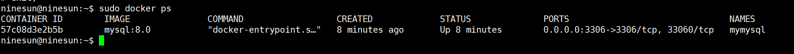
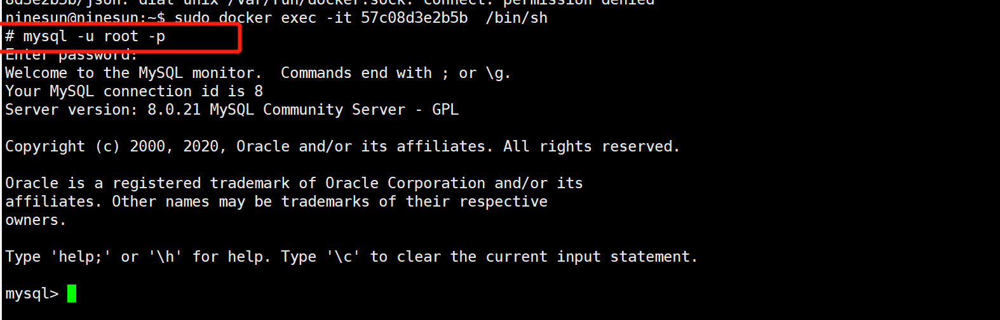
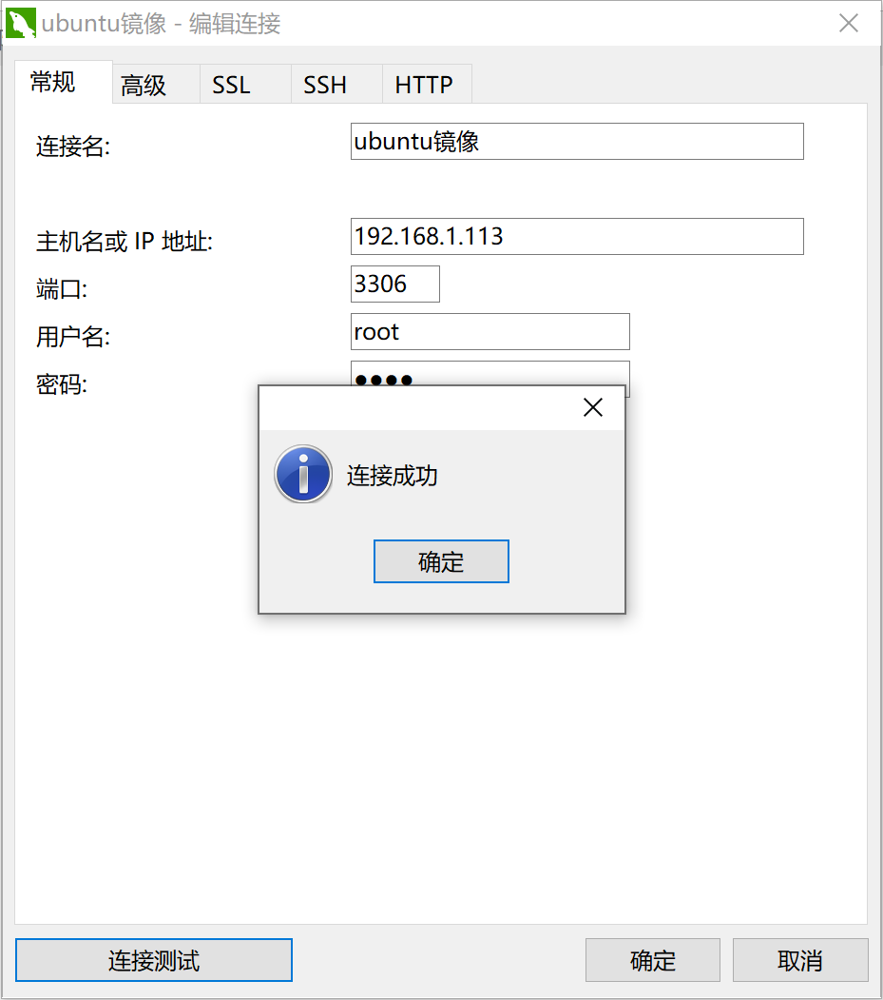

<!-- TOC -->

- [1.拉取mysql镜像](#1拉取mysql镜像)
- [2.验证是否拉取成功](#2验证是否拉取成功)
- [3.运行mysql镜像](#3运行mysql镜像)
- [4.进入容器，修改root用户允许远程访问](#4进入容器修改root用户允许远程访问)
  - [4.1 查看容器id](#41-查看容器id)
  - [4.2 进入容器](#42-进入容器)
  - [4.3 进入mysql](#43-进入mysql)
  - [4.4 修改远程权限：](#44-修改远程权限)
  - [4.5 通过Navicat等远程访问工具进行访问](#45-通过navicat等远程访问工具进行访问)
- [5.数据卷的挂载，方面我们后期维护](#5数据卷的挂载方面我们后期维护)

<!-- /TOC -->
# 1.拉取mysql镜像
```
sudo docker pull mysql:8.0
```
# 2.验证是否拉取成功
```
sudo docker images
```
# 3.运行mysql镜像
```
docker run -d -p 3306:3306 --name mymysql -e MYSQL_ROOT_PASSWORD=root  docker.io/mysql:8.0
```
# 4.进入容器，修改root用户允许远程访问
## 4.1 查看容器id
```
docker ps
```

## 4.2 进入容器
```
sudo docker exec -it 57c08d3e2b5b  /bin/sh
```

## 4.3 进入mysql
``` 
mysql -u root -p
```

## 4.4 修改远程权限：
```
alter user 'root'@'%' identified with mysql_native_password by 'root';
```
## 4.5 通过Navicat等远程访问工具进行访问

# 5.数据卷的挂载，方面我们后期维护
```
sudo docker run -it -v /home/docker/mysql/conf:/etc/mysql/conf.d -v /home/docker/mysql/data:/var/lib/mysql
```
