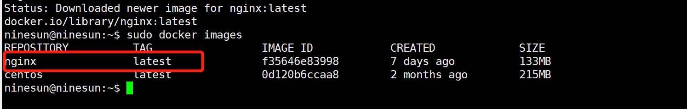
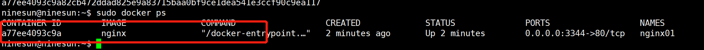
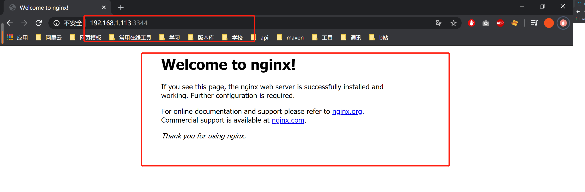
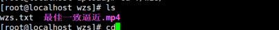
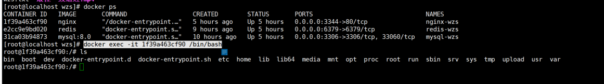
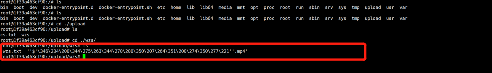
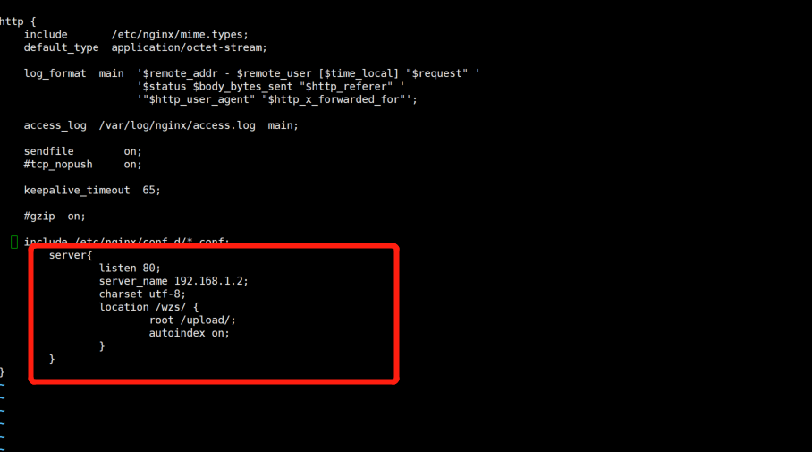
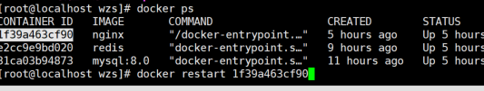

<!-- TOC -->

- [1. 拉取nginx镜像](#1-拉取nginx镜像)
- [2. 验证是否镜像拉取成功](#2-验证是否镜像拉取成功)
- [3. 运行nginx镜像](#3-运行nginx镜像)
- [4. 查看是否启动成功](#4-查看是否启动成功)
- [5. 在外部浏览器验证nginx的启动](#5-在外部浏览器验证nginx的启动)
- [6. 为了方便我们以后的文件上传等操作，我们将数据进行挂载](#6-为了方便我们以后的文件上传等操作我们将数据进行挂载)
- [7. 配置nginx.conf](#7-配置nginxconf)

<!-- /TOC -->
# 1. 拉取nginx镜像
```
docker pull nginx
```
# 2. 验证是否镜像拉取成功
```
docker images
```

# 3. 运行nginx镜像
```
sudo docker run -d --name nginx01  -p 3344:80 nginx
```
大致解释一下上面这个命令
> * -d 表示是以后台的方式运行
> * --name nginx01 说明此镜像的名称命名为nginx01，如果不加此参数默认为镜像的名称
> -p 3344:80 80是nginx镜像运行起来的端口号，3344是映射到公网可以供我们访问的端口

# 4. 查看是否启动成功
```
docker ps
```

# 5. 在外部浏览器验证nginx的启动

# 6. 为了方便我们以后的文件上传等操作，我们将数据进行挂载
首先我们先创建数据目录
``` 
mkdir /home/zhuxu/soft/nginx/upload
```
目录自己可以自定义
通过以下指令进行挂载
```
docker run --name mynginx -d -p 2000:80  -v /home/zhuxu/soft/nginx/upload:/upload nginx 
```
挂载成功之后我们可以在upload目录放一个测试文件进行测试

接下来我们进入启动好的nginx镜像中

```
docker exec -it 1f39a463cf90 /bin/bash
```

# 7. 配置nginx.conf
进入nginx镜像之后，进入/etc/nginx，编辑nginx.conf
```
vim nginx.conf
```
加入以下内容

注意：server_name 为当前服务器的ip地址
至此nginx的配置结束
我们返回docker容器，重启nginx服务

我们打开浏览器访问
