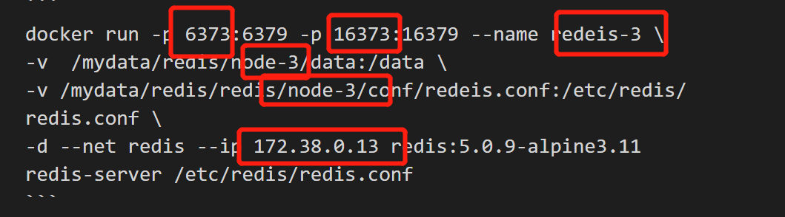

# 1.拉取redis镜像
```
sudo docker pull redis
```
# 2.自定义网络
```
sudo docker network  create redis --subnet 172.38.0.0/16
```
这样就创建了一个redis网络

# 3.使用shell脚本创建若干个redis服务
这里我们创建6个结点，运行一下脚本
```
for port in $(seq 1 6); \
do \
mkdir -p /mydata/redis/node-${port}/conf 
touch /mydata/redis/node-${port}/conf/redis.conf
cat <<EOF>> /mydata/redis/node-${port}/conf/redis.conf
port 6379
bind 0.0.0.0
cluster-enabled yes
cluster-config-file nodes.conf
cluster-node-timeout 5000
cluster-announce-ip 172.38.0.1${port}
cluster-announce-port 6379
cluster-announce-bus-port 16379
appendonly yes
EOF
done
```
参数描述
> (1）port（端口号） 
(2）masterauth（设置集群节点间访问密码，跟下面一致）   
(3）requirepass（设置redis访问密码）    
(4）cluster-enabled yes（启动集群模式）    
(5）cluster-config-file nodes.conf（集群节点信息文件）
(6）cluster-node-timeout 5000（redis节点宕机被发现的时间）
(7）cluster-announce-ip（集群节点的汇报ip，防止nat，预先填写为网关ip后续需要手动修改配置文件）
(8）cluster-announce-port（集群节点的汇报port，防止nat）
(9）cluster-announce-bus-port（集群节点的汇报bus-port，防止nat）
(10) appendonly yes（开启aof）
# 4.我们查看创建好的结点

# 5.我们依次启动创建好的redis镜像
``` 
docker run -p 6371:6379 -p 16371:16379 --name redis-1 \
-v /mydata/redis/node-1/data:/data \
-v /mydata/redis/node-1/conf/redis.conf:/etc/redis/redis.conf \
-d --net redis --ip 172.38.0.11 redis:5.0.9-alpine3.11 redis-server /etc/redis/redis.conf
```
```
docker run -p 6372:6379 -p 16372:16379 --name redis-2 \
-v /mydata/redis/node-2/data:/data \
-v /mydata/redis/node-2/conf/redis.conf:/etc/redis/redis.conf \
-d --net redis --ip 172.38.0.12 redis:5.0.9-alpine3.11 redis-server /etc/redis/redis.conf
```
```
docker run -p 6373:6379 -p 16373:16379 --name redis-3 \
-v /mydata/redis/node-3/data:/data \
-v /mydata/redis/node-3/conf/redis.conf:/etc/redis/redis.conf \
-d --net redis --ip 172.38.0.13 redis:5.0.9-alpine3.11 redis-server /etc/redis/redis.conf
```
接下来我们以此类推启动剩下的六个镜像，修改内容

# 6.通过指令查看redis结点运行情况
```
doker ps
```

# 7.接下来我们开始创建集群
## 7.1 进入其中一个redis结点镜像
```
docker exec -it redis-1 /bin/sh
```

注意只有出现以上两个文件才说明结点配置成功
## 7.2 使用指令创建集群
```
redis-cli --cluster create 172.38.0.11:6379 172.38.0.12:6379 172.38.0.13:6379 172.38.0.14:6379 172.38.0.15:6379 172.38.0.16:6379 --cluster-replicas 1
```

## 7.3 我们进入集群进行测试
```
redis-cli -c
cluster info
cluster nodes
```

这里我们能看到主节点的数量：3,并且主节点，从节点都已连接
## 7.4 我们存放一个值看看具体情况
```
set a b
```

我们可以看到是第三个主机在处理，说明他的从机结点中也有对应的数据，只有这种情况下当主机宕机后从机会替补上去，才能实现高可用
## 7.5 接下来我们继续测试主机宕机之后从机结点是否可以实现替补
我们先将刚刚存值的172.168.0.13对应的主机停机

## 7.6 继续回到redis服务器，尝试获取值

值已经获取成功，说明redis集群已经部署成功
