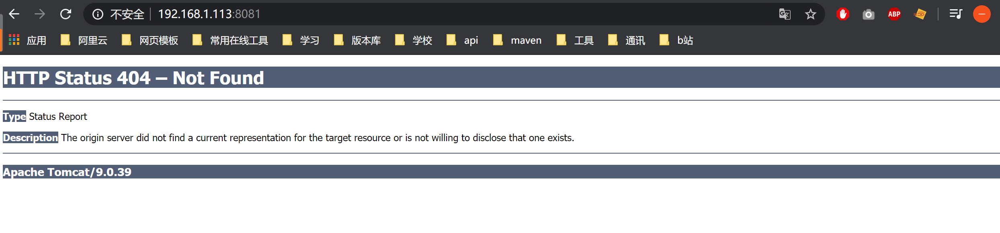
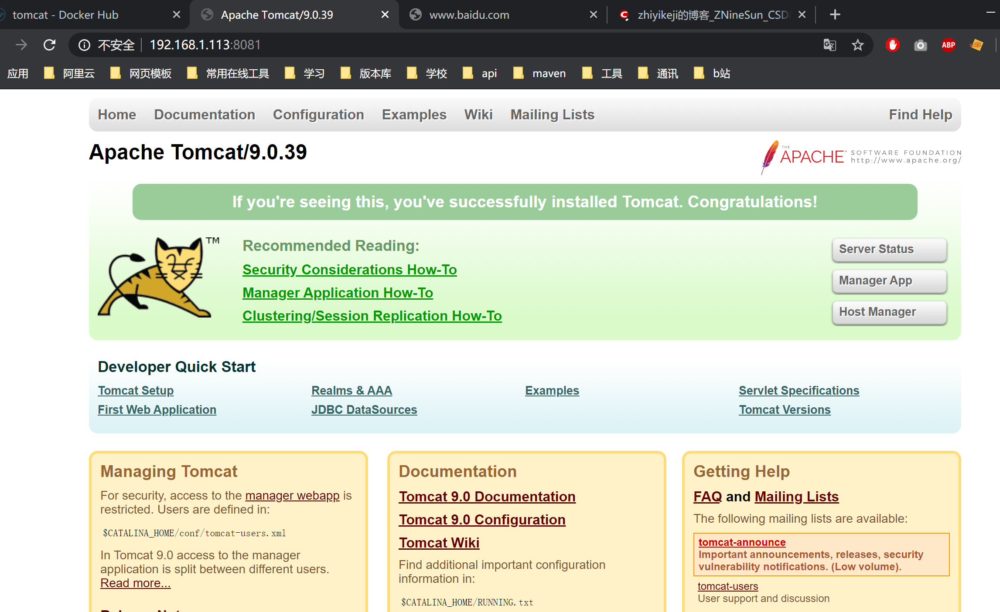

# 1.拉取镜像
```
docker pull tomcat:9.0
```
# 2.验证是否拉取成功
```
docker images
```
# 3.运行tomcat镜像
```
docker run -d -p 8081:8080 tomcat:9.0
```
# 4.验证是否运行成功
```
docker ps
```
# 5.外部访问

若出现这种情况，我们需要将wwebapps.dist目录下的内容拷贝至webapps下
## 5.1 进入tomcat镜像
```
 docker exec -it 8dac6bd633bf /bin/bash
```
注意：8dac6bd633b为tomcat镜像id，我们需要通过docker ps来查看
## 5.2 拷贝
```
cp -r ./webapps.dist/* ./webapps
```
## 5.3 重新访问即可
