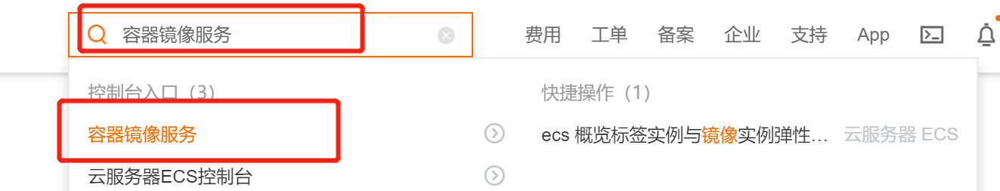
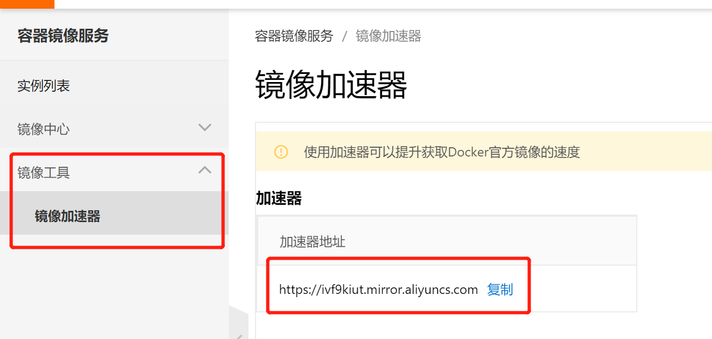

# 1.登录阿里云
[点击此处登录](https://account.aliyun.com/login/login.htm?oauth_callback=https%3A%2F%2Fhomenew.console.aliyun.com%2F&lang=zh)
# 2.登录成功之后找到容器镜像服务

# 3.进入容器镜像服务之后，找到自己的镜像加速地址

# 4.配置docker
## 4.1 修改daemon配置文件/etc/docker/daemon.json来使用加速器
* 1.创建docker
```
mkdir -p /etc/docker
```
* 2.配置配置文件
  ```
    sudo tee /etc/docker/daemon.json <<-'EOF'
    {
    "registry-mirrors": ["https://ivf9kiut.mirror.aliyuncs.com"]
    }
    EOF
  ```

* 3.使配置文件生效
  ```
    sudo systemctl daemon-reload
  ```
* 4.重启docker
  ```
    sudo systemctl restart docker
  ```