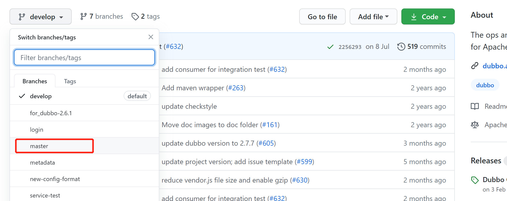
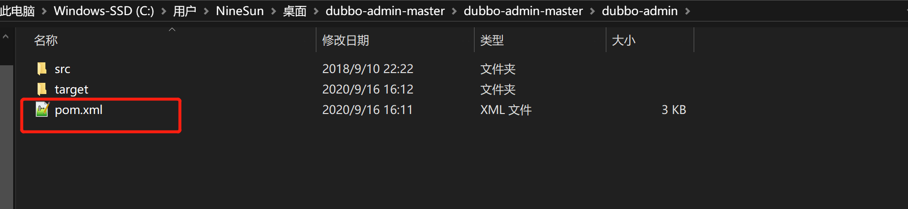
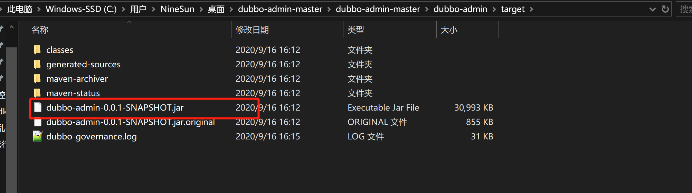
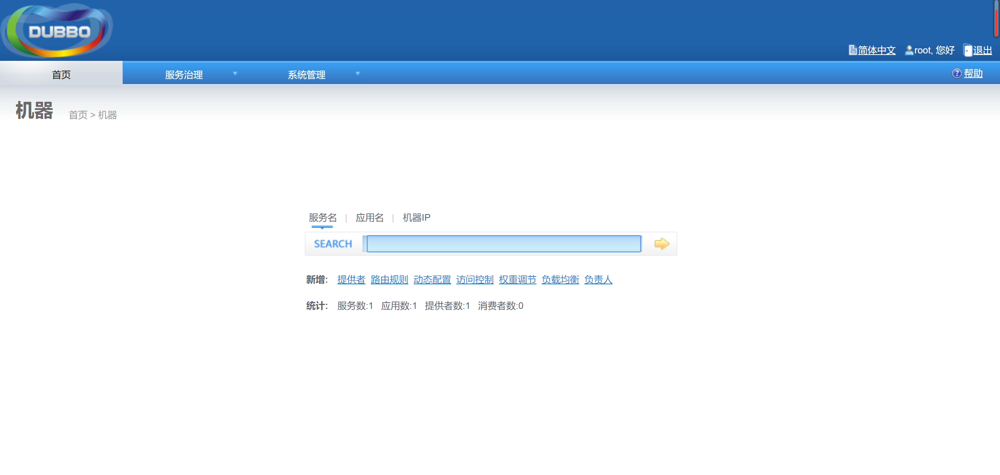

# 1.首先下载dubbo admin对应的压缩包
[点击此处下载](https://github.com/apache/incubator-dubbo-ops)，选择主干分支

# 2.解压缩之后cd进入dubbo-admin目录，修改pom文件

在pom文件中添加插件
``` xml
<plugin>
   <groupId>org.apache.maven.plugins</groupId>
   <artifactId>maven-compiler-plugin</artifactId>
   <version>3.6.1</version>
   <configuration>
      <source>1.8</source>
      <target>1.8</target>
   </configuration>
</plugin>

```
注意1.8对应的是你自己环境下的jdk版本
# 3.使用指令进行打包
``` xml 
mvn clean package -Dmaven.test.skip=true
```
打包成功后，cd到target目录，执行指令

``` xml
java -jar dubbo-admin-0.0.1-SNAPSHOT.jar
```
在浏览器进行访问，访问地址：http://127.0.0.1:7001/，输入默认的账号密码root/root,登录成功

