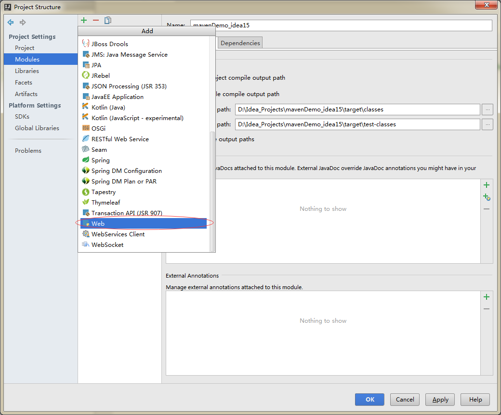
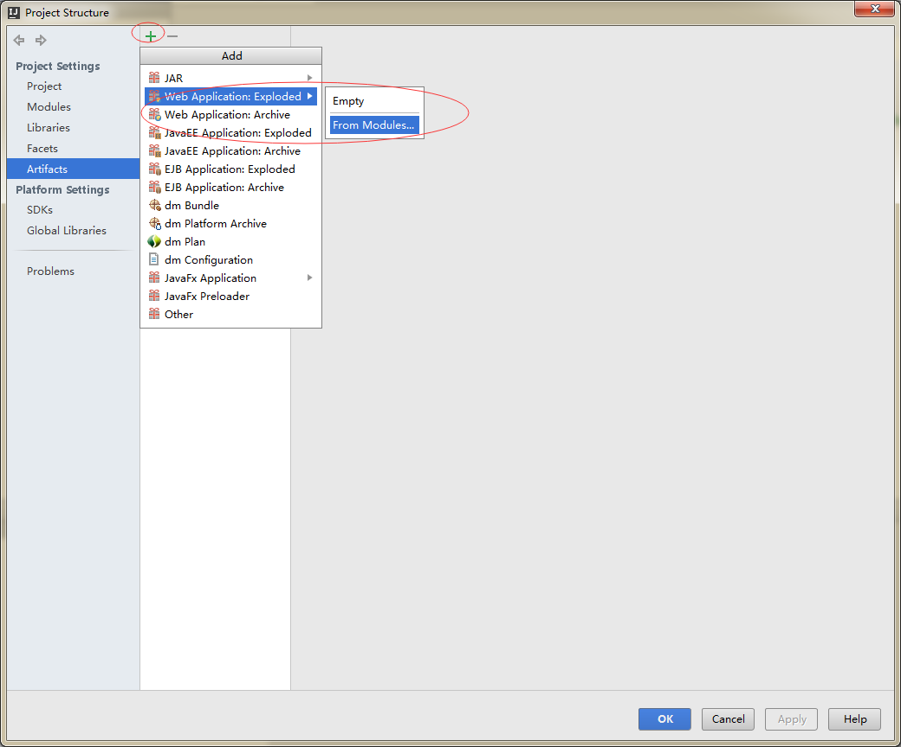
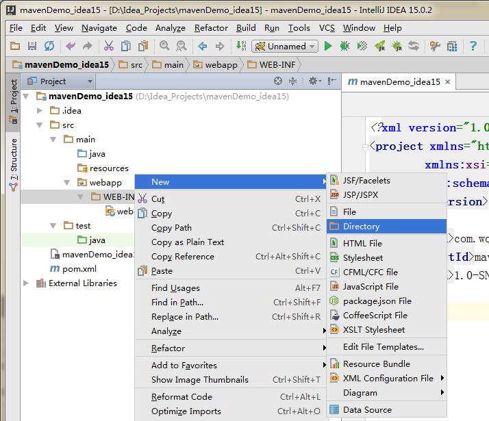
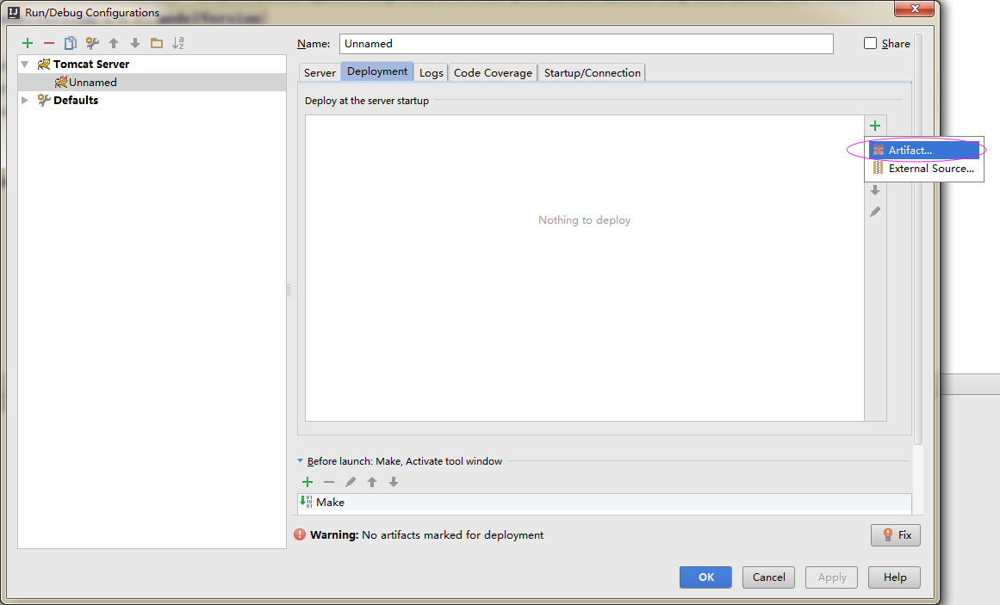
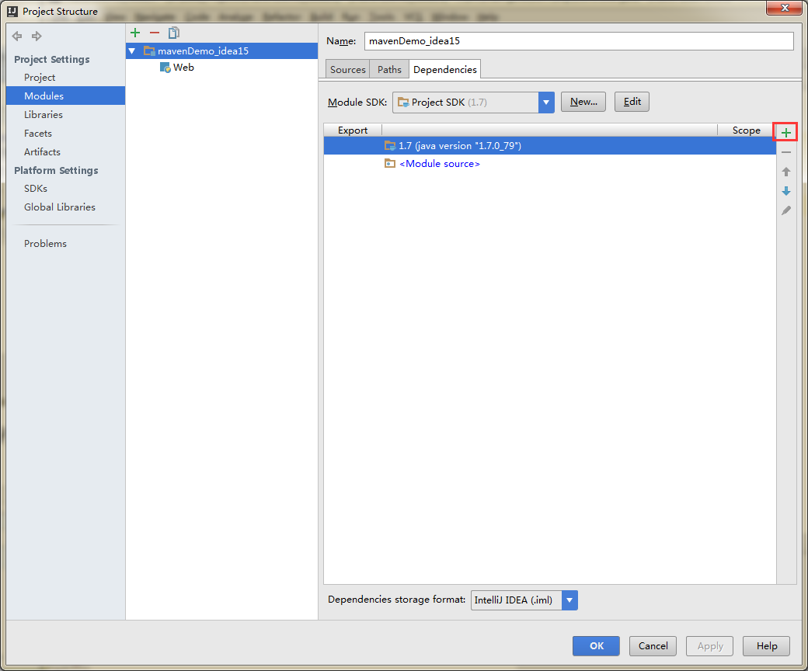
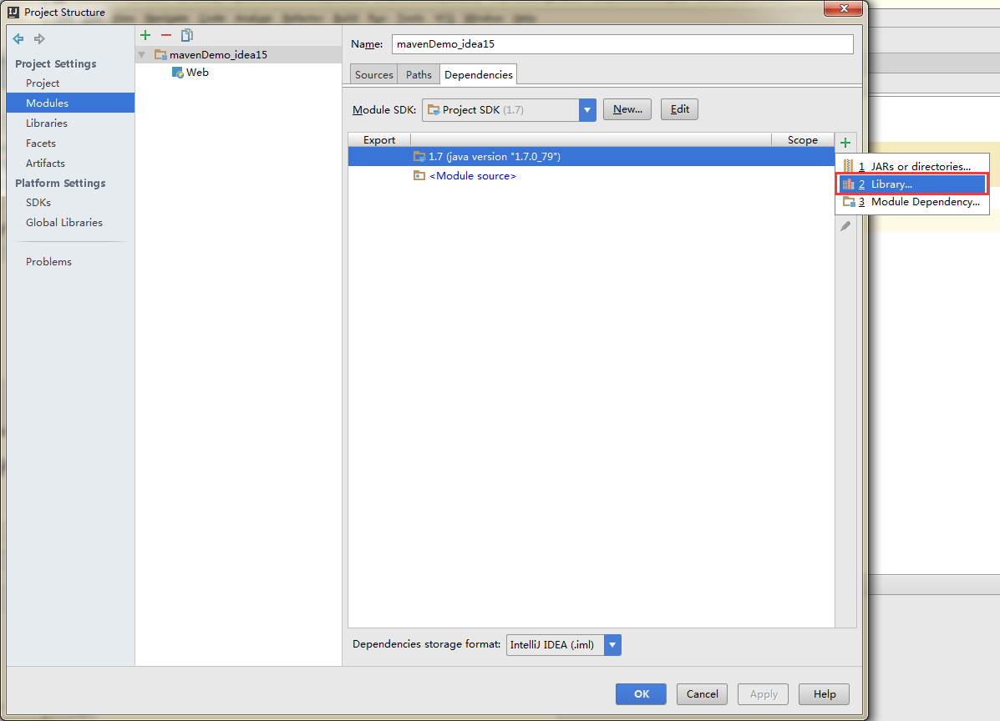
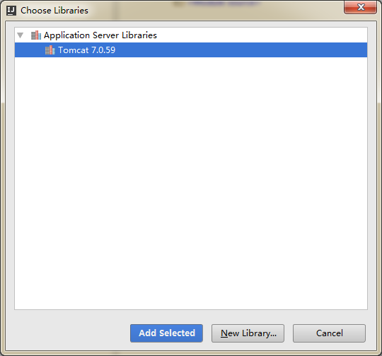

# 默认配置好了maven，如果没有配置好，请参考我的这一篇博客 [点击查看]()
# 1.file->new->project->maven,如图：

# 2.输入groupId,Artifacid，点击next,如图：

点击finish
# 3.file->Project Structure,如图

project无需设置，看下一步,点图中的“+”:

选择web

接下来双击双击Web Resource Directory

> 在后面加上webapp。好了，点OK，Web的资源目录便设置好了。

# 4.现在设置Web的描述文件的目录

设置成如下的格式：设置在webapp目录下

Facts: 表示当前项目的适配服务组件。可看到此项目已是一个Web项目了。

# 5. 进行Aftifacts设置，这个Aftifacts描述了当前项目发布的信息。现在进行添加，从Modeles中选择。

# 6.行成如下的目录结构

# 7.如有需要，添加lib包

# 8.部署服务器
### run->Edit Configurations

# 9.添加tomcat环境
### file->Project Structure

