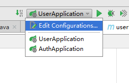
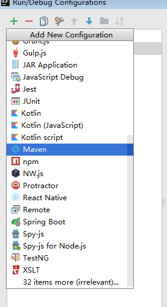

# 无论是jar包还是war包都是这一个方法，只是在pom.xml文件中修改对应的打包类型即可
# 1.具体操作如下:
* 1.点击如图1所示的位置:

图1

* 2.接着点击如图2所示的位置:
  

* 3.进入图3所示的界面，并点击图中勾选的位置

* 4.进入图4所示界面，并点击图中选中的部分
  

* 5.进入图5所示的界面，填写相应的内容，只需要填写图中勾选的内容即可，其中只有Name可以不一样:

* 6.回到原来的界面，选择你刚刚命名的选项，点击运行，待运行结束之后，target目录里便会出现对应的内容

