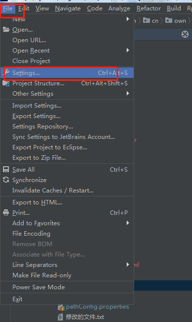
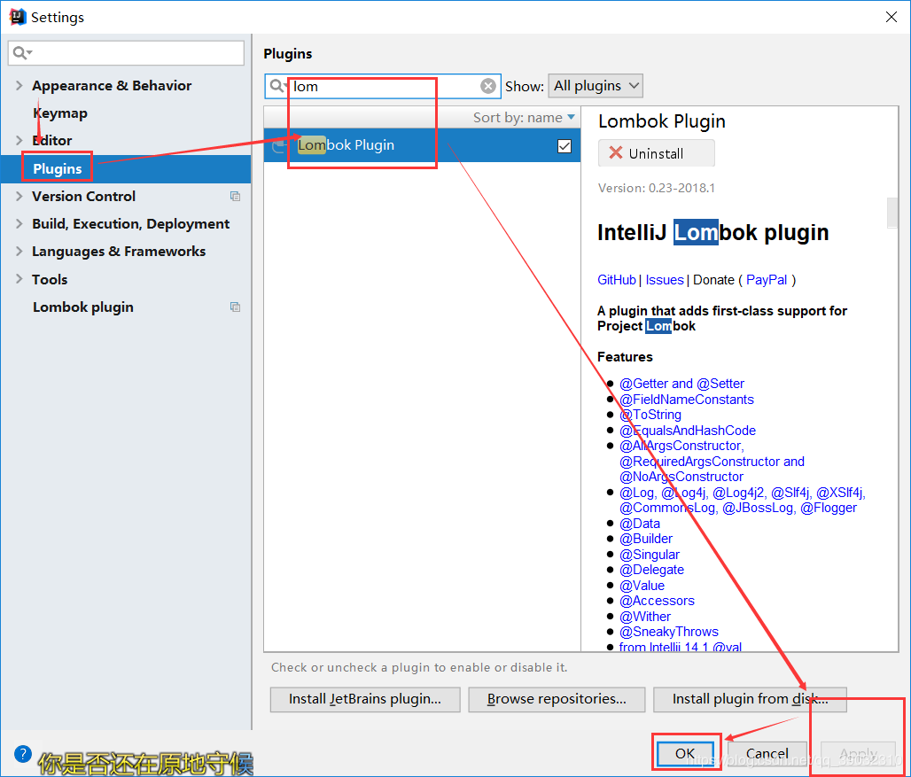

# 1.引入mavern依赖
``` xml
        <dependency>
            <groupId>org.projectlombok</groupId>
            <artifactId>lombok</artifactId>
            <version>1.16.10</version>
        </dependency>
```
# 2.引入插件
打开file->settings->plugins


# 3.在对应的实体类上添加注解即可
``` java
package com.cn.own.model;

import lombok.Data;
import org.springframework.web.multipart.MultipartFile;
@Data
public class TbCatalogPo extends BaseBean{
    /** content_id - 主键自增id */
    private Integer contentId;

    /** content_name - 目录名称*/
    private String contentName;

    /** content_level - 目录级别*/
    private String contentLevel;

    /** content_url - 链接地址*/
    private String contentUrl;

    /** pid - 父级id*/
    private Integer pid;

    /** icon - 目录图标*/
    private String icon;
}
```