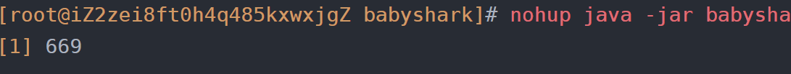
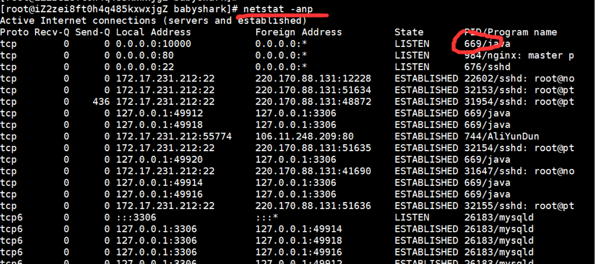

如果我们直接使用
```xml
java -jar zuul-0.0.1-SNAPSHOT.jar
```
的方式来进行部署，则我们关闭窗口服务就会立刻停止，我们可以通过以下指令：
``` xml
nohup java -jar zuul-0.0.1-SNAPSHOT.jar >msg.log 2>&1 &
```
的方式让服务在后台运行

其中669为进程的pid，如果我们想停止此项服务则可以通过
``` xml
kill 669
```
将服务停止
# 查看所有进程
```
netstat -anp
```
