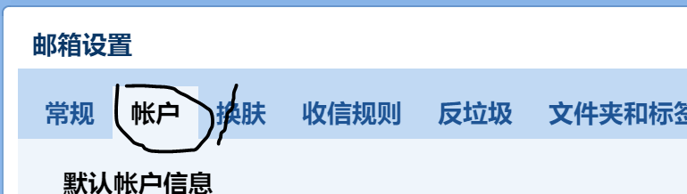
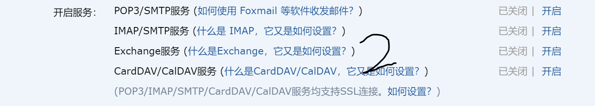
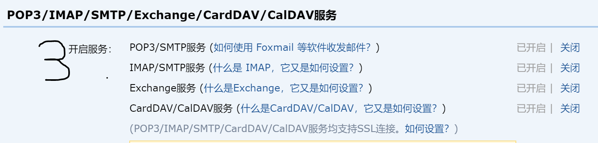
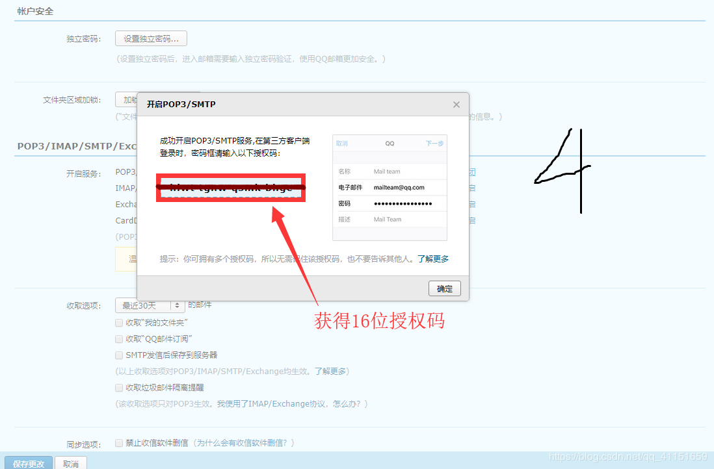

# 1.使用socket通信功能实现java的邮件传输
### 1.1 什么是socet
>  Socket的英文原义是“孔”或“插座”。在网络编程中，网络上的两个程序通过一个双向的通信连接实现数据的交换，这个连接的一端称为一个socket。      
 Socket套接字是通信的基石，是支持TCP/IP协议的网络通信的基本操作单元。它是网络通信过程中端点的抽象表示，包含进行网络通信必须的五种信息：连接使用的协议，本地主机的IP地址，本地进程的协议端口，远地主机的IP地址，远地进程的协议端口。   
Socket本质是编程接口(API)，对TCP/IP的封装，TCP/IP也要提供可供程序员做网络开发所用的接口，这就是Socket编程接口；HTTP是轿车，提供了封装或者显示数据的具体形式；Socket是发动机，提供了网络通信的能力。
### 1.2.Socket的原理
>  Socket实质上提供了进程通信的端点。进程通信之前，双方首先必须各自创建一个端点，否则是没有办法建立联系并相互通信的。正如打电话之前，双方必须各自拥有一台电话机一样    
套接字之间的连接过程可以分为三个步骤：服务器监听，客户端请求，连接确认。    
1、服务器监听：是服务器端套接字并不定位具体的客户端套接字，而是处于等待连接的状态，实时监控网络状态。    
2、客户端请求：是指由客户端的套接字提出连接请求，要连接的目标是服务器端的套接字。为此，客户端的套接字必须首先描述它要连接的服务器的套接字，指出服务器端套接字的地址和端口号，然后就向服务器端套接字提出连接请求。    
3、连接确认：是指当服务器端套接字监听到或者说接收到客户端套接字的连接请求，它就响应客户端套接字的请求，建立一个新的线程，把服务器端套接字的描述发给客户端，一旦客户端确认了此描述，连接就建立好了。而服务器端套接字继续处于监听状态，继续接收其他客户端套接字的连接请求。
### 1.3.     基于java的socket网络编程实现
> Server端Listen监听某个端口是否有连接请求，Client端向Server 端发出连接请求，Server端向Client端发回Accept接受消息。这样一个连接就建立起来了。Server端和Client端都可以通过Send，Write等方法与对方通信。    
 对于一个功能齐全的Socket，都要包含以下基本结构，其工作过程包含以下四个基本的步骤：   
1、创建Socket；   
2、 打开连接到Socket的输入/出流；   
3、按照一定的协议对Socket进行读/写操作；    
4、关闭Socket。
# 2.具体代码实现
我们将用代码完成邮件的发送。这在实际项目中应用的非常广泛，比如注册需要发送邮件进行账号激活，再比如OA项目中利用邮件进行任务提醒等等。

### 2.1.使用Java发送 E-mail 十分简单，但是首先你应该准备 
* JavaMail API
``` xml
        <dependency>
            <groupId>javax.mail</groupId>
            <artifactId>mail</artifactId>
            <version>1.4.7</version>
        </dependency>
```
* Java Activation Framework 
``` xml
 <dependency>
            <groupId>javax.activation</groupId>
            <artifactId>activation</artifactId>
            <version>1.1.1</version>
        </dependency>
```
得到两个jar包
### 2.2.获取对应邮箱的权限 （以qq邮箱为例）
##### QQ邮箱需要安全验证，我们需要获取他对应的权限；
> 进入QQ邮箱–>邮箱设置–>账户，下滑找到POP3/IMAP/SMTP/Exchange/CardDav/CalDav服务，开启POP3/SMTP服务，如图所示：
> 
> 
> 
> 
### 2.3.下面开始进入编程阶段：
```  java
package com.cn.own.util;

import com.cn.own.model.EmailModel;

import com.sun.mail.util.MailSSLSocketFactory;

import javax.mail.*;
import javax.mail.internet.InternetAddress;
import javax.mail.internet.MimeMessage;

import java.util.Properties;

public class JavaSocket {
    private final static String emailKey="16位的授权码";
    private final static String emailId_send="发件人邮箱";//注：要和你的16位授权码对应的邮箱
    private final static String emailId_receive="收件人邮箱";

    public static void sendEmail(EmailModel emailModel) throws Exception{
        

        Properties prop = new Properties();
        prop.setProperty("mail.host", "smtp.qq.com"); //// 设置QQ邮件服务器
        prop.setProperty("mail.transport.protocol", "smtp"); // 邮件发送协议
        prop.setProperty("mail.smtp.auth", "true"); // 需要验证用户名密码

        // 关于QQ邮箱，还要设置SSL加密，加上以下代码即可
        MailSSLSocketFactory sf = new MailSSLSocketFactory();
        sf.setTrustAllHosts(true);
        prop.put("mail.smtp.ssl.enable", "true");
        prop.put("mail.smtp.ssl.socketFactory", sf);


        //使用JavaMail发送邮件的5个步骤

        //创建定义整个应用程序所需的环境信息的 Session 对象

        Session session = Session.getDefaultInstance(prop, new Authenticator() {
            public PasswordAuthentication getPasswordAuthentication() {
                //发件人邮件用户名、授权码
                return new PasswordAuthentication(emailId_send, emailKey);
            }
        });

        //开启Session的debug模式，这样就可以查看到程序发送Email的运行状态
        session.setDebug(true);

        //2、通过session得到transport对象
        Transport ts = session.getTransport();

        //3、使用邮箱的用户名和授权码连上邮件服务器
        ts.connect("smtp.qq.com", emailId_send, emailKey);

        //4、创建邮件

        //创建邮件对象
        MimeMessage message = new MimeMessage(session);

        //指明邮件的发件人
        message.setFrom(new InternetAddress(emailId_receive));

        //指明邮件的收件人，现在发件人和收件人是一样的，那就是自己给自己发
        message.setRecipient(Message.RecipientType.TO, new InternetAddress(emailId_receive));

        //邮件的标题
        message.setSubject(emailModel.getTitle());

        //邮件的文本内容
        message.setContent(emailModel.getMessage(), "text/html;charset=UTF-8");

        //5、发送邮件
        ts.sendMessage(message, message.getAllRecipients());
     
       // re=ts
        ts.close();
        


    }
}

```
下面附上EmailModel
``` java
package com.cn.own.model;

public class EmailModel {
    private String title;//邮件标题
    private String message;//邮件内容

    public String getTitle() {
        return title;
    }

    public void setTitle(String title) {
        this.title = title;
    }

    public String getMessage() {
        return message;
    }

    public void setMessage(String message) {
        this.message = message;
    }
}


```
下面我们用一个单元测试进行测试：
``` java
package com.cn.own.junitTest;

import com.cn.own.util.JavaSocket;
import org.junit.runner.RunWith;
import org.springframework.boot.test.context.SpringBootTest;
import org.springframework.test.context.junit4.SpringRunner;

@RunWith(SpringRunner.class)
@SpringBootTest(webEnvironment = SpringBootTest.WebEnvironment.RANDOM_PORT)
public class Test {
    @org.junit.Test
    public void testSendEmail() throws Exception{

        JavaSocket.sendEmail(new EmailModel("title","message"));
    }
}

```
至此就结束了简单的文本类型的邮件发送
# 3.带图片和附件的邮件
> 先认识两个类一个名词：   
MIME（多用途互联网邮件扩展类型）   
MimeBodyPart类   
javax.mail.internet.MimeBodyPart类 表示的是一个MIME消息，它和MimeMessage类一样都是从Part接口继承过来。   
MimeMultipart类   
javax.mail.internet.MimeMultipart是抽象类 Multipart的实现子类,它用来组合多个MIME消息。一个MimeMultipart对象可以包含多个代表MIME消息的MimeBodyPart对象。
### 3.1.代码实现
#### 3.1.1 创建包含内嵌图片的邮件
> 前面的例子中是单独的使用HTML或者是纯文本内容，但是有时候我们需要在纯文本中使用内嵌的方式显示一些图片，因此就要将纯文本和内嵌图片单独存放在MimeBodyPart中然后再将其存放在一个Mimemultipart对象中即可。
``` java
import com.sun.mail.util.MailSSLSocketFactory;

import javax.activation.DataHandler;
import javax.activation.FileDataSource;
import javax.mail.*;
import javax.mail.internet.InternetAddress;
import javax.mail.internet.MimeBodyPart;
import javax.mail.internet.MimeMessage;
import javax.mail.internet.MimeMultipart;
import java.util.Properties;

public class SendImageEmail {
    public static void main(String[] args) throws Exception {

        Properties prop = new Properties();
        prop.setProperty("mail.host", "smtp.qq.com"); //// 设置QQ邮件服务器
        prop.setProperty("mail.transport.protocol", "smtp"); // 邮件发送协议
        prop.setProperty("mail.smtp.auth", "true"); // 需要验证用户名密码

        // 关于QQ邮箱，还要设置SSL加密，加上以下代码即可
        MailSSLSocketFactory sf = new MailSSLSocketFactory();
        sf.setTrustAllHosts(true);
        prop.put("mail.smtp.ssl.enable", "true");
        prop.put("mail.smtp.ssl.socketFactory", sf);

        //使用JavaMail发送邮件的5个步骤

        //1、创建定义整个应用程序所需的环境信息的 Session 对象
        Session session = Session.getDefaultInstance(prop, new Authenticator() {
            public PasswordAuthentication getPasswordAuthentication() {
                //发件人邮件用户名、授权码
                return new PasswordAuthentication("545646733@qq.com", "授权码");
            }
        });


        //开启Session的debug模式，这样就可以查看到程序发送Email的运行状态
        session.setDebug(true);

        //2、通过session得到transport对象
        Transport ts = session.getTransport();

        //3、使用邮箱的用户名和授权码连上邮件服务器
        ts.connect("smtp.qq.com", "545646733@qq.com", "授权码");

        //4、创建邮件

        //创建邮件
        MimeMessage message = new MimeMessage(session);

        // 设置邮件的基本信息
        //发件人
        message.setFrom(new InternetAddress("545646733@qq.com"));
        //收件人
        message.setRecipient(Message.RecipientType.TO, new InternetAddress("545646733@qq.com"));
        //邮件标题
        message.setSubject("带图片的邮件");

        // 准备邮件数据

        // 准备图片数据
        MimeBodyPart image = new MimeBodyPart();
        DataHandler dh = new DataHandler(new FileDataSource("src/resources/bz.jpg"));
        image.setDataHandler(dh);
        image.setContentID("bz.jpg");

        // 准备正文数据
        MimeBodyPart text = new MimeBodyPart();
        text.setContent("这是一封邮件正文带图片的邮件", "text/html;charset=UTF-8");

        // 描述数据关系
        MimeMultipart mm = new MimeMultipart();
        mm.addBodyPart(text);
        mm.addBodyPart(image);
        mm.setSubType("related");

        //设置到消息中，保存修改
        message.setContent(mm);
        message.saveChanges();

        //5.发送邮件
        ts.sendMessage(message, message.getAllRecipients());
        ts.close();
    }
}
```
##### 3.2.2 带图片和附件的复杂邮件发送
``` java
import javax.activation.DataHandler;
import javax.activation.FileDataSource;
import javax.mail.*;
import javax.mail.internet.InternetAddress;
import javax.mail.internet.MimeBodyPart;
import javax.mail.internet.MimeMessage;
import javax.mail.internet.MimeMultipart;
import java.security.GeneralSecurityException;
import java.util.Properties;

public class SendFileMail {
    public static void main(String[] args) throws MessagingException, GeneralSecurityException {

        //创建一个配置文件保存并读取信息
        Properties properties = new Properties();

        //设置qq邮件服务器
        properties.setProperty("mail.host","smtp.qq.com");
        //设置发送的协议
        properties.setProperty("mail.transport.protocol","smtp");
        //设置用户是否需要验证
        properties.setProperty("mail.smtp.auth", "true");


        //=================================只有QQ存在的一个特性，需要建立一个安全的链接
        // 关于QQ邮箱，还要设置SSL加密，加上以下代码即可
        MailSSLSocketFactory sf = new MailSSLSocketFactory();
        sf.setTrustAllHosts(true);
        properties.put("mail.smtp.ssl.enable", "true");
        properties.put("mail.smtp.ssl.socketFactory", sf);

        //=================================准备工作完毕

        //1.创建一个session会话对象；
        Session session = Session.getDefaultInstance(properties, new Authenticator() {
            @Override
            protected PasswordAuthentication getPasswordAuthentication() {
                return new PasswordAuthentication("545646733@qq.com", "授权码");
            }
        });

        //可以通过session开启Dubug模式，查看所有的过程
        session.setDebug(true);


        //2.获取连接对象，通过session对象获得Transport，需要捕获或者抛出异常；
        Transport tp = session.getTransport();

        //3.连接服务器,需要抛出异常；
        tp.connect("smtp.qq.com","545646733@qq.com","授权码");

        //4.连接上之后我们需要发送邮件；
        MimeMessage mimeMessage = imageMail(session);

        //5.发送邮件
        tp.sendMessage(mimeMessage,mimeMessage.getAllRecipients());

        //6.关闭连接
        tp.close();

    }


    public static MimeMessage imageMail(Session session) throws MessagingException {

        //消息的固定信息
        MimeMessage mimeMessage = new MimeMessage(session);

        //邮件发送人
        mimeMessage.setFrom(new InternetAddress("545646733@qq.com"));
        //邮件接收人，可以同时发送给很多人，我们这里只发给自己；
        mimeMessage.setRecipient(Message.RecipientType.TO, new InternetAddress("545646733@qq.com"));
        mimeMessage.setSubject("我也不知道是个什么东西就发给你了"); //邮件主题


        /*
        编写邮件内容
        1.图片
        2.附件
        3.文本
         */

        //图片
        MimeBodyPart body1 = new MimeBodyPart();
        body1.setDataHandler(new DataHandler(new FileDataSource("src/resources/yhbxb.png")));
        body1.setContentID("yhbxb.png"); //图片设置ID

        //文本
        MimeBodyPart body2 = new MimeBodyPart();
        body2.setContent("请注意，我不是广告","text/html;charset=utf-8");

        //附件
        MimeBodyPart body3 = new MimeBodyPart();
        body3.setDataHandler(new DataHandler(new FileDataSource("src/resources/log4j.properties")));
        body3.setFileName("log4j.properties"); //附件设置名字

        MimeBodyPart body4 = new MimeBodyPart();
        body4.setDataHandler(new DataHandler(new FileDataSource("src/resources/1.txt")));
        body4.setFileName(""); //附件设置名字

        //拼装邮件正文内容
        MimeMultipart multipart1 = new MimeMultipart();
        multipart1.addBodyPart(body1);
        multipart1.addBodyPart(body2);
        multipart1.setSubType("related"); //1.文本和图片内嵌成功！

        //new MimeBodyPart().setContent(multipart1); //将拼装好的正文内容设置为主体
        MimeBodyPart contentText =  new MimeBodyPart();
        contentText.setContent(multipart1);

        //拼接附件
        MimeMultipart allFile =new MimeMultipart();
        allFile.addBodyPart(body3); //附件
        allFile.addBodyPart(body4); //附件
        allFile.addBodyPart(contentText);//正文
        allFile.setSubType("mixed"); //正文和附件都存在邮件中，所有类型设置为mixed；


        //放到Message消息中
        mimeMessage.setContent(allFile);
        mimeMessage.saveChanges();//保存修改


        return mimeMessage;

    }

}
```
至此所有的邮件功能均已实现