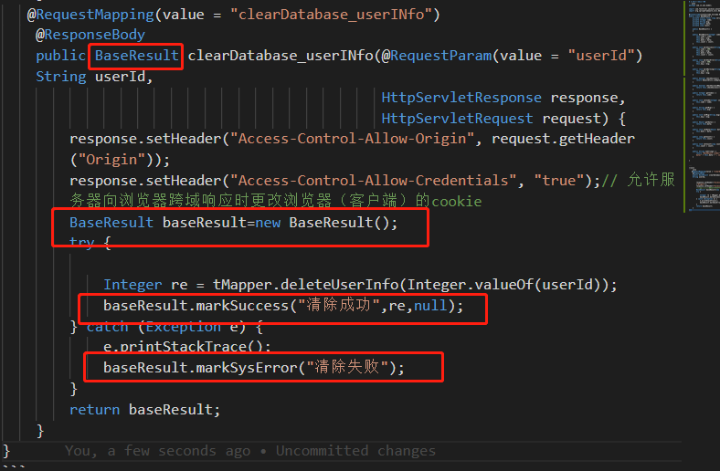

<!-- TOC -->

- [1.java8 list排序——通过指定元素排序](#1java8-list排序通过指定元素排序)
  - [1.1 排序方法](#11-排序方法)
  - [1.2 测试示例](#12-测试示例)
- [2.java8 list去重——通过指定元素去重](#2java8-list去重通过指定元素去重)
  - [2.1 去重方法](#21-去重方法)
  - [2.2 测试示例](#22-测试示例)
- [3.枚举配置类](#3枚举配置类)
  - [3.1 枚举类](#31-枚举类)
  - [3.2 测试示例](#32-测试示例)
- [4.返回实体类配置](#4返回实体类配置)
- [5.web工具类](#5web工具类)

<!-- /TOC -->
# 1.java8 list排序——通过指定元素排序
## 1.1 排序方法
``` java
  tbLabelList = tbLabelList.stream().sorted(Comparator.comparing(TbLabel::getUserAnswerTimes).reversed()).collect(Collectors.toList());
```
## 1.2 测试示例
TbLabel:
``` java 
public class TbLabel {

    /** detail_id - 对应具体文章的id*/
    private Integer detailId;

    /** school_id - 提供给哪一个高校使用*/
    private Integer schoolId;
    /**标签对应的用户回复频率**/
    private Double userAnswerTimes;

}
```
测试：
``` java
 List<TbLabel> tbLabelList=new ArrayList<>();
        TbLabel tbLabel1=new TbLabel();
        tbLabel1.setUserAnswerTimes(2.01);
        tbLabel1.setSchoolId(1);
        TbLabel tbLabel2=new TbLabel();
        tbLabel2.setUserAnswerTimes(2.121);
        tbLabel2.setSchoolId(1);
        TbLabel tbLabel3=new TbLabel();
        tbLabel3.setUserAnswerTimes(3.01);
        tbLabel3.setSchoolId(1);
        tbLabelList.add(tbLabel1);
        tbLabelList.add(tbLabel2);
        tbLabelList.add(tbLabel3);
         tbLabelList = tbLabelList.stream().sorted(Comparator.comparing(TbLabel::getUserAnswerTimes).reversed()).collect(Collectors.toList());//根据UserAnswerTimes倒序排列
```
# 2.java8 list去重——通过指定元素去重
## 2.1 去重方法
``` java
 tbLabelList = tbLabelList.stream().collect(
                collectingAndThen(toCollection(() -> new TreeSet<>(comparingLong(TbLabel::getDetailId))), ArrayList::new));
```
## 2.2 测试示例
TbLabel:
``` java 
public class TbLabel {

    /** detail_id - 对应具体文章的id*/
    private Integer detailId;

    /** school_id - 提供给哪一个高校使用*/
    private Integer schoolId;
    /**标签对应的用户回复频率**/
    private Double userAnswerTimes;

}
```
测试：
``` java
        List<TbLabel> tbLabelList=new ArrayList<>();
        TbLabel tbLabel1=new TbLabel();
        tbLabel1.setUserAnswerTimes(2.01);
        tbLabel1.setDetailId(1);
        TbLabel tbLabel2=new TbLabel();
        tbLabel2.setUserAnswerTimes(2.121);
        tbLabel2.setDetailId(1);
        TbLabel tbLabel3=new TbLabel();
        tbLabel3.setUserAnswerTimes(3.01);
        tbLabel3.setDetailId(2);
        tbLabelList.add(tbLabel1);
        tbLabelList.add(tbLabel2);
        tbLabelList.add(tbLabel3);
         tbLabelList = tbLabelList.stream().sorted(Comparator.comparing(TbLabel::getUserAnswerTimes).reversed()).collect(Collectors.toList());//根据DetailId去重
```
# 3.枚举配置类
## 3.1 枚举类
``` java
 public enum ContentConfig {
    /**infoType 消息类型（0-待回复；1-用户审批;2-互助圈审批;3-创建学校审批）**/
    INFOTYPE_ANSWER(0),
    INFOTYPE_USER_APPROVE(1),
    INFOTYPE_HELPCIRCLE_APPROVE(2),
    INFOTYPE_CREATESCHOOL_APPROVE(3);
    private final int value;

    ContentConfig(int value) {
        this.value = value;
    }

    public int getValue() {
        return value;
    }
}
```
## 3.2 测试示例
``` java 
 /**
     * 使用示例
     * @param args
     */
    public static void main(String[] args) {
        System.out.println(ContentConfig.INFOTYPE_ANSWER.getValue());
    }
```
# 4.返回实体类配置
```java
package com.cn.own.model;

import com.fasterxml.jackson.annotation.JsonInclude;
import org.springframework.util.ObjectUtils;

@JsonInclude(JsonInclude.Include.NON_NULL)
public class BaseResult {
    private static final long serialVersionUID = 1L;
    private Integer code;
    private String msg;
    private Object data;
    private Long count;

    public BaseResult() {
    }

    public BaseResult(Integer code, String msg, Object data, Long count) {
        this.code = code;
        this.msg = msg;
        this.data = data;
        this.count = count;
    }

    public void markSuccess(String msg, Object data, Long count) {
        this.code = 200;
        this.msg = msg;
        this.data = data;
        this.count = count;
    }

    public void markSysError(String msg) {
        this.code = 500;
        this.msg = msg;
    }

    public void markWarning(String msg) {
        this.code = 0;
        this.msg = msg;
    }

    public boolean checkSuccess() {
        return ObjectUtils.isEmpty(this.getCode()) && 200 == this.getCode();
    }

    public boolean checkSuccessWData() {
        return this.checkSuccess() && ObjectUtils.isEmpty(this.getData());
    }

    public Integer getCode() {
        return this.code;
    }

    public void setCode(Integer code) {
        this.code = code;
    }

    public String getMsg() {
        return this.msg;
    }

    public void setMsg(String msg) {
        this.msg = msg;
    }

    public Object getData() {
        return this.data;
    }

    public void setData(Object data) {
        this.data = data;
    }

    public Long getCount() {
        return this.count;
    }

    public void setCount(Long count) {
        this.count = count;
    }

    public String toString() {
        return "BaseResult [code=" + this.code + ", msg=" + this.msg + ", data=" + this.data + ", count=" + this.count + "]";
    }

}


```
用法：
``` java
   @RequestMapping(value = "clearDatabase_userINfo")
    @ResponseBody
    public BaseResult clearDatabase_userINfo(@RequestParam(value = "userId") String userId,
                                             HttpServletResponse response, HttpServletRequest request) {
        response.setHeader("Access-Control-Allow-Origin", request.getHeader("Origin"));
        response.setHeader("Access-Control-Allow-Credentials", "true");// 允许服务器向浏览器跨域响应时更改浏览器（客户端）的cookie
        BaseResult baseResult=new BaseResult();
        try {

            Integer re = tMapper.deleteUserInfo(Integer.valueOf(userId));
            baseResult.markSuccess("清除成功",re,null);
        } catch (Exception e) {
            e.printStackTrace();
            baseResult.markSysError("清除失败");
        }
        return baseResult;
    }
```

# 5.web工具类
获取request session等
``` java
package com.dubbo.consumer.indentity.util;

import org.springframework.web.context.request.RequestContextHolder;
import org.springframework.web.context.request.ServletRequestAttributes;
import javax.servlet.http.HttpServletRequest;
import javax.servlet.http.HttpSession;

public class WebUtils {
    /**
     * 获取request
     *
     * @return
     */
    public static HttpServletRequest getRequest() {
        ServletRequestAttributes requestAttributes = (ServletRequestAttributes) RequestContextHolder
                .getRequestAttributes();
        return requestAttributes == null ? null : requestAttributes.getRequest();
    }
    /**
     * 获取session
     *
     * @return
     */
    public static HttpSession getSession() {
        HttpSession session   = getRequest().getSession();
        return session;
    }
}
```