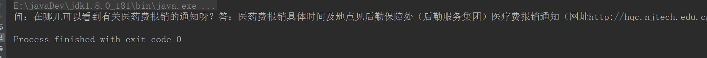

# 1.使用正则表达式过滤掉h5标签，此处将处理方法写在一个工具类里
``` java
import java.util.regex.Pattern;
 /**
     * 移出富文本编辑器中的h5标签
     * @param inputString
     * @return
     */
    public static String removeHtmlTag(String inputString) {
        if (inputString == null)
            return null;
        String htmlStr = inputString; // 含html标签的字符串
        String textStr = "";
        java.util.regex.Pattern p_script;
        java.util.regex.Matcher m_script;
        java.util.regex.Pattern p_style;
        java.util.regex.Matcher m_style;
        java.util.regex.Pattern p_html;
        java.util.regex.Matcher m_html;
        try {
            //定义script的正则表达式{或<script[^>]*?>[\\s\\S]*?<\\/script>
            String regEx_script = "<[\\s]*?script[^>]*?>[\\s\\S]*?<[\\s]*?\\/[\\s]*?script[\\s]*?>";
            //定义style的正则表达式{或<style[^>]*?>[\\s\\S]*?<\\/style>
            String regEx_style = "<[\\s]*?style[^>]*?>[\\s\\S]*?<[\\s]*?\\/[\\s]*?style[\\s]*?>";
            String regEx_html = "<[^>]+>"; // 定义HTML标签的正则表达式
            p_script = Pattern.compile(regEx_script, Pattern.CASE_INSENSITIVE);
            m_script = p_script.matcher(htmlStr);
            htmlStr = m_script.replaceAll(""); // 过滤script标签
            p_style = Pattern.compile(regEx_style, Pattern.CASE_INSENSITIVE);
            m_style = p_style.matcher(htmlStr);
            htmlStr = m_style.replaceAll(""); // 过滤style标签
            p_html = Pattern.compile(regEx_html, Pattern.CASE_INSENSITIVE);
            m_html = p_html.matcher(htmlStr);
            htmlStr = m_html.replaceAll(""); // 过滤html标签
            textStr = htmlStr;
        } catch (Exception e) {
            e.printStackTrace();
        }
        return textStr;// 返回文本字符串
    }
```
使用方法：
``` java
 public static void main(String[] args) {
        String a="<p class=\\\"p\\\"><b><spanyes';font-family:宋体;font-weight:bold;font-size:12.0000pt;mso-font-kerning:0.0000pt;\\\"><font face=\\\"宋体\\\">问：</font></spanyes';font-family:宋体;font-weight:bold;font-size:12.0000pt;mso-font-kerning:0.0000pt;\\\"></b><spanyes';font-family:宋体;font-weight:normal;font-size:12.0000pt;mso-font-kerning:0.0000pt;\\\"><font face=\\\"宋体\\\">在哪儿可以看到有关医药费报销的通知呀？</font><spanyes';font-family:宋体;font-weight:normal;font-size:12.0000pt;mso-font-kerning:0.0000pt;\\\"><o:p></o:p></spanyes';font-family:宋体;font-weight:normal;font-size:12.0000pt;mso-font-kerning:0.0000pt;\\\"></spanyes';font-family:宋体;font-weight:normal;font-size:12.0000pt;mso-font-kerning:0.0000pt;\\\"></p><p class=\\\"p\\\" align=\\\"justify\\\"><b><spanyes';font-family:宋体;font-weight:bold;font-size:12.0000pt;mso-font-kerning:0.0000pt;\\\"><font face=\\\"宋体\\\">答：</font></spanyes';font-family:宋体;font-weight:bold;font-size:12.0000pt;mso-font-kerning:0.0000pt;\\\"></b><spanyes';font-family:宋体;font-weight:normal;font-size:12.0000pt;mso-font-kerning:0.0000pt;\\\"><font face=\\\"宋体\\\">医药费报销具体时间及地点见后勤保障处（后勤服务集团）医疗费报销通知</font><span yes';font-family:宋体;font-weight:normal;font-size:12.0000pt;\\\"=\\\"\\\"><font face=\\\"宋体\\\">（网址</font>http://hqc.njtech.edu.cn/）</span><spanyes';font-family:宋体;font-weight:normal;font-size:12.0000pt;mso-font-kerning:0.0000pt;\\\"><font face=\\\"宋体\\\">，或者南京工业大学校医院通知公告一栏（网址</font>http://gdyy.njtech.edu.cn/），一般在每个月下旬发布次月报销通知，建议大家及时登录网站查看信息，以免错过。<spanyes';font-family:宋体;font-weight:normal;font-size:12.0000pt;mso-font-kerning:0.0000pt;\\\"><o:p></o:p>";
        System.out.println(removeHtmlTag(a));
    }
```
测试结果:
