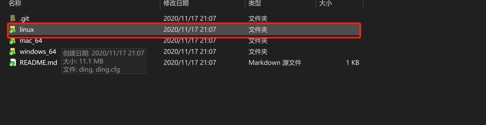
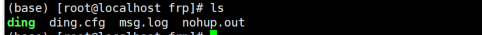
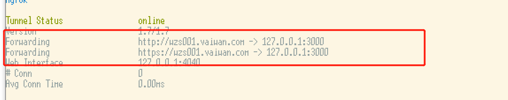

# 1.先将项目下载
```
git clone https://github.com/open-dingtalk/pierced.git
```
# 2.将linux目录上传至linux服务器

# 3.linux下执行命令
```
cd linux
chmod 777 ./ding
nohup  ./ding -config=./ding.cfg -subdomain=wzs 8080
```

其中：
* 1.wzs：域名前缀
* 2.8080：我们要穿透的端口地址

注意windows下的运行命令：
```
ding -config=ding.cfg -subdomain=wzs 8080
```
