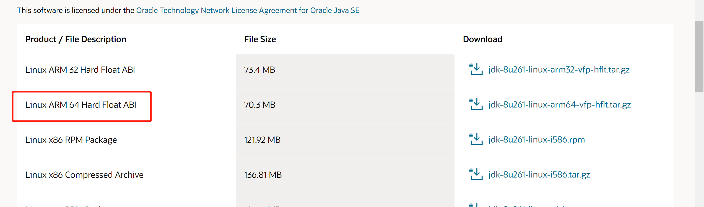

# 1.下载linux环境下的安装包
[点击此处下载](http://www.oracle.com/technetwork/java/javase/downloads/jdk8-downloads-2133151.html)

# 2.在home目录下创建java目录

# 3.将我们下载好的jdk文件移动至刚刚创建的java目录
```
sudo mv jdk-8u241-linux-x64.tar.gz /home/java
```
# 4.cd到我们的java目录，解压刚刚移动过来的jdk文件
```
tar -zxvf jdk-8u241-linux-x64.tar.gz
```
# 5.编辑文件，输入指令
```
sudo gedit /etc/profile
```
在文件末尾添加
``` yml
#set Java environment

export JAVA_HOME=/home/java/jdk1.8.0_241(注意版本)
export JRE_HOME=$JAVA_HOME/jre
export CLASSPATH=.:$JAVA_HOME/lib:$JRE_HOME/lib:$CLASSPATH
export PATH=$JAVA_HOME/bin:$JRE_HOME/bin:$PATH
```
# 6.输入指令使刚刚配置好的文件 生效
``` 
source /etc/profile
```
# 7.输入 <font color=#FF0000>sudo java -version</font>  测试是否配置成功
若出现jdk对应的版本号则说明配置成功
 
