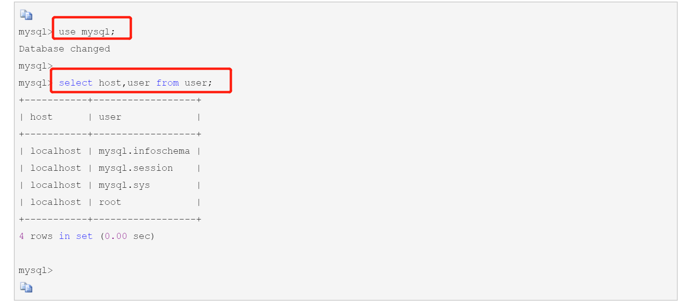

<!-- TOC -->

- [1.设置外键失败问题](#1设置外键失败问题)
  - [1.1.问题描述](#11问题描述)
  - [1.2.解决方案：](#12解决方案)
- [2.批量删除出现 sql injection violation, multi-statement not allow : ...的问题](#2批量删除出现-sql-injection-violation-multi-statement-not-allow--的问题)
  - [2.1.问题描述：](#21问题描述)
  - [2.2.解决方案](#22解决方案)
    - [2.2.1.引入阿里的Durid连接池](#221引入阿里的durid连接池)
    - [2.2.2.创建一个配置类来开启Druid的防火墙配置](#222创建一个配置类来开启druid的防火墙配置)
    - [2.2.3.在application.properties的配置文件中修改jdb连接路径，添加allowMultiQueries=true，改为如下：](#223在applicationproperties的配置文件中修改jdb连接路径添加allowmultiqueriestrue改为如下)
- [3.设置外键提示3780错误](#3设置外键提示3780错误)
  - [3.1 问题描述](#31-问题描述)
  - [3.2解决方案:](#32解决方案)
    - [3.2.1 首先注意两者是否均选中或均未选中Unsigned，再次注意编码的方式上是否一致，最后在查看是否属于同一种类型](#321-首先注意两者是否均选中或均未选中unsigned再次注意编码的方式上是否一致最后在查看是否属于同一种类型)
- [4.mysql使用循环生成测试数据](#4mysql使用循环生成测试数据)
  - [4.1.创建存储过程](#41创建存储过程)
  - [4.2.使用这个存储过程](#42使用这个存储过程)
  - [4.3.使用完成之后可以删除这个存储过程](#43使用完成之后可以删除这个存储过程)
- [5.解决连接数据库提示Authentication plugin 'caching_sha2_password' cannot be loaded的问题](#5解决连接数据库提示authentication-plugin-caching_sha2_password-cannot-be-loaded的问题)
  - [5.1 管理员权限运行命令提示符，登陆MySQL](#51-管理员权限运行命令提示符登陆mysql)
  - [5.2 修改账户密码加密规则并更新用户密码](#52-修改账户密码加密规则并更新用户密码)
    - [5.2.1 修改加密规则](#521-修改加密规则)
    - [5.2.2 更新一下用户的密码](#522-更新一下用户的密码)
  - [5.3 刷新权限](#53-刷新权限)
  - [5.4 重置密码](#54-重置密码)
- [6.解决HOST is not allowed to connect to this mysql server](#6解决host-is-not-allowed-to-connect-to-this-mysql-server)
  - [6.1 问题描述](#61-问题描述)
  - [6.2 问题原因](#62-问题原因)
  - [6.3 解决方案](#63-解决方案)

<!-- /TOC -->
# 1.设置外键失败问题
## 1.1.问题描述
> alter table stu add foreign key(cno) references user(id);
Failed to add the foreign key constraint. Missing index for constraint 'stu_ibfk_1' in the referenced table 'user'
## 1.2.解决方案：
> 作为外键，user表中的id必须是唯一值,因此得添加约束unique,或者primary key;   
设置外键的办法：
```java
ALTER TABLE user ADD UNIQUE (id)
```
# 2.批量删除出现 sql injection violation, multi-statement not allow : ...的问题
## 2.1.问题描述：
> 【异常】——Cause: java.sql.SQLException: sql injection violation, multi-statement not allow :XXXXX
## 2.2.解决方案
不允许批量执行，其本质错误是Druid的防火墙配置(WallConfig)中变量
multiStatementAllow默认为false，在源码中当多条语句时，判断了是否开启了批量执行,
否则报错不允许执行多条语句。
### 2.2.1.引入阿里的Durid连接池
```xml
<!-- https://mvnrepository.com/artifact/com.alibaba/druid-spring-boot-starter -->
		<dependency>
			<groupId>com.alibaba</groupId>
			<artifactId>druid-spring-boot-starter</artifactId>
			<version>${durid}</version>
		</dependency>
```
### 2.2.2.创建一个配置类来开启Druid的防火墙配置
```java
package com.boot.zhiyi.config;

import com.alibaba.druid.filter.Filter;
import com.alibaba.druid.pool.DruidDataSource;
import com.alibaba.druid.wall.WallConfig;
import com.alibaba.druid.wall.WallFilter;
import org.springframework.beans.factory.annotation.Autowired;
import org.springframework.boot.context.properties.ConfigurationProperties;
import org.springframework.context.annotation.Bean;
import org.springframework.context.annotation.Configuration;
import org.springframework.context.annotation.DependsOn;
import org.springframework.context.annotation.Primary;

import javax.sql.DataSource;
import java.util.ArrayList;
import java.util.LinkedList;
import java.util.List;
@Configuration
public class DuridConfig {

    @Autowired
    WallFilter wallFilter;
    @Bean(name = "dataSource")    //声明其为Bean实例
    @Primary  //在同样的DataSource中，首先使用被标注的DataSource
    @ConfigurationProperties(prefix = "spring.datasource")
    public DataSource dataSource(){
        DruidDataSource datasource = new DruidDataSource();

        // filter
        List<Filter> filters = new ArrayList<>();
        filters.add(wallFilter);
        datasource.setProxyFilters(filters);

        return datasource;
    }
    @Bean(name = "wallFilter")
    @DependsOn("wallConfig")
    public WallFilter wallFilter(WallConfig wallConfig) {
        WallFilter wallFilter = new WallFilter();
        wallFilter.setConfig(wallConfig);
        return wallFilter;

    }

    @Bean(name = "wallConfig")
    public WallConfig wallConfig(){
        WallConfig wallConfig = new WallConfig();
        wallConfig.setMultiStatementAllow(true);//允许一次执行多条语句
        wallConfig.setNoneBaseStatementAllow(true);//允许一次执行多条语句
        return wallConfig;
    }


}

```
### 2.2.3.在application.properties的配置文件中修改jdb连接路径，添加allowMultiQueries=true，改为如下：
```java
spring.datasource.url=jdbc:mysql://localhost:3306/vqqdeoplay?autoReconnect=true&useUnicode=true&characterEncoding=utf-8&&zeroDateTimeBehavior=CONVERT_TO_NULL&&serverTimezone=GMT%2B8&useSSL=false&&allowMultiQueries=true
```
# 3.设置外键提示3780错误
## 3.1 问题描述
> 3780 - Referencing column 'bookdetailld' and referenced column 'id' in foreign key constraint 'borrow f kl' are
incompatible
## 3.2解决方案:
### 3.2.1 首先注意两者是否均选中或均未选中Unsigned，再次注意编码的方式上是否一致，最后在查看是否属于同一种类型
# 4.mysql使用循环生成测试数据
## 4.1.创建存储过程
``` java
delimiter //
create procedure getData()
BEGIN
DECLARE i INT;
SET i=1;
WHILE i<200000 DO
INSERT INTO trade VALUES ("172.20.0.41","2016-03-31_09-19-23.404","trade","sendMessage.trade.Test","main","2532",UUID(),"XGD","main","content");
SET i=i+1;
END WHILE;
END
//
```
## 4.2.使用这个存储过程
```java
CALL getData();
```
## 4.3.使用完成之后可以删除这个存储过程
``` java
DROP PROCEDURE getData;
```
# 5.解决连接数据库提示Authentication plugin 'caching_sha2_password' cannot be loaded的问题
## 5.1 管理员权限运行命令提示符，登陆MySQL

## 5.2 修改账户密码加密规则并更新用户密码
### 5.2.1 修改加密规则 
```
ALTER USER 'root'@'localhost' IDENTIFIED BY 'password' PASSWORD EXPIRE NEVER;
```
### 5.2.2 更新一下用户的密码
```
ALTER USER 'root'@'localhost' IDENTIFIED WITH mysql_native_password BY 'password'; 
```

## 5.3 刷新权限
```
FLUSH PRIVILEGES;
```

## 5.4 重置密码
```
alter user 'root'@'localhost' identified by '111111';
```

# 6.解决HOST is not allowed to connect to this mysql server
## 6.1 问题描述
当我们远程连接mysql服务器时会出现HOST is not allowed to connect to this mysql server这种错误

## 6.2 问题原因
> host主机不能访问本机的mysql服务，原因需要连接非本机的mysql的时候，默认host是localhost，我们需要将这个mysql连接权限设置成%，更改方法直接通过软件更改和命令行更改：   
> 在mysql的数据库选择mysql这个数据库，里面有一个user表，进入表中有一个host字段将localhost值更改为%这个保存后，刷新或者重启MySQL服务都行。
登录服务器mysql查看
> 

## 6.3 解决方案
> 授权访问,因为是本地连接,所以,给予了所有权限
> ```
> grant all privileges on *.* to 'root'@'%' with grant option;
> ```
> 

报错是因为产生用户不能授权的原因是mysql 数据库中user 表中的特定用户(root) 的host 的属性值为localhost.
接下来我们执行以下操作
``` yml
update user set host='%' where user='root';

grant all privileges on *.* to 'root'@'%';

flush privileges;
```

再次进行连接测试


