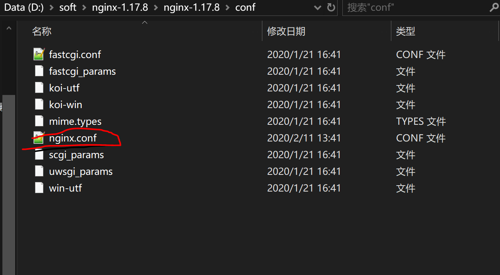

# 1.nginx功能简介
> nginx是为了实现负载均衡减轻服务器压力而设计
# 2.安装nginx
## 2.1 [点击此处下载](http://nginx.org/en/download.html)

## 2.2 下载完成之后解压缩，先进入到conf文件夹下进行一些必要的配置配置

## 2.3 打开nginx.conf文件，添加要负载均衡的服务器地址（轮训策略与加权轮询）

### 2.3.1 添加轮训地址
``` js
upstream backser {
	#权重设置为5 ，如果7个请求过来，理论上有5个会落到8081对应的后端服务器上。
   server localhost:1000; 
   server localhost:1001;
}
```
### 2.3.2 配置对应的映射
``` js
location / {
            root   html;
            index  index.html index.htm;
			proxy_pass http://backser;
        }
```
更多Nginx负载均衡_轮训策略与加权轮询配置[点击此处](https://www.jianshu.com/p/160a60dd06ab)
# 3.启动与访问
## 3.1 启动
> 打开cmd，切换到nginx的安装目录，输入指令
``` cmd
start nginx
```

## 3.2 访问
> 在浏览器访问 localhost:80，若出现以下界面视为安装配置成功

## 3.3下面我们访问controller层写的映射路径即可

# 下面附带nginx的其他操作
``` cmd
2、停止：

C:\server\nginx-1.0.2>nginx.exe -s stop

或

C:\server\nginx-1.0.2>nginx.exe -s quit

注：stop是快速停止nginx，可能并不保存相关信息；quit是完整有序的停止nginx，并保存相关信息。

3、重新载入Nginx：

C:\server\nginx-1.0.2>nginx.exe -s reload

当配置信息修改，需要重新载入这些配置时使用此命令。

4、重新打开日志文件：

C:\server\nginx-1.0.2>nginx.exe -s reopen

5、查看Nginx版本：

C:\server\nginx-1.0.2>nginx -v
```