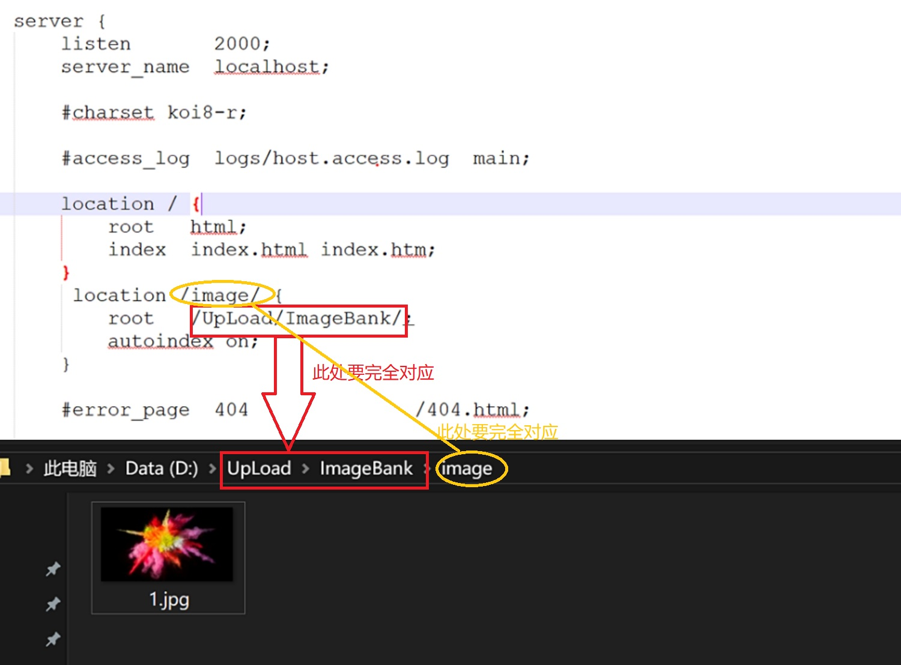
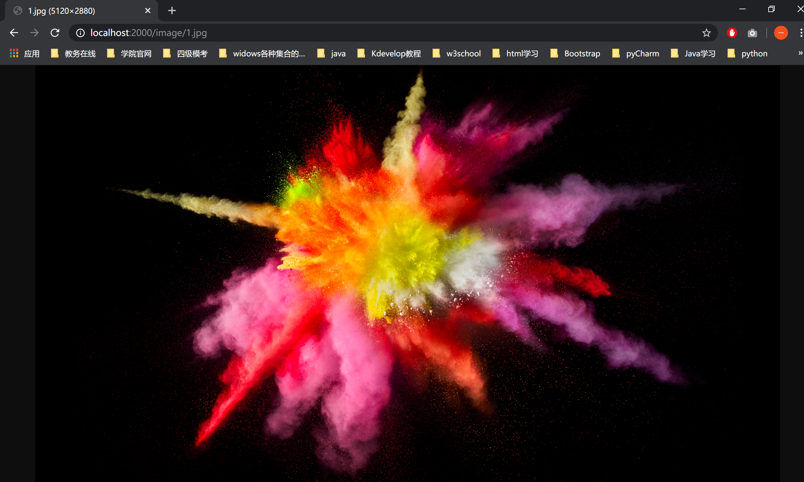

# 首先安装nginx，详情[点击此处](https://blog.csdn.net/zhiyikeji/article/details/104262522)
# 1.在config配置文件中添加映射添加内容如下：
``` js
		 location /image/ {
            root   /UpLoad/ImageBank/;
            autoindex on;
        }	
```
这样的话相当于当/image请求过来之后，会访问D:\UpLoad\ImageBank\image目录下的文件    
由于nginx访问的是绝对路径，所以接下来在你安装nginx对应的磁盘下创建目录/UpLoad/ImageBank/，详情参考此图:

# 2.测试
在浏览器端访问:localhost:端口号/image/1.png，测试结果如下：

