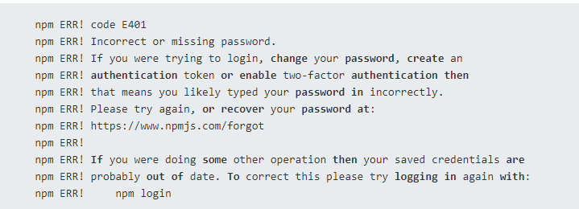
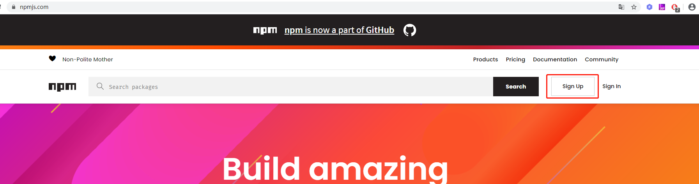
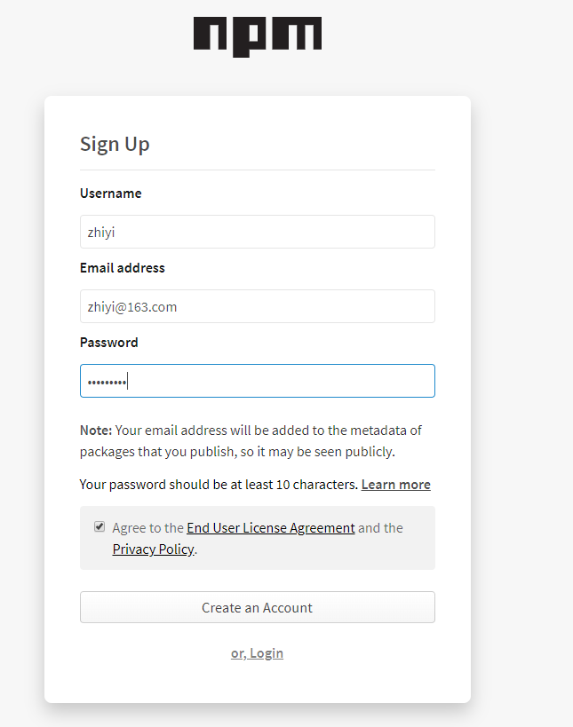
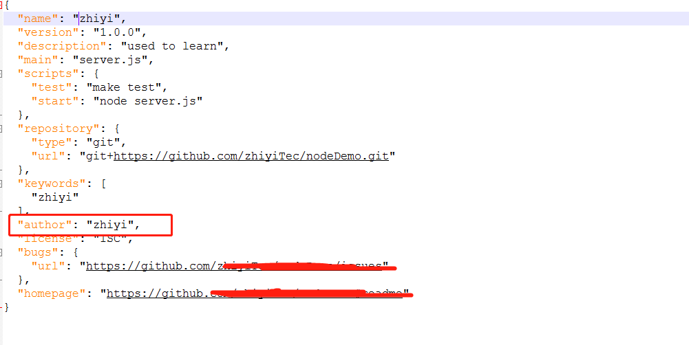

<!-- TOC -->

- [1.npm adduser](#1npm-adduser)

<!-- /TOC -->
# 1.npm adduser
当我们使用此指令报以下错误时:

我们可以尝试在node.js官网上先进行注册，验证成功之后在执行此指令，[npm官网 ](https://www.npmjs.com/)


完成以上操作后进行登录，登录之后在邮箱进行验证，待验证完成之后，关闭原本的cmd，重新打开一个，在执行 npm adduser操作
注意：
* 1.执行npm adduser时对应的用户名，密码以及邮箱要与你注册时的一致，注册完成之后出现Logged in as maxiaorong on http://registry.npmjs.org/.视为注册成功，如果我们使用的是其他镜像，则需要先切回npm原本的镜像再重新执行npm adduser，切换镜像的方法:
``` js
npm config set registry https://registry.npmjs.org/
```
* 2.package.json中的author要和登录npm账号的一致，不然再行npm publish时会报错


