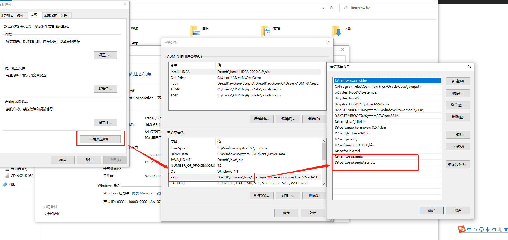
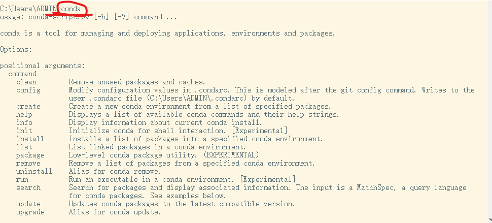
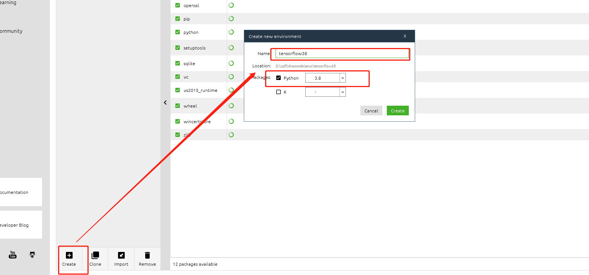
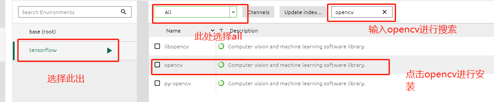
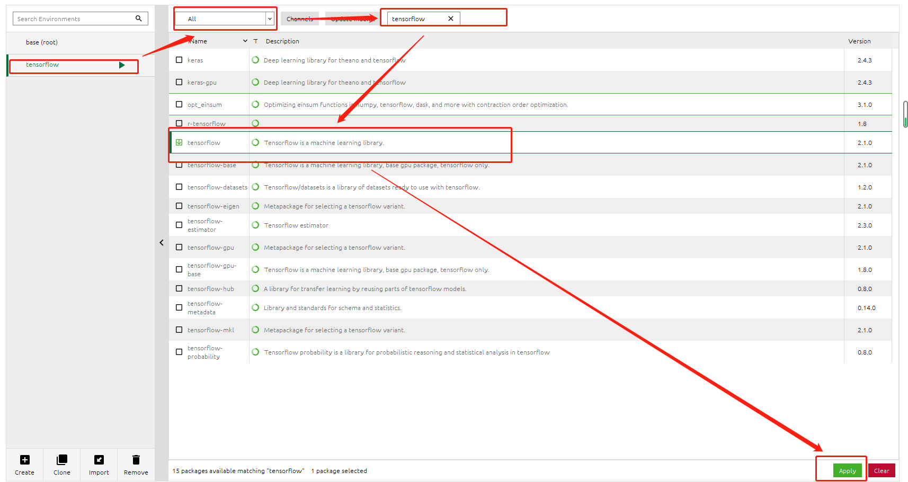
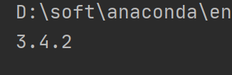

<!-- TOC -->

- [1.安装anconda环境](#1安装anconda环境)
  - [1.1.windows下Anaconda的搭建](#11windows下anaconda的搭建)
  - [1.2.在Anaconda下搭建和配置TensorFlow](#12在anaconda下搭建和配置tensorflow)
    - [1.2.1.创建tensorflow环境](#121创建tensorflow环境)
    - [1.2.2.在tensorflow环境中安装opencv、tensorflow](#122在tensorflow环境中安装opencvtensorflow)
- [2.在pycharm中配置tensorflow](#2在pycharm中配置tensorflow)
- [3.在anaconda环境中添加opencv库](#3在anaconda环境中添加opencv库)

<!-- /TOC -->
# 1.安装anconda环境
## 1.1.windows下Anaconda的搭建
[点击此处进行下载](https://www.anaconda.com/products/individual)
下载之后就是一路的next进行安装，安装完成之后配置环境变量

通过cmd输入conda， 若出现以下界面说明安装成功

## 1.2.在Anaconda下搭建和配置TensorFlow
进入我们刚刚安装好的Anaconda软件 
### 1.2.1.创建tensorflow环境

### 1.2.2.在tensorflow环境中安装opencv、tensorflow

同样的方法搜索tensorflow，点击apply进行安装即可

# 2.在pycharm中配置tensorflow
[点击此处查看](https://blog.csdn.net/zhiyikeji/article/details/112599958)
# 3.在anaconda环境中添加opencv库


安装完成之后我们可以检测一下是否安装成功
``` python
import cv2;
print(cv2.__version__)
```
