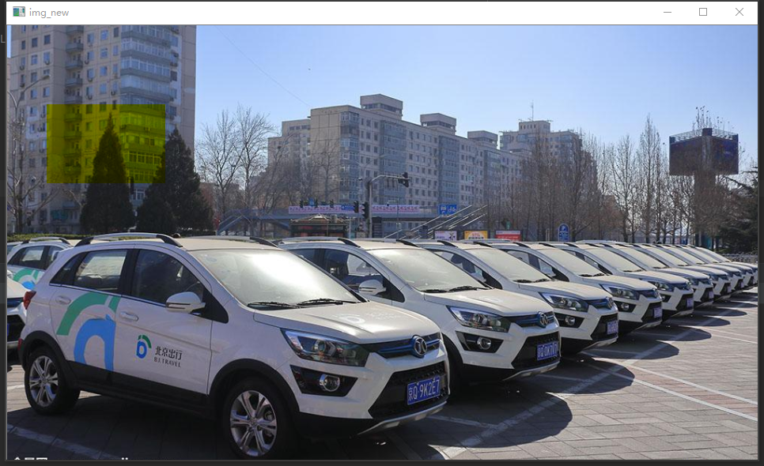
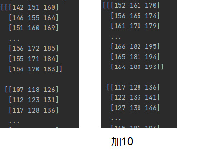
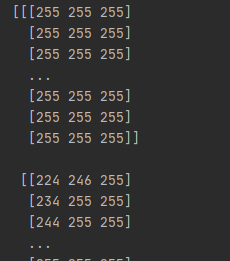
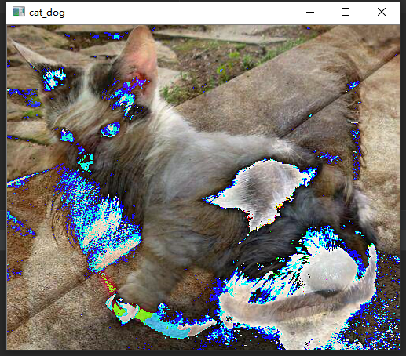

<!-- TOC -->

- [1.了解图像的组成](#1了解图像的组成)
- [2.数据读取-图像](#2数据读取-图像)
- [3.图像的保存](#3图像的保存)
- [4.图像的截取](#4图像的截取)
- [5.数据读取——视频](#5数据读取视频)
- [6.颜色通道的提取组合](#6颜色通道的提取组合)
- [7.边界填充](#7边界填充)
- [8.数值计算](#8数值计算)
- [9.图像融合](#9图像融合)

<!-- /TOC -->
# 1.了解图像的组成

图片由h * w * c个像素组成（一般分为R/G/B三个通道时，每个通道图片由h * w个像素组成），像素范围在0-255(即黑-白)，故图片的numpy数组格式为uint8足以
比如图片的宽是500，高是300，那么像素为500 *300 *3，在矩阵中表示为[500,300,3]
# 2.数据读取-图像
opencv读取的格式是BGR
* cv2.IMREAD_COLOR：彩色图像
* cv2.IMREAD_GRAYSCALE：灰度图像

``` python
import cv2  # opencv读取的格式是BGR
import matplotlib.pyplot as plt
import numpy as np
img = cv2.imread('./images/car.png')
print(img.shape)
cv2.imshow("car",img)
cv2.waitKey(0) # 等待时间，毫秒级，0表示任意键终止。 如果设定1000，大概10s就销毁窗口
```

我们可以看出读取到图片是一个三维的矩阵，通道数为3
为了方便展示图像，我们可以定义一个专门展示图像的函数
``` python
def cv_show(name, img):
    cv2.imshow(name, img)
    cv2.waitKey(0)
    cv2.destroyAllWindows()
```
当然我们也可以读取一个灰度图像
``` python
img = cv2.imread('./images/car.png', cv2.IMREAD_GRAYSCALE)
print(img.shape)
cv_show("car_gray", img)
```

通过运行结果显示我们读取的灰度图是一个二维的结构，表示只有一个颜色通道
# 3.图像的保存
``` python
cv2.imwrite('cat_gray.jpg',img_gray)
```
其他一些常用的基础属性

# 4.图像的截取
感兴趣区域（ROI）的截取 [x:x+w,y:y+h]
``` python
img = cv2.imread('./images/car.png')
img_crop = img[100:200, 50:200]
cv_show('car_crop', img_crop)
```

# 5.数据读取——视频
* cv2.VideoCapture可以捕获摄像头，用数字来控制不同的设备，例如0,1。
* 如果是视频文件，直接指定好路径即可。
``` python
vc = cv2.VideoCapture('./videos/test.mp4')
# 检查是否正确打开
if vc.isOpened():
    opened, frame = vc.read()  # 此时frame中存储的是视频的第一帧图片
    cv2.imshow('frame', frame)
else:
    open = False  # 第一感觉是,是不是写错了,但还就是open
while open:
    ret, frame = vc.read()
    if frame is None:
        break
    if ret == True:
        gray = cv2.cvtColor(frame, cv2.COLOR_BGR2GRAY)
        cv2.imshow('result', gray)
        if cv2.waitKey(10) & 0xFF == 27:  # 表示按下退出键就关闭窗口
            break
vc.release()  # 关闭相机
cv2.destroyAllWindows()  # 关闭窗口
```

* cv2.waitKey(100) 隔多少毫秒显示下一张图片，设置稍大点，符合我们看视频的一个速度。太大就像看视频卡顿的感觉；太小就像几倍速播放，太快了。
* 0xFF == 27 指定退出键退出
* 0xFF == ord(‘q’) 指定q键退出
# 6.颜色通道的提取组合
* split 分离颜色通道
* merge 组合颜色通道(注 两个括号)

``` python
img = cv2.imread('./images/car.png')
b, g, r = cv2.split(img)
b[100:200, 50:200] = 0
img_new = cv2.merge((b, g, r))
print(img_new)
cv_show("img_new",img_new)
```

比如将蓝色通道都置0，绿 红通道 这块区域的值没变，则组合成黄色
我们也可以单独保留某个通道，其他通道置0
* 只保留R
``` python
img = cv2.imread('./images/car.png')
img_C = img.copy()
img_C[:, :, 0] = 0
img_C[:, :, 1] = 0
print(img_C)
cv_show("R", img_C)
```

* 只保留G
``` python
img = cv2.imread('./images/car.png')
img_C = img.copy()
img_C[:, :, 0] = 0
img_C[:, :, 2] = 0
print(img_C)
cv_show("G", img_C)
```

* 只保留B
``` python
img = cv2.imread('./images/car.png')
img_C = img.copy()
img_C[:, :, 1] = 0
img_C[:, :, 2] = 0
print(img_C)
cv_show("B", img_C)
```

# 7.边界填充
扩充图像边界 copyMakeBorder，需要6个参数：图+上+下+左+右(填充的像素大小)+填充方式
填充方式如下：
* BORDER_REPLICATE：复制法，也就是复制最边缘像素。
* BORDER_REFLECT：反射法，对感兴趣的图像中的像素在两边进行复制例如：fedcba|abcdefgh|hgfedcb
* BORDER_REFLECT_101：反射法，也就是以最边缘像素为轴(没有a)，对称，gfedcb|abcdefgh|gfedcba
* BORDER_WRAP：外包装法cdefgh|abcdefgh|abcdefg
* BORDER_CONSTANT：常量法，常数值填充。

``` python
img = cv2.imread('./images/car.png')
top_size, bottom_size, left_size, right_size = (50, 50, 50, 50)
# 复制法
img_replace = cv2.copyMakeBorder(img, top_size, bottom_size, left_size, right_size, cv2.BORDER_REPLICATE)
# 反射法
img_reflect = cv2.copyMakeBorder(img, top_size, bottom_size, left_size, right_size, cv2.BORDER_REFLECT)
# 反射法
img_reflect101 = cv2.copyMakeBorder(img, top_size, bottom_size, left_size, right_size, cv2.BORDER_REFLECT_101)
# 外包装法
img_wrap = cv2.copyMakeBorder(img, top_size, bottom_size, left_size, right_size, cv2.BORDER_WRAP)
# 常量法，常数值填充。
img_constant = cv2.copyMakeBorder(img, top_size, bottom_size, left_size, right_size, cv2.BORDER_CONSTANT, value=0)
plt.subplot(231), plt.imshow(img, 'gray'), plt.title('ORIGINAL')
plt.subplot(232), plt.imshow(img_replace, 'gray'), plt.title('Replace')
plt.subplot(233), plt.imshow(img_reflect, 'gray'), plt.title('REFLECT')
plt.subplot(234), plt.imshow(img_reflect101, 'gray'), plt.title('REFLECT_101')
plt.subplot(235), plt.imshow(img_wrap, 'gray'), plt.title('WRAP')
plt.subplot(236), plt.imshow(img_constant, 'gray'), plt.title('CONSTANT')
plt.savefig('cat_fill.jpg')
plt.show()
```

# 8.数值计算
``` python
img_cat = cv2.imread("./images/cat.jpg")
img_dog = cv2.imread("./images/dog.jpg")
# 相当于在每个像素点上都加10
# print(img_cat)
img_cat2 = img_cat + 10
print(img_cat2)
```

``` python
print(img_cat+img_cat2)
```

正常情况下142+152=294，但是显示38，原因是像素点的范围是0-255，越界之后就会执行取余操作，也就是294%256=38
``` python
print(cv2.add(img_cat,img_cat2))
```

与np的＋不同，np的＋是超过255的部分就取余，但是cv2.add是超过255的部分直接取255
# 9.图像融合
* cv2.resize(img, (新img的宽, 高)) 融合两张图的前提是尺寸一致
``` python
img_cat = cv2.imread("./images/cat.jpg")
img_dog = cv2.imread("./images/dog.jpg")
print(img_dog+img_cat)
```

原因是两个变量的shape不同，所以我们要是想对他们进行相加
``` python
img_cat = cv2.imread("./images/cat.jpg")
img_dog = cv2.imread("./images/dog.jpg")
img_dog = cv2.resize(img_dog, (img_cat.shape[1], img_cat.shape[0]))
cat_dog = img_cat + img_dog
print(cat_dog)
cv_show("cat_dog", cat_dog)
```
