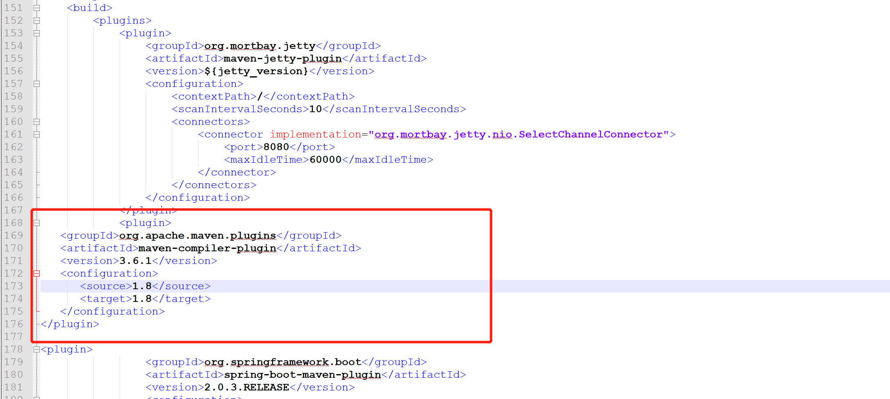

# 1.在pom文件中添加插件
``` xml
<plugin>
   <groupId>org.apache.maven.plugins</groupId>
   <artifactId>maven-compiler-plugin</artifactId>
   <version>3.6.1</version>
   <configuration>
      <source>1.8</source>
      <target>1.8</target>
   </configuration>
</plugin>
```

由于我的环境是jdk 1.8所以在此处设置为1.8
