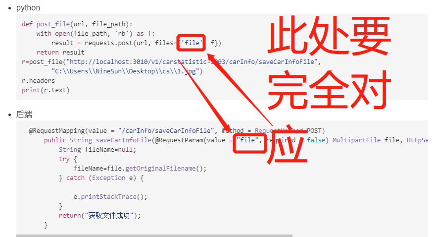

<!-- TOC -->

- [1.引入requests模块](#1引入requests模块)
- [2.设置请求头](#2设置请求头)
- [3.设置请求参数](#3设置请求参数)
  - [3.1 如果只是传输普通的json数据](#31-如果只是传输普通的json数据)
  - [3.2如果传输的数据中包含文件数据](#32如果传输的数据中包含文件数据)
    - [3.2.1 仅仅传输文件](#321-仅仅传输文件)
    - [3.2.2 传输文件和数据](#322-传输文件和数据)

<!-- /TOC -->
# 1.引入requests模块
``` python
import requests
```
# 2.设置请求头
``` python
headers2 = {'Content-Type': 'application/json'}
```
# 3.设置请求参数
## 3.1 如果只是传输普通的json数据
``` python
# 需要传输的参数
data = {"lesson": "Operation System", "score": 100}
r = requests.post('http://localhost:3010/v1/carstatistic-3003/carInfo/countCarInfo', headers=headers2,json=data,
                  verify=False)
r.headers
print(r.text)
```
整体代码：
* python
  ``` python
    import requests

    headers2 = {'Content-Type': 'application/json'}
    data = {"name": "ninesun", "age": 21}
    r = requests.post('http://localhost:3010/v1/carstatistic-3003/carInfo/countCarInfo', headers=headers2,json=data,
                    verify=False)
    r.headers
    print(r.text)
    ```
* 后端
  ``` java
    @RequestMapping(value = "carInfo/countCarInfo", method = RequestMethod.POST)
        public String countCarInfo(@RequestBody Map<String, Object> map) {
            String name=map.get("name").toString();
            String age=map.get("age").toString();
            return "测试";
        }
  ```
## 3.2如果传输的数据中包含文件数据
### 3.2.1 仅仅传输文件
* python
    ``` python
    def post_file(url, file_path):
        with open(file_path, 'rb') as f:
            result = requests.post(url, files={'file': f})
        return result
    r=post_file("http://localhost:3010/v1/carstatistic-3003/carInfo/saveCarInfoFile",
            "C:\\Users\\NineSun\\Desktop\\cs\\1.jpg")
    r.headers
    print(r.text)
    ```
* 后端
  ``` java
    @RequestMapping(value = "/carInfo/saveCarInfoFile", method = RequestMethod.POST)
        public String saveCarInfoFile(@RequestParam(value = "file", required = false) MultipartFile file, HttpServletResponse response, HttpServletRequest request) {
            String fileName=null;
            try {
                fileName=file.getOriginalFilename();
            } catch (Exception e) {
                
                e.printStackTrace();
            }
            return("获取文件成功");
        }
  ```
此处有个对应关系：

### 3.2.2 传输文件和数据
``` python
data = {"k1" : "v1"}
files = {
  "field1" : open("1.png", "rb")
}
r = requests.post("http://httpbin.org/post", data, files=files)
```

