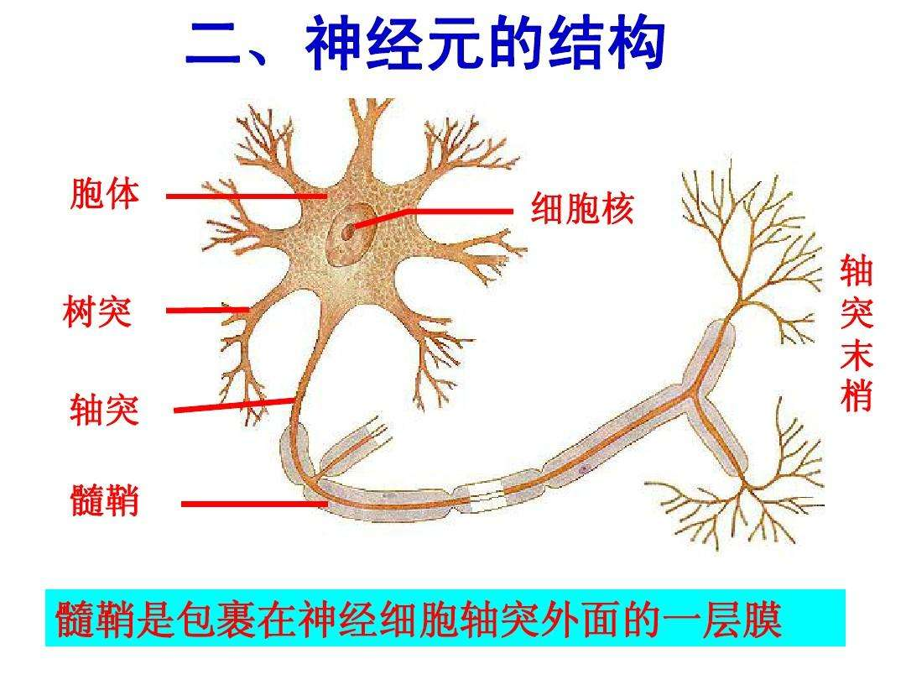
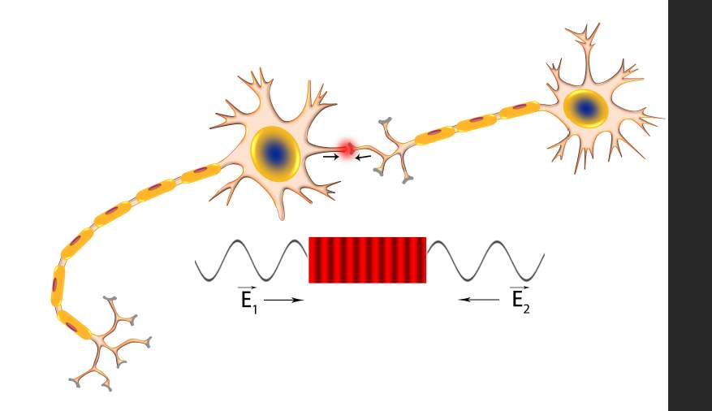
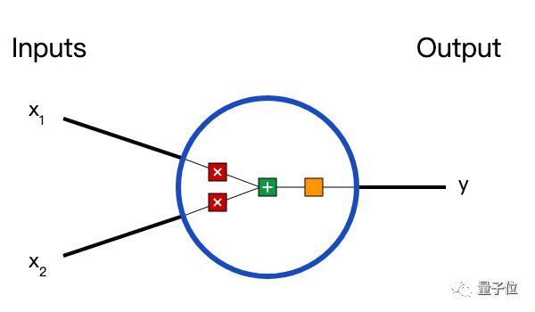
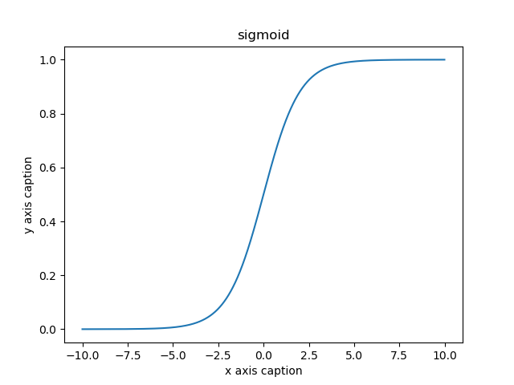
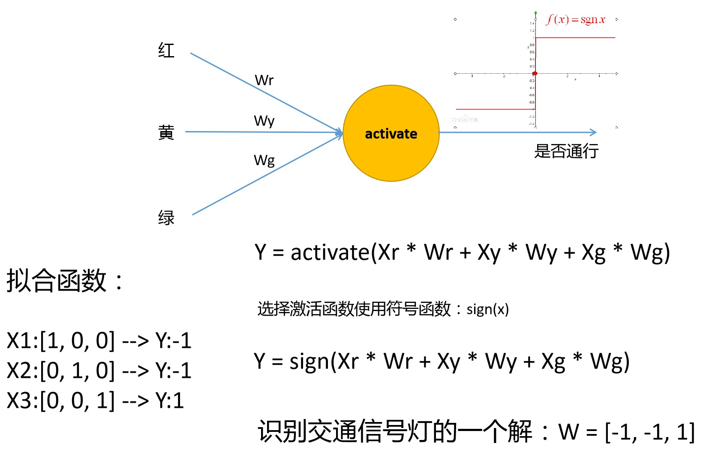
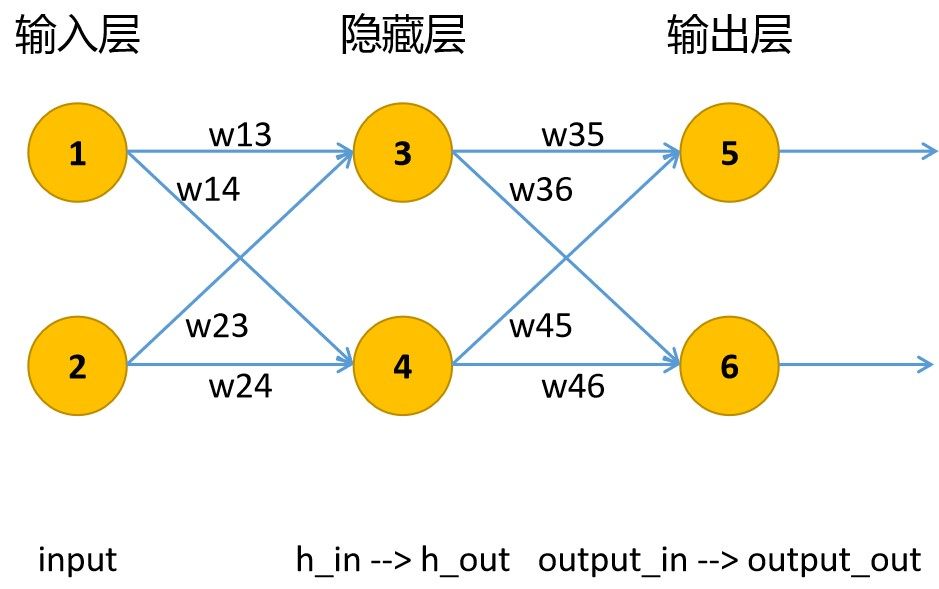
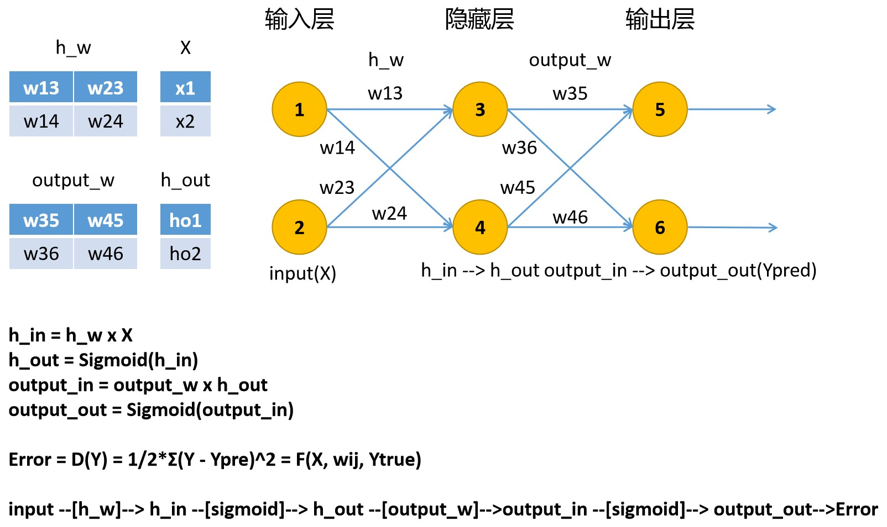

# 第十部分：误差反向传播算法（BP）

<!-- @import "[TOC]" {cmd="toc" depthFrom=1 depthTo=6 orderedList=false} -->

<!-- code_chunk_output -->

- [第十部分：误差反向传播算法（BP）](#第十部分误差反向传播算法bp)
  - [一、神经网络基本概念](#一-神经网络基本概念)
  - [二、神经元模型](#二-神经元模型)
    - [1. 单个神经元](#1-单个神经元)
      - [1> 感知器模型](#1-感知器模型)
      - [2> 输入与输出](#2-输入与输出)
      - [3> 激活函数](#3-激活函数)
    - [2. 单个神经元的学习](#2-单个神经元的学习)
      - [1> 识别](#1-识别)
    - [3. 多层神经元模型](#3-多层神经元模型)
  - [三、误差反向传播算法(BP)](#三-误差反向传播算法bp)
    - [1. 算法的推导](#1-算法的推导)
      - [1> 输出层权重偏导](#1-输出层权重偏导)
      - [2> 隐藏层权重偏导](#2-隐藏层权重偏导)
    - [3. 训练](#3-训练)
      - [1> 调整单个权重 w。我们追求误差减小，故，有以下公式：](#1-调整单个权重-w我们追求误差减小故有以下公式)
      - [2> 随机梯度下降](#2-随机梯度下降)
    - [4. 编码](#4-编码)
  - [四、一个学习示例](#四-一个学习示例)
    - [1. 性别预测](#1-性别预测)
  - [五、 算法优化](#五-算法优化)
    - [1. 指定网络结构](#1-指定网络结构)
    - [2. 存储当前神经网络的训练数据](#2-存储当前神经网络的训练数据)

<!-- /code_chunk_output -->

## 一、神经网络基本概念

## 二、神经元模型
**神经元细胞示意图**

### 1. 单个神经元
#### 1> 感知器模型

#### 2> 输入与输出

#### 3> 激活函数
$$
Sigmoid(x) = \frac{1}{1+e^{-x}}
$$

$$
Sigmoid'(x) = Sigmoid(x) * (1 - Sigmoid(x))
$$
### 2. 单个神经元的学习
#### 1> 识别

### 3. 多层神经元模型

## 三、误差反向传播算法(BP)
### 1. 算法的推导

**符号说明：**
* `X`: 输入向量
* $Y_{true}$: 输入向量 `X` 对应的真实结果
* $Y_{pred}$: 根据输入向量 `X` 预测的结果
* `Yi`: 向量的某个分量
* `h_in`: 隐藏层输入
* `h_out`: 隐藏层输出(经过激活函数处理)
* `h_w`: 隐藏层权重矩阵
* `output_in`: 输出层输入
* `output_out`: 输出层输出(经过激活函数处理)
* `output_w`: 输出层权重矩阵

#### 1> 输出层权重偏导
已知对于某个训练样例 d 的误差函数：
$$
Error = \frac{1}{2} * \sum_{i \in output}(Yi_{true}-Yi_{pred})^2
$$
可得，总误差函数对输出层权重 $w_{35}$ 的偏导数：
$$
\frac{\partial{E}}{\partial{w_{35}}} = \frac{\partial{E}}{\partial{output5\_out}} * \frac{\partial{output5\_out}}{\partial{output5\_in}} * \frac{\partial{output5\_in}}{\partial{w_{35}}}
$$
各项展开得：
$
\frac{\partial{E}}{\partial{output5\_out}} = -(Y5_{true} - output5\_out)
$
$
\frac{\partial{output5\_out}}{\partial{output5\_in}} = Sigmoid(output5\_in)*(1-Sigmoid(output5\_in))
$
$
output5\_in = h3\_out * w_{35} + h4\_out * w_{45}
$
$
\frac{\partial{output\_in}}{\partial{w_{35}}} = h3\_out
$

**最终偏导为：**
$$
\frac{\partial{E}}{\partial{w35}} = -(Y5_{true} - output5\_out) * Sigmoid(output5\_in)*(1-Sigmoid(output5\_in)) * h3\_out
$$

#### 2> 隐藏层权重偏导
总体上，隐藏层权重偏导公式如下：
$$
\frac{\partial{E}}{\partial{w_{13}}} = \frac{\partial{E}}{\partial{h3\_out}} * \frac{\partial{h3\_out}}{\partial{h3\_in}} * \frac{\partial{h3\_in}}{\partial{w_{13}}}
$$
展开，得：
$$
\frac{\partial{E}}{\partial{w_{13}}} = \frac{\partial{E}}{\partial{h3\_out}} * Sigmoid(h3\_in) * (1 - Sigmoid(h3\_in))* x_1
$$
仔细分析，我们只需对权重 $w_{13}$ 直接影响的节点求导即可：
$$
\frac{\partial{E}}{\partial{h3\_out}} = \sum_{i \in Downstream(h3)} \frac{\partial{E}}{\partial{outputi\_out}} * \frac{\partial{outputi\_out}}{\partial{outputi\_in}} * \frac{\partial{outputi\_in}}{\partial{h3\_out}} 
$$
各项展开得：
$$
\frac{\partial{E}}{\partial{h3\_out}} = \sum_{i \in Downstream(h3)} -(Yi_{true} - outputi\_out) * Sigmoid(outputi\_in) * (1 - Sigmoid(outputi\_in)) * w_{3i}
$$

### 3. 训练
#### 1> 调整单个权重 w。我们追求误差减小，故，有以下公式：
$$
w_{35} = w_{35} - \Delta w_{35}
$$
定义学习速率：$r$
$$
w_{35} = w_{35} - r * \frac{\partial{E}}{\partial{w_{35}}}
$$
输出层权重调整：
$$
w_{35} = w_{35} + r * (Y5_{true} - output5\_out) * Sigmoid(output5\_in)*(1-Sigmoid(output5\_in)) * h3\_out
$$
$$
w_{45} = w_{45} + r * (Y5_{true} - output5\_out) * Sigmoid(output5\_in)*(1-Sigmoid(output5\_in)) * h4\_out
$$
$$
w_{36} = w_{36} + r * (Y6_{true} - output6\_out) * Sigmoid(output6\_in)*(1-Sigmoid(output6\_in)) * h3\_out
$$
$$
w_{46} = w_{46} + r * (Y6_{true} - output6\_out) * Sigmoid(output6\_in)*(1-Sigmoid(output6\_in)) * h4\_out
$$
利用矩阵运算简化
$$
ow += r *
\left( \begin{array}{cc}
    Y5_{true} - Y5_{pred} \\
    Y6_{true} - Y6_{pred}
    \end{array}
\right) \cdot Sigmoid'\left( \begin{array}{cc}
    output5\_{in} \\
    output6\_{in}
    \end{array}
\right) \times \left( \begin{array}{c}
    h3\_{out} & h4\_{out}
    \end{array}
\right)
$$
继续化简(默认向量为列向量)：
$$
ow += r * (Y_{true} - Y_{pred}) \cdot Sigmoid'(output\_in) \times h\_out.T
$$
令：
$$
output\_errors = (Y_{true} - Y_{pred})
$$
则：
$$
hw += r * (output\_errors \cdot Sigmoid'(output\_in)) \times h\_out.T
$$

隐藏层权重调整：
$$
w_{13} = w_{13} + r * Sigmoid'(h3\_in) * x_1 * \sum_{i \in Downstream(h3)} (Yi_{true} - outputi\_out) * Sigmoid'(outputi\_in) * w_{3i}
$$

$$
w_{23} = w_{23} + r * Sigmoid'(h3\_in) * x_2 * \sum_{i \in Downstream(h3)} (Yi_{true} - outputi\_out) * Sigmoid'(outputi\_in) * w_{3i}
$$

$$
w_{14} = w_{14} + r * Sigmoid'(h4\_in) * x_1 * \sum_{i \in Downstream(h4)} (Yi_{true} - outputi\_out) * Sigmoid'(outputi\_in) * w_{4i}
$$

$$
w_{24} = w_{24} + r * Sigmoid'(h4\_in) * x_2 * \sum_{i \in Downstream(h4)} (Yi_{true} - outputi\_out) * Sigmoid'(outputi\_in) * w_{4i}
$$
利用矩阵简化：
$$
hw_{ij} += r * Sigmoid'\left(\begin{array}{c}
    hj\_in \\
    hj\_in
\end{array}\right) \cdot \left(\begin{array}{c}
    x_1 \\
    x_2
\end{array}\right) \times \sum_{k \in Downstream(h_j)} ( 
    Yk_{true} - Yk_{pred} ) \cdot Sigmoid'( 
    outputk\_{in}
) \times w_{jk}
$$
令(默认向量为列向量):
$$
hidden\_errors = output\_w.T \times 
    ((Yk_{true} - Yk_{pred} ) \cdot Sigmoid'( 
    output\_{in})
)
$$
带入得(默认向量为列向量)：
$$
hw += r * (hidden\_errors \cdot Sigmoid'(h\_in)) \times X.T
$$

#### 2> 随机梯度下降
1. 对训练样本中的每一个数据，进行一次训练
2. 对整个样本进行多次(例如：100次)训练

### 4. 编码

## 四、一个学习示例
### 1. 性别预测

## 五、 算法优化
### 1. 指定网络结构
可随意指定：输入层，隐藏层，输出层的神经元个数

### 2. 存储当前神经网络的训练数据
将神经网络结构，包括：学习速率，训练次数和所有权重矩阵存成文件，以便以后可以不必训练，加载数据后可直接进行预测。

