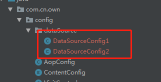
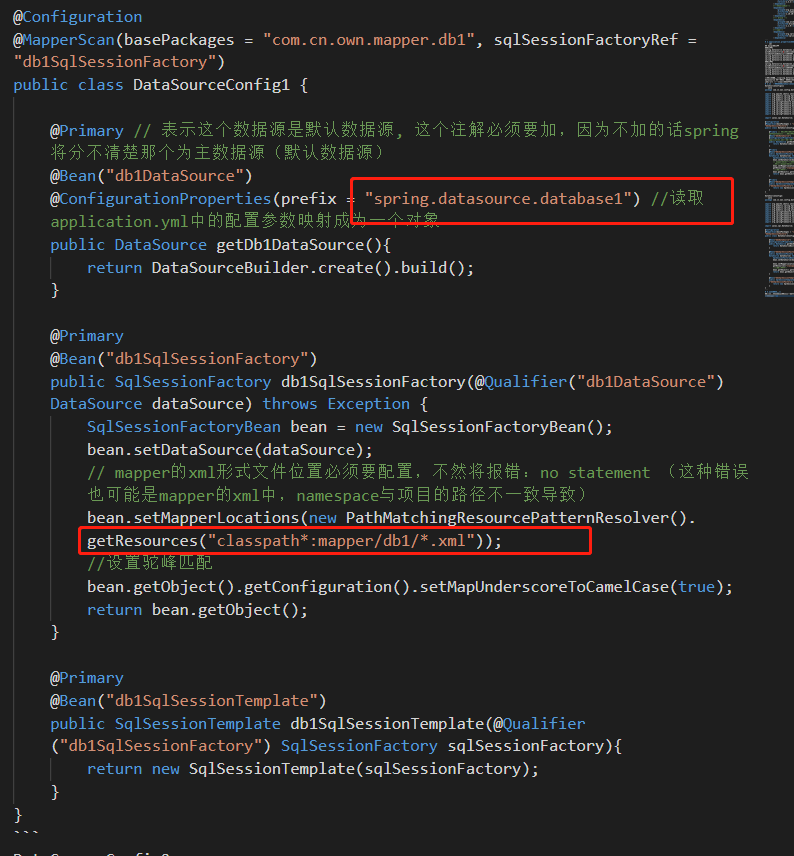
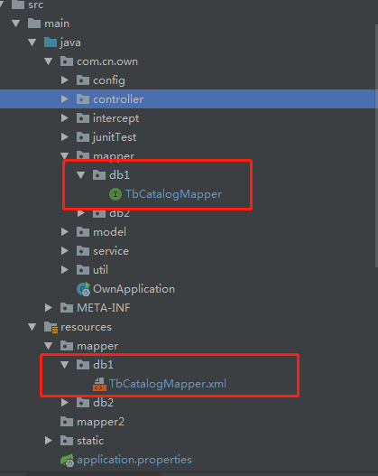

<!-- TOC -->

- [1.maven环境依赖](#1maven环境依赖)
- [2.application.properties文件配置](#2applicationproperties文件配置)
- [3.添加配置文件DataSourceConfig1，DataSourceConfig2](#3添加配置文件datasourceconfig1datasourceconfig2)
- [4.具体如何使用](#4具体如何使用)

<!-- /TOC -->
# 1.maven环境依赖
``` xml
        <!--mysql-->
        <dependency>
            <groupId>mysql</groupId>
            <artifactId>mysql-connector-java</artifactId>
            <version>8.0.13</version>
        </dependency>
        <!--Spring Boot Mybatis 依赖-->
        <dependency>
            <groupId>org.mybatis.spring.boot</groupId>
            <artifactId>mybatis-spring-boot-starter</artifactId>
            <version>1.3.2</version>
        </dependency>
        <!--引入lomBok-->
        <dependency>
            <groupId>org.projectlombok</groupId>
            <artifactId>lombok</artifactId>
            <version>1.16.10</version>
        </dependency>
        <!-- druid -->
        <dependency>
            <groupId>com.alibaba</groupId>
            <artifactId>druid-spring-boot-starter</artifactId>
            <version>1.1.9</version>
        </dependency>
        <!--jpa-->
        <dependency>
            <groupId>org.springframework.boot</groupId>
            <artifactId>spring-boot-starter-data-jpa</artifactId>
        </dependency>
```
# 2.application.properties文件配置
``` xml
## mysql数据源
#数据源1
spring.datasource.database1.jdbc-url=jdbc:mysql://localhost:3306/own1?autoReconnect=true&useUnicode=true&characterEncoding=utf-8&&zeroDateTimeBehavior=CONVERT_TO_NULL&&serverTimezone=GMT%2B8
spring.datasource.database1.username=root
spring.datasource.database1.password=root
spring.datasource.database1.driver-class-name=com.mysql.jdbc.Driver
#数据源2
spring.datasource.database2.jdbc-url=jdbc:mysql://localhost:3306/own2?autoReconnect=true&useUnicode=true&characterEncoding=utf-8&&zeroDateTimeBehavior=CONVERT_TO_NULL&&serverTimezone=GMT%2B8
spring.datasource.database2.username=root
spring.datasource.database2.password=jywzs@123
spring.datasource.database2.driver-class-name=com.mysql.jdbc.Driver
```
注意：切勿使用spring.datasource.database2.url，各个版本的 springboot 配置 datasource 时参数有所变化，例如低版本配置数据库 url 时使用 url 属性，高版本使用 jdbc-url 属性，请注意区分。
# 3.添加配置文件DataSourceConfig1，DataSourceConfig2
DataSourceConfig1：
```java
package com.cn.own.config.dataSource;

import org.apache.ibatis.session.SqlSessionFactory;
import org.mybatis.spring.SqlSessionFactoryBean;
import org.mybatis.spring.SqlSessionTemplate;
import org.mybatis.spring.annotation.MapperScan;
import org.springframework.beans.factory.annotation.Qualifier;
import org.springframework.boot.context.properties.ConfigurationProperties;
import org.springframework.boot.jdbc.DataSourceBuilder;
import org.springframework.context.annotation.Bean;
import org.springframework.context.annotation.Configuration;
import org.springframework.context.annotation.Primary;
import org.springframework.core.io.support.PathMatchingResourcePatternResolver;

import javax.sql.DataSource;

@Configuration
@MapperScan(basePackages = "com.cn.own.mapper.db1", sqlSessionFactoryRef = "db1SqlSessionFactory")
public class DataSourceConfig1 {

    @Primary // 表示这个数据源是默认数据源, 这个注解必须要加，因为不加的话spring将分不清楚那个为主数据源（默认数据源）
    @Bean("db1DataSource")
    @ConfigurationProperties(prefix = "spring.datasource.database1") //读取application.yml中的配置参数映射成为一个对象
    public DataSource getDb1DataSource(){
        return DataSourceBuilder.create().build();
    }

    @Primary
    @Bean("db1SqlSessionFactory")
    public SqlSessionFactory db1SqlSessionFactory(@Qualifier("db1DataSource") DataSource dataSource) throws Exception {
        SqlSessionFactoryBean bean = new SqlSessionFactoryBean();
        bean.setDataSource(dataSource);
        // mapper的xml形式文件位置必须要配置，不然将报错：no statement （这种错误也可能是mapper的xml中，namespace与项目的路径不一致导致）
        bean.setMapperLocations(new PathMatchingResourcePatternResolver().getResources("classpath*:mapper/db1/*.xml"));
        //设置驼峰匹配
        bean.getObject().getConfiguration().setMapUnderscoreToCamelCase(true);
        return bean.getObject();
    }

    @Primary
    @Bean("db1SqlSessionTemplate")
    public SqlSessionTemplate db1SqlSessionTemplate(@Qualifier("db1SqlSessionFactory") SqlSessionFactory sqlSessionFactory){
        return new SqlSessionTemplate(sqlSessionFactory);
    }
}
```
DataSourceConfig2:
```java
package com.cn.own.config.dataSource;

import org.apache.ibatis.session.SqlSessionFactory;
import org.mybatis.spring.SqlSessionFactoryBean;
import org.mybatis.spring.SqlSessionTemplate;
import org.mybatis.spring.annotation.MapperScan;
import org.springframework.beans.factory.annotation.Qualifier;
import org.springframework.boot.context.properties.ConfigurationProperties;
import org.springframework.boot.jdbc.DataSourceBuilder;
import org.springframework.context.annotation.Bean;
import org.springframework.context.annotation.Configuration;
import org.springframework.core.io.support.PathMatchingResourcePatternResolver;

import javax.sql.DataSource;

@Configuration
@MapperScan(basePackages = "com.cn.own.mapper.db2", sqlSessionFactoryRef = "db2SqlSessionFactory")
public class DataSourceConfig2 {

    @Bean("db2DataSource")
    @ConfigurationProperties(prefix = "spring.datasource.database2")
    public DataSource getDb1DataSource(){
        return DataSourceBuilder.create().build();
    }

    @Bean("db2SqlSessionFactory")
    public SqlSessionFactory db1SqlSessionFactory(@Qualifier("db2DataSource") DataSource dataSource) throws Exception {
        SqlSessionFactoryBean bean = new SqlSessionFactoryBean();
        bean.setDataSource(dataSource);

        bean.setMapperLocations(new PathMatchingResourcePatternResolver().getResources("classpath*:mapper/db2/*.xml"));
        //设置驼峰匹配
        bean.getObject().getConfiguration().setMapUnderscoreToCamelCase(true);
        return bean.getObject();
    }

    @Bean("db2SqlSessionTemplate")
    public SqlSessionTemplate db1SqlSessionTemplate(@Qualifier("db2SqlSessionFactory") SqlSessionFactory sqlSessionFactory){
        return new SqlSessionTemplate(sqlSessionFactory);
    }
}
```

# 4.具体如何使用
如果我们想查询own数据库中的内容，只需要将mapper以及mapper.xml文件放在我们之前指定好的db1中


同理，我们如果想查询own2中的数据，将mapper以及mapper.xml放在db2中即可
以上就是配置数据源的全部