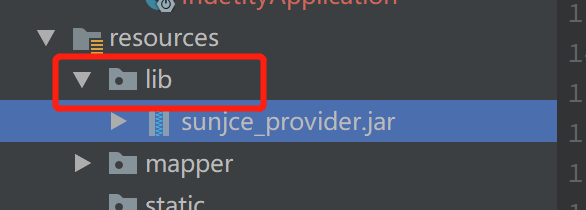
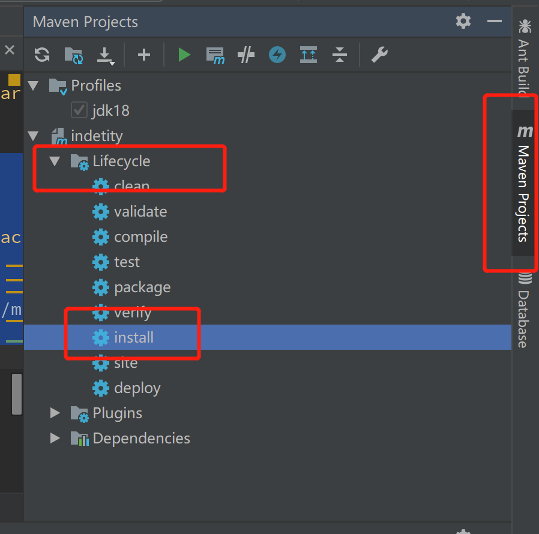

# 1.在resources目录新建lib目录，同时将下载好的jar包复制到此目录

# 2.添加maven依赖
``` xml
 <!--加载本地jar包-->
        <dependency>
            <groupId>sunjce_provider</groupId>
            <artifactId>sunjce_provider</artifactId>
            <version>0.0.1</version>
            <scope>system</scope>
            <systemPath>${project.basedir}/src/main/resources/lib/sunjce_provider.jar
            </systemPath>
        </dependency>
```
注意：systemPath这个路径必须得是你jar的路径。其他的按照套路填就行，要求不是太严格。${project.basedir}只是一个系统自己的常量，不用管它
# 3.在springBoot打包插件中修改参数用于打包本地jar包
``` xml
<plugin>
            <groupId>org.springframework.boot</groupId>
            <artifactId>spring-boot-maven-plugin</artifactId>
             <configuration>
                    <includeSystemScope>true</includeSystemScope>
                </configuration>
            <executions>
                <execution>
                    <goals>
                        <goal>repackage</goal>
                    </goals>
                </execution>
            </executions>
        </plugin>
```
# 4.重新install以下项目即可
