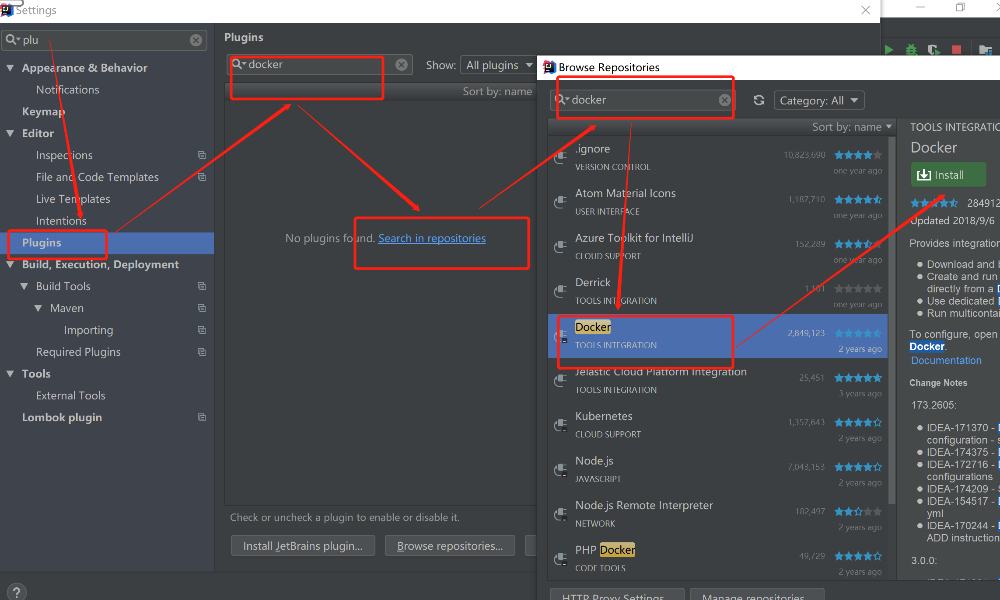
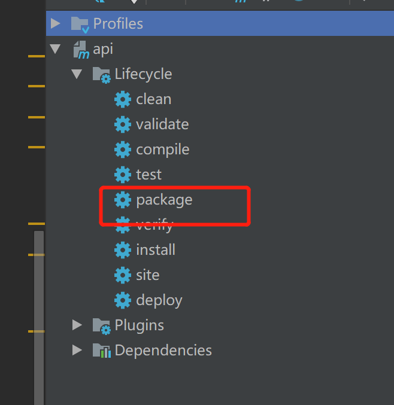
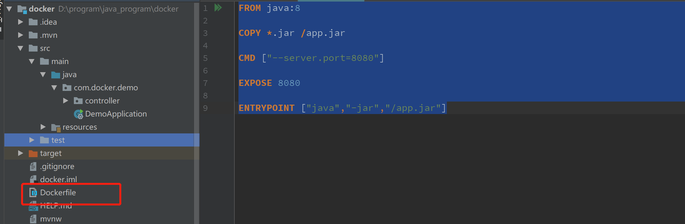
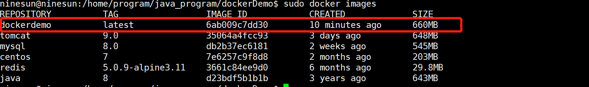
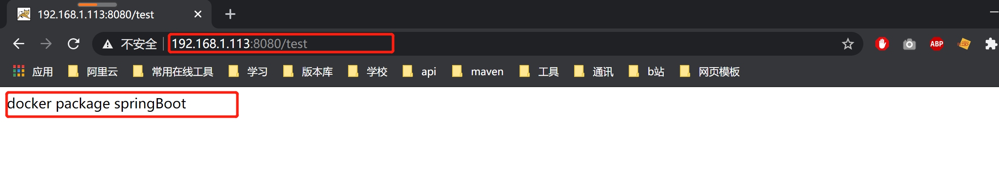

# 1.安装docker插件

安装完成之后，重启idea
# 2.打包我们的项目

# 3.编写Dockerfile
```docker
FROM java:8

COPY *.jar /app.jar

CMD ["--server.port=8080"]

EXPOSE 8080

ENTRYPOINT ["java","-jar","/app.jar"]
```

# 4.将我们编写的DockerFile以及打包好的jar包上传至服务器

# 5.构建我们自己的镜像
首先cd到我们存放Dockerfile的目录，执行以下命令
``` docker
sudo docker build -t dockerdemo .
```
# 6. 查看是否构建成功
```
docker images
```

# 7.执行我们构建好的容器
```
sudo docker run -d --name springboot -p 8080:8080 dockerdemo
```
# 8.外部访问测试


下面附上controller的代码
``` java
@Controller
public class TestController {

    @ResponseBody
    @RequestMapping(value = "test",method = RequestMethod.GET)
    public String test(){
        return "docker package springBoot";
    }
}

```
至此部署springBoot至docker就结束了