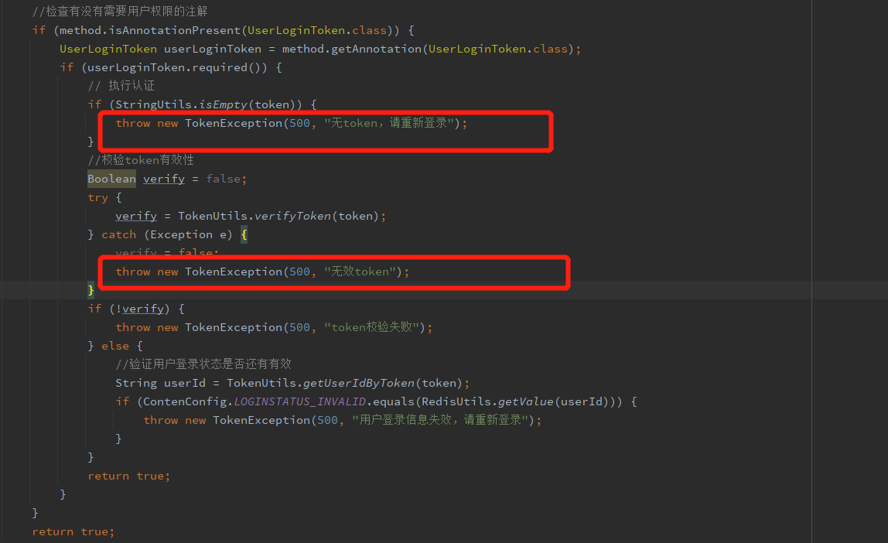

我们在做异常处理时经常只是能打印在控制台但是却无法将错误信息或提示显示给用户，springBoot中的全局异常处理就有效的解决了我们这个问题
# 1.创建异常拦截类
``` java
@ControllerAdvice
public class DealExceptionHandler {

    //指定出现什么异常值执行这个方法
    @ExceptionHandler(Exception.class)
    @ResponseBody//为了返回数据
    public BaseResult defaultExceptionHandler(Exception ex) {
        BaseResult baseResult = new BaseResult();
        ex.printStackTrace();
        baseResult.makError("发现全局异常，正在处理，请刷新再试");
        return baseResult;
    }

    //指定TokenException异常值执行这个方法
    @ExceptionHandler(TokenException.class)
    @ResponseBody//为了返回数据
    public BaseResult tokenExceptionHandler(Exception ex) {
        BaseResult baseResult = new BaseResult();
        ex.printStackTrace();
        baseResult.makError("Token异常，请刷新重试");
        return baseResult;
    }
}
```
这里面有两个方法：
* 1.defaultExceptionHandler 用于拦截全局的异常
* 2.tokenExceptionHandler 用于拦截我们自定义的异常
对于tokenException，如下：
``` java
public class TokenException extends RuntimeException {
    private Integer code;
    private String message;

    public TokenException(Integer code, String message) {
        super(message);
        this.code = code;
    }
    public Integer getCode() {
        return code;
    }

    public void setCode(Integer code) {
        this.code = code;
    }
}
```
tokenException的用法如下：

当发生我们抛出的tokenException异常时，就会被tokenExceptionHandler给拦截，返回<font color=#FF0000>  Token异常，请刷新重试 </font>   的提示
