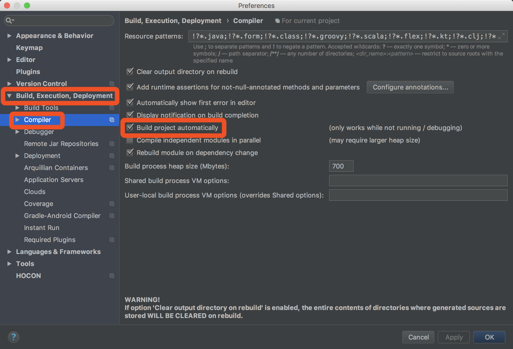
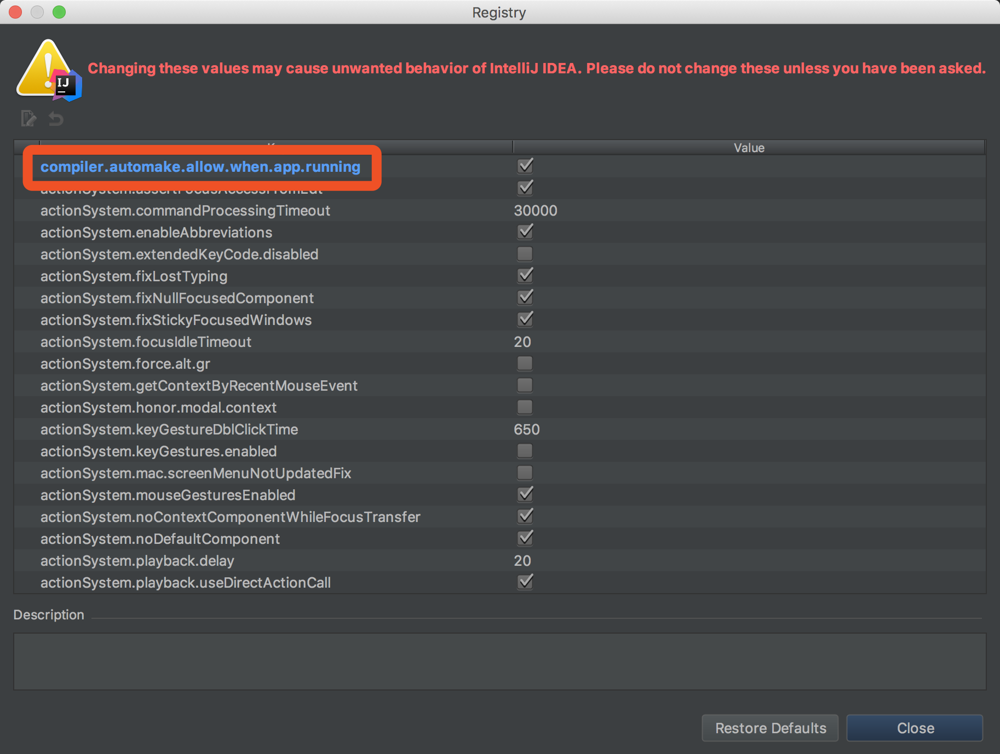
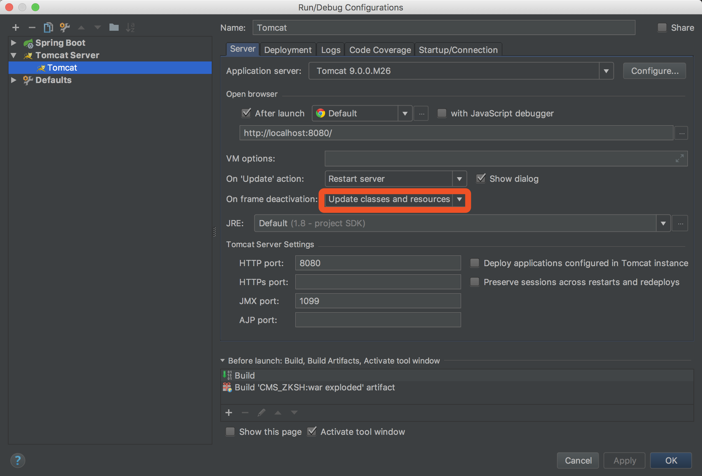

# 1.首先关闭springBoot默认开启的thymeleaf的缓存
在application.properties文件中添加：
``` yml
#关闭默认的thymleaf：
spring.thymeleaf.cache=false
```
这样,再用Update classes and resources方式更新就能更新静态文件了.
# 2.修改pom.xml,在dependency那里引入热部署devtools的maven引用
设置如下：
``` xml
<dependency>
            <groupId>org.springframework.boot</groupId>
            <artifactId>spring-boot-devtools</artifactId>
            <optional>true</optional>
            <scope>true</scope>
        </dependency>
　<plugin>
                <groupId>org.springframework.boot</groupId>
                <artifactId>spring-boot-maven-plugin</artifactId>
                <configuration>
                    <!--fork :  如果没有该项配置，肯定devtools不会起作用，即应用不会restart -->
                    <fork>true</fork>
                </configuration>
            </plugin>
```
# 3.在setting里面找到Build，Execution,Deployment->Compiler下将Build project ayutomaticaly开启
如下图所示；

# 4.Mac用户同时按下 shitf+option+command+/ ,windows用户的话,大概是 shift+ctrl+alt+/找到Registy，勾选compiler.automake.allow.when.app.running
如下图示：

# 5.接下来在application.properties中开启devtool：
``` yml
#设置热更新
spring.devtools.livereload.enabled=true
```
# 如果是使用的内置的tomcat启动的项目，所有的配置到此结束，若使用我们本地的 tomcat运行的项目，需要在进行最后一个配置
如下图所示：
