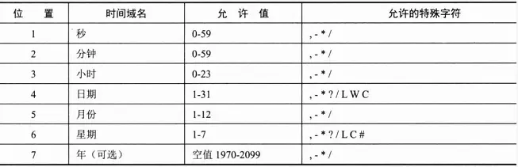

<!-- TOC -->

- [1.在启动类上添加注解@EnableScheduling，如下图所示：](#1%e5%9c%a8%e5%90%af%e5%8a%a8%e7%b1%bb%e4%b8%8a%e6%b7%bb%e5%8a%a0%e6%b3%a8%e8%a7%a3enablescheduling%e5%a6%82%e4%b8%8b%e5%9b%be%e6%89%80%e7%a4%ba)
- [2.创建配置类，添加注解@Scheduled](#2%e5%88%9b%e5%bb%ba%e9%85%8d%e7%bd%ae%e7%b1%bb%e6%b7%bb%e5%8a%a0%e6%b3%a8%e8%a7%a3scheduled)
  - [2.1 其中Schedule 三种任务调度器有：](#21-%e5%85%b6%e4%b8%adschedule-%e4%b8%89%e7%a7%8d%e4%bb%bb%e5%8a%a1%e8%b0%83%e5%ba%a6%e5%99%a8%e6%9c%89)
    - [2.1.1.fixedRate](#211fixedrate)
    - [2.1.2 fixedDelay](#212-fixeddelay)
    - [2.1.3 Cron表达式](#213-cron%e8%a1%a8%e8%be%be%e5%bc%8f)
- [3.配置 TaskScheduler 线程池](#3%e9%85%8d%e7%bd%ae-taskscheduler-%e7%ba%bf%e7%a8%8b%e6%b1%a0)

<!-- /TOC -->
# 1.在启动类上添加注解@EnableScheduling，如下图所示：

# 2.创建配置类，添加注解@Scheduled
## 2.1 其中Schedule 三种任务调度器有：
### 2.1.1.fixedRate
固定频率任务：   
该属性的含义是上一个调用开始后再次调用的延时（不用等待上一次调用完成），这样就可能会存在任务重复执行的问题，所以不是建议使用，但数据量如果不大时在配置的间隔时间内可以执行完也是可以使用的。
> 注意：当方法的执行时间超过任务调度频率时，调度器会在当前方法执行完成后立即执行下次任务。    

示例代码：
``` java
@Scheduled(fixedRate = 1000 * 10)
public void work() {
  // do your work here
  
}
```
fixedRate 的单位是毫秒，上例中 fixedRate = 1000 * 10 表示每 10 秒执行一次。     
设第一次执行开始时时间为 0，正常情况下第二次执行开始时间是第 10 秒，第三次是第 20 秒……以此类推。     
但假如任务在 10 秒内没有完成，比如第一次花了 15秒完成任务，那第二次执行时间也是 第15 秒，会马上执行。
### 2.1.2 fixedDelay
固定间隔任务：    
下一次的任务执行时间，是从方法最后一次任务执行结束时间开始计算。并以此规则开始周期性的执行任务。    
示例代码：
``` java
@Scheduled(fixedDelay = 1000 * 10)
public void work() {
  // do your work here
  
}
```
上例每隔10秒执行一次，设第一次执行开始时时间为 0，如果任务的执行时间是 5 秒，那下次任务的开始时间是 5 + 10 = 15 即第 15 秒。再下一次任务开始执行时间是 15 + 5 + 10 = 30 即第 30 秒，以此类推
### 2.1.3 Cron表达式
Cron表达式由6或7个空格分隔的时间字段组成，如下图：

* 第一位，表示秒，取值 0-59
* 第二位，表示分，取值 0-59
* 第三位，表示小时，取值 0-23
* 第四位，日期，取值 1-31
* 第五位，月份，取值 1-12
* 第六位，星期几，取值 1-7
* 第七位，年份，可以留空，取值 1970-2099

(*) 星号：可以理解为“每”的意思，每秒、没分
(?) 问号：只能出现在日期和星期这两个位置，表示这个位置的值不确定
(-) 表达一个范围，如在小时字段中使用 10-12 ，表示从10点到12点
(,) 逗号，表达一个列表值，如在星期字段中使用 1,2,4 ，则表示星期一、星期二、星期四
(/) 斜杠，如 x/y ，x是开始值，y是步长，如在第一位(秒)使用 0/15，表示从0秒开始，每15秒

官方解释：
0 0 3 * * ?         每天 3 点执行
0 5 3 * * ?         每天 3 点 5 分执行
0 5 3 ? * *         每天 3 点 5 分执行
0 5/10 3 * * ?      每天 3 点 5 分，15 分，25 分，35 分，45 分，55 分这几个点执行
0 10 3 ? * 1        每周星期天的 3 点10 分执行，注：1 表示星期天
0 10 3 ? * 1 #3      每个月的第三个星期的星期天 执行，#号只能出现在星期的位置

注：第六位(星期几)中的数字可能表达不太正确，可以使用英文缩写来表示，如：Sun    
注意，当方法的执行时间超过任务调度频率时，调度器会在下个周期执行。     
下面的例子，每 10 秒执行一次，但任务执行时间是 12 秒。
设第一次执行任务开始时间是 0，那第一次任务执行完应该是第 12 秒。第二次任务本应在第 10 秒开始执行，但由于第 10 秒时第一次任务还没执行完，所以第二次任务会把第 10 秒这个节点跳过，等到第 20 秒再执行第二次任务。
``` java
@Scheduled(cron = "0/10 * * * * *")
public void test() throws InterruptedException {
  log.info(Thread.currentThread().getName()+"---test");
  TimeUnit.SECONDS.sleep(12);
}

```
# 3.配置 TaskScheduler 线程池
Spring 会默认创建一个单线程池，如果系统中有多个定时任务要执行，任务调度器就会出现时间漂移，任务执行时间将不确定。    
所以我们自定义一个 TaskScheduler 线程池。
``` java
@Configuration
public class InitBeanConfig {

  /**
   * 配置 Schedule 的线程池.
   */
  @Bean
  public TaskScheduler taskScheduler() {
    ThreadPoolTaskScheduler taskScheduler = new ThreadPoolTaskScheduler();
    taskScheduler.setPoolSize(10);
    taskScheduler.setThreadNamePrefix("springboot-task");
    return taskScheduler;
  }
}
```
这样当需要同时执行多个任务，就会最多开启 10 个线程来处理。
本文参考掘金文章，不作商用，只为分享,原文[点击此处](https://juejin.im/post/5d5cf9fc518825415d061069)