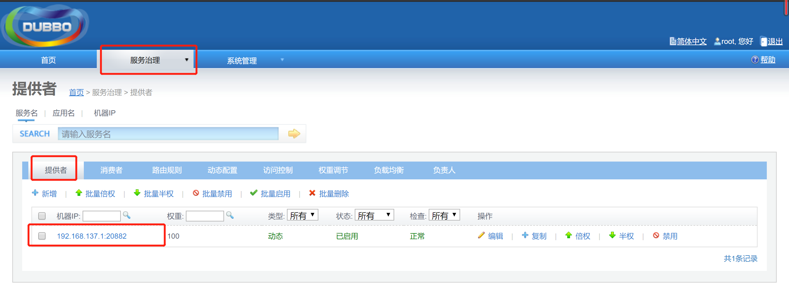

<!-- TOC -->

- [1.api 用来存放通用的实体类以及工具类](#1api-用来存放通用的实体类以及工具类)
  - [1.1.创建一个maven项目或者 创建一个springBoot项目作为api，下面写一个小demo进行展示](#11创建一个maven项目或者-创建一个springboot项目作为api下面写一个小demo进行展示)
  - [1.2新增实体类BaseResult在api中](#12新增实体类baseresult在api中)
  - [1.3 由于我们这个项目需要其他项目引用，所以去掉spring-boot-maven-plugin插件，具体原因点击此处](#13-由于我们这个项目需要其他项目引用所以去掉spring-boot-maven-plugin插件具体原因点击此处)
  - [1.4 打包项目](#14-打包项目)
- [2.provider 暴露服务的服务提供者](#2provider-暴露服务的服务提供者)
  - [2.1 引入maven依赖](#21-引入maven依赖)
  - [2.2 实体类UserAddress](#22-实体类useraddress)
  - [2.3 service](#23-service)
  - [2.4 service的实现类](#24-service的实现类)
  - [2.5 配置application.properties](#25-配置applicationproperties)
  - [2.6 在启动类上添加service的扫描](#26-在启动类上添加service的扫描)
  - [2.7 同样去掉插件spring-boot-maven-plugin](#27-同样去掉插件spring-boot-maven-plugin)
  - [2.8 在启动项目之前务必先打开zookeeper,在dubbo-admin上检验是否注册成功,不会dubbo-admin?点击此处查看](#28-在启动项目之前务必先打开zookeeper在dubbo-admin上检验是否注册成功不会dubbo-admin点击此处查看)
  - [2.9 打包项目](#29-打包项目)
- [3. consumer](#3-consumer)
  - [3.1 创建一个新的springBoot项目作为消费者，注意这次的项目要配置为springBoot的web项目，在创建时注意引用web模块](#31-创建一个新的springboot项目作为消费者注意这次的项目要配置为springboot的web项目在创建时注意引用web模块)
  - [3.2引入maven依赖](#32引入maven依赖)
  - [3.3 controller](#33-controller)
  - [3.4 配置application.properties](#34-配置applicationproperties)
- [注意 :](#注意-)

<!-- /TOC -->
# 1.api 用来存放通用的实体类以及工具类
## 1.1.创建一个maven项目或者 创建一个springBoot项目作为api，下面写一个小demo进行展示
## 1.2新增实体类BaseResult在api中
``` java
package com.dubbo.api.po;


import org.springframework.util.ObjectUtils;


public class BaseResult {
    private static final long serialVersionUID = 1L;
    private Integer code;
    private String msg;
    private Object data;
    private Long count;

    public BaseResult() {
    }

    public BaseResult(Integer code, String msg, Object data, Long count) {
        this.code = code;
        this.msg = msg;
        this.data = data;
        this.count = count;
    }

    public void markSuccess(String msg, Object data, Long count) {
        this.code = 200;
        this.msg = msg;
        this.data = data;
        this.count = count;
    }

    public void markSysError(String msg) {
        this.code = 500;
        this.msg = msg;
    }

    public void markWarning(String msg) {
        this.code = 0;
        this.msg = msg;
    }

    public boolean checkSuccess() {
        return ObjectUtils.isEmpty(this.getCode()) && 200 == this.getCode();
    }

    public boolean checkSuccessWData() {
        return this.checkSuccess() && ObjectUtils.isEmpty(this.getData());
    }

    public Integer getCode() {
        return this.code;
    }

    public void setCode(Integer code) {
        this.code = code;
    }

    public String getMsg() {
        return this.msg;
    }

    public void setMsg(String msg) {
        this.msg = msg;
    }

    public Object getData() {
        return this.data;
    }

    public void setData(Object data) {
        this.data = data;
    }

    public Long getCount() {
        return this.count;
    }

    public void setCount(Long count) {
        this.count = count;
    }

    public String toString() {
        return "BaseResult [code=" + this.code + ", msg=" + this.msg + ", data=" + this.data + ", count=" + this.count + "]";
    }

}
```

## 1.3 由于我们这个项目需要其他项目引用，所以去掉spring-boot-maven-plugin插件，具体原因[点击此处](https://blog.csdn.net/zhiyikeji/article/details/108635928)
## 1.4 打包项目
# 2.provider 暴露服务的服务提供者 
Dubbo原理:

Dubbo角色：

* Provider：暴露服务的服务提供者

* Container：服务运行的容器

* Consumer：调用远程服务的消费者

* Registry：服务注册和发现的注册中心

* Minitor：统计服务调用次数和时间的监控中心

调用过程：

下面根据我的理解说明一下

0：服务器容器负责启动、加载、运行服务提供者

1：服务提供者在启动后就可以向注册中心暴露服务

2：服务消费者在启动后就可以向注册中心订阅想要的服务

3：注册中心向服务消费者返回服务调用列表

4：服务消费者基于软负载均衡算法调用服务提供者的服务，这个服务提供者有可能是一个服务提供者列表，调用那个服务提供者就是根据负载均衡来调用了

5：服务提供者和服务消费者定时将保存在内存中的服务调用次数和服务调用时间推送给监控中心
大致情况了解之后，我们就继续写示例,继续创建一个全新的springBoot项目
## 2.1 引入maven依赖
``` xml
<properties>
        <java.version>11</java.version>
        <dubbo.version>2.7.5</dubbo.version>
        <curator.version>2.12.0</curator.version>
    </properties>
```
``` xml
  <!--dubbo-->
        <dependency>
            <groupId>org.apache.dubbo</groupId>
            <artifactId>dubbo-spring-boot-starter</artifactId>
            <version>${dubbo.version}</version>
        </dependency>


        <!-- Zookeeper dependencies -->
        <dependency>
            <groupId>org.apache.dubbo</groupId>
            <artifactId>dubbo-dependencies-zookeeper</artifactId>
            <version>${dubbo.version}</version>
            <type>pom</type>
            <exclusions>
                <exclusion>
                    <groupId>org.slf4j</groupId>
                    <artifactId>slf4j-log4j12</artifactId>
                </exclusion>
            </exclusions>
        </dependency>
        <dependency>
            <groupId>org.apache.curator</groupId>
            <artifactId>curator-framework</artifactId>
            <version>${curator.version}</version>
        </dependency>

        <!-- https://mvnrepository.com/artifact/org.apache.curator/curator-recipes -->
        <dependency>
            <groupId>org.apache.curator</groupId>
            <artifactId>curator-recipes</artifactId>
            <version>${curator.version}</version>
        </dependency>
        <!--引入通用包-->
        <dependency>
            <groupId>com.dubbo</groupId>
            <artifactId>api</artifactId>
            <version>0.0.1-SNAPSHOT</version>
        </dependency>
```
## 2.2 实体类UserAddress
``` java
package com.dubbo.provider.po;

import java.io.Serializable;

public class UserAddress implements Serializable {

    private Integer id;
    private String userAddress; //用户地址
    private String userId; //用户id
    private String consignee; //收货人
    private String phoneNum; //电话号码
    private String isDefault; //是否为默认地址    Y-是     N-否

    public UserAddress() {
        super();
    }

    public UserAddress(Integer id, String userAddress, String userId, String consignee, String phoneNum,
                       String isDefault) {
        super();
        this.id = id;
        this.userAddress = userAddress;
        this.userId = userId;
        this.consignee = consignee;
        this.phoneNum = phoneNum;
        this.isDefault = isDefault;
    }

    public Integer getId() {
        return id;
    }
    public void setId(Integer id) {
        this.id = id;
    }
    public String getUserAddress() {
        return userAddress;
    }
    public void setUserAddress(String userAddress) {
        this.userAddress = userAddress;
    }
    public String getUserId() {
        return userId;
    }
    public void setUserId(String userId) {
        this.userId = userId;
    }
    public String getConsignee() {
        return consignee;
    }
    public void setConsignee(String consignee) {
        this.consignee = consignee;
    }
    public String getPhoneNum() {
        return phoneNum;
    }
    public void setPhoneNum(String phoneNum) {
        this.phoneNum = phoneNum;
    }
    public String getIsDefault() {
        return isDefault;
    }
    public void setIsDefault(String isDefault) {
        this.isDefault = isDefault;
    }
}
```
## 2.3 service 
UserService
``` java
package com.dubbo.provider.service;

import com.dubbo.provider.po.UserAddress;

import java.util.List;

public interface UserService {
    /**
     * 按照用户id返回所有的收货地址
     * @param userId
     * @return
     */
    public List<UserAddress> getUserAddressList(String userId);

    public String getMsg();
}

```
OrderService
``` java
package com.dubbo.provider.service;


import com.dubbo.provider.po.UserAddress;

import java.util.List;

public interface OrderService {
    /**
     * 初始化订单
     * @param userId
     */
    public List<UserAddress> initOrder(String userId);
}

```
## 2.4 service的实现类
UserServiceImpl
``` java
package com.dubbo.provider.service.impl;
import com.dubbo.provider.po.UserAddress;
import com.dubbo.provider.service.UserService;
import org.apache.dubbo.config.annotation.Service;
import org.springframework.stereotype.Component;

import java.util.Arrays;
import java.util.List;


@Service//暴露服务
@Component
public class UserServiceImpl implements UserService {

    @Override
    public List<UserAddress> getUserAddressList(String userId) {
        UserAddress address1 = new UserAddress(1, "北京市昌平区", "1", "李老师", "010-56253825", "Y");
        UserAddress address2 = new UserAddress(2, "深圳市宝安区", "1", "王老师", "010-56253825", "N");
        return Arrays.asList(address1,address2);
    }

    @Override
    public String getMsg() {
        return "这是提供者推送的信息";
    }
}
```
OrderServiceImpl
``` java
package com.dubbo.provider.service.impl;

import com.dubbo.provider.po.UserAddress;
import com.dubbo.provider.service.OrderService;
import com.dubbo.provider.service.UserService;
import org.apache.dubbo.config.annotation.Reference;
import org.apache.dubbo.config.annotation.Service;
import org.springframework.beans.factory.annotation.Autowired;

import java.util.List;


@Service
public class OrderServiceImpl implements OrderService {
    @Autowired
    UserService userService;

    @Override
    public List<UserAddress> initOrder(String userId) {
        //1、查询用户的收货地址
        List<UserAddress> addressList = userService.getUserAddressList(userId);
        return addressList;
    }
}

```
注意@Service引用的是dubbo的
目录结构如下：

## 2.5 配置application.properties
``` yml

server.port=7010

dubbo.application.name=user-service-provider
dubbo.registry.address=127.0.0.1:2181
dubbo.registry.protocol=zookeeper

dubbo.protocol.name=dubbo
dubbo.protocol.port=20882

dubbo.monitor.protocol=registry
#dubbo.scan.base-packages=com.example.springboot.dubbo
```
## 2.6 在启动类上添加service的扫描
``` java
@EnableDubbo(scanBasePackages="com.dubbo.provider.service.impl")
```
``` java
package com.dubbo.provider;

import org.springframework.boot.SpringApplication;
import org.springframework.boot.autoconfigure.SpringBootApplication;
import org.apache.dubbo.config.spring.context.annotation.EnableDubbo;

@EnableDubbo(scanBasePackages="com.dubbo.provider.service.impl")
@SpringBootApplication
public class ProviderApplication {

    public static void main(String[] args) {
        SpringApplication.run(ProviderApplication.class, args);
    }

}
```
## 2.7 同样去掉插件spring-boot-maven-plugin
## 2.8 在启动项目之前务必先打开zookeeper,在dubbo-admin上检验是否注册成功,不会dubbo-admin?[点击此处查看](https://blog.csdn.net/zhiyikeji/article/details/108625143)
若dubbo-admin显示以下效果，说明注册成功

## 2.9 打包项目
# 3. consumer
## 3.1 创建一个新的springBoot项目作为消费者，注意这次的项目要配置为springBoot的web项目，在创建时注意引用web模块
## 3.2引入maven依赖
``` xml
    <properties>
        <java.version>11</java.version>
        <spring-boot.version>2.2.1.RELEASE</spring-boot.version>
        <dubbo.version>2.7.5</dubbo.version>
        <curator.version>2.12.0</curator.version>
    </properties>

```
``` xml
 <!--dubbo-->
        <dependency>
            <groupId>org.apache.dubbo</groupId>
            <artifactId>dubbo-spring-boot-starter</artifactId>
            <version>${dubbo.version}</version>
        </dependency>

        <dependency>
            <groupId>org.apache.dubbo</groupId>
            <artifactId>dubbo-dependencies-zookeeper</artifactId>
            <version>${dubbo.version}</version>
            <type>pom</type>
            <exclusions>
                <exclusion>
                    <groupId>org.slf4j</groupId>
                    <artifactId>slf4j-log4j12</artifactId>
                </exclusion>
            </exclusions>
        </dependency>
        <!-- https://mvnrepository.com/artifact/org.apache.curator/curator-framework -->
        <dependency>
            <groupId>org.apache.curator</groupId>
            <artifactId>curator-framework</artifactId>
            <version>${curator.version}</version>
        </dependency>

        <!-- https://mvnrepository.com/artifact/org.apache.curator/curator-recipes -->
        <dependency>
            <groupId>org.apache.curator</groupId>
            <artifactId>curator-recipes</artifactId>
            <version>${curator.version}</version>
        </dependency>
        <!--引入provider-->
        <dependency>
            <groupId>com.dubbo</groupId>
            <artifactId>provider</artifactId>
            <version>0.0.1-SNAPSHOT</version>
        </dependency>
```
## 3.3 controller
``` java
package com.dubbo.consumer.consumer.controller;

import com.dubbo.api.po.BaseResult;
import com.dubbo.provider.po.UserAddress;
import com.dubbo.provider.service.OrderService;
import com.dubbo.provider.service.UserService;
import org.apache.dubbo.config.annotation.Reference;
import org.springframework.beans.factory.annotation.Autowired;
import org.springframework.stereotype.Controller;
import org.springframework.web.bind.annotation.RequestMapping;
import org.springframework.web.bind.annotation.RequestMethod;
import org.springframework.web.bind.annotation.RequestParam;
import org.springframework.web.bind.annotation.ResponseBody;

import java.util.List;


@Controller
public class OrderController {

    @Reference
    OrderService orderService;
    @Reference
    UserService userService;

    @ResponseBody
    @RequestMapping(value = "/initOrder",method = RequestMethod.POST)
    public List<UserAddress> initOrder(@RequestParam("uid")String userId) {
        return orderService.initOrder(userId);
    }
    @ResponseBody
    @RequestMapping(value = "/getMsg",method = RequestMethod.POST)
    public BaseResult getMsg(@RequestParam("uid")String userId) {
        BaseResult baseResult=new BaseResult();
        String re=userService.getMsg();
        baseResult.markSuccess("获取成功",re,null);
        return baseResult;
    }
}
```
注意：我们引用服务者暴露的服务时只需将@Service改为@Reference即可
## 3.4 配置application.properties
``` yml
server.port=7000
dubbo.application.name=order-service-consumer
dubbo.registry.address=zookeeper://127.0.0.1:2181
dubbo.monitor.protocol=registry

```
在运行此项目之前务必却保zookeeper以及provider已经启动
同样也在dubbo-admin检验是否注册成功

# 注意 :
若遇到打包失败的问题，尝试下面的这种方法：
在pom文件中添加maven-surefire-plugin插件
``` xml
<!--添加配置跳过测试-->
            <plugin>
                <groupId>org.apache.maven.plugins</groupId>
                <artifactId>maven-surefire-plugin</artifactId>
                <version>2.22.1</version>
                <configuration>
                    <skipTests>true</skipTests>
                </configuration>
            </plugin>
```
至此一个简单的springBoot集成dubbo的项目至此结束