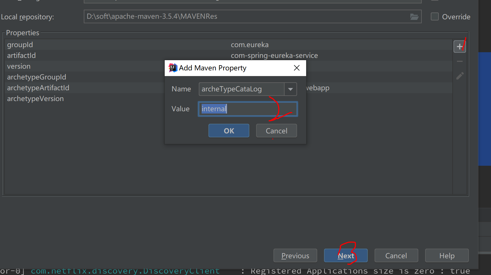
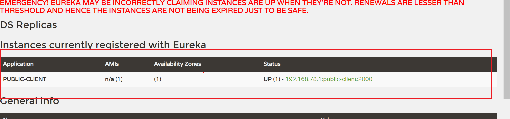

# 1.eureka用于做负载均衡以及微服务集群，所以依赖springCloud，故我们引入先在原有的springBoot基础上引入依赖
``` xml
 <dependencyManagement>
        <dependencies>
            <dependency>
                <groupId>org.springframework.cloud</groupId>
                <artifactId>spring-cloud-dependencies</artifactId>
                <version>${spring-cloud.version}</version>
                <type>pom</type>
                <scope>import</scope>
            </dependency>
        </dependencies>
    </dependencyManagement>
```
# 2.新建一个maven moudle作为service端




等待项目构建完成之后，右单击main文件，新建Directory java,并将其改为source root类型的文件夹


完成以上操作之后新建以下目录结构文件夹

其中IndexServerController内容如下：
``` java
package com.eureka.controller;

import org.springframework.stereotype.Controller;
import org.springframework.web.bind.annotation.RequestMapping;
import org.springframework.web.bind.annotation.ResponseBody;

import java.util.HashMap;
import java.util.Map;

@Controller
public class IndexServerController {
    @RequestMapping("index.do")
    @ResponseBody
    public Map<String,Object> indexClient(){
        Map<String,Object> map=new HashMap<>();
        map.put("测试","com-spring-eureka-service");
        return map;
    }
}

```
ApplicationService文件内容如下：
``` java
package com.eureka;

import org.springframework.boot.SpringApplication;
import org.springframework.boot.autoconfigure.SpringBootApplication;
import org.springframework.cloud.netflix.eureka.server.EnableEurekaServer;

@SpringBootApplication
@EnableEurekaServer
public class ApplicationService {
    public static void main(String[] args){
        SpringApplication.run(ApplicationService.class,args);
    }
}

```
接下来配置yml文件

Application.yml文件内容如下：
```yml
server:
  port: 1000

eureka:
  instance:
    hostname: localhost
  client:
    registerWithEureka: false
    fetchRegistry: false
    serviceUrl:
      defaultZone: http://${eureka.instance.hostname}:${server.port}/eureka/

```
最后pom文件的内容如下
``` xml
<?xml version="1.0" encoding="UTF-8"?>
<project xmlns="http://maven.apache.org/POM/4.0.0" xmlns:xsi="http://www.w3.org/2001/XMLSchema-instance"
         xsi:schemaLocation="http://maven.apache.org/POM/4.0.0 http://maven.apache.org/maven-v4_0_0.xsd">
    <parent>
        <artifactId>demo</artifactId>
        <groupId>com.eureka</groupId>
        <version>0.0.1-SNAPSHOT</version>
    </parent>

    <modelVersion>4.0.0</modelVersion>
    <packaging>war</packaging>

    <name>com-spring-eureka-service</name>
    <artifactId>com-spring-eureka-service</artifactId>

    <build>
        <plugins>
            <plugin>
                <groupId>org.mortbay.jetty</groupId>
                <artifactId>maven-jetty-plugin</artifactId>
                <version>6.1.7</version>
                <configuration>
                    <connectors>
                        <connector implementation="org.mortbay.jetty.nio.SelectChannelConnector">
                            <port>8888</port>
                            <maxIdleTime>30000</maxIdleTime>
                        </connector>
                    </connectors>
                    <webAppSourceDirectory>${project.build.directory}/${pom.artifactId}-${pom.version}
                    </webAppSourceDirectory>
                    <contextPath>/</contextPath>
                </configuration>
            </plugin>
        </plugins>
    </build>

    <dependencyManagement>
        <dependencies>
            <dependency>
                <groupId>org.springframework.cloud</groupId>
                <artifactId>spring-cloud-dependencies</artifactId>
                <version>{spring-cloud-version}</version>
                <type>pom</type>
                <scope>import</scope>
            </dependency>
        </dependencies>
    </dependencyManagement>
    <dependencies>

        <dependency>
            <groupId>org.springframework.boot</groupId>
            <artifactId>spring-boot-starter-web</artifactId>
        </dependency>

        <dependency>
            <groupId>org.springframework.boot</groupId>
            <artifactId>spring-boot-starter-test</artifactId>
            <scope>test</scope>
            <exclusions>
                <exclusion>
                    <groupId>org.junit.vintage</groupId>
                    <artifactId>junit-vintage-engine</artifactId>
                </exclusion>
            </exclusions>
        </dependency>
        <!-- https://mvnrepository.com/artifact/org.springframework.cloud/spring-cloud-starter-netflix-eureka-server -->
        <dependency>
            <groupId>org.springframework.cloud</groupId>
            <artifactId>spring-cloud-starter-netflix-eureka-server</artifactId>
            <version>2.2.1.RELEASE</version>
        </dependency>
    </dependencies>

</project>

```
# 3.使用和步骤2同样的方法新建一个moudle 作为client端，其目录结构如下：

其中ClientConfig：
``` java

package com.eureka.config;

import org.springframework.context.annotation.Bean;
import org.springframework.context.annotation.Configuration;
import org.springframework.web.client.RestTemplate;

@Configuration
public class ClientConfig {
    @Bean
    public RestTemplate restTemplate(){
        RestTemplate restTemplate=new RestTemplate();
        return restTemplate;
    }
}

```
ClientController:
``` java
package com.eureka.controller;

import org.springframework.beans.factory.annotation.Autowired;
import org.springframework.http.ResponseEntity;
import org.springframework.stereotype.Controller;
import org.springframework.web.bind.annotation.RequestMapping;
import org.springframework.web.bind.annotation.ResponseBody;
import org.springframework.web.client.RestTemplate;

@Controller
public class ClientController {
    @Autowired
    RestTemplate restTemplate;
    @RequestMapping("index.do")
    @ResponseBody
    public  String indexClient(){
        ResponseEntity<String> responseEntity=restTemplate.getForEntity("http://localhost:1000/index.do",String.class);
        return responseEntity.getBody();
    }
}

```
ApplicationClient:
``` java
package com.eureka;

import org.springframework.boot.SpringApplication;
import org.springframework.boot.autoconfigure.SpringBootApplication;
import org.springframework.cloud.netflix.eureka.EnableEurekaClient;

@SpringBootApplication
@EnableEurekaClient
public class ApplicationClient {
    public static void main(String[] args){
        SpringApplication.run(ApplicationClient.class,args);
    }
}

```
application.yml文件：
``` yml
#配置 Eureka Client
eureka:
  client:
    serviceUrl:
      defaultZone: http://localhost:1000/eureka
  instance:
    preferIpAddress: true
server:
  port: 2000  #服务端口号
spring:
  application:
    name: public-client #服务名称--调用的时候根据名称来调用该服务的方法
```

pom文件：
``` xml
<?xml version="1.0" encoding="UTF-8"?>
<project xmlns="http://maven.apache.org/POM/4.0.0" xmlns:xsi="http://www.w3.org/2001/XMLSchema-instance"
         xsi:schemaLocation="http://maven.apache.org/POM/4.0.0 http://maven.apache.org/maven-v4_0_0.xsd">
    <parent>
        <artifactId>demo</artifactId>
        <groupId>com.eureka</groupId>
        <version>0.0.1-SNAPSHOT</version>
    </parent>

    <modelVersion>4.0.0</modelVersion>
    <packaging>war</packaging>

    <name>com-spring-eureka-client</name>
    <artifactId>com-spring-eureka-client</artifactId>

    <build>
        <plugins>
            <plugin>
                <groupId>org.mortbay.jetty</groupId>
                <artifactId>maven-jetty-plugin</artifactId>
                <version>6.1.7</version>
                <configuration>
                    <connectors>
                        <connector implementation="org.mortbay.jetty.nio.SelectChannelConnector">
                            <port>8888</port>
                            <maxIdleTime>30000</maxIdleTime>
                        </connector>
                    </connectors>
                    <webAppSourceDirectory>${project.build.directory}/${pom.artifactId}-${pom.version}
                    </webAppSourceDirectory>
                    <contextPath>/</contextPath>
                </configuration>
            </plugin>
        </plugins>
    </build>

    <dependencyManagement>
        <dependencies>
            <dependency>
                <groupId>org.springframework.cloud</groupId>
                <artifactId>spring-cloud-dependencies</artifactId>
                <version>{spring-cloud-version}</version>
                <type>pom</type>
                <scope>import</scope>
            </dependency>
        </dependencies>
    </dependencyManagement>
    <dependencies>

        <dependency>
            <groupId>org.springframework.boot</groupId>
            <artifactId>spring-boot-starter-web</artifactId>
        </dependency>

        <dependency>
            <groupId>org.springframework.boot</groupId>
            <artifactId>spring-boot-starter-test</artifactId>
            <scope>test</scope>
            <exclusions>
                <exclusion>
                    <groupId>org.junit.vintage</groupId>
                    <artifactId>junit-vintage-engine</artifactId>
                </exclusion>
            </exclusions>
        </dependency>
        <!-- https://mvnrepository.com/artifact/org.springframework.cloud/spring-cloud-starter-netflix-eureka-server -->
        <dependency>
            <groupId>org.springframework.cloud</groupId>
            <artifactId>spring-cloud-starter-netflix-eureka-server</artifactId>
            <version>2.2.1.RELEASE</version>
        </dependency>
    </dependencies>
</project>

```
# 4.先运行service端，启动之后再浏览器输入 http://localhost:1000/，若出现以下界面说明eureka启动成功

# 5.在启动client端，启动之后，在浏览器刷新刚刚打开的界面若出现

说明整个项目eureka的配置成功，否则视为失败
# ！！！切记pom文件中关于eureka以及springCLoud的版本不要乱改，否则会出现eureka注册失败或者项目启动失败等情况，具体原因可以看spring cloud官方文档