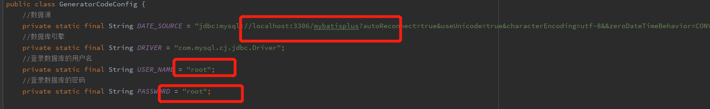
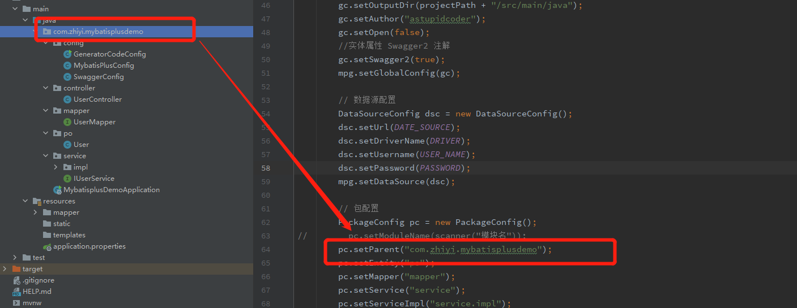
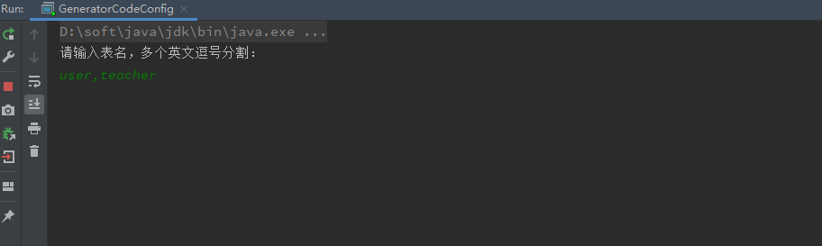
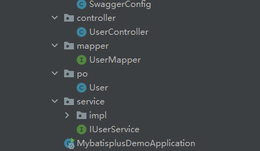
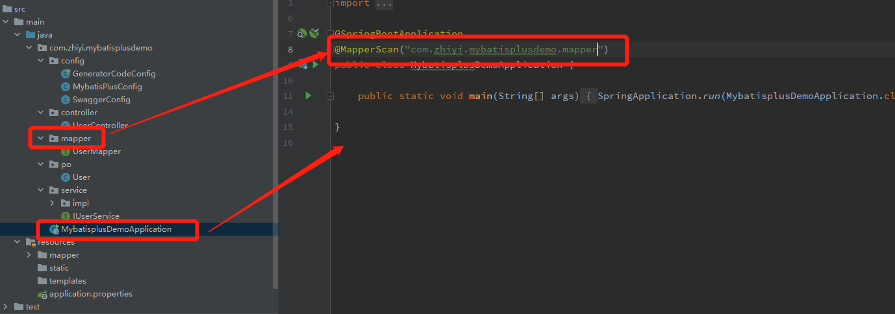

<!-- TOC -->

- [1.添加驱动依赖](#1添加驱动依赖)
  - [1.1 mysql](#11-mysql)
  - [1.2 sqlServer](#12-sqlserver)
- [2.添加mybatis plus依赖](#2添加mybatis-plus依赖)
- [3.添加相应的配置](#3添加相应的配置)
- [4.配置分页插件](#4配置分页插件)
- [5.添加自动生成代码的功能](#5添加自动生成代码的功能)
- [6.主运行程序上添加注解@MapperScan](#6主运行程序上添加注解mapperscan)
- [7.集成后的常见错误](#7集成后的常见错误)
  - [7.1 SpringCloud集成 报错 An attempt was made to call a method that does not exist. The attempt was made](#71-springcloud集成-报错-an-attempt-was-made-to-call-a-method-that-does-not-exist-the-attempt-was-made)
  - [7.2 net.sf.jsqlparser.statement.select.PlainSelect.getGroupByColumnReferences()Ljava/util/List](#72-netsfjsqlparserstatementselectplainselectgetgroupbycolumnreferencesljavautillist)

<!-- /TOC -->
# 1.添加驱动依赖
## 1.1 mysql
``` xml
  <dependency>
            <groupId>mysql</groupId>
            <artifactId>mysql-connector-java</artifactId>
             <version>8.0.13</version>
        </dependency>
```
## 1.2 sqlServer
``` xml
<dependency>
    <groupId>com.microsoft.sqlserver</groupId>
    <artifactId>sqljdbc4</artifactId>
    <version>4.0</version>
</dependency>
<!-- https://mvnrepository.com/artifact/com.microsoft.sqlserver/mssql-jdbc -->
<dependency>
    <groupId>com.microsoft.sqlserver</groupId>
    <artifactId>mssql-jdbc</artifactId>
    <version>8.2.0.jre8</version>
    <scope>test</scope>
</dependency>
```
# 2.添加mybatis plus依赖
``` xml
<!-- mybatis plus 代码生成器 -->
        <!-- https://mvnrepository.com/artifact/com.baomidou/mybatis-plus -->
        <dependency>
            <groupId>com.baomidou</groupId>
            <artifactId>mybatis-plus</artifactId>
            <version>3.4.1</version>
        </dependency>

        <dependency>
            <groupId>com.baomidou</groupId>
            <artifactId>mybatis-plus-boot-starter</artifactId>
            <version>3.4.2</version>
        </dependency>
        <dependency>
            <groupId>com.baomidou</groupId>
            <artifactId>mybatis-plus-generator</artifactId>
            <version>3.4.1</version>
        </dependency>
        <dependency>
            <groupId>org.freemarker</groupId>
            <artifactId>freemarker</artifactId>
            <version>2.3.30</version>
        </dependency>
        <dependency>
            <groupId>com.alibaba</groupId>
            <artifactId>fastjson</artifactId>
            <version>1.2.75</version>
        </dependency>
```
# 3.添加相应的配置
``` yml
#数据源配置
spring.datasource.url=jdbc:mysql://localhost:3306/mybatisplus?autoReconnect=true&useUnicode=true&characterEncoding=utf-8&&zeroDateTimeBehavior=CONVERT_TO_NULL&&serverTimezone=GMT%2B8
spring.datasource.username=root
spring.datasource.password=root
spring.datasource.driver-class-name=com.mysql.cj.jdbc.Driver
##日志级别
logging.level.com.dalaoyang.dao.UserMapper=debug
# 映射xml文件
mybatis-plus.mapper-locations=classpath*:mapper/*Mapper.xml
# 起别名
mybatis-plus.type-aliases-package=com.zhiyi.mybatisplusdemo.po
# 驼峰命名匹配
mybatis-plus.configuration.map-underscore-to-camel-case=true
# 设置在控制台打印sql语句
mybatis-plus.configuration.log-impl=org.apache.ibatis.logging.stdout.StdOutImpl
```
# 4.配置分页插件
``` java
import com.baomidou.mybatisplus.extension.plugins.PaginationInterceptor;
import org.springframework.context.annotation.Bean;
import org.springframework.context.annotation.Configuration;

/**
 * 配置分页插件
 */
@Configuration
public class MybatisPlusConfig {

    /**
     * 分页插件
     */
    @Bean
    public PaginationInterceptor paginationInterceptor() {
        return new PaginationInterceptor();
    }
}
```
# 5.添加自动生成代码的功能
在添加此项功能之前我们需要添加swagger配置，[点击此处查看springBoot集成swagger](https://blog.csdn.net/zhiyikeji/article/details/116226223)
``` java
import com.baomidou.mybatisplus.core.exceptions.MybatisPlusException;
import com.baomidou.mybatisplus.core.toolkit.StringUtils;
import com.baomidou.mybatisplus.generator.AutoGenerator;
import com.baomidou.mybatisplus.generator.config.*;
import com.baomidou.mybatisplus.generator.config.rules.NamingStrategy;
import com.baomidou.mybatisplus.generator.engine.FreemarkerTemplateEngine;

import java.util.Scanner;

/**
 * 自动生成mybatisplus的相关代码
 */
public class GeneratorCodeConfig {
    //数据源
    private static final String DATE_SOURCE = "jdbc:mysql://localhost:3306/mybatisplus?autoReconnect=true&useUnicode=true&characterEncoding=utf-8&&zeroDateTimeBehavior=CONVERT_TO_NULL&&serverTimezone=GMT%2B8";
    //数据库引擎
    private static final String DRIVER = "com.mysql.cj.jdbc.Driver";
    //登录数据库的用户名
    private static final String USER_NAME = "root";
    //登录数据库的密码
    private static final String PASSWORD = "root";

    public static String scanner(String tip) {
        Scanner scanner = new Scanner(System.in);
        StringBuilder help = new StringBuilder();
        help.append("请输入" + tip + "：");
        System.out.println(help.toString());
        if (scanner.hasNext()) {
            String ipt = scanner.next();
            if (StringUtils.isNotBlank(ipt)) {
                return ipt;
            }
        }
        throw new MybatisPlusException("请输入正确的" + tip + "！");
    }

    public static void main(String[] args) {
        // 代码生成器
        AutoGenerator mpg = new AutoGenerator();

        // 全局配置
        GlobalConfig gc = new GlobalConfig();
        String projectPath = System.getProperty("user.dir");
        gc.setOutputDir(projectPath + "/src/main/java");
        gc.setAuthor("astupidcoder");
        gc.setOpen(false);
        //实体属性 Swagger2 注解
        gc.setSwagger2(true);
        mpg.setGlobalConfig(gc);

        // 数据源配置
        DataSourceConfig dsc = new DataSourceConfig();
        dsc.setUrl(DATE_SOURCE);
        dsc.setDriverName(DRIVER);
        dsc.setUsername(USER_NAME);
        dsc.setPassword(PASSWORD);
        mpg.setDataSource(dsc);

        // 包配置
        PackageConfig pc = new PackageConfig();
//        pc.setModuleName(scanner("模块名"));
        pc.setParent("com.zhiyi.mybatisplusdemo");
        pc.setEntity("po");
        pc.setMapper("mapper");
        pc.setService("service");
        pc.setServiceImpl("service.impl");
        mpg.setPackageInfo(pc);

        // 自定义配置
//        InjectionConfig cfg = new InjectionConfig() {
//            @Override
//            public void initMap() {
//                // to do nothing
//            }
//        };

        // 如果模板引擎是 freemarker
//        String templatePath = "/templates/mapper.xml.ftl";
        // 如果模板引擎是 velocity
        // String templatePath = "/templates/mapper.xml.vm";

        // 自定义输出配置
//        List<FileOutConfig> focList = new ArrayList<>();
        // 自定义配置会被优先输出
//        focList.add(new FileOutConfig(templatePath) {
//            @Override
//            public String outputFile(TableInfo tableInfo) {
//                // 自定义输出文件名 ， 如果你 Entity 设置了前后缀、此处注意 xml 的名称会跟着发生变化！！
//                return projectPath + "/src/main/resources/mapper/" + pc.getModuleName()
//                        + "/" + tableInfo.getEntityName() + "Mapper" + StringPool.DOT_XML;
//            }
//        });
        /*
        cfg.setFileCreate(new IFileCreate() {
            @Override
            public boolean isCreate(ConfigBuilder configBuilder, FileType fileType, String filePath) {
                // 判断自定义文件夹是否需要创建
                checkDir("调用默认方法创建的目录");
                return false;
            }
        });
        */
//        cfg.setFileOutConfigList(focList);
//        mpg.setCfg(cfg);

        // 配置模板
        TemplateConfig templateConfig = new TemplateConfig();

        // 配置自定义输出模板
        //指定自定义模板路径，注意不要带上.ftl/.vm, 会根据使用的模板引擎自动识别
        // templateConfig.setEntity("templates/entity2.java");
        // templateConfig.setService();
        // templateConfig.setController();

        templateConfig.setXml(null);
        mpg.setTemplate(templateConfig);

        // 策略配置
        StrategyConfig strategy = new StrategyConfig();
        strategy.setNaming(NamingStrategy.underline_to_camel);
        strategy.setColumnNaming(NamingStrategy.underline_to_camel);
        strategy.setSuperEntityClass("com.baomidou.mybatisplus.extension.activerecord.Model");
        strategy.setEntityLombokModel(true);
        strategy.setRestControllerStyle(true);

        strategy.setEntityLombokModel(true);
        // 公共父类
//        strategy.setSuperControllerClass("com.baomidou.ant.common.BaseController");
        // 写于父类中的公共字段
//        strategy.setSuperEntityColumns("id");
        strategy.setInclude(scanner("表名，多个英文逗号分割").split(","));
        strategy.setControllerMappingHyphenStyle(true);
        strategy.setTablePrefix(pc.getModuleName() + "_");
        mpg.setStrategy(strategy);
        mpg.setTemplateEngine(new FreemarkerTemplateEngine());
        mpg.execute();
    }
}
```
此处有些代码需要更改


运行这个文件，输入我们需要生成的表名

运行结束之后会生成一下目录结构

若出现HOST is not allowed to connect to this mysql server这种错误参考[此文章第六章](https://blog.csdn.net/zhiyikeji/article/details/104230406?ops_request_misc=%257B%2522request%255Fid%2522%253A%2522161965963816780357277689%2522%252C%2522scm%2522%253A%252220140713.130102334.pc%255Fblog.%2522%257D&request_id=161965963816780357277689&biz_id=0&utm_medium=distribute.pc_search_result.none-task-blog-2~blog~first_rank_v2~rank_v29-3-104230406.nonecase&utm_term=mybatis)
# 6.主运行程序上添加注解@MapperScan

至此配置全部结束
# 7.集成后的常见错误
## 7.1 SpringCloud集成 报错 An attempt was made to call a method that does not exist. The attempt was made
原因：与pageHelper插件冲突
解决办法：将pageHelper插件中的mybatis排除掉
``` xml
 <dependency>
            <groupId>com.github.pagehelper</groupId>
            <artifactId>pagehelper-spring-boot-starter</artifactId>
            <version>1.2.10</version>
            <exclusions>
                <exclusion>
                    <groupId>org.mybatis</groupId>
                    <artifactId>mybatis</artifactId>
                </exclusion>
            </exclusions>
        </dependency>
```
## 7.2 net.sf.jsqlparser.statement.select.PlainSelect.getGroupByColumnReferences()Ljava/util/List
原因：jar包版本不对
解决办法：添加jsqlparser依赖如果有此依赖请降低版本
``` xml
<dependency>
            <groupId>com.github.jsqlparser</groupId>
            <artifactId>jsqlparser</artifactId>
            <version>1.4</version>
        </dependency>
```