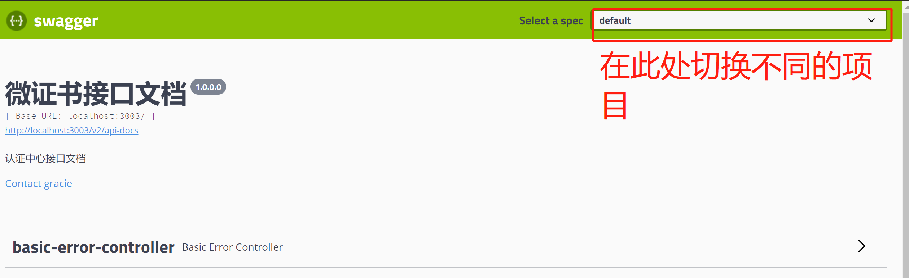
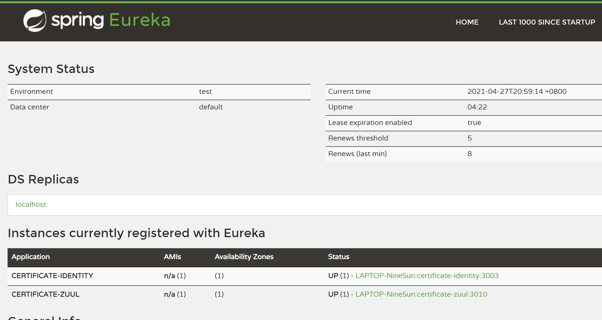

<!-- TOC -->

- [1.springBoot集成swagger](#1springboot集成swagger)
  - [1.引入依赖](#1引入依赖)
  - [2.添加SwaggerConfig](#2添加swaggerconfig)
  - [3.在controller层添加注解](#3在controller层添加注解)

<!-- /TOC -->
# 1.springBoot集成swagger
## 1.引入依赖
``` xml 
 <!--        集成swaggerui -->
        <!-- https://mvnrepository.com/artifact/io.springfox/springfox-swagger2 -->
        <dependency>
            <groupId>io.springfox</groupId>
            <artifactId>springfox-swagger2</artifactId>
            <version>2.9.2</version>
        </dependency>
        <!-- https://mvnrepository.com/artifact/io.springfox/springfox-swagger-ui -->
        <dependency>
            <groupId>io.springfox</groupId>
            <artifactId>springfox-swagger-ui</artifactId>
            <version>2.9.2</version>
        </dependency>
```
* springfox-swagger2是用于生成接口文档的，必须要依赖
* springfox-swagger-ui负责提供ui查询界面
## 2.添加SwaggerConfig
``` java
import io.swagger.annotations.Api;
import io.swagger.annotations.ApiOperation;
import org.springframework.context.annotation.Bean;
import org.springframework.context.annotation.Configuration;
import springfox.documentation.builders.ApiInfoBuilder;
import springfox.documentation.builders.PathSelectors;
import springfox.documentation.builders.RequestHandlerSelectors;
import springfox.documentation.service.*;
import springfox.documentation.spi.DocumentationType;
import springfox.documentation.spring.web.plugins.Docket;
import springfox.documentation.swagger2.annotations.EnableSwagger2;
import springfox.documentation.service.ApiInfo;
import springfox.documentation.service.Contact;

@Configuration //在springboot中加载配置文件
@EnableSwagger2 //加载swagger
public class SwaggerConfig {

    @Bean
    public Docket api() {
          //添加head参数配置start---用于设置请求头
        ParameterBuilder tokenPar = new ParameterBuilder();
        List<Parameter> pars = new ArrayList<>();
        tokenPar.name(ContenConfig.TOKEN_SIGN).description("token令牌").modelRef(new ModelRef("string")).parameterType("header").required(false).build();
        pars.add(tokenPar.build());
        //添加head参数配置end
        return new Docket(DocumentationType.SWAGGER_2)
                .apiInfo(apiInfo()) // 调用apiInfo方法
                .pathMapping("/") //配置访问路径
                .select()
                .paths(PathSelectors.regex("/.*")) //匹配路径下的方法
                .build()
                .globalOperationParameters(pars);//注意这里是将请求头加入到配置中;

    }

    private ApiInfo apiInfo() {
        return new ApiInfoBuilder().title("")
                .contact(new Contact("xxx", "", "xxxxxxxxxx@qq.com"))
                .title("xxxx接口文档")
                .description("xxxx接口文档")
                .version("1.0.0.0")
                .build();

    }

}
```
## 3.在controller层添加注解
``` java
@Api(tags = "登录")
@Controller
public class LoginController {
    /**
     * 用于app端的登录
     *
     * @param tbUser
     * @param response
     * @param request
     * @return
     */
    @ApiOperation("app端的登录实现")
//    @ApiImplicitParam(name = "tbUser", value = "传递数据为json对象", dataType = "com.certificate.api.Po.TbUser")
    @ResponseBody
    @RequestMapping(value = "/app/login", method = RequestMethod.POST)
    public String appLogin(@RequestBody TbUser tbUser,
                               HttpServletResponse response, HttpServletRequest request) {
               
        return "swagger测试";
    }
}

```
接下来访问
```
http://localhost:3003/swagger-ui.html
```

