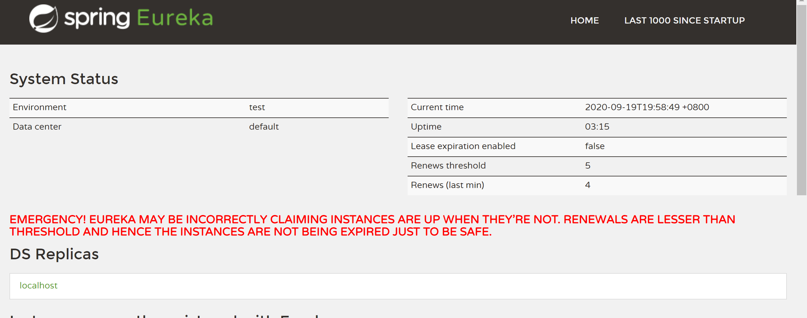

<!-- TOC -->

- [1.api](#1api)
  - [1 po层](#1-po层)
  - [2.service层](#2service层)
- [2.Eureka注册中心](#2eureka注册中心)
  - [1.maven依赖](#1maven依赖)
  - [2.配置properties](#2配置properties)
  - [3.在主程序类上添加@EnableEurekaServer注解启用注册中心功能](#3在主程序类上添加enableeurekaserver注解启用注册中心功能)
  - [4.启动项目后访问http://localhost:8080/查看服务启动情况](#4启动项目后访问httplocalhost8080查看服务启动情况)
- [3.provider](#3provider)
  - [1.添加maven依赖](#1添加maven依赖)
  - [2.配置properties](#2配置properties-1)
  - [3.service的实现类](#3service的实现类)
  - [4.controller](#4controller)
  - [5.在主程序类上添加@EnableEurekaClient注解启动Eureka客户端功能，并启动项目](#5在主程序类上添加enableeurekaclient注解启动eureka客户端功能并启动项目)
  - [6.启动项目，查看Eureka注册中心是否注册成功](#6启动项目查看eureka注册中心是否注册成功)
- [4.consumer](#4consumer)
  - [1.添加maven依赖](#1添加maven依赖-1)
  - [2.配置eureka的相关信息](#2配置eureka的相关信息)
  - [3.在主程序上添加@EnableDiscoveryClient注解，开启发现服务功能，并在容器中添加RestTemplate。](#3在主程序上添加enablediscoveryclient注解开启发现服务功能并在容器中添加resttemplate)
  - [4.controller](#4controller-1)
  - [5.打开postMan测试](#5打开postman测试)

<!-- /TOC -->
# 1.api
我们首先创建一个springBoot项目用于用于存放一些公共服务接口及公共的Bean等
项目结构如下：

接下来我们先把通用服务以及实体类写好
## 1 po层
User
``` java
public class User {
    private Integer id;
    private String userName;
    private String passWord;
    private Integer enabled;
    public User(){}
    public User(Integer id, String userName){
        this.id=id;
        this.userName=userName;
    }
    public Integer getId() {
        return id;
    }

    public void setId(Integer id) {
        this.id = id;
    }

    public String getUserName() {
        return userName;
    }

    public void setUserName(String userName) {
        this.userName = userName;
    }

    public String getPassWord() {
        return passWord;
    }

    public void setPassWord(String passWord) {
        this.passWord = passWord;
    }

    public Integer getEnabled() {
        return enabled;
    }

    public void setEnabled(Integer enabled) {
        this.enabled = enabled;
    }
}
```
BaseResult
``` java
package com.cloud.api.po;

import com.fasterxml.jackson.annotation.JsonInclude;
import org.springframework.util.ObjectUtils;

@JsonInclude(JsonInclude.Include.NON_NULL)
public class BaseResult {
    private static final long serialVersionUID = 1L;
    private Integer code;
    private String msg;
    private Object data;
    private Long count;

    public BaseResult() {
    }

    public BaseResult(Integer code, String msg, Object data, Long count) {
        this.code = code;
        this.msg = msg;
        this.data = data;
        this.count = count;
    }

    public void markSuccess(String msg, Object data, Long count) {
        this.code = 200;
        this.msg = msg;
        this.data = data;
        this.count = count;
    }

    public void markSysError(String msg) {
        this.code = 500;
        this.msg = msg;
    }

    public void markWarning(String msg) {
        this.code = 0;
        this.msg = msg;
    }

    public boolean checkSuccess() {
        return ObjectUtils.isEmpty(this.getCode()) && 200 == this.getCode();
    }

    public boolean checkSuccessWData() {
        return this.checkSuccess() && ObjectUtils.isEmpty(this.getData());
    }

    public Integer getCode() {
        return this.code;
    }

    public void setCode(Integer code) {
        this.code = code;
    }

    public String getMsg() {
        return this.msg;
    }

    public void setMsg(String msg) {
        this.msg = msg;
    }

    public Object getData() {
        return this.data;
    }

    public void setData(Object data) {
        this.data = data;
    }

    public Long getCount() {
        return this.count;
    }

    public void setCount(Long count) {
        this.count = count;
    }

    public String toString() {
        return "BaseResult [code=" + this.code + ", msg=" + this.msg + ", data=" + this.data + ", count=" + this.count + "]";
    }
}
```
## 2.service层
UserService
``` java
package com.cloud.api.provider.service;
import com.cloud.api.provider.po.User;
public interface UserService {
    public User getUser(Integer userId,String userName);
}
```
注意：在打包之前去掉spring-boot-maven-plugin插件，[点击此处查看原因](https://blog.csdn.net/zhiyikeji/article/details/108635928)
# 2.Eureka注册中心
新建一个SpringBoot web项目用于Eureka注册中心
## 1.maven依赖
``` java
 <!--引入springCloud   -->
        <!-- https://mvnrepository.com/artifact/org.springframework.cloud/spring-cloud-starter-netflix-eureka-server -->
        <dependency>
            <groupId>org.springframework.cloud</groupId>
            <artifactId>spring-cloud-starter-netflix-eureka-server</artifactId>
            <version>2.2.1.RELEASE</version>
        </dependency>
 <!--引入api-->
        <dependency>
            <groupId>com.cloud</groupId>
            <artifactId>api</artifactId>
            <version>0.0.1-SNAPSHOT</version>
        </dependency>
```
## 2.配置properties
``` yml
server.port=8080
#eureka.instance.hostname Eureka服务端实例名称
eureka.instance.hostname=eureka-server
#eureka.client.register-with-eureka 是否向注册中心注册自己
eureka.client.register-with-eureka=false
#eureka.client.fetch-registry   是否从Eureka上获取服务的注册信息,自己就是注册中心，本身职责就是维护服务实例，并不需要去检索服务
eureka.client.fetch-registry=false
#eureka.client.service-url.defaultZone  设置与Eureka Server交互的地址(查询服务、注册服务等)
eureka.client.service-url.defaultZone=http://localhost:${server.port}/eureka/
```
## 3.在主程序类上添加@EnableEurekaServer注解启用注册中心功能
```java
package com.cloud.eureka;

import com.cloud.api.po.BaseBean;
import org.springframework.boot.SpringApplication;
import org.springframework.boot.autoconfigure.SpringBootApplication;
import org.springframework.cloud.netflix.eureka.server.EnableEurekaServer;

@SpringBootApplication
@EnableEurekaServer //启用Eureka注册中心功能
public class EurekaApplication {

    public static void main(String[] args) {
        SpringApplication.run(EurekaApplication.class, args);
    }

}
```
## 4.启动项目后访问http://localhost:8080/查看服务启动情况

# 3.provider
新建SpringBoot web项目用于服务提供者
## 1.添加maven依赖
``` xml
  <!--引入springCloud-->
        <!-- https://mvnrepository.com/artifact/org.springframework.cloud/spring-cloud-starter-netflix-eureka-client -->
        <dependency>
            <groupId>org.springframework.cloud</groupId>
            <artifactId>spring-cloud-starter-netflix-eureka-client</artifactId>
            <version>2.2.5.RELEASE</version>
        </dependency>
        <!--引入api-->
        <dependency>
            <groupId>com.cloud</groupId>
            <artifactId>api</artifactId>
            <version>0.0.1-SNAPSHOT</version>
        </dependency>
```
## 2.配置properties
``` yml
server.port=8081
spring.application.name=user-provider
#eureka.instance.prefer-ip-address  注册服务的时候使用服务的ip地址
eureka.instance.prefer-ip-address=true
eureka.client.service-url.defaultZone=http://localhost:8080/eureka/
```
## 3.service的实现类 
UserServiceImpl
``` java
package com.cloud.provider.serviceImpl;

import com.cloud.api.provider.po.User;
import com.cloud.api.provider.service.UserService;
import org.springframework.stereotype.Service;

@Service
public class UserServiceImpl implements UserService {
    @Override
    public User getUser(Integer userId,String userName) {

        return new User(userId,userName);
    }
}

```
## 4.controller
UserController
```java
package com.cloud.provider.controller;

import com.cloud.api.po.BaseResult;
import com.cloud.api.provider.po.User;
import com.cloud.api.provider.service.UserService;
import org.springframework.beans.factory.annotation.Autowired;
import org.springframework.stereotype.Controller;
import org.springframework.web.bind.annotation.RequestBody;
import org.springframework.web.bind.annotation.RequestMapping;
import org.springframework.web.bind.annotation.RequestMethod;
import org.springframework.web.bind.annotation.ResponseBody;

@Controller
public class UserController {
    @Autowired
    private UserService userService;
    @ResponseBody
    @RequestMapping(value = "getUser",method = RequestMethod.POST)
    public BaseResult getUser(@RequestBody User user){
        BaseResult baseResult=new BaseResult();
        User u=userService.getUser(user.getId(),user.getUserName());
        baseResult.markSuccess("获取成功",u,null);
        return baseResult;
    }
}

```
## 5.在主程序类上添加@EnableEurekaClient注解启动Eureka客户端功能，并启动项目
``` java
package com.cloud.provider;

import org.springframework.boot.SpringApplication;
import org.springframework.boot.autoconfigure.SpringBootApplication;
import org.springframework.cloud.netflix.eureka.EnableEurekaClient;

@SpringBootApplication
@EnableEurekaClient ////启用Eureka客户端功能
public class ProviderApplication {

    public static void main(String[] args) {
        SpringApplication.run(ProviderApplication.class, args);
    }
}
```
## 6.启动项目，查看Eureka注册中心是否注册成功

# 4.consumer
新建SpringBoot web项目用与服务消费者
## 1.添加maven依赖
``` xml
<!--引入springCloud-->
        <!-- https://mvnrepository.com/artifact/org.springframework.cloud/spring-cloud-starter-netflix-eureka-client -->
        <dependency>
            <groupId>org.springframework.cloud</groupId>
            <artifactId>spring-cloud-starter-netflix-eureka-client</artifactId>
            <version>2.2.5.RELEASE</version>
        </dependency>
        <!--引入api-->
        <dependency>
            <groupId>com.cloud</groupId>
            <artifactId>api</artifactId>
            <version>0.0.1-SNAPSHOT</version>
        </dependency>
        <!--fastJson-->
        <!-- https://mvnrepository.com/artifact/com.alibaba/fastjson -->
        <dependency>
            <groupId>com.alibaba</groupId>
            <artifactId>fastjson</artifactId>
            <version>1.2.73</version>
        </dependency>
```
## 2.配置eureka的相关信息
``` yml
server.port=8082
spring.application.name=user-consumer
#eureka.instance.prefer-ip-address  注册服务的时候使用服务的ip地址
eureka.instance.prefer-ip-address=true
eureka.client.service-url.defaultZone=http://localhost:8080/eureka/

```
## 3.在主程序上添加@EnableDiscoveryClient注解，开启发现服务功能，并在容器中添加RestTemplate。
``` java
package com.cloud.consumer;

import org.springframework.boot.SpringApplication;
import org.springframework.boot.autoconfigure.SpringBootApplication;
import org.springframework.cloud.client.discovery.EnableDiscoveryClient;
import org.springframework.cloud.client.loadbalancer.LoadBalanced;
import org.springframework.context.annotation.Bean;
import org.springframework.web.client.RestOperations;
import org.springframework.web.client.RestTemplate;

@SpringBootApplication
@EnableDiscoveryClient  //开启服务发现功能
public class ConsumerApplication {

    public static void main(String[] args) {
        SpringApplication.run(ConsumerApplication.class, args);
    }

    @Bean
    @LoadBalanced   //使用负载均衡机制
    public RestOperations restTemplate() {
        return new RestTemplate();
    }
}

```
## 4.controller
``` java
package com.cloud.consumer.controller;

import com.cloud.api.po.BaseResult;
import com.cloud.api.provider.po.User;
import org.springframework.beans.factory.annotation.Autowired;
import org.springframework.stereotype.Controller;
import org.springframework.web.bind.annotation.RequestBody;
import org.springframework.web.bind.annotation.RequestMapping;
import org.springframework.web.bind.annotation.RequestMethod;
import org.springframework.web.bind.annotation.ResponseBody;
import org.springframework.web.client.RestOperations;

@Controller
public class UserController {
    @Autowired
    private RestOperations restTemplate;

    @ResponseBody
    @RequestMapping(value = "getUser",method = RequestMethod.POST)
    public BaseResult getUser(@RequestBody User user){
        BaseResult baseResult=new BaseResult();
        baseResult= restTemplate.postForObject("http://user-provider/getUser",user,BaseResult.class);
        return baseResult;
    }
}

```
## 5.打开postMan测试

至此一个简单的springCloud项目至此结束