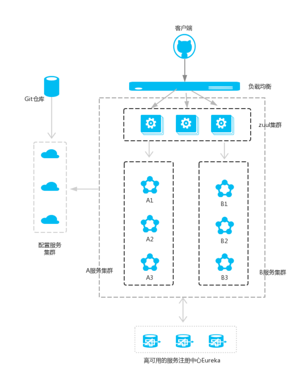
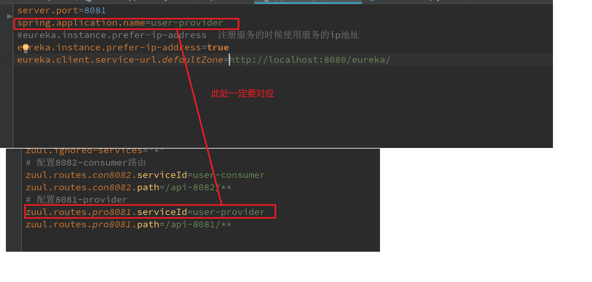
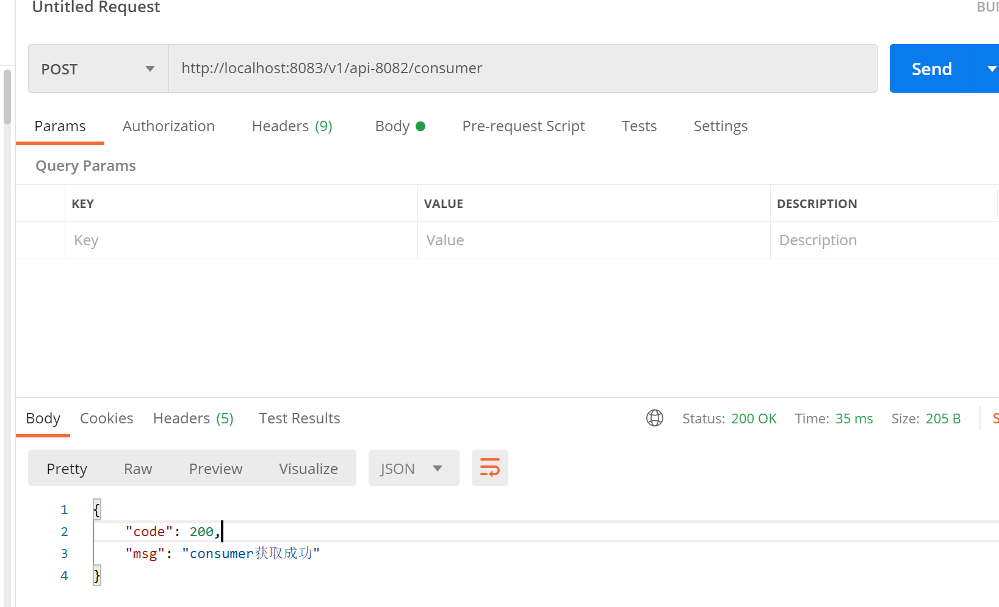
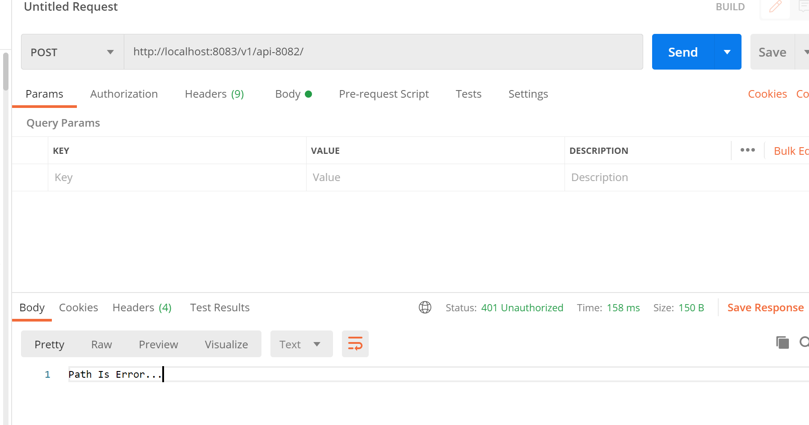

<!-- TOC -->

- [1.之前讲解了springBoot集成springCloud，即实现了服务注册中心，服务者，消费者功能的实现](#1之前讲解了springboot集成springcloud即实现了服务注册中心服务者消费者功能的实现)
- [2.接下来我们继续实现springCloud的 路由设置--zuul](#2接下来我们继续实现springcloud的-路由设置--zuul)
- [3.我大致介绍一下zuul的作用和功能](#3我大致介绍一下zuul的作用和功能)
  - [3.1 zuul是什么](#31-zuul是什么)
  - [3.2 zuul到底用来干什么](#32-zuul到底用来干什么)
    - [主要功能：](#主要功能)
    - [所有功能](#所有功能)
- [4.开始创建zuul项目](#4开始创建zuul项目)
  - [4.1 我们新建一个springBoot的web项目](#41-我们新建一个springboot的web项目)
  - [4.2 添加maven依赖](#42-添加maven依赖)
  - [4.3 applicaton类加上注解@EnableZuulProxy，开启zuul的功能：](#43-applicaton类加上注解enablezuulproxy开启zuul的功能)
  - [4.3 在application.properties添加配置](#43-在applicationproperties添加配置)
  - [4.4 接下来我们按照上面说的服务启动顺序，依次启动，使用postMan测试](#44-接下来我们按照上面说的服务启动顺序依次启动使用postman测试)
- [5.上面我们只实现了路由的转发功能，接下来实现zuul的服务过滤以及统一服务降级的功能](#5上面我们只实现了路由的转发功能接下来实现zuul的服务过滤以及统一服务降级的功能)
  - [5.1 服务过滤](#51-服务过滤)
    - [使用postMan测试：](#使用postman测试)
  - [5.2 统一服务降级](#52-统一服务降级)
    - [测试：](#测试)

<!-- /TOC -->
# 1.之前讲解了springBoot集成springCloud，即实现了服务注册中心，服务者，消费者功能的实现
[点击此处查看](https://blog.csdn.net/zhiyikeji/article/details/108687071)
# 2.接下来我们继续实现springCloud的 路由设置--zuul
一个微服务系统的结构大致如下：

注意：A与B之间的 服务可以互相调用
# 3.我大致介绍一下zuul的作用和功能
## 3.1 zuul是什么　
> * zuul 是netflix开源的一个API Gateway 服务器, 本质上是一个web servlet应用。
> * Zuul 在云平台上提供动态路由，监控，弹性，安全等边缘服务的框架。Zuul 相当于是设备和 Netflix 流应用的 Web 网站后端所有请求的前门。
> * Zuul的主要功能是路由转发和过滤器。路由功能是微服务的一部分，比如／api/user转发到到user服务，/api/shop转发到到shop服务。zuul默认和Ribbon结合实现了负载均衡的功能。
## 3.2 zuul到底用来干什么
### 主要功能：
> * 按照不同策略，将请求转发到不同的服务上去；
> * 聚合API接口，统一对外暴露，提高系统的安全性；
> * 实现请求统一的过滤，以及服务的熔断降级；
### 所有功能
> zuul的核心是一系列的filters, 其作用可以类比Servlet框架的Filter，或者AOP。
> Zuul可以通过加载动态过滤机制，从而实现以下各项功能：
> * 验证与安全保障: 识别面向各类资源的验证要求并拒绝那些与要求不符的请求。
> * 审查与监控: 在边缘位置追踪有意义数据及统计结果，从而为我们带来准确的生产状态结论。
> * 动态路由: 以动态方式根据需要将请求路由至不同后端集群处。
> * 压力测试: 逐渐增加指向集群的负载流量，从而计算性能水平。
> * 负载分配: 为每一种负载类型分配对应容量，并弃用超出限定值的请求。
> * 静态响应处理: 在边缘位置直接建立部分响应，从而避免其流入内部集群。
> * 多区域弹性: 跨越AWS区域进行请求路由，旨在实现ELB使用多样化并保证边缘位置与使用者尽可能接近。
# 4.开始创建zuul项目
项目的主要架构如下：
``` java
1.8080-eureka
2.8083-zuul
3.8082-consumer
4.8081-provider
启动顺序：
eureka->zuul->provider->consumer
```
## 4.1 我们新建一个springBoot的web项目
## 4.2 添加maven依赖
``` xml
<dependency>
            <groupId>org.springframework.cloud</groupId>
            <artifactId>spring-cloud-starter-netflix-eureka-client</artifactId>
        </dependency>
        <dependency>
            <groupId>org.springframework.cloud</groupId>
            <artifactId>spring-cloud-starter-netflix-zuul</artifactId>
        </dependency>
```
## 4.3 applicaton类加上注解@EnableZuulProxy，开启zuul的功能：
``` java
@SpringBootApplication
@EnableEurekaClient
@EnableZuulProxy
```
``` java
package com.cloud.zuul;

import org.springframework.boot.SpringApplication;
import org.springframework.boot.autoconfigure.SpringBootApplication;
import org.springframework.cloud.netflix.eureka.EnableEurekaClient;
import org.springframework.cloud.netflix.zuul.EnableZuulProxy;

@SpringBootApplication
@EnableEurekaClient
@EnableZuulProxy
public class ZuulApplication {
    public static void main(String[] args) {
        SpringApplication.run(ZuulApplication.class, args);
    }
}
```
## 4.3 在application.properties添加配置
``` yml
# 端口
server.port=8083
#注册名称
spring.application.name=service-zuul
#eureka.instance.prefer-ip-address  注册服务的时候使用服务的ip地址
eureka.instance.prefer-ip-address=true
eureka.client.service-url.defaultZone=http://localhost:8080/eureka/
# 前缀，用来做版本控制
zuul.prefix=/v1
# 禁用默认路由，执行配置路由
zuul.ignored-services="*"
# 配置8082-consumer路由
zuul.routes.con8082.serviceId=user-consumer
zuul.routes.con8082.path=/api-8082/**
# 配置8081-provider
zuul.routes.pro8081.serviceId=user-provider
zuul.routes.pro8081.path=/api-8081/**
```
* 以/api-8082/ 开头的请求都转发给consumer服务；
* 以/api-8081/开头的请求都转发给provider服务；
注意：serviceId要与项目配置里的spring.application.name对应

## 4.4 接下来我们按照上面说的服务启动顺序，依次启动，使用postMan测试

# 5.上面我们只实现了路由的转发功能，接下来实现zuul的服务过滤以及统一服务降级的功能
## 5.1 服务过滤
新建一个配置类，自定过滤的需求
FilterConfig
``` java
package com.cloud.zuul.config;

import com.netflix.zuul.ZuulFilter;
import com.netflix.zuul.context.RequestContext;
import com.netflix.zuul.exception.ZuulException;
import org.springframework.stereotype.Component;
import org.springframework.stereotype.Controller;

import javax.servlet.http.HttpServletRequest;
@Component
public class FilterConfig extends ZuulFilter {
    @Override
    public String filterType() {
        return "pre";
    }

    @Override
    public int filterOrder() {
        return 0;
    }

    @Override
    public boolean shouldFilter() {
        return true;
    }

    @Override
    public Object run() throws ZuulException {
        RequestContext requestContext = RequestContext.getCurrentContext() ;
        try {
            doBizProcess(requestContext);
        } catch (Exception e){
            System.out.println("异常：{}"+e.getMessage());
        }
        return null;
    }
    public void doBizProcess (RequestContext requestContext) throws Exception {
        HttpServletRequest request = requestContext.getRequest() ;
        String reqUri = request.getRequestURI() ;
        if (!reqUri.contains("getAuthorInfo")){
            requestContext.setSendZuulResponse(false);
            requestContext.setResponseStatusCode(401);
            requestContext.getResponse().getWriter().print("Path Is Error...");
        }
    }
}
```
大致解释以下以上代码：
我们可以在run()方法中自定义我们希望拦截的事件，比如404 500拦截，toeken拦截等
filterType：返回一个字符串代表过滤器的类型。
在zuul中定义了四种不同生命周期的过滤器类型，具体如下：
* pre：路由之前
* routing：路由之时
* post： 路由之后
* error：发送错误调用
* filterOrder：过滤的顺序
* shouldFilter：这里可以写逻辑判断，是否要过滤，本文true,永远过滤。注意：此处若设为false则不进行过滤。
* run：过滤器的具体逻辑。可用很复杂，包括查sql，nosql去判断该请求到底有没有权限访问。
### 使用postMan测试：

## 5.2 统一服务降级
FallBackConfig
``` java
package com.cloud.zuul.config;

import com.netflix.hystrix.exception.HystrixTimeoutException;
import org.springframework.http.HttpHeaders;
import org.springframework.http.HttpStatus;
import org.springframework.http.MediaType;
import org.springframework.http.client.ClientHttpResponse;
import org.springframework.stereotype.Component;

import java.io.ByteArrayInputStream;
import java.io.InputStream;
@Component
public class FallBackConfig implements org.springframework.cloud.netflix.zuul.filters.route.FallbackProvider {
    /**定义构造函数**/
    public ClientHttpResponse fallbackResponse() {
        return response(HttpStatus.INTERNAL_SERVER_ERROR);
    }
    @Override
    public String getRoute() {
        return "*";
    }

    @Override
    public ClientHttpResponse fallbackResponse(String route, Throwable cause) {
        // 捕获超时异常，返回自定义信息
        if (cause instanceof HystrixTimeoutException) {
            return response(HttpStatus.GATEWAY_TIMEOUT);
        } else {
            return fallbackResponse();
        }
    }


    private ClientHttpResponse response(final HttpStatus status) {
        return new ClientHttpResponse() {
            @Override
            public HttpStatus getStatusCode() {
                return status;
            }
            @Override
            public int getRawStatusCode() {
                return status.value();
            }
            @Override
            public String getStatusText() {
                return status.getReasonPhrase();
            }
            @Override
            public void close() {
                System.out.println("close");
            }
            @Override
            public InputStream getBody() {
                String message =
                        "{\n" +
                                "\"code\": 200,\n" +
                                "\"message\": \"微服务飞出了地球\"\n" +
                                "}";
                return new ByteArrayInputStream(message.getBytes());
            }
            @Override
            public HttpHeaders getHeaders() {
                HttpHeaders headers = new HttpHeaders();
                headers.setContentType(MediaType.APPLICATION_JSON);
                return headers;
            }
        };
    }
}
```
### 测试：
在测试之前我们先关闭consumer的服务，在发送请求
至此zuul的功能基本实现，如果有不当之处希望各位小哥哥，小姐姐多多指教
