<!-- TOC -->

- [1. 合并与分割](#1-合并与分割)
  - [1.1 合并](#11-合并)
  - [1.2 分割](#12-分割)
- [2.数据统计](#2数据统计)
  - [2.1 向量范数](#21-向量范数)
  - [2.2 最大最小值、均值、和](#22-最大最小值均值和)

<!-- /TOC -->
# 1. 合并与分割
## 1.1 合并
合并是指将多个张量在某个维度上合并为一个张量
这句话的具体含义就是：
> 以某学校班级成绩册数据为例，设张量 A 保存了某学校 1-4 号班级的成绩册，每个班级 35 个学生，共 8 门科目，则张量 A的 shape 为：[4,35,8]；张量 B 保存了剩下的 6 个班级的成绩册，shape 为[6,35,8]。通过合并 2 个成绩册，便可得到学校所有班级的成绩册张量 C，shape 应为[10,35,8]。这就是张量合并的意义所在。张量的合并可以使用拼接(Concatenate)和堆叠(Stack)操作实现，拼接并不会产生新的维度，而堆叠会创建新维度。选择使用拼接还是堆叠操作来合并张量，取决于具体的场景是否需要创建新维度。

* 拼接
  在 TensorFlow 中，可以通过 tf.concat(tensors, axis)，其中 tensors 保存了所有需要合并的张量 List，axis 指定需要合并的维度。回到上面的例子，这里班级维度索引号为 0，即 axis=0，合并张量 A,B 如下：
  ``` python
    import tensorflow as tf
    a = tf.random.normal([4, 35, 8])  # 模拟成绩册A
    b = tf.random.normal([6, 35, 8])  # 模拟成绩册B
    r = tf.concat([a, b], axis=0)
    print(r)
  ```
  输出结果：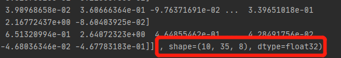
  合并操作可以在任意的维度上进行，唯一的约束是非合并维度的长度必须一致。
* 堆叠
  如果在合并数据时，希望创建一个新的维度，则需要使用 tf.stack 操作。
  使用 tf.stack(tensors, axis)可以合并多个张量 tensors，其中 axis 指定插入新维度的位置，axis 的用法与 tf.expand_dims 的一致，当axis ≥ 0时在 axis 之前插入;当axis < 0时，在 axis 之后插入新维度。
  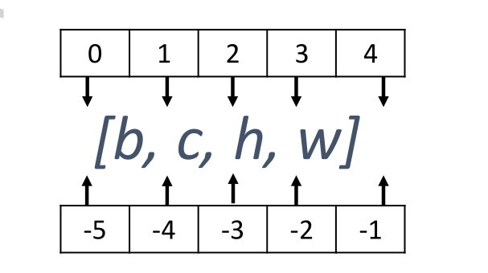
  > 考虑张量 A 保存了某个班级的成绩册，shape 为[35,8]，张量 B 保存了另一个班级的成绩册，shape 为[35,8]。合并这 2 个班级的数据时，需要创建一个新维度，定义为班级维度，新维度可以选择放置在任意位置，一般根据大小维度的经验法则，将较大概念的班级维度放置在学生维度之前，则合并后的张量的新 shape 应为[2,35,8]。堆叠方式合并这 2 个班级成绩册如下：
  ``` python
    a = tf.random.normal([35, 8])
    b = tf.random.normal([35, 8])
    r = tf.stack([a, b], axis=0)
    print(r)
  ```
  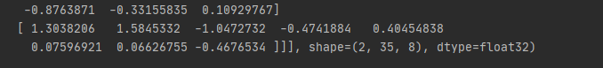

## 1.2 分割
合并操作的逆过程就是分割，将一个张量分拆为多个张量。
> 继续考虑成绩册的例子，我们得到整个学校的成绩册张量，shape 为[10,35,8]，现在需要将数据在班级维度切割为10 个张量，每个张量保存了对应班级的成绩册。

通过 tf.split(x, axis, num_or_size_splits)可以完成张量的分割操作，其中:
* x：待分割张量
* axis：分割的维度索引号
* num_or_size_splits：切割方案。
  * num_or_size_splits 为单个数值时,如 10，表示切割为 10 份；
  * 当 num_or_size_splits 为 List 时,每个元素表示每份的长度.如[2,3,2,2]表示切割为 4 份，每份的长度分别为 2,3,2,2

现在我们将总成绩册张量切割为 10 份：
``` python
x = tf.random.normal([10, 35, 8])
r=tf.split(x,axis=0,num_or_size_splits=10)
for a in r:
    print(a.shape)
```
输出结果：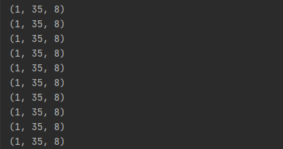
我们进行不等长的切割：将数据切割为 4 份，每份长度分别为[4,2,2,2]:
``` python
x = tf.random.normal([10, 35, 8])
r = tf.split(x, axis=0, num_or_size_splits=[4, 2, 2, 2])
for a in r:
    print(a.shape)
```
输出结果: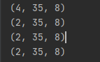
第一个张量的 shape，根据我们的切割方案，它应该包含了 4 个班级的成绩册
特别地，如果希望在某个维度上全部按长度为 1 的方式分割，还可以直接使用 tf.unstack(x,axis)。这种方式是 tf.split 的一种特殊情况，切割长度固定为 1，只需要指定切割维度即可。
例如，将总成绩册张量在班级维度进行 unstack：
``` python
x = tf.random.normal([10, 35, 8])
r = tf.unstack(x, axis=0)  # unstack长度为1
for a in r:
    print(a.shape)
```
输出结果：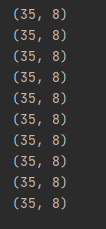
可以看到，通过 tf.unstack 切割后，shape 变为[35,8]，即班级维度消失了，这也是与 tf.split区别之处
# 2.数据统计
在神经网络的计算过程中，经常需要统计数据的各种属性，如最大值，均值，范数等等。由于张量通常 shape 较大，直接观察数据很难获得有用信息，通过观察这些张量统计信息可以较轻松地推测张量数值的分布。
## 2.1 向量范数
向量范数(Vector norm)是表征向量“长度”的一种度量方法，在神经网络中，常用来表示张量的权值大小，梯度大小等。常用的向量范数有：
* L1 范数 定义为向量𝒙的所有元素绝对值之和
  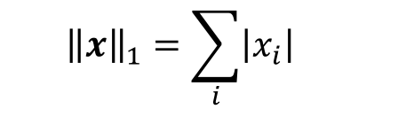
* L2 范数 定义为向量𝒙的所有元素的平方和，再开根号
  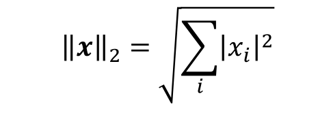
* ∞ 范数  定义为向量𝒙的所有元素绝对值的最大值：
  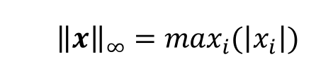
  对于矩阵、张量，同样可以利用向量范数的计算公式，等价于将矩阵、张量打平成向量后计算。
在 TensorFlow 中，可以通过 tf.norm(x, ord)求解张量的 L1, L2, ∞等范数，其中参数 ord指定为 1,2 时计算 L1, L2 范数，指定为 np.inf 时计算∞ −范数：
``` python
x = tf.ones([2, 2])
print(x)
r = tf.norm(x, ord=1)  # 计算L1范数
print("L1范数：",r)
r = tf.norm(x, ord=2)  # 计算L2范数
print("L2范数：",r)
r = tf.norm(x, ord=np.inf)  # 计算∞范数
print("∞范数：",r)
```
输出结果：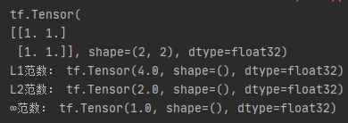
## 2.2 最大最小值、均值、和
通过 tf.reduce_max, tf.reduce_min, tf.reduce_mean, tf.reduce_sum 可以求解张量在某个维度上的最大、最小、均值、和，也可以求全局最大、最小、均值、和信息。
考虑 shape 为[4,10]的张量，其中第一个维度代表样本数量，第二个维度代表了当前样本分别属于 10 个类别的概率，需要求出每个样本的概率最大值为：
``` python
x = tf.random.normal([4, 10])
r = tf.reduce_max(x, axis=1)  # 统计概率维度上的最大值
print("概率维度上的最大值:",r)
r = tf.reduce_min(x, axis=1)  # 统计概率维度上的最小值
print("概率维度上的最小值:",r)
r = tf.reduce_mean(x, axis=1)  # 统计概率维度上的均值
print("概率维度上的均值:",r)
```
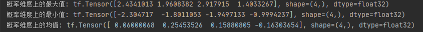
当不指定 axis 参数时，tf.reduce_*函数会求解出全局元素的最大、最小、均值、和：
``` python
x = tf.random.normal([4, 10])
# 统计全局的最大、最小、均值、和
r = tf.reduce_max(x)  # 统计全局上的最大值
print("全局上的最大值:",r)
r = tf.reduce_min(x)  # 统计全局上的最小值
print("全局上的最小值:",r)
r = tf.reduce_mean(x)  # 统计全局上的均值
print("全局上的均值:",r)
```
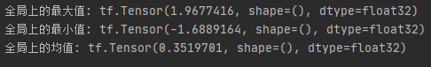
在求解误差函数时，通过 TensorFlow 的 MSE 误差函数可以求得每个样本的误差，需要计算样本的平均误差，此时可以通过 tf.reduce_mean 在样本数维度上计算均值：
``` python
import tensorflow as tf
import numpy as np
from tensorflow import keras
out = tf.random.normal([4, 10])  # 网络预测输出
y = tf.constant([1, 2, 2, 0])  # 真是标签
y = tf.one_hot(y, depth=10)  # one-hot编码
loss = keras.losses.mse(y, out)  # 计算每个样本误差
loss = tf.reduce_mean(loss)  # 平均误差
print(loss)
```
输出结果：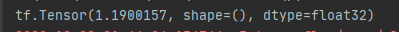