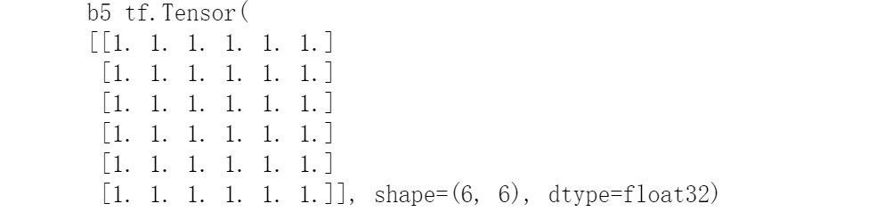
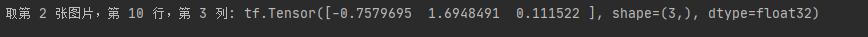
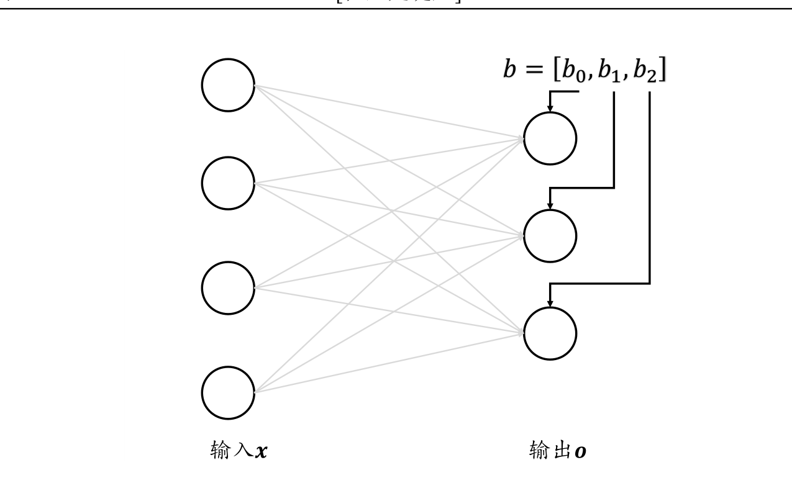
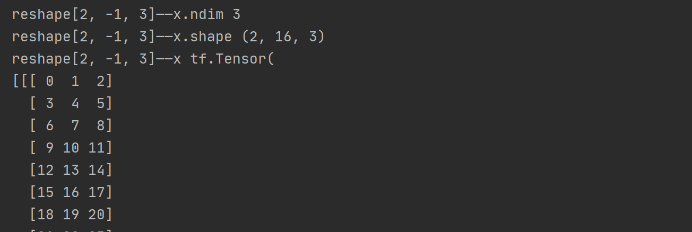

<!-- TOC -->

- [第4章 TensorFlow 基础](#第4章-tensorflow-基础)
  - [4.1 数据类型](#41-数据类型)
    - [4.1.1 数值 数值 类型](#411-数值-数值-类型)
    - [4.1.2 字符串类型](#412-字符串类型)
    - [4.1.3 布尔类型](#413-布尔类型)
  - [4.2 数值精度](#42-数值精度)
    - [4.2.1 读取精度](#421-读取精度)
    - [4.2.2 类型转换](#422-类型转换)
  - [4.3 待优化张量](#43-待优化张量)
  - [4.4 创建张量](#44-创建张量)
    - [4.4.1 从 从 Numpy, List 对象 创建](#441-从-从-numpy-list-对象-创建)
    - [4.4.2 创建全 0 ，全 1 张量](#442-创建全-0-全-1-张量)
    - [4.4.3 创建 创建 自定义数值](#443-创建-创建-自定义数值)
    - [4.4.4 创建已知分布的张量](#444-创建已知分布的张量)
    - [4.4.5 创建序列](#445-创建序列)
  - [4.5 张量的典型应用](#45-张量的典型应用)
    - [4.5.1 标量](#451-标量)
    - [4.5.2 向量](#452-向量)
    - [4.5.3 矩阵](#453-矩阵)
    - [4.5.4 3 维张量](#454-3-维张量)
    - [4.5.5 4 维张量](#455-4-维张量)
  - [4.6 索引与切片](#46-索引与切片)
    - [4.6.1 索引](#461-索引)
    - [4.6.2 切片](#462-切片)
    - [4.6.3 小结](#463-小结)
  - [4.7 维度变换](#47-维度变换)
    - [4.7.1 Reshape](#471-reshape)
    - [4.7.2 增删维度](#472-增删维度)
      - [增加维度](#增加维度)
      - [删除维度](#删除维度)
    - [4.7.3 交换维度](#473-交换维度)
    - [4.7.4 数据复制](#474-数据复制)
  - [4.8 Broadcasting](#48-broadcasting)

<!-- /TOC -->
# 第4章 TensorFlow 基础
## 4.1 数据类型
### 4.1.1 数值 数值 类型
数值类型的张量是 TensorFlow 的主要数据载体，分为：
* 标量(Scalar) 单个的实数，如 1.2, 3.4 等，维度数(Dimension，也叫秩)为 0，shape 为[]
* 向量(Vector) n 个实数的有序,通过中括号包裹，如[1.2]，[1.2,3.4]等，维度数为1，长度不定，shape 为[n]
* 矩阵(Matrix) n 行 m 列实数的有序集合，如[ [1,2],[3,4]]，也可以写成 
$$
\begin{matrix}
1 & 2  \\
3 & 4 \\
\end{matrix} \tag{1}
$$
* 张量(Tensor) 所有维度数dim > 2的数组统称为张量。
 张量的每个维度也做轴(Axis)，一般维度代表了具体的物理含义，比如 Shape 为[2,32,32,3]的张量共有 4 维，如果表示图片数据的话，每个维度/轴代表的含义分别是：图片数量、图片高度、图片宽度、图片通道数，其中 2 代表了 2 张图片，32 代表了高宽均为 32，3 代表了 RGB 3 个通道。张量的维度数以及每个维度所代表的具体物理含义需要由用户自行定义
 
注意：
> 在 TensorFlow 中间，为了表达方便，一般把标量、向量、矩阵也统称为张量，不作区分，需要根据张量的维度数和形状自行判断。
```python
import tensorflow as tf
print("==============4.1.1 数值 数值 类型==============")
a = tf.constant([[[1,2],[3,4]],[[5,6],[7,8]]])
print(a)
print(a.shape)
```

### 4.1.2 字符串类型
除了丰富的数值类型外，TensorFlow 还支持字符串(String)类型的数据
例如在表示图片数据时，可以先记录图片的路径，再通过预处理函数根据路径读取图片张量。通过传入字符串对象即可创建字符串类型的张量：
```python
print("==============4.1.2 字符串类型==============")
b = tf.constant('HELLO, Deep Learning.')# 实例化一个字符串变量
b=tf.strings.lower(b) # 将所有字母变为小写
print(b)
```

### 4.1.3 布尔类型
为了方便表达比较运算操作的结果，TensorFlow 还支持布尔类型(Boolean, bool)的张量。
布尔类型的张量只需要传入 Python 语言的布尔类型数据，转换成 TensorFlow 内部布尔型即可：
```python
print("==============4.1.3 布尔类型==============")
c= tf.constant(True)
print(c)
c = tf.constant([True, False])
print(c)
# TensorFlow 的布尔类型和 Python 语言的布尔类型并不对等，不能通用
c = tf.constant(True) # 创建布尔张量
print(c==True)
```


## 4.2 数值精度
* 对于数值类型的张量，可以保持为不同字节长度的精度，如浮点数 3.14 既可以保存为16-bit 长度，也可以保存为 32-bit 甚至 64-bit 的精度。Bit 位越长，精度越高，同时占用的内存空间也就越大。
* 常用的精度类型有 tf.int16, tf.int32, tf.int64, tf.float16, tf.float32,tf.float64
* 其中 tf.float64 即为 tf.double。
在创建张量时，可以指定张量的保存精度：
``` python
import tensorflow as tf
import numpy as np
a=tf.constant(123456789, dtype=tf.int16)
a1=tf.constant(123456789, dtype=tf.int32)
print(a)
print(a1)
a2=tf.constant(np.pi, dtype=tf.float32)
a3=tf.constant(np.pi, dtype=tf.float64)
print(a2)
print(a3)
```

可以看到，保存精度过低时，数据 123456789 发生了溢出，得到了错误的结果，一般使用tf.int32, tf.int64 精度。对于浮点数，高精度的张量可以表示更精准的数据，例如采用tf.float32 精度保存𝜋
### 4.2.1 读取精度
通过访问张量的 dtype 成员属性可以判断张量的保存精度：
``` python
print('before:',a.dtype)
if a.dtype != tf.float32:
    a = tf.cast(a,tf.float32) # 转换精度
print('after :',a.dtype)
```

### 4.2.2 类型转换
系统的每个模块使用的数据类型、数值精度可能各不相同，对于不符合要求的张量的类型及精度，需要通过 tf.cast 函数进行转换：
```python
a = tf.constant(np.pi, dtype=tf.float16)
a=tf.cast(a, tf.double)
print("a转double:{}".format(a.dtype))
```

进行类型转换时，需要保证转换操作的合法性，例如将高精度的张量转换为低精度的张量时，可能发生数据溢出隐患：
```python
a=tf.constant(123456789,dtype=tf.int32)
a=tf.cast(a,tf.int16)
print("a有32转16位:",a)
```

布尔型与整形之间相互转换也是合法的，是比较常见的操作：
```python
a = tf.constant([True, False])
a=tf.cast(a,tf.int32)
print("布尔型与整形之间相互转换：",a)
```

一般默认 0 表示 False，1 表示 True，在 TensorFlow 中，将非 0 数字都视为 True:
```python
a = tf.constant([-1, 0, 1, 2])
a=tf.cast(a, tf.bool)
print("整型转bool类型：",a)

```

## 4.3 待优化张量
* 张量的 name 和 trainable 属性是 Variable 特有的属性，
* name 属性用于命名计算图中的变量，这套命名体系是 TensorFlow 内部维护的，一般不需要用户关注 name 属性；
* trainable表征当前张量是否需要被优化，创建 Variable 对象是默认启用优化标志，可以设置trainable=False 来设置张量不需要优化。
``` python
a=tf.constant([-1,0,1,2])
aa=tf.Variable(a)
print(aa)
print(aa.name)
print(aa.trainable)
```

除了通过普通张量方式创建 Variable，也可以直接创建：
``` python
b = tf.Variable([[1,2],[3,4]])
print("b",b)
```

注意：待优化张量可看做普通张量的特殊类型，普通张量也可以通过 GradientTape.watch()方法临时加入跟踪梯度信息的列表。
## 4.4 创建张量
* Numpy Array 数组和 Python List 是 Python 程序中间非常重要的数据载体容器
* 很多数据都是通过 Python 语言将数据加载至 Array 或者 List 容器，再转换到 Tensor 类型
* 通过TensorFlow 运算处理后导出到 Array 或者 List 容器，方便其他模块调用。

### 4.4.1 从 从 Numpy, List 对象 创建
通过 tf.convert_to_tensor 可以创建新 Tensor，并将保存在 Python List 对象或者 NumpyArray 对象中的数据导入到新 Tensor 中
``` python
a=tf.convert_to_tensor([1,2.])
```
需要注意的是，Numpy 中浮点数数组默认使用 64-Bit 精度保存数据，转换到 Tensor 类型时精度为 tf.float64，可以在需要的时候转换为 tf.float32 类型。
``` python
aa=tf.convert_to_tensor(np.array([[1,2.],[3,4]]))
print("a:",a)
print("aa:",aa)
```

### 4.4.2 创建全 0 ，全 1 张量
``` python
b=tf.zeros([])
b1=tf.ones([])
b2=tf.ones([1])
b3=tf.zeros([1])
print("b:",b)
print("b1",b1)
print("b2",b2)
print("b3",b3)
```

写到此处忘记解释print(x)显示shape=(2,)和shape=(2,1)的区别了，下面解释一下：
> * shape=(2,)表示x是一个一位数组，数组里面有两个元素
> * shape=(2,1)表示x是一个矩阵，表示的是一个两行一列的矩阵

希望大家不要混淆
创建全 0 的矩阵：
``` python
b4=tf.zeros([2,3])
print("b4",b4)
```

创建全1矩阵:
``` python
b5=tf.ones([6,6])
print("b5",b5)
```

过 tf.zeros_like, tf.ones_like 可以方便地新建与某个张量 shape 一致，内容全 0 或全 1的张量。
例如，创建与张量 b6 形状一样的全 0 张量：
``` python
b6=tf.ones([2,3])
b7=tf.zeros_like(b6)
print("b7",b7)
```

### 4.4.3 创建 创建 自定义数值
除了初始化为全 0，或全 1 的张量之外，有时也需要全部初始化为某个自定义数值的张量，比如将张量的数值全部初始化为-1 等。
通过 tf.fill(shape, value)可以创建全为自定义数值 value 的张量。例如，创建元素为-1的标量：
``` python
c=tf.fill([3,4],-1)
print("C:",c)
```

### 4.4.4 创建已知分布的张量
* 正态分布(Normal Distribution，或 Gaussian Distribution)
* 均匀分布(UniformDistribution)是最常见的分布之一，创建采样自这 2 种分布的张量非常有用
* 比如在卷积神经网络中，卷积核张量 W 初始化为正态分布有利于网络的训练；
* 在对抗生成网络中，隐藏变量 z 一般采样自均匀分布。
* 通过 tf.random.normal(shape, mean=0.0, stddev=1.0)可以创建
* 形状为 shape，均值为mean,标准差为 stddev 的正态分布𝒩(𝑛𝑓𝑏𝑜,𝑡𝑢𝑒𝑒𝑓𝑤 2 )。
下面创建一个均值为0，标准差为1的正态分布:
``` python
d=tf.random.normal([2,2])
print("d:",d)
```

创建均值为 1，标准差为 2 的正太分布：
``` python
d1=tf.random.normal([2,2], mean=1,stddev=2)
print("d1",d1)
```

通过 tf.random.uniform(shape, minval=0, maxval=None, dtype=tf.float32)可以创建采样自[𝑛𝑗𝑜𝑤𝑏𝑚,𝑛𝑏𝑦𝑤𝑏𝑚]区间的均匀分布的张量。
例如创建采样自区间[0,1]，shape 为[2,2]的矩阵：
``` python
d2=tf.random.uniform([2,2])
print("d2",d2)
```

创建采样自区间[0,10]，shape 为[2,2]的矩阵：
``` python
d3=tf.random.uniform([2,2],maxval=10)
print("d3",d3)
```

如果需要均匀采样整形类型的数据，必须指定采样区间的最大值 maxval 参数，同时制定数据类型为 tf.int*型：
``` python
d4=tf.random.uniform([2,2],maxval=100,dtype=tf.int32)
print("d4",d4)
```

### 4.4.5 创建序列
* 在循环计算或者对张量进行索引时，经常需要创建一段连续的整形序列
* 可以通过tf.range()函数实现。
* tf.range(limit, delta=1)可以创建[0,𝑚𝑗𝑛𝑗𝑢)之间，步长为 delta 的整形序列，不包含 limit 本身。例如，创建 0~9，步长为 1 的整形序列
``` python
e=tf.range(10,delta=1)
print("e",e)
```

创建 0~9，步长为 2 的整形序列：
``` python
e1=tf.range(10,delta=2)
print("e1",e1)
```

tf.range(start, limit, delta=1)可以创建[𝑡𝑢𝑏𝑠𝑢,𝑚𝑗𝑛𝑗𝑢)，步长为 delta 的序列，不包含 limit本身：
``` python
e2=tf.range(1,limit=10,delta=1)
print("e2",e2)
```


## 4.5 张量的典型应用
### 4.5.1 标量
在 TensorFlow 中，标量最容易理解，它就是一个简单的数字，维度数为 0，shape 为[]。
标量的典型用途之一是误差值的表示、各种测量指标的表示，比如准确度(Accuracy,acc)，精度(Precision)和召回率(Recall)等

以均方差误差函数为例，经过 tf.keras.losses.mse(或 tf.keras.losses.MSE)返回每个样本上的误差值，最后取误差的均值作为当前 batch 的误差，它是一个标量：
``` python
out = tf.random.uniform([4,10]) #随机模拟网络输出
y = tf.constant([2,3,2,0]) # 随机构造样本真实标签
y = tf.one_hot(y, depth=10) # one-hot 编码
loss = tf.keras.losses.mse(y, out) # 计算每个样本的 MSE
loss = tf.reduce_mean(loss) # 平均 MSE
print(loss)
```

下面解释tf.one_hot函数
* tf.one_hot
  > tf.one_hot()函数是将input转化为one-hot类型数据输出，相当
  > 将多个数值联合放在一起作为多个相同类型的向量，可用于表示各自的概率分布，通常用于分类任务中作为最后的FC层的输出，有时翻译成“独热”编码。
  > tensorflow的help中相关说明如下：
  > ``` python
  > one_hot(indices, depth, on_value=None, off_value=None, axis=None, dtype=None, name=None)
  >  Returns a one-hot tensor.
  >   ```
  > * indices表示输入的多个数值，通常是矩阵形式；depth表示输出的尺寸。
  > * 由于one-hot类型数据长度为depth位,其中只用一位数字表示原输入数据，这里的on_value就是这个数字，默认值为1，one-hot数据的其他位用off_value表示，默认值为0。
  > * tf.one_hot()函数规定输入的元素indices从0开始，最大的元素值不能超过（depth - 1），因此能够表示depth个单位的输入。若输入的元素值超出范围，输出的编码均为 [0, 0 … 0, 0]。
  > * indices = 0 对应的输出是[1, 0 … 0, 0], indices = 1 对应的输出是[0, 1 … 0, 0], 依次类推，最大可能值的输出是[0, 0 … 0, 1]。

###  4.5.2 向量
向量是一种非常常见的数据载体，如在全连接层和卷积神经网络层中，偏置张量𝒃就使用向量来表示。如图所示，每个全连接层的输出节点都添加了一个偏置值，把所有输出节点的偏置表示成向量形式：$𝒃 = [b_1 ,b_2 ]^𝑇 $。

考虑 2 个输出节点的网络层，我们创建长度为 2 的偏置向量𝒃，并累加在每个输出节点
``` python
# z=wx,模拟获得激活函数的输入 z
z = tf.random.normal([4, 2])
b = tf.zeros([2])  # 模拟偏执向量
z = z + b  # 累加偏执
print("b:",b)
print("z:",z)
```

注意:这里 shape 为[4,2]的𝒜和 shape 为[2]的𝒃张量可以直接相加，这是为什么呢？
  > 通过高层接口类 Dense()方式创建的网络层，张量 W 和𝒃存储在类的内部，由类自动创建并管理。可以通过全连接层的 bias 成员变量查看偏置变量𝒃
  
例如创建输入节点数为 4，输出节点数为 3 的线性层网络，那么它的偏置向量 b 的长度应为 3：
``` python
from tensorflow_core.python.layers import layers
fc = layers.Dense(3)  # 创建一层wx+b，输出节点为3
# 通过build函数创建w,b张量，输入节点为4
fc.build(input_shape=(2, 4))
bias=fc.bias  # 查看偏置
print(bias)
```

可以看到，类的偏置成员 bias 初始化为全 0，这也是偏置𝒃的默认初始化方案。
###  4.5.3 矩阵
矩阵也是非常常见的张量类型，比如全连接层的批量输入$𝑌 = [b,d_in]$，其中b表示输入样本的个数，即 batch size，$d_in$表示输入特征的长度。
比如特征长度为 4，一共包含 2 个样本的输入可以表示为矩阵：
x = tf.random.normal([2,4])

令全连接层的输出节点数为 3，则它的权值张量 W 的 shape 为[4,3]:
```python
x = tf.random.normal([2, 4])
w = tf.ones([4, 3])  # 定义w张量
b = tf.zeros([3])  # 定义b张量
o = x @ w + b  # x@w+b运算 @ 等价于tf.matmul表示矩阵相乘
print(o)
```

下面解释几行代码
* o = x @ w + b 
  > @ 等价于tf.matmul表示矩阵相乘
  其中 X，W 张量均是矩阵。x@w+b 网络层称为线性层，在 TensorFlow 中可以通过 Dense类直接实现，Dense 层也称为全连接层。

写到此处解释一下全连接层

> 最后的两列小圆球就是两个全连接层，在最后一层卷积结束后，进行了最后一次池化，输出了20个12*12的图像，然后通过了一个全连接层变成了1*100的向量。


我们通过 Dense 类创建输入 4 个节点，输出 3 个节点的网络层，可以通过全连接层的 kernel 成员名查看其权值矩阵 W：
``` python
import tensorflow as tf
from tensorflow_core.python import keras
from  tensorflow.keras import layers
fc=layers.Dense(3) #定义全连接层的输出节点为3
fc.build(input_shape=(2,4)) #定义全连接层的输入节点为4
print("fc.kernel:",fc.kernel)
```

###  4.5.4 3 维张量
三维的张量一个典型应用是表示序列信号，它的格式是

* b表示序列信号的数量
* sequence len 表示序列信号在时间维度上的采样点数
* feature len 表示每个点的特征长度。

如图 4.3 所示。为了能够方便字符串被神经网络处理，一般将单词通过嵌入层(Embedding Layer)编码为固定长度的向量，比如“a”编码为某个长度 3 的向量，那么 2 个等长(单词数为 5)的句子序列可以表示为 shape 为[2,5,3]的 3 维张量，其中 2 表示句子个数，5 表示单词数量，3 表示单词向量的长度

``` python
import tensorflow as tf
from tensorflow_core.python import keras
from  tensorflow.keras import layers
(x_train, y_train), (x_test, y_test) = keras.datasets.imdb.load_data(num_words=10000)  # 自动加载 IMDB 电影评价数据集
x_train = keras.preprocessing.sequence.pad_sequences(x_train, maxlen=80)  # 将句子填充、截断为等长 80 个单词的句子
print(x_train.shape)
embedding = layers.Embedding(10000, 100)  # 创建词向量 Embedding 层类
out = embedding(x_train)  # 将数字编码的单词转换为词向量
print(out.shape)

```

可以看到，经过 Embedding 层编码后，句子张量的 shape 变为[25000,80,100]，其中 100 表示每个单词编码为长度 100 的向量
对于特征长度为 1 的序列信号，比如商品价格在 60 天内即可表示商品的价格，因此 2 件商品的价格变化趋势可以使用 shape 为[2,60]的张量表示。为了方便统一格式，也将价格变化趋势表达为 shape 为 [2,60,1]的张量，其中的 1 表示特征长度为 1

###  4.5.5 4 维张量
4 维张量在卷积神经网络中应用的非常广泛，它用于保存特征图(Feature maps)数据，格式一般定义为$[b,h,w,c]$
* b表示输入的数量
* h/w：特征图的宽高
* c:特征图的通道数

``` python
import tensorflow as tf
from tensorflow_core.python import keras
from  tensorflow.keras import layers
x = tf.random.normal([4, 32, 32, 3])  # 创建32*32的彩色图片，个数为4
layer = layers.Conv2D(16, kernel_size=3)  # 创建卷积神经网络
out = layer(x)  # 前向计算
print(out.shape)  # 计算输出大小
print(layer.kernel.shape)  # 卷积核张量也是 4 维张量，可以通过 kernel 成员变量访问
```

## 4.6 索引与切片
通过索引与切片操作可以提取张量的部分数据，使用频率非常高。
### 4.6.1 索引
``` python
import tensorflow as tf
from tensorflow_core.python import keras
from tensorflow.keras import layers
import numpy as np
x = tf.random.normal([4, 32, 32, 3])
print("第一张图片的数据", x[0])
print("第一张图片的第二行数据：", x[0][1])
print("第一张图片的第二行第三列的像素：", x[0][1][2])
print("取第 3 张图片，第 2 行，第 1 列的像素，B 通道(第 2 个通道)颜色强度值：", x[2][1][0][1])
```

当张量的维度数较高时，使用[𝑗][𝑘]...[𝑙]的方式书写不方便，可以采用[𝑗,𝑘,…,𝑙]的方式索引，它们是等价的。
``` python
print("取第 2 张图片，第 10 行，第 3 列:",x[1,9,2])
```

### 4.6.2 切片
通过start : end:step切片方式可以方便地提取一段数据
* start 为开始读取位置的索引
* end 为结束读取位置的索引(不包含 end 位)
* step 为读取步长
以 shape 为[4,32,32,3]的图片张量为例：
读取第 2,3 张图片：
  ``` python
  print("读取第 2,3 张图片：",x[1:3])
  ```
如 x[0,::]表示读取第 1 张图片的所有行，其中::表示在行维度上读取所有行，它等于x[0]的写法
``` python
print("读取第 1 张图片的所有行:", x[0,::])
```
我们来总结start : end:step切片的简写方式，其中从第一个元素读取时 start 可以省略，即 start=0 是可以省略，取到最后一个元素时 end 可以省略，步长为 1 时 step 可以省略，简写方式总结如表格 4.1：

特别地，step 可以为负数，考虑最特殊的一种例子，step = −1时，start : end:−1表示从 start 开始，逆序读取至 end 结束(不包含 end)，索引号end<=start
``` python
x = tf.range(9)
print("x:", x)
print("x[8:0:-1]", x[8:0:-1])
print("逆序取全部元素：",x[::-1])
print("逆序间隔采样：",x[::-2])
```

当张量的维度数量较多时，不需要采样的维度一般用单冒号:表示采样所有元素，此时有可能出现大量的:出现
我们继续考虑[4,32,32,3]的图片张量，当需要读取 G 通道上的数据时，前面所有维度全部提取，此时需要写为：
``` python
import tensorflow as tf
from tensorflow_core.python import keras
from tensorflow.keras import layers
import numpy as np
x = tf.random.normal([4, 32, 32, 3])
print(x[:, :, :, 1])
```

为了避免出现像x[:,:,:,1]这样出现过多冒号的情况，可以使用⋯符号表示取多个维度上所有的数据，其中维度的数量需根据规则自动推断：当切片方式出现⋯符号时，⋯符号,左边的维度将自动对齐到最左边，⋯符号右边的维度将自动对齐到最右边，此时系统再自动推断⋯符号代表的维度数量，它的切片方式总结如表格4.2

比如读取第 1-2 张图片的 G/B 通道数据：
``` python
import tensorflow as tf
from tensorflow_core.python import keras
from tensorflow.keras import layers
import numpy as np

x = tf.random.normal([4, 32, 32, 3])
print("读取第 1-2 张图片的 G/B 通道数据:",x[0:2,...,1:])
```

读取最后 2 张图片：
``` python
x = tf.random.normal([4, 32, 32, 3])
print("读取最后 2 张图片：", x[2:,...])
```

读取 R/G 通道数据：
``` python
print("读取最后 2 张图片：", x[2:, ...])
```

### 4.6.3 小结
张量的索引与切片方式多种多样，尤其是切片操作，初学者容易犯迷糊。但其实本质上切片操作只有start : end : step这一种基本形式，通过这种基本形式有目的地省略掉默认参数，从而衍生出多种简写方法，这也是很好理解的。它衍生的简写形式熟练后一看就能推测出省略掉的信息，书写起来也更方便快捷。由于深度学习一般处理的维度数在 4 维以内，⋯操作符完全可以用:符号代替，因此理解了这些就会发现张量切片操作并不复杂。

## 4.7 维度变换
在神经网络运算过程中，维度变换是最核心的张量操作，通过维度变换可以将数据任意地切换形式，满足不同场合的运算需求。
那么为什么需要维度变换呢？考虑线性层的批量形式：

其中 X 包含了 2 个样本，每个样本的特征长度为 4，X 的 shape 为[2,4]。线性层的输出为3个节点，即 W 的 shape 定义为[4,3]，偏置𝒃的 shape 定义为[3]。那么X@W的运算张量shape 为[2,3]，需要叠加上 shape 为[3]的偏置𝒃。

对于 2 个样本的输入 X，我们需要将 shape 为[3]的偏置𝒃
$$
b=
\left[
\begin{matrix}
b0 \\
b1 \\
b2  
\end{matrix} \right]\tag{2}
$$
按样本数量复制 1 份，变成矩阵形式𝐵 ′ ：
$$
B'=
\left[
\begin{matrix}
b0 & b1 & b2 \\
b0 & b1 & b2 \\
\end{matrix} \right]\tag{2}
$$
通过与X′ = X@W

相加，此时X′与𝐵 ′ shape 相同，满足矩阵相加的数学条件：

通过这种方式，既满足了数学上矩阵相加需要 shape 一致的条件，又达到了给每个输入样本的输出节共享偏置的逻辑。
为了实现这种运算方式，我们将𝒃插入一个新的维度，并把它定义为 batch 维度，然后在 batch 维度将数据复制 1 份，得到变换后的B′，新的 shape 为[2,3]
### 4.7.1 Reshape
在介绍改变视图操作之前，我们先来认识一下张量的存储和视图(View)的概念
* 张量的视图：就是我们理解张量的方式
  比如 shape 为[2,4,4,3]的张量 A，我们从逻辑上可以理解为 2 张图片，每张图片 4 行 4 列，每个位置有 RGB 3 个通道的数据
* 张量的存储：张量在内存上保存为一段连续的内存区域，对于同样的存储，我们可以有不同的理解方式
  比如上述 A，我们可以在不改变张量的存储下，将张量 A 理解为 2 个样本，每个样本的特征为长度 48 的向量。这就是存储与视图的关系。

我们通过 tf.range()模拟生成 x 的数据：
``` python
import tensorflow as tf
from tensorflow_core.python import keras
from tensorflow.keras import layers
import numpy as np
x=tf.range(96)
x=tf.reshape(x,[2,4,4,3])
print(x)
```

在存储数据时，内存并不支持这个维度层级概念，只能以平铺方式按序写入内存，因此这种层级关系需要人为管理，也就是说，每个张量的存储顺序需要人为跟踪。
为了方便表达，我们把张量 shape 中相对靠左侧的维度叫做大维度，shape 中相对靠右侧的维度叫做小维度
比如[2,4,4,3]的张量中，图片数量维度与通道数量相比，图片数量叫做大维度，通道数叫做小维度。在优先写入小维度的设定下，上述张量的内存布局为

数据在创建时按着初始的维度顺序写入，改变张量的视图仅仅是改变了张量的理解方式，并不会改变张量的存储顺序，这在一定程度上是从计算效率考虑的，大量数据的写入操作会消耗较多的计算资源。
改变视图操作在提供便捷性的同时，也会带来很多逻辑隐患，这主要的原因是张量的视图与存储不同步造成的。
我们先介绍合法的视图变换操作，再介绍不合法的视图变换。
比如张量按着初始视图[b,h,w,c]写入的内存布局，我们改变初始视图[b,h,w,c]的理解方式，它可以有多种合法理解方式：
* [b,h*w,c ] 张量理解为 b 张图片，h * w 个像素点，c 个通道
* [b,h，w * c ]张量理解为 b 张图片，h 行，每行的特征长度为 w*c
* [b,h * w * c ]张量理解为 b 张图片，每张图片的特征长度为 h*w*c

从语法上来说，视图变换只需要满足新视图的元素总量与内存区域大小相等即可，即新视图的元素数量等于b * h * w *c,而恰恰由于视图的约束很少，完全由用户定义，使得在改变视图时容易出现逻辑隐患
接下来我们继续讨论不合法的视图变换：
例如，如果定义新视图为[b,w,h,c],[b,c,h * w]或者[b,c,h,w]等时，与张量的存储顺序相悖，如果不同步更新张量的存储顺序，那么恢复出的数据将与新视图不一致，从而导致数据错乱。
为了能够正确恢复出数据，必须保证张量的存储顺序与新视图的维度顺序一致
* 根据 图片数量 - 行 - 列 - 通道 初始视图保存的张量，按照 图片数量 - 行 - 列 - 通道(b-h-w-c)的顺序可以获得合法数据。
* 如果按着 图片数量 - 像素 - 通道（b-h * w-c）的恢复视图，也可以获取合法数据
* 如果按着 图片数量 - 通道 - 像素（b-c-h * w）的方式恢复数据，由于内存布局是按着 图片数量 - 行 - 列 - 通道 的顺序，视图维度与存储维度顺序相悖，提取的数据将是错乱的。

改变视图是神经网络中非常常见的操作，可以通过串联多个 Reshape 操作来实现复杂逻辑，但是在通过 Reshape 改变视图时，必须始终记住张量的存储顺序，新视图的维度顺序不能与存储顺序相悖，否则需要通过交换维度操作将存储顺序同步过来。
举个例子：
>  对于shape 为[4,32,32,3]的图片数据，通过 Reshape 操作将 shape 调整为[4,1024,3]，此时视图的维度顺序为b-piexl-c，张量的存储顺序为[b,h,w,c]。
> 可以将[4,1024,3]恢复为
> 

在 TensorFlow 中，可以通过张量的 ndim 和 shape 成员属性获得张量的维度数和形状：
``` python
import tensorflow as tf
from tensorflow_core.python import keras
from tensorflow.keras import layers
import numpy as np
x = tf.range(96)
x = tf.reshape(x, [2, 4, 4, 3])
print("x.ndim",x.ndim)
print("x.shape",x.shape)
```

通过 tf.reshape(x, new_shape)，可以将张量的视图任意的合法改变：
``` python
import tensorflow as tf
from tensorflow_core.python import keras
from tensorflow.keras import layers
import numpy as np
x = tf.range(96)
x = tf.reshape(x, [2, 4, 4, 3])
x=tf.reshape(x, [2, -1])
print("reshape——x.ndim", x.ndim)
print("reshape——x.shape", x.shape)
print("reshape——x", x)
```

下面解释一下相应的参数：
* 参数-1 :表示当前轴上长度需要根据视图总元素不变的法则自动推导,从而方便用户书写。
  比如，上面的-1 可以推导为$$\frac{2*4*4*3}{2}$$

再次改变数据的视图为[2,4,12]：
``` python
import tensorflow as tf
from tensorflow_core.python import keras
from tensorflow.keras import layers
import numpy as np
x = tf.range(96)
x = tf.reshape(x, [2, 4, 12])
print("reshape[2,4,12]——x.ndim", x.ndim)
print("reshape[2,4,12]——x.shape", x.shape)
print("reshape[2,4,12]——x", x)
```

下面解释一下[2,4,12]的含义：这是将x的形状变为2行4列，其中每一行有12个元素
``` python
import tensorflow as tf
from tensorflow_core.python import keras
from tensorflow.keras import layers
import numpy as np
x = tf.range(96)
x = tf.reshape(x, [2, -1, 3])
print("reshape[2, -1, 3]——x.ndim", x.ndim)
print("reshape[2, -1, 3]——x.shape", x.shape)
print("reshape[2, -1, 3]——x", x)
```

下面在解释一下 [2, -1, 3]中-1的含义，它表示：$$\frac{2*4*4*3}{2*3}$$
经过上面的一系列变换视图，张量的存储顺序始终没有发生任何改变，仍然是在内存中仍然是按着初始写入的顺序0,1,2,…,95保存的。

### 4.7.2 增删维度
#### 增加维度 
增加一个长度为 1 的维度相当于给原有的数据增加一个新维度的概念，维度长度为 1，故数据并不需要改变，仅仅是改变数据的理解方式，因此它其实可以理解为改变视图的一种特殊方式
下面我们考虑一个具体的例子：
> 一张 28x28 灰度图片的数据保存为 为[28,28]的张量，在末尾给张量增加一新维度，定义为为通道数维度，此时张量的 shape 变为[28,28,1]：

``` python
import tensorflow as tf
from tensorflow_core.python import keras
from tensorflow.keras import layers
import numpy as np
x = tf.random.uniform([28, 28], maxval=10, dtype=tf.int32)
print(x)
```

通过 tf.expand_dims(x, axis)可在指定的 axis 轴前可以插入一个新的维度：
``` python
x=tf.expand_dims(x, axis=2)
```

我们先对比一下插入前和插入后的数据：
* 插入前：
  
* 插入后：
  
可以看到，插入一个新维度后，数据的存储顺序并没有改变，依然按着5，2，3，3，1...的顺序保存，仅仅是在插入一个新的维度后，改变了数据的视图
同样的方法，我们可以在最前面插入一个新的维度，并命名为图片数量维度，长度为1，此时张量的 shape 变为[1,28,28,1]

注意：tf.expand_dims 的 axis
  * 为正时，表示在当前维度之前插入一个新维度
  * 为负时，表示当前维度之后插入一个新的维度

以[𝑐,ℎ, ,𝑑]张量为例，不同 axis 参数的实际插入位置如下图 4.6 所示：

#### 删除维度 
是增加维度的逆操作，与增加维度一样，删除维度只能删除长度为 1 的维
度，也不会改变张量的存储。继续考虑增加维度后 shape 为[1,28,28,1]的例子。
如果希望将图片数量维度删除，可以通过 tf.squeeze(x, axis)函数，axis 参数为待删除的维度的索引号，图片数量的维度轴 axis=0：
``` python
import tensorflow as tf
from tensorflow_core.python import keras
from tensorflow.keras import layers
import numpy as np
x = tf.random.uniform([28, 28], maxval=10, dtype=tf.int32)
x = tf.expand_dims(x, axis=2)
x = tf.expand_dims(x, axis=0)
# 删除维度
x=tf.squeeze(x,axis=0)
print(x)
```

继续删除通道数维度，由于已经删除了图片数量维度，此时的x的shape 为[28,28,1]，因此删除通道数维度时指定 axis=2：
``` python
x=tf.squeeze(x,axis=2)
print("tf.squeeze(x,axis=2)",x)
```

但是如果不指定维度参数 axis，即 tf.squeeze(x)，那么他会默认删除所有长度为 1 的维度：
``` python
import tensorflow as tf
from tensorflow_core.python import keras
from tensorflow.keras import layers
import numpy as np
x = tf.random.uniform([1, 28, 28, 1], maxval=10, dtype=tf.int32)
print("未删除前：", x.shape)
x = tf.squeeze(x)
print("删除后：",x.shape)
```

### 4.7.3 交换维度
改变视图、增删维度都不会影响张量的存储。在实现算法逻辑时，在保持维度顺序不变的条件下，仅仅改变张量的理解方式是不够的，有时需要直接调整的存储顺序，即交换维度(Transpose)。通过交换维度，改变了张量的存储顺序，同时也改变了张量的视图。
交换维度操作是非常常见的，比如在 TensorFlow 中，图片张量的默认存储格式是通道后行格式：[b,h,w,c]，但是部分库的图片格式是通道先行：[b,c,h,w]，因此需要完成[b,h,w,c]到[b,c,h,w]维度交换运算。
我们以[b,h,w,c]转换到[b,c,h,w]为例，介绍如何使用tf.transpose(x, perm)函数完成维度交换操作，其中
* perm表示新维度顺序List

考虑图片张量 shape 为[2,32,32,3]， 图片数量、行、列、通道数 的维度索引分别为 0,1,2,3，如果需要交换为[b,c,h,w]格式，则新维度的排序为 图片数量、通道数、行、列 ，对应的索引号为[0,3,1,2]，实现如下:
``` python
import tensorflow as tf
from tensorflow_core.python import keras
from tensorflow.keras import layers
import numpy as np
x = tf.random.normal([2, 32, 32, 3])
x=tf.transpose(x, perm=[0, 3, 1, 2])
print(x)
```

下面大致解释一下上面的代码:
> perm后面的顺序就是原始对应位置进行交换后的顺序，也就是说原来3号位对应的位置现在放在2号位置上

如果希望将[b,h,w,c]交换为[b,w,h,c]，即将行列维度互换，则新维度索引为[0,2,1,3]:

注意:通过 tf.transpose 完成维度交换后，张量的存储顺序已经改变，视图也随之改变，后续的所有操作必须基于新的存续顺序进行
### 4.7.4 数据复制
* 当通过增加维度操作插入新维度后，可能希望在新的维度上面复制若干份数据，满足后续算法的格式要求。
* 考虑𝑍 = 𝑌@𝑋 + 𝒃的例子，偏置𝒃插入新维度后，需要在新维度上复制 batch size(步长尺寸) 份数据,将 shape 变为与𝑌@𝑋一致后，才能完成张量相加运算。
* 可以通过tf.tile(x, multiples)函数完成数据在指定维度上的复制操作
  multiples 分别指定了每个维度上面的复制倍数
  * 对应位置为 1 表明不复制
  * 为 2 表明新长度为原来的长度的 2 倍，即数据复制一份，以此类推。
以输入为[2,4]，输出为 3 个节点线性变换层为例，偏置𝒃定义为：

通过 tf.expand_dims(b,axis=0)插入新维度：样本数量维度

此时𝒃的 shape 变为[1,3]，我们需要在 axis=0 图片数量维度上根据输入样本的数量复制若干次，这里的 batch size 为 2，𝒃变为矩阵 B：

实现以上结果，我们可以通过以下步骤：
通过 tf.tile(b, multiples=[2,1])即可在 axis=0 维度复制 1 次在 axis=1 维度不复制。
> axis=0表示[1,3]中的1也就是一行，上面的代码就是将第一行复制一次

``` python
import tensorflow as tf
from tensorflow_core.python import keras
from tensorflow.keras import layers
import numpy as np
b = tf.constant([1, 2])
print("初始状态下：", b)
b = tf.expand_dims(b, axis=0)
print("在0号位插入一个新的维度：", b)
b=tf.tile(b,multiples=[2,1])
print("复制一次之后：",b)
```

我们在看一个例子
``` python
import tensorflow as tf
from tensorflow_core.python import keras
from tensorflow.keras import layers
import numpy as np
x=tf.range(4)
x=tf.reshape(x,[2,2])
print("未复制之前的x:",x)
x=tf.tile(x,multiples=[1,2])
print("在列维度上复制一份数据：",x)
x=tf.tile(x,multiples=[2,1])
print("在行维度上复制一份数据：",x)
```

需要注意的是，tf.tile 会创建一个新的张量来保存复制后的张量，由于复制操作涉及到大量数据的读写 IO 运算，计算代价相对较高。
神经网络中不同 shape 之间的运算操作十分频繁，那么有没有轻量级的复制操作呢？这就是接下来要介绍的 Broadcasting 操作。
## 4.8 Broadcasting
Broadcasting 也叫广播机制(自动扩展也许更合适)，它是一种轻量级张量复制的手段，在逻辑上扩展张量数据的形状，但是只要在需要时才会执行实际存储复制操作。
对于大部分场景，Broadcasting 机制都能通过优化手段避免实际复制数据而完成逻辑运算，从而相对于 tf.tile 函数，减少了大量计算代价。
对于所有长度为 1 的维度，Broadcasting 的效果和 tf.tile 一样，都能在此维度上逻辑复
制数据若干份，但是区别在于
*  tf.tile 会创建一个新的张量，执行复制 IO 操作，并保存复制后的张量数据
*  Broadcasting 并不会立即复制数据，它会逻辑上改变张量的形状，使得视图上变成了复制后的形状

Broadcasting 会通过深度学习框架的优化手段避免实际复制数据而完成逻辑运算，至于怎么实现的我们不用考虑，对于用户来说，Broadcasting 和 tf.tile 复制的最终效果是一样的，操作对用户透明，但是 Broadcasting 机制节省了大量计算资源，建议在运算过程中尽可能地利用 Broadcasting 提高计算效率。
继续考虑上述的Y = X@W+ 𝒃的例子，X@W的 shape 为[2,3]，𝒃的 shape 为[3]，我们可以通过结合 tf.expand_dims 和 tf.tile 完成实际复制数据运算，将𝒃变换为[2,3]，然后与X@W完成相加。但实际上，我们直接将 shape 为[2,3]与[3]的𝒃相加：
``` python
import tensorflow as tf
from tensorflow_core.python import keras
from tensorflow.keras import layers
import numpy as np

x = tf.random.normal([2, 4])
w = tf.random.normal([4, 3])
b = tf.random.normal([3])
y = x @ w + b
print(y)
```

我们可以看出上述加法并没有发生逻辑错误，那么它是怎么实现的呢？
这是因为它自动调用 Broadcasting函数 tf.broadcast_to(x, new_shape)，将 2 者 shape 扩张为相同的[2,3]，即上式可以等效为：
``` python
y = x@w + tf.broadcast_to(b,[2,3])
```
也就是说，操作符+在遇到 shape 不一致的 2 个张量时，会自动考虑将 2 个张量Broadcasting 到一致的 shape，然后再调用 tf.add 完成张量相加运算
这也就解释了我们之前一直存在的困惑。通过自动调用 tf.broadcast_to(b, [2,3])的 Broadcasting 机制，既实现了
增加维度、复制数据的目的，又避免实际复制数据的昂贵计算代价，同时书写更加简洁高效。

那么有了 Broadcasting 机制后，所有 shape 不一致的张量是不是都可以直接完成运算了呢？
很明显，所有的运算都需要在正确逻辑下进行，Broadcasting 机制并不会扰乱正常的计算逻辑，它只会针对于最常见的场景自动完成增加维度并复制数据的功能，提高开发效率和运行效率。这种最常见的场景是什么呢？
这就要说到 Broadcasting 设计的核心思想。
> Broadcasting 机制的核心思想是**普适性**，即同一份数据能普遍适合于其他位置。在验证普适性之前，需要将张量 shape 靠右对齐，然后进行普适性判断：对于长度为 1 的维度，默认这个数据普遍适合于当前维度的其他位置；对于不存在的维度，则在增加新维度后默认当前数据也是普适性于新维度的，从而可以扩展为更多维度数、其他长度的张量形状。

这段话可能读起来比较难理解，下面我们通过一个例子去理解它：
考虑 shape 为[w,1]的张量 A，需要扩展为 shape：[b,h,w,c]，如图 4.7 所示，上行为欲扩展的 shape，下面为现有 shape：

下面我们经过如下几个步骤来实现：
* 将 2 个 shape 靠右对齐
* 对于通道维度 c，张量的现长度为 1，则默认此数据同样适合当前维度的其他位置，将数据逻辑上复制c − 1份，长度变为 c；
* 对于不存在的 b 和 h 维度，则自动插入新维度，新维度长度为 1，同时默认当前的数据普适于新维度的其他位置，即对于其它的图片、其他的行来说，与当前的这一行的数据完全一致。
* 这样将数据b，h 维度的长度自动扩展为 b，h，如图 4.8 所示：


通过 tf.broadcast_to(x, new_shape)可以显式将现有 shape 扩张为 new_shape：
``` python
a = tf.random.normal([32, 1])
a = tf.broadcast_to(a, [2, 32, 32, 3])
print(a)
```

下面我们来考虑不满足普适性原则的例子，如下图 4.9 所示：

在 c 维度上，张量已经有 2 个特征数据，新 shape 对应维度长度为 c(c ≠ 2，比如 c=3)，那么当前维度上的这 2 个特征无法普适到其他长度，故不满足普适性原则，无法应用Broadcasting 机制，将会触发错误：
``` python
a = tf.random.normal([32, 2])
a=tf.broadcast_to(a, [2, 32, 32, 4])
print(a)
```

在进行张量运算时，有些运算可以在处理不同 shape 的张量时，会隐式自动调用Broadcasting 机制，如+，-，*，/等运算等，将参与运算的张量 Broadcasting 成一个公共shape，再进行相应的计算，如图 4.10 所示，演示了 3 种不同 shape 下的张量 A，B 相加的例子：
