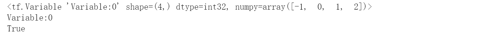

<!-- TOC -->

- [第4章 TensorFlow 基础](#第4章-tensorflow-基础)
  - [4.1 数据类型](#41-数据类型)
    - [4.1.1 数值 数值 类型](#411-数值-数值-类型)
    - [4.1.2 字符串类型](#412-字符串类型)
    - [4.1.3 布尔类型](#413-布尔类型)
  - [4.2 数值精度](#42-数值精度)
    - [4.2.1 读取精度](#421-读取精度)
    - [4.2.2 类型转换](#422-类型转换)
  - [4.3 待优化张量](#43-待优化张量)
  - [4.4 创建张量](#44-创建张量)
    - [4.4.1 从 从 Numpy, List 对象 创建](#441-从-从-numpy-list-对象-创建)
    - [4.4.2 创建全 0 ，全 1 张量](#442-创建全-0-全-1-张量)
    - [4.4.3 创建 创建 自定义数值](#443-创建-创建-自定义数值)
    - [4.4.4 创建已知分布的张量](#444-创建已知分布的张量)
    - [4.4.5 创建序列](#445-创建序列)

<!-- /TOC -->
# 第4章 TensorFlow 基础
## 4.1 数据类型
### 4.1.1 数值 数值 类型
数值类型的张量是 TensorFlow 的主要数据载体，分为：
* 标量(Scalar) 单个的实数，如 1.2, 3.4 等，维度数(Dimension，也叫秩)为 0，shape 为[]
* 向量(Vector) n 个实数的有序,通过中括号包裹，如[1.2]，[1.2,3.4]等，维度数为1，长度不定，shape 为[n]
* 矩阵(Matrix) n 行 m 列实数的有序集合，如[ [1,2],[3,4]]，也可以写成 
$$
\begin{matrix}
1 & 2  \\
3 & 4 \\
\end{matrix} \tag{1}
$$
* 张量(Tensor) 所有维度数dim > 2的数组统称为张量。
 张量的每个维度也做轴(Axis)，一般维度代表了具体的物理含义，比如 Shape 为[2,32,32,3]的张量共有 4 维，如果表示图片数据的话，每个维度/轴代表的含义分别是：图片数量、图片高度、图片宽度、图片通道数，其中 2 代表了 2 张图片，32 代表了高宽均为 32，3 代表了 RGB 3 个通道。张量的维度数以及每个维度所代表的具体物理含义需要由用户自行定义
 
注意：
> 在 TensorFlow 中间，为了表达方便，一般把标量、向量、矩阵也统称为张量，不作区分，需要根据张量的维度数和形状自行判断。
```python
import tensorflow as tf
print("==============4.1.1 数值 数值 类型==============")
a = tf.constant([[[1,2],[3,4]],[[5,6],[7,8]]])
print(a)
print(a.shape)
```

### 4.1.2 字符串类型
除了丰富的数值类型外，TensorFlow 还支持字符串(String)类型的数据
例如在表示图片数据时，可以先记录图片的路径，再通过预处理函数根据路径读取图片张量。通过传入字符串对象即可创建字符串类型的张量：
```python
print("==============4.1.2 字符串类型==============")
b = tf.constant('HELLO, Deep Learning.')# 实例化一个字符串变量
b=tf.strings.lower(b) # 将所有字母变为小写
print(b)
```

### 4.1.3 布尔类型
为了方便表达比较运算操作的结果，TensorFlow 还支持布尔类型(Boolean, bool)的张量。
布尔类型的张量只需要传入 Python 语言的布尔类型数据，转换成 TensorFlow 内部布尔型即可：
```python
print("==============4.1.3 布尔类型==============")
c= tf.constant(True)
print(c)
c = tf.constant([True, False])
print(c)
# TensorFlow 的布尔类型和 Python 语言的布尔类型并不对等，不能通用
c = tf.constant(True) # 创建布尔张量
print(c==True)
```


## 4.2 数值精度
* 对于数值类型的张量，可以保持为不同字节长度的精度，如浮点数 3.14 既可以保存为16-bit 长度，也可以保存为 32-bit 甚至 64-bit 的精度。Bit 位越长，精度越高，同时占用的内存空间也就越大。
* 常用的精度类型有 tf.int16, tf.int32, tf.int64, tf.float16, tf.float32,tf.float64
* 其中 tf.float64 即为 tf.double。
在创建张量时，可以指定张量的保存精度：
``` python
import tensorflow as tf
import numpy as np
a=tf.constant(123456789, dtype=tf.int16)
a1=tf.constant(123456789, dtype=tf.int32)
print(a)
print(a1)
a2=tf.constant(np.pi, dtype=tf.float32)
a3=tf.constant(np.pi, dtype=tf.float64)
print(a2)
print(a3)
```

可以看到，保存精度过低时，数据 123456789 发生了溢出，得到了错误的结果，一般使用tf.int32, tf.int64 精度。对于浮点数，高精度的张量可以表示更精准的数据，例如采用tf.float32 精度保存𝜋
### 4.2.1 读取精度
通过访问张量的 dtype 成员属性可以判断张量的保存精度：
``` python
print('before:',a.dtype)
if a.dtype != tf.float32:
    a = tf.cast(a,tf.float32) # 转换精度
print('after :',a.dtype)
```

### 4.2.2 类型转换
系统的每个模块使用的数据类型、数值精度可能各不相同，对于不符合要求的张量的类型及精度，需要通过 tf.cast 函数进行转换：
```python
a = tf.constant(np.pi, dtype=tf.float16)
a=tf.cast(a, tf.double)
print("a转double:{}".format(a.dtype))
```

进行类型转换时，需要保证转换操作的合法性，例如将高精度的张量转换为低精度的张量时，可能发生数据溢出隐患：
```python
a=tf.constant(123456789,dtype=tf.int32)
a=tf.cast(a,tf.int16)
print("a有32转16位:",a)
```

布尔型与整形之间相互转换也是合法的，是比较常见的操作：
```python
a = tf.constant([True, False])
a=tf.cast(a,tf.int32)
print("布尔型与整形之间相互转换：",a)
```

一般默认 0 表示 False，1 表示 True，在 TensorFlow 中，将非 0 数字都视为 True:
```python
a = tf.constant([-1, 0, 1, 2])
a=tf.cast(a, tf.bool)
print("整型转bool类型：",a)

```

## 4.3 待优化张量
* 张量的 name 和 trainable 属性是 Variable 特有的属性，
* name 属性用于命名计算图中的变量，这套命名体系是 TensorFlow 内部维护的，一般不需要用户关注 name 属性；
* trainable表征当前张量是否需要被优化，创建 Variable 对象是默认启用优化标志，可以设置trainable=False 来设置张量不需要优化。
``` python
a=tf.constant([-1,0,1,2])
aa=tf.Variable(a)
print(aa)
print(aa.name)
print(aa.trainable)
```

除了通过普通张量方式创建 Variable，也可以直接创建：
``` python
b = tf.Variable([[1,2],[3,4]])
print("b",b)
```

注意：待优化张量可看做普通张量的特殊类型，普通张量也可以通过 GradientTape.watch()方法临时加入跟踪梯度信息的列表。
## 4.4 创建张量
* Numpy Array 数组和 Python List 是 Python 程序中间非常重要的数据载体容器
* 很多数据都是通过 Python 语言将数据加载至 Array 或者 List 容器，再转换到 Tensor 类型
* 通过TensorFlow 运算处理后导出到 Array 或者 List 容器，方便其他模块调用。

### 4.4.1 从 从 Numpy, List 对象 创建
通过 tf.convert_to_tensor 可以创建新 Tensor，并将保存在 Python List 对象或者 NumpyArray 对象中的数据导入到新 Tensor 中
``` python
a=tf.convert_to_tensor([1,2.])
```
需要注意的是，Numpy 中浮点数数组默认使用 64-Bit 精度保存数据，转换到 Tensor 类型时精度为 tf.float64，可以在需要的时候转换为 tf.float32 类型。
``` python
aa=tf.convert_to_tensor(np.array([[1,2.],[3,4]]))
print("a:",a)
print("aa:",aa)
```

### 4.4.2 创建全 0 ，全 1 张量
``` python
b=tf.zeros([])
b1=tf.ones([])
b2=tf.ones([1])
b3=tf.zeros([1])
print("b:",b)
print("b1",b1)
print("b2",b2)
print("b3",b3)
```

写到此处忘记解释print(x)显示shape=(2,)和shape=(2,1)的区别了，下面解释一下：
> * shape=(2,)表示x是一个一位数组，数组里面有两个元素
> * shape=(2,1)表示x是一个矩阵，表示的是一个两行一列的矩阵

希望大家不要混淆
创建全 0 的矩阵：
``` python
b4=tf.zeros([2,3])
print("b4",b4)
```

创建全1矩阵:
``` python
b5=tf.ones([6,6])
print("b5",b5)
```

过 tf.zeros_like, tf.ones_like 可以方便地新建与某个张量 shape 一致，内容全 0 或全 1的张量。
例如，创建与张量 b6 形状一样的全 0 张量：
``` python
b6=tf.ones([2,3])
b7=tf.zeros_like(b6)
print("b7",b7)
```

### 4.4.3 创建 创建 自定义数值
除了初始化为全 0，或全 1 的张量之外，有时也需要全部初始化为某个自定义数值的张量，比如将张量的数值全部初始化为-1 等。
通过 tf.fill(shape, value)可以创建全为自定义数值 value 的张量。例如，创建元素为-1的标量：
``` python
c=tf.fill([3,4],-1)
print("C:",c)
```

### 4.4.4 创建已知分布的张量
* 正态分布(Normal Distribution，或 Gaussian Distribution)
* 均匀分布(UniformDistribution)是最常见的分布之一，创建采样自这 2 种分布的张量非常有用
* 比如在卷积神经网络中，卷积核张量 W 初始化为正态分布有利于网络的训练；
* 在对抗生成网络中，隐藏变量 z 一般采样自均匀分布。
* 通过 tf.random.normal(shape, mean=0.0, stddev=1.0)可以创建
* 形状为 shape，均值为mean,标准差为 stddev 的正态分布𝒩(𝑛𝑓𝑏𝑜,𝑡𝑢𝑒𝑒𝑓𝑤 2 )。
下面创建一个均值为0，标准差为1的正态分布:
``` python
d=tf.random.normal([2,2])
print("d:",d)
```

创建均值为 1，标准差为 2 的正太分布：
``` python
d1=tf.random.normal([2,2], mean=1,stddev=2)
print("d1",d1)
```

通过 tf.random.uniform(shape, minval=0, maxval=None, dtype=tf.float32)可以创建采样自[𝑛𝑗𝑜𝑤𝑏𝑚,𝑛𝑏𝑦𝑤𝑏𝑚]区间的均匀分布的张量。
例如创建采样自区间[0,1]，shape 为[2,2]的矩阵：
``` python
d2=tf.random.uniform([2,2])
print("d2",d2)
```

创建采样自区间[0,10]，shape 为[2,2]的矩阵：
``` python
d3=tf.random.uniform([2,2],maxval=10)
print("d3",d3)
```

如果需要均匀采样整形类型的数据，必须指定采样区间的最大值 maxval 参数，同时制定数据类型为 tf.int*型：
``` python
d4=tf.random.uniform([2,2],maxval=100,dtype=tf.int32)
print("d4",d4)
```

### 4.4.5 创建序列
* 在循环计算或者对张量进行索引时，经常需要创建一段连续的整形序列
* 可以通过tf.range()函数实现。
* tf.range(limit, delta=1)可以创建[0,𝑚𝑗𝑛𝑗𝑢)之间，步长为 delta 的整形序列，不包含 limit 本身。例如，创建 0~9，步长为 1 的整形序列
``` python
e=tf.range(10,delta=1)
print("e",e)
```

创建 0~9，步长为 2 的整形序列：
``` python
e1=tf.range(10,delta=2)
print("e1",e1)
```

tf.range(start, limit, delta=1)可以创建[𝑡𝑢𝑏𝑠𝑢,𝑚𝑗𝑛𝑗𝑢)，步长为 delta 的序列，不包含 limit本身：
``` python
e2=tf.range(1,limit=10,delta=1)
print("e2",e2)
```
